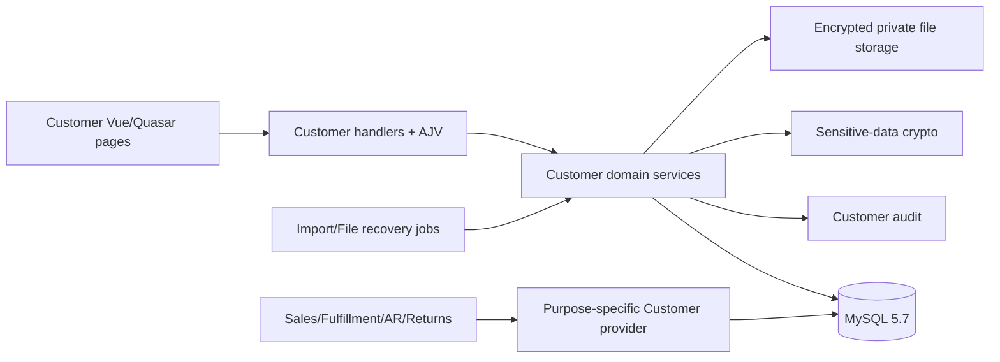
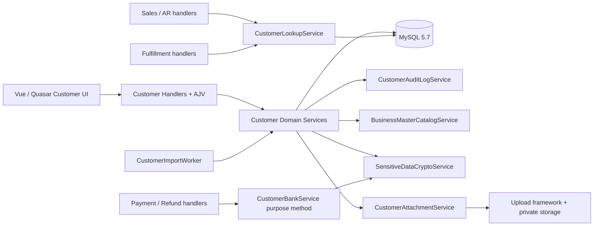
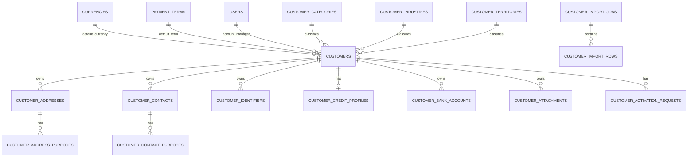

# Customer Management System Design Specification (Harness 2.0 Aligned)

## Harness alignment record

| Item | Value |
| --- | --- |
| Execution mode | `REVIEW_AND_ALIGN` |
| Recovery baseline | `origin/main` at `0996cb7e85e377981121d2d9b0fd7e99ff8eb1a7` |
| Legacy source | `design_spec.md` merged verbatim below before deletion |
| Review method | `SELF_REVIEW`; independent review remains required before implementation authorization |
| Product-code change | None |

The aligned decisions and complete legacy body form one canonical design. Typed relations are owned by `08_traceability.json`.

## 1. Authority and Alignment Model

The complete aligned detailed design is the preserved legacy design body below. This specification is the normative harness traceability entry: it assigns stable `DES-*` identifiers and records the corrections incorporated into that full design.

Precedence is:

1. confirmed business requirement and approved decisions;
2. this aligned specification for explicit corrections/clarifications;
3. the full aligned the preserved legacy design body for detailed fields, tables, routes, pages, services and test design.

No application source or migration is changed by this document.

## 2. Architecture Summary

Use the existing modular monolith: Node.js ES modules, Express `BaseRequestHandler`, AJV request/response schemas, explicit service injection, `MySqlDatabaseService.withTransaction()`, Vue 3, Quasar, page/service discovery and shared UI components. Customer owns its aggregate and purpose-specific read services. Currency/Payment Term, sensitive-data primitives, authentication, authorization, idempotency, time, upload and scheduling remain shared platform capabilities.



## 3. Canonical Design Decisions

| Design ID | Decision / behavior | Requirement basis | Provenance |
| --- | --- | --- | --- |
| DES-001 | Keep Customer as an independent aggregate in the modular monolith; do not introduce generic Party or a microservice. | FR-017..FR-100; BR-001..004 | `EXISTING` |
| DES-002 | Reuse handler discovery, AJV, permission policy, transaction, idempotency, scheduler, upload and Vue/Quasar conventions; dependency injection remains explicit. | NFR-006..014; SEC-001..014 | `EXISTING` |
| DES-003 | Application normalization is the sole equality algorithm; canonical `*_key` columns use `utf8mb4_bin`, while display/search columns retain project collation. | FR-002, FR-003, FR-018..021, FR-028, FR-049; BR-005..007 | `ENHANCED` |
| DES-004 | Customer root and children use stable numeric IDs, optimistic versions and database uniqueness/foreign-key constraints. | FR-017..070; NFR-006..008 | `EXISTING` |
| DES-005 | Lifecycle is command-based, not arbitrary status update; `ever_activated_at` and registered reference guards protect permanent deletion. | FR-034..041; BR-025..029 | `EXISTING` |
| DES-006 | Business commands use framework idempotency plus domain invariants; actor+route+canonical payload hash is bound to a durable outcome/resource reference. Commit-unknown is reconciled, never blindly retried. | FR-077, FR-090; NFR-008 | `ENHANCED` |
| DES-007 | Every write locks in fixed order, performs current-state/version validation, writes domain data and redacted audit in one MySQL transaction. | FR-030, FR-045, FR-074..077, FR-097; NFR-006..008 | `EXISTING` |
| DES-008 | Address/contact purpose default changes lock the Customer and affected mappings, clear old default and set the new value atomically; unique generated slots are the final defense. | FR-042..049; BR-010..013 | `EXISTING` |
| DES-009 | Credit absence, zero limit and On Hold are distinct projections; Customer stores policy only and never computes exposure or override eligibility. | FR-050..056; BR-017..020 | `EXISTING` |
| DES-010 | Activation approval uses a setting/version snapshot, different active approver, immutable bounded snapshot/hash and CAS decisions; setting changes are prospective. | FR-071..083; SEC-004, SEC-007 | `EXISTING` |
| DES-011 | Bank values use AES-256-GCM, versioned owner-bound AAD, separate HMAC blind-index keys, masked projections, fresh permission/re-auth and audited reveal; no generic decrypt route exists. | FR-057..063; SEC-005, SEC-006, SEC-010..014 | `EXISTING` |
| DES-012 | General and bank-sensitive files use private encrypted storage, allowlisted signatures, malware scan and durable `processing -> active/storage_error` finalization. Stale processing/upload operations are reconciled by a bounded recovery job. | FR-064..070; NFR-006, NFR-009, NFR-015; SEC-010, SEC-013 | `ENHANCED` |
| DES-013 | CSV jobs stream RFC 4180 input, reject sensitive columns, persist row-level normalized payload/status, apply each Customer aggregate atomically and resume by lease without replaying terminal rows. | FR-084..093; NFR-004, NFR-008 | `EXISTING` |
| DES-014 | APIs use explicit GET/read and POST/command routes, `additionalProperties:false`, owner-composite lookup, version fields, bounded pagination, stable public errors and safe envelopes. | FR-001..FR-100; SEC-001..014 | `EXISTING` |
| DES-015 | Authorization is enforced server-side with explicit permissions and no inheritance. Sensitive writes/read and delegation re-check current actor status/permission and required authentication strength. | SEC-001..014 | `EXISTING` |
| DES-016 | Frontend follows `docs/frontend-design.md`, shared components, URL filters, accessible status/error/focus behavior, 375–1440px layouts, and never stores sensitive plaintext in Pinia, URL or local storage. | FR-001..016, FR-064..093; NFR-011, NFR-014 | `EXISTING` |
| DES-017 | Downstream lookup is purpose-specific. New sale/manual invoice is Active-only; existing-order fulfillment, shipped-source invoice, existing AR settlement, historical return and history views do not fail solely on Customer status. Address/contact/bank ownership and active-purpose rules still apply at submit. Unknown purpose fails closed. | FR-034, FR-047, FR-048, FR-054..056; BR-025, BR-026, BR-035, BR-042 | `ENHANCED` |
| DES-018 | Search defaults to exact and normalized token-prefix semantics with bounded input and indexed predicates. Arbitrary infix search is not implied; adding it requires a new indexed design and performance acceptance. | FR-001..010; NFR-001..005 | `ENHANCED` |
| DES-019 | Query plans use two-step page IDs/summary projections, `EXISTS` for completeness/child filters, allowlisted sort, stable tie-breaker and no multi-child count join. | FR-001..016; NFR-001..005 | `EXISTING + ENHANCED` |
| DES-020 | Reference/open-matter checks use a versioned provider registry. Delete requires every mandatory provider `READY` and `NO_REFERENCE`; unavailable/unknown fails closed. Archive reports safe blockers and never silently severs existing obligations. | FR-037..041; NFR-010 | `ENHANCED` |
| DES-021 | Audit actions use allowlisted redacted builders, same-transaction writes for business mutations, immutable application APIs, request correlation and bounded detail. Sensitive access attempts/results are auditable without plaintext. | FR-094..100; SEC-011, SEC-014 | `EXISTING` |
| DES-022 | Migrations use logical IDs and forward-only, restart-safe DDL. Physical sequence numbers are allocated from latest main at Phase entry; no reserved number is authoritative. | NFR-006, NFR-011 | `ENHANCED` |
| DES-023 | Logs/metrics/alerts avoid sensitive and high-cardinality labels and cover latency, conflicts, approval age, integrity failures, denied access, file recovery and worker leases. | NFR-001..010; SEC-010..014 | `EXISTING + ENHANCED` |
| DES-024 | Backup/restore treats DB, key rings, general files, bank-sensitive files and audit as one recoverable set; production RTO<=4h and RPO<=15m are proven by isolated restore/reconciliation. | NFR-009, NFR-015 | `NEW — USER APPROVED` |
| DES-025 | Deliver dependency-safe vertical Phases; sensitive/file and consumer capabilities remain disabled/fail-closed until providers, keys, scanner, storage and security reviews are ready. | All requirements; OI-002..005 | `ENHANCED` |

## 4. Domain and State Design

### 4.1 Customer Lifecycle

```text
draft -> active                         (approval OFF)
draft -> pending_approval -> active     (approval ON + approve)
pending_approval -> draft               (reject/withdraw/invalidate)
active -> suspended -> active
active|suspended -> blocked -> suspended
draft|active|suspended -> archived -> suspended
```

Only named commands execute these transitions. Block/unblock requires `customer.approval`; restore/unblock never returns directly to Active. Permanent delete is limited to never-active, currently Draft, unreferenced aggregates with all mandatory reference providers ready.

### 4.2 Purpose Eligibility Matrix

| Purpose | Customer status | Child rule | Typical consumer |
| --- | --- | --- | --- |
| `new_sale` | Active only | No shipping address required at SO creation | Sales Order |
| `manual_invoice` | Active only | Billing data optional per AR contract | Invoicing |
| `existing_order_fulfillment` | Any persisted status | Chosen shipping address/contact must be active, owned and correctly purposed | Fulfillment |
| `invoice_existing_shipment` | Any persisted status | Current billing choice, if supplied, must be active/owned; source snapshot remains authoritative | Invoicing |
| `ar_existing_document` | Any persisted status | No new-sales eligibility implication | Receipt/Credit/Statement |
| `historical_return` | Any persisted status | Original transaction identity/snapshot retained | Returns |
| `refund_existing_transaction` | Any persisted status | Selected bank must be active/owned/purpose-authorized | Refund |
| `history` | Any persisted status | Read-only minimal projection | Inquiry/reporting |

The consumer authorizes its own actor and owns its transaction/snapshot. Customer Provider only validates current master ownership/eligibility and returns an allowlisted projection.

## 5. Database Alignment

### 5.1 Formal Logical Tables

The full design defines 20 logical-table groups: shared `currencies` and `payment_terms`; three classification catalogs; `customers`; address/purpose; contact/purpose; identifier; credit profile; bank; attachment; activation request; settings; audit; import job/row; and `customer_operation_requests` for durable domain outcomes. Exact fields, nullability, defaults, FKs and indexes remain as specified except the corrections below.

### 5.2 Normative Corrections

- `customer_code_key`, `legal_name_key`, `trading_name_key`, catalog/payment-term `code_key` and `identifier_value_key` explicitly use `CHARACTER SET utf8mb4 COLLATE utf8mb4_bin`. Equality is applied to the already normalized value, not delegated to linguistic collation.
- User-facing text remains `utf8mb4_unicode_ci`; normalized token-prefix predicates target indexed key/search columns. A leading `%term%` scan is not the standard list path.
- `customer_attachments` processing records must durably correlate the request/operation and deterministic `stored_name`; status includes `processing`, `active`, `inactive`, `storage_error`, `deleting`, `delete_failed`. A recovery index covers `(status,updated_at,id)`.
- Import source/result storage uses the same deterministic-state reconciliation rule; a DB terminal state is never claimed while the required object is absent or has the wrong hash.
- `customer_operation_requests` owns long-lived actor/route/key/payload-hash/result/lease state. Attachment and import operations reference it; short-lived framework idempotency rows do not replace this domain result index.
- Generated default-slot columns and composite ownership FKs remain required. Service tests are insufficient substitutes for real MySQL 5.7 constraint/race tests.
- Audit has no update/delete application endpoint. Production DB credentials separate migration/operations authority from runtime DML authority; backup and emergency access are logged and governed operationally.

### 5.3 Migration Rules

Use logical migration ordering only: permissions/shared catalogs -> Customer catalogs/root/audit -> party/credit -> settings/approval -> bank/files -> imports. At each Phase start, fetch latest main, inspect applied migration history, allocate the next available physical sequence and update tests. Applied migrations are never renamed or edited; correction uses a forward migration.

## 6. Backend and API Alignment

### 6.1 Services

Preserve the source service boundaries. Add explicit responsibilities:

- `CustomerOperationService`: canonical payload hash/outcome reconciliation around framework idempotency.
- `CustomerFileRecoveryJob`: finalize or safely fail stale attachment/import file states; verify hashes before activation.
- `CustomerReferenceProviderRegistry`: mandatory provider readiness/version and tri-state `REFERENCE | NO_REFERENCE | UNKNOWN`.
- `CustomerLookupService`: named/purpose-allowlisted methods matching §4.2; no generic status bypass.

### 6.2 Transaction and Lock Order

Normative lock order is:

```text
customer_settings (when required)
-> customers (ascending id)
-> activation request
-> child rows (type then ascending id)
-> purpose mappings
-> import/file operation row
-> customer_audit_logs append
```

Never call storage, scanner, notification or an unavailable downstream service while holding DB locks. Multiple-Customer commands are not part of this module. Deadlock/lock timeout produces a bounded retryable conflict; services do not silently replay business commands.

### 6.3 Idempotency and Outcome

- Required on create, activation/approval decision, high-risk lifecycle, bank mutation/reveal session creation, upload, import upload/confirm and export creation.
- The idempotency record binds actor, route, canonical payload hash and resource/operation ID.
- Same key/same payload returns the original known outcome; same key/different payload returns `IDEMPOTENCY_CONFLICT`.
- An indeterminate commit returns a correlation/operation reference. Clients poll outcome or GET the resource; they never generate a fresh key until the original outcome is terminal.
- Domain unique/CAS constraints remain mandatory because framework idempotency alone cannot prevent two different keys causing duplicate effects.

### 6.4 API Contract

All routes in the preserved legacy design body §6 remain in scope. Aligned additions/clarifications:

- Every command response returns `resourceId`, `version`, `status`, `requestId`, and `operationId` when processing may outlive the request.
- `GET /api/v1/customer-operations/:operationId` returns only actor-owned/safely authorized status: `PROCESSING | SUCCEEDED | FAILED | UNKNOWN`, result resource reference and stable error; it never returns payload or sensitive data.
- Customer Provider exposes named methods or an enum-enforced purpose. Unknown purpose is rejected at construction/validation and at runtime.
- All child/file/bank/approval lookups query parent ID and child ID together. Cross-owner and absent results use the same safe response.
- Sensitive downloads/reveals use `no-store`, fresh permission, re-auth, bounded token/session binding and audit before content is exposed.

## 7. File and Import Recovery Sequences

### 7.1 Attachment Upload

1. Authenticate/authorize, validate metadata and reserve idempotent operation.
2. Stream to encrypted private temp storage while calculating size, signature and SHA-256; scan before acceptance.
3. In one transaction create `processing` metadata with deterministic object name and redacted audit.
4. Atomically move temp object to final storage and verify hash/size.
5. In a short transaction change metadata to `active`, append completion audit and complete operation response.
6. If the process stops after step 3, recovery checks final then temp object: finalize a valid object, otherwise mark `storage_error` and alert. It never creates a second attachment for the same operation.

### 7.2 Import Files

Apply the same reserve/stream/verify/finalize pattern to import sources/results. Row application remains one Customer aggregate per transaction. Worker leases are bounded; terminal rows never replay; summary is recomputed from row states.

## 8. Frontend Design

Preserve the source pages: Customer list/create/detail, approvals, imports and settings. Each page uses `PageHeader`, `DataTable`, `FormPanel`, `EllipsisCell`, shared notifications/confirmations, URL filters and permission-aware page metadata.

Implementation acceptance requires Playwright in a real browser for primary flows, error/empty/loading states, keyboard/focus behavior, refresh/back state, 375/768/1024/1440px behavior, console errors and failed/malformed network requests. Static review, unit tests and build success alone are insufficient.

Bank plaintext exists only inside the active reveal/form component, is cleared on timeout/unmount/session loss and is never placed in URL, analytics, storage, global store, screenshot fixture or test snapshot.

## 9. Security and Threat Controls

- Explicit backend permission matrix; UI visibility is convenience only.
- System administrator does not automatically receive bank permissions. Any exceptional delegation path requires current protected-admin role, approved device, password, reason, target permission allowlist and audit; it does not grant route access to the delegator.
- SQL values are parameterized; sort/table selection uses code allowlists. AJV blocks mass assignment.
- Owner-safe IDs, output encoding, CSV formula neutralization, private paths, file signature/scan and response headers address IDOR/injection/XSS/path traversal/content sniffing.
- Bank ciphertext, IV, tag, blind index, key IDs, plaintext, sensitive filenames and file contents are excluded from ordinary projections/logs/audit details.
- Key rotation supports old+new reads and new-key writes, reports counts only, proves zero old-key rows before retirement and is covered by backup/restore.

## 10. Performance, Availability and Operations

- Capacity baseline: 100,000 customers, stated child cardinalities, 50 concurrent users and 10,000-row imports.
- Standard list/exact/prefix and shipping/contact lookups: p95 < 2s under the declared mixed load; error rate <1%; no unbounded DB/request queue.
- Import precheck+execution: <10 minutes excluding human delay.
- Record dataset generator version, distribution, hardware, MySQL config, warm-up, p50/p95/p99, throughput, errors, CPU/memory and lock metrics.
- Health/readiness reports schema, mandatory provider registry, key ring, scanner, storage and worker readiness per capability. Optional sensitive capability failure does not corrupt or overexpose core Customer reads.
- Alerts cover bank integrity/unknown key, unauthorized access spikes, stuck file/import operations, audit failures, migration mismatch and sustained latency breaches.

## 11. Backup, Retention and DR

- Restore unit: Customer DB rows and audit, encryption/lookup key rings, general files, bank-sensitive files, import evidence and configuration manifest.
- RPO<=15 minutes determines backup/log-shipping cadence. RTO<=4 hours is measured from declared incident start through isolated restore, key/file verification, reference reconciliation and successful smoke—not merely database availability.
- Quarterly restore exercise samples ordinary Customer, address/contact, approval, encrypted bank reveal, both file sensitivity classes, import history and audit correlation.
- Customer/audit/bank/file records retain at least seven years. No automatic destructive purge/crypto-shredding until Legal/Compliance approves longer periods, legal hold and deletion procedure. Import source/result policy remains source requirement baseline.

## 12. Failure and Degraded Modes

| Failure | Required behavior |
| --- | --- |
| DB timeout before commit | Roll back/destroy abandoned connection; return safe retryable error. |
| Commit result unknown | Keep operation unresolved; reconcile by operation/resource/audit before retry. |
| Audit insert fails | Business transaction rolls back. |
| Scanner/key/storage unavailable | Sensitive/file capability fails closed; core masked/general data remains available where safe. |
| Crash after file metadata commit | Recovery finalizes deterministic object or marks error; no duplicate active record. |
| Reference provider unavailable | Delete/archive decision returns unknown and fails closed; no silent bypass. |
| Permission revoked after page load | Submit/reveal re-checks current authority and returns safe denial without side effect. |
| Customer/child changed after selection | Consumer submit revalidates purpose/ownership/version and requires reselection where applicable. |
| Worker crash/lease expiry | Another worker resumes non-terminal rows only; terminal effects are not replayed. |

## 13. Deployment and Rollback

- Each Phase begins from current main in an independent worktree and has one merge checkpoint by default.
- Use expand/additive forward migrations. Server remains compatible with absent disabled-capability tables during ordered deployment where explicitly designed.
- Provision keys/storage/scanner/backup before enabling bank/file routes or assigning sensitive roles.
- Rollback application only to a schema-compatible version. Data correction is an audited compensating action or forward migration, never direct history deletion.
- Any change to lifecycle, normalization equality, purpose matrix, retention or sensitive-data model reopens the requirement/design gate and updates all downstream artifacts.

## 14. Trade-offs and Rejected Alternatives

| Rejected alternative | Reason |
| --- | --- |
| Generic Party aggregate | No second implemented variation justifies complexity; Customer/Supplier have distinct ownership and workflows. |
| Customer microservice/event bus | Current single-application MySQL transaction model is simpler and sufficient. |
| Generic decrypt/download API | Expands data-exfiltration surface and loses purpose/audit context. |
| Leading-wildcard scan as default search | Cannot rely on existing B-tree indexes at the declared capacity. |
| Client-only permissions/default validation | Races and direct API calls would bypass business rules. |
| Cross-store “success” before file finalization | Creates ambiguous/missing objects and unsafe retries. |
| Fixed future migration numbers | Parallel feature branches make reservations stale. |
| Automatic purge after seven years | Legal hold/longer retention is unresolved and deletion is irreversible. |

## 15. Requirement Coverage Manifest

The following IDs are each covered by one or more decisions above and mapped precisely in `08_traceability_matrix.md`:

- Functional: FR-001, FR-002, FR-003, FR-004, FR-005, FR-006, FR-007, FR-008, FR-009, FR-010, FR-011, FR-012, FR-013, FR-014, FR-015, FR-016, FR-017, FR-018, FR-019, FR-020, FR-021, FR-022, FR-023, FR-024, FR-025, FR-026, FR-027, FR-028, FR-029, FR-030, FR-031, FR-032, FR-033, FR-034, FR-035, FR-036, FR-037, FR-038, FR-039, FR-040, FR-041, FR-042, FR-043, FR-044, FR-045, FR-046, FR-047, FR-048, FR-049, FR-050, FR-051, FR-052, FR-053, FR-054, FR-055, FR-056, FR-057, FR-058, FR-059, FR-060, FR-061, FR-062, FR-063, FR-064, FR-065, FR-066, FR-067, FR-068, FR-069, FR-070, FR-071, FR-072, FR-073, FR-074, FR-075, FR-076, FR-077, FR-078, FR-079, FR-080, FR-081, FR-082, FR-083, FR-084, FR-085, FR-086, FR-087, FR-088, FR-089, FR-090, FR-091, FR-092, FR-093, FR-094, FR-095, FR-096, FR-097, FR-098, FR-099, FR-100.
- Non-functional: NFR-001, NFR-002, NFR-003, NFR-004, NFR-005, NFR-006, NFR-007, NFR-008, NFR-009, NFR-010, NFR-011, NFR-012, NFR-013, NFR-014, NFR-015.
- Security: SEC-001, SEC-002, SEC-003, SEC-004, SEC-005, SEC-006, SEC-007, SEC-008, SEC-009, SEC-010, SEC-011, SEC-012, SEC-013, SEC-014.

## 16. Design Readiness

The aligned architecture is implementable, but the Human Design Gate is `CONDITIONAL`: the cross-system sensitive-permission delegation change requires explicit Security/Backend approval before TASK-020 in PHASE-003, and each unavailable downstream provider or sensitive runtime dependency blocks only its dependent capability. No application code or acceptance test was executed here.

---

# Preserved legacy design body (complete source content; superseded internal links updated)

# Customer Management 系統設計規格

## 0. 文件資訊

| 項目 | 內容 |
| --- | --- |
| 文件名稱 | Customer Management 系統設計規格 |
| 文件版本 | 0.2 Harness Aligned |
| 文件日期 | 2026-09-10 |
| 需求基線 | `docs/customer_management/requirement.md` 0.2 Harness Aligned |
| 適用系統 | ERP App；單一公司；批發客戶 |
| 設計狀態 | Harness Review已對齊；設計門檻為Conditional，DR-004須在敏感權限實作前批准 |

### 0.1 文件目的

本文件把 Customer Management 業務需求轉成可直接拆解任務、實作、測試、部署及驗收的技術契約。內容以目前專案的 Node.js／Express 5、MySQL 5.7、Vue 3／Quasar 2 模組化單體為基線，不另建微服務、GraphQL、事件匯流排或通用 Party 模型。

本文件的「須」是實作要求；範例資料不是業務預設。若 requirement 與本文件衝突，以已簽核 requirement 為準並先修訂本文件，不由開發者在程式中自行選擇語意。

### 0.2 已確認設計決策

| 決策 | 設計結論 |
| --- | --- |
| Customer 與 Supplier 是否共用 Party aggregate | 不共用。Customer 的 root、地址、聯絡人、識別、審批及 audit 均為獨立 domain；只共用穩定的技術基建與受控目錄。 |
| 銀行安全基建 | 共用 encryption、masking、blind index、key ring、rotation 及安全檔案工具；Customer 與 Supplier 各自保有 service、table、permission 及 audit。 |
| Supplier 是否為 Customer 前置 | 不是。Business Master 及 Sensitive Data foundation 可獨立部署；Customer 不 import Supplier module。 |
| 設計交付範圍 | 完整設計 Phase 1～3；每個 Phase 仍能獨立驗收及部署。 |
| Currency／Payment Term | 共用 `currencies`、`payment_terms`；Customer 對 Business Master 只有 read contract。建表及最低 HKD seed 由 Business Master foundation 負責，不假設 Supplier migration 已先建立。HD-007 已批准 Customer 在 TASK-010 提供唯讀 impact checker，回報目前 Customer default 的彙總計數及 watermark；它不寫入 Business Master table，registry、token 與高風險決策仍由 Business Master 擁有。 |
| Customer 分類目錄 | Category、Industry、Territory 採 Customer 專屬受控目錄表，使用 `customer.settings` 維護；不先造一個全 ERP 通用分類引擎。 |
| UI／UX | 所有頁面與元件必須按 `docs/frontend-design.md` 實作；該文件是硬性前端規格。 |

### 0.3 明確不做

- 不建立母子公司、Customer Group、共享信用、個人會員、資料列級銷售隔離。
- 不保存客戶價目表、折扣、促銷、AR 暴露、可用信用額或匯率。
- 不允許 Sales／Fulfillment 建立臨時地址；下游只引用 ID 並在確認時保存自己的快照。
- 不提供 generic decrypt API、generic attachment download API 或 generic Customer write API。
- 不讓 UI、CSV worker 或下游模組直接寫 Customer tables。
- 不修改已套用 migration；不以預留但尚未存在的檔號覆蓋目前 main。

### 0.4 Harness對齊與設計權威

- 本文件是Customer Management完整且正式的詳細系統設計基線。
- [本文件的Canonical Design Decisions](#3-canonical-design-decisions)定義`DES-001`～`DES-025`標準設計決策及本次Harness修正；其修正內容已納入本文件，並作為跨需求、任務及測試的追溯入口。
- [`04_design_review.md`](04_design_review.md)記錄獨立架構、安全、資料庫、SRE、工程與QA評審。
- 權威順序為：已確認業務需求與批准決策、本文件及`DES-*`修正、其他輔助評審記錄。出現衝突時須回到設計評審，不得在程式中靜默選擇。

---

## 1. 現況、成功條件與 Capability Map

### 1.1 現有專案約束

- Handler 由目錄自動發現並繼承 `BaseRequestHandler`；route 的 method、path、authType、authorizationPolicies、request／response schema 必須是 static metadata。
- API 以 GET 查詢、POST 寫入；AJV schema 一律 `additionalProperties: false`。
- DB 使用 `MySqlDatabaseService` 與 `withTransaction()`；SQL 參數化，列表排序只用 server allowlist。
- 權限目錄正本是 `server/src/modules/authorization/permissionCatalogue.js`，migration 只是資料投影；權限沒有 inheritance。
- 時間保存 epoch milliseconds，由 `SystemTimeService.nowMs()` 產生；顯示使用 `APP_TIME_ZONE`。
- 前端頁面由 `export const page` 發現，表格、表單、高風險確認分別沿用 `DataTable`、`FormPanel`、`promptPassword()`。
- Migration runner 按四位數前綴排序。2026-09-07 的 main 已存在 `0010–0013`、`0024` Item migrations；Item 設計仍配置至 `0026`，所以 Customer 不宣稱擁有 `0014–0026`。

### 1.2 可驗證成功條件

1. 全新 MySQL 測試庫可由 migration runner 建立完整 schema，重跑為 no-op；所有 FK、unique slot、索引及 seed 經真 MySQL 測試證明。
2. UI、API、CSV 與 internal lookup 共用同一 Customer domain service，唯一性、狀態、版本、審批及 audit 不分叉。
3. Customer Code、Legal Name、Identifier unique 在並發下仍由 DB constraint 硬性保證；錯誤轉成穩定 public code。
4. 每個地址／聯絡用途及每個 Customer 的有效銀行帳戶最多一個 default，並發切換不能留下兩個 default。
5. 所有一般 projection 都沒有銀行明文、ciphertext、IV、tag、blind index、key ID 或 Bank Sensitive 儲存路徑；reveal／下載有強認證與 audit。
6. Sales 只取得 Active Customer；Fulfillment 只取得所屬 Customer 的 active Shipping Address，提交時再驗證並由下游保存 snapshot。
7. 100,000 Customers 容量及 50 concurrent users 下，指定查詢 p95 < 2 秒；10,000-row import 總處理時間 < 10 分鐘。
8. Phase 1～3 各自的 migration、server、client、permissions、tests 及 release gate 一併交付，沒有「先上 UI、日後補權限／audit」的半成品。

### 1.3 Capability Map

| Capability | 範圍 | 前置依賴 | 獨立驗收 |
| --- | --- | --- | --- |
| `CUS-CAP-00 Foundation` | 共用 Currency／Payment Term schema、敏感資料 crypto／masking／upload policy | User／Role、migration runner、upload framework | foundation migrations、config fail-closed、crypto vectors、catalog read tests |
| `CUS-CAP-01 Core` | root CRUD、狀態、唯一性、受控目錄、地址、聯絡、Identifier、Credit、audit、lookup | CAP-00 | AC-001～035、050～051；core API／UI／MySQL integration |
| `CUS-CAP-02 Approval` | settings、Pending flow、queue、reassign、block／unblock | CAP-01 | AC-009～020、047～049；race／self-approval tests |
| `CUS-CAP-03 Bank & Files` | encrypted banks、masked list、reveal、General／Bank Sensitive attachments | CAP-00、CAP-01 | AC-036～043；security review、key rotation、orphan cleanup |
| `CUS-CAP-04 Bulk` | template、precheck、partial-success worker、result、export | CAP-01；activate mode另需CAP-02 | AC-044～046、052；10k performance、resume、idempotency |
| `CUS-CAP-05 Downstream` | Sales／Fulfillment／Invoice／AR／Payment purpose-specific lookup | CAP-01；Bank用途另需CAP-03 | ownership／status recheck、snapshot contract、consumer contract tests |

建置順序為 CAP-00 → CAP-01 → CAP-02／CAP-03 → CAP-04／CAP-05。CAP-00 是獨立 foundation，不代表 Supplier 已上線；Supplier 日後改用同一 foundation 時另作兼容 migration／service refactor，不由 Customer PR 偷改未實作 Supplier 功能。

---

## 2. 系統架構

### 2.1 元件關係



### 2.2 後端 module boundary

| 模組／服務 | 責任 | 不負責 |
| --- | --- | --- |
| `businessMaster` | Currency、Payment Term 讀取及有效性驗證；foundation schema contract；impact checker registry、token 與高風險決策 | 匯率、due-date calculation、Customer 設定或 Customer data write |
| `customer/CustomerBusinessMasterImpactChecker` | 以 Customer-owned `customers` table 唯讀彙總 Currency／Payment Term default 的 active/open counts 及變更 watermark | Business Master catalog write、registry/token、Customer record projection |
| `sensitiveData`（technical service） | AES-256-GCM、AAD、masking、HMAC blind index、多 key read、rotation primitive | 認識 Customer／Supplier 權限或 table |
| `customer/CustomerService` | root create／update、狀態機、code change、完整度、root version | 子資源 CRUD、銀行解密、交易計算 |
| `customer/CustomerPartyService` | Address、Contact、Identifier 及 purpose/default 原子更新 | 通用 Party abstraction |
| `customer/CustomerCreditService` | optional credit policy 的建立／更新／清除與 projection | AR exposure 或 override |
| `customer/CustomerApprovalService` | setting snapshot、submit／withdraw／approve／reject／reassign | Bank reveal |
| `customer/CustomerBankService` | bank domain validation、crypto 使用、duplicate、default、reveal、future payment resolution | 暴露 generic decrypt |
| `customer/CustomerAttachmentService` | metadata、sensitivity policy、stream authorization、cleanup | OCR、virus engine 本身 |
| `customer/CustomerLookupService` | purpose-specific current-state projections、ownership recheck | 呼叫方 permission；交易 snapshot 儲存 |
| `customer/CustomerImportService` | upload/precheck/job/row state、template/export | 另一套 Customer validation |
| `customer/CustomerAuditLogService` | action allowlist、redacted detail、same-transaction insert | 任意 JSON dump |

Service 依賴由 handler／worker 明確注入。只有 shared technical service 可放 `server/src/services/`；business rules 留在 `server/src/modules/customer/`。不新增 repository abstraction：目前只有 MySQL 一種 persistence，service 直接使用注入的 database／connection 更貼近既有程式。

### 2.3 前端架構

- `client/src/services/customer*.js` 只負責 HTTP mapping，不重做 business rule。
- 頁面放 `client/src/pages/customers/`；可複用的 Customer feature components 放 `client/src/components/customers/`。
- URL query 保存 list filter／sort／page；bank plaintext 只存在 reveal dialog 的 local `ref`，30 秒倒數或 dialog unmount 即清空，不進 Pinia、localStorage、query string 或 analytics。
- 所有 UI 必須遵守 `docs/frontend-design.md`：`PageHeader`、`DataTable sticky-actions`、`EllipsisCell`、`FormPanel`、Quasar spacing／tokens、真正 heading、中文文案、WCAG 2.1 AA。

### 2.4 一致性與交易邊界

- 每個 command 在一個 `withTransaction()` 中依序：重讀 actor permission → lock aggregate rows → 驗證 current state／version → 寫 domain data → 寫 Customer audit → commit。
- 不在 DB transaction 內做檔案 upload、CSV parsing、通知或外部呼叫。附件採「暫存檔 → DB metadata+audit commit → atomic rename」；rename 失敗把 metadata 轉 `storage_error` 並告警，cleanup job 收斂，不回成功。
- Root update 使用 `WHERE id=? AND version=?` compare-and-set。子資源有自己的 version；會改 root 可觀察狀態的操作同時 `customers.version=version+1`。
- Default switch 先鎖 Customer 及同用途 mapping／bank rows，清舊 default，再設新 default；generated unique slot 是最後防線。
- 審批決定同時鎖 request、Customer、setting不必重讀（採 request snapshot）；驗證 request version、Customer version、assigned approver及 actor 現有權限。
- 匯入每一 row 是獨立 transaction；row result 的 `applied` 與 Customer aggregate／audit 在同一 commit。Job summary 由 row terminal states 重算，不用不可靠的記憶體 counter。

### 2.5 併發鎖順序

統一鎖順序：`customer_settings(如需)` → `customers` → `customer_activation_requests` → `customer_addresses/contacts/identifiers/credit/banks/attachments` → purpose mappings → import row。需要多 Customer 的跨 Customer bank duplicate warning，只作無鎖 indexed read，不同時鎖兩個 Customer；因而不把 warning 變成跨 aggregate atomic rule。

Deadlock／lock timeout 回可重試的 `409 CONCURRENT_OPERATION`; service 最多不自行隱藏重試 business command。未知 commit outcome 沿用 database service 的 indeterminate 結果，要求以 Idempotency-Key／resource GET 對帳。

---

## 3. 權限、認證及資料投影

### 3.1 權限目錄

新增六項。Permission migration冪等種入全部六項；只把一般`customer.view`、`customer.mgmt`、`customer.approval`、`customer.settings`授予受保護的`system-admin`，**不自動授予**`customer.bank.view`或`customer.bank.mgmt`：

```js
{ name: "customer.view", description: "查看客戶一般資料與變更歷史" }
{ name: "customer.mgmt", description: "管理客戶一般、信用及主資料" }
{ name: "customer.approval", description: "審批客戶啟用及封鎖狀態" }
{ name: "customer.bank.view", description: "主動查看客戶完整銀行資料及敏感附件" }
{ name: "customer.bank.mgmt", description: "管理客戶銀行資料及敏感附件" }
{ name: "customer.settings", description: "管理客戶設定及受控分類目錄" }
```

沒有 permission inheritance：管理員角色需顯式取得 `customer.view`＋`customer.mgmt`；Bank write route 需 `customer.view`＋`customer.bank.view`＋`customer.bank.mgmt`；Approval route 需 `customer.view`＋`customer.approval`。為解決現有「操作者只能授予自己已有權限」與敏感權限不應自動進system-admin的衝突，`adminGuard`增加窄例外：目前DB角色確實含受保護`system-admin`的操作者，可在`jwt-device-password`＋reason＋audit的既有角色／權限指派流程中委派catalogue內權限，但不因可委派而通過業務route。`RoleAdminService.assignPermissions`及`UserAdminService.assignRoles`都套相同例外；一般管理員仍只能授予自己的子集。system-admin若有業務需要，亦須被明確指派含bank權限的獨立角色後才可access，符合「管理身份不自動取得銀行資料」。

### 3.2 認證強度

| 操作 | authType | 權限 |
| --- | --- | --- |
| 一般 list／detail／masked bank／general attachment download | `jwt` | `customer.view` |
| 一般 CRUD、Credit、Address／Contact／Identifier | `jwt` | view＋mgmt；關鍵變更另要求 reason |
| Activate／submit／withdraw | `jwt` | view＋mgmt |
| Suspend／reactivate／archive／restore、approve／reject／reassign | `jwt-password` | 對應 mgmt 或 approval |
| Code change、permanent delete、block／unblock | `jwt-device-password` | 對應 mgmt 或 approval |
| Bank create／update／default／deactivate；Bank Sensitive upload／change／deactivate | `jwt-device-password` | view＋bank.view＋bank.mgmt |
| Bank reveal；Bank Sensitive download／preview | `jwt-password` | view＋bank.view |
| Settings／catalog write | `jwt-device-password` | view＋settings |
| Import confirm／export | `jwt-password` | view＋mgmt |

所有 write service 使用 `assertActorFresh` 重讀 DB permission，避免 JWT 內已撤銷 claim 繼續寫入。Sensitive read 也重讀 bank permission；未授權嘗試由 security logger 記錄，不把 resource existence 或敏感 metadata 回給 actor。

### 3.3 Projection allowlist

| Projection | 可含資料 | 永不包含 |
| --- | --- | --- |
| `CustomerSummary` | id、code、legal/display name、一般聯絡摘要、default currency／term、manager、分類、creditStatus、status、version、updatedAt | bank metadata、credit notes、internal normalized keys |
| `CustomerDetail` | root、children、credit、masked bank summaries、一般附件 metadata、完整度 | bank明文／crypto columns、Bank Sensitive filename／path（無bank.view時）、storage path |
| `MaskedBankAccount` | id、holder、bank name、country、currency、purpose、status、default、mask、version | 明文、lastFour獨立欄位、length、blind index、keys |
| `RevealedBankAccount` | id、accountNumber、revealedAt、expiresInSeconds | crypto metadata；response `Cache-Control: no-store` |
| `CustomerLookup` | 用途所需 id、code、name、status、version、defaults | notes、bank、attachments、audit、permissions |
| `CreditPolicyLookup` | configured、limit（string或null）、currencyCode、status、policyVersion、customerVersion | credit notes、AR exposure |
| `AuditDetail` | allowlisted before／after、reason、actor、requestId | bank明文、ciphertext、blind index、secret、file contents |

### 3.4 銀行密碼學及檔案安全

- Account number 先 Unicode NFC，僅明確折疊全形 ASCII，再移除被批准的分隔字元、保留 ASCII 字母數字並只對 ASCII lowercase 作 uppercase；不使用會將上標、圈字或連字轉成另一個合法帳號的 NFKC compatibility fold，其餘字元拒絕。顯示值不由 normalized value猜回格式。
- 每列用 AES-256-GCM、隨機 12-byte IV、16-byte auth tag。AAD 固定版本化為 `erp-bank:v1:<ownerType>:<customerId>:<cryptoContext>`，防止密文搬到另一 owner 解密。
- Duplicate blind index 用 HMAC-SHA-256；scope input 為 country／bank／branch／normalized account。Write 使用 active lookup key；read／duplicate 在 rotation window 使用全部 read keys。
- Encryption key ring 與 blind-index key ring 分離，key material只來自 secret config；key ID 可存 DB，key value 不存 DB／log。
- 啟用 Bank capability 時缺 active key、未知 row key或重複 key ID均 startup fail closed。Rotation／reindex script 可按 id batch續跑並輸出只含 counts 的報告。
- Attachment storage root 必須在 app 指定 private directory；stored name 是 server UUID，不使用 client filename。下載走授權 handler及 `Content-Disposition`；PDF／image preview 加 `nosniff`、CSP sandbox；Bank Sensitive 不經 CDN/public URL。
- Upload 依 extension、declared MIME、magic signature、size 四項全過才接受；PDF／PNG／JPEG／WebP，拒絕 SVG。若部署環境提供 malware scanner，掃描成功才轉 active；scanner 未配置時此 capability 不可聲稱已通過安全 gate。

---

## 4. Domain 模型與業務規則

### 4.1 Customer aggregate root

狀態常數：`draft`、`pending_approval`、`active`、`suspended`、`blocked`、`archived`。允許轉換只按 requirement §7.2；不提供任意 `status/change`。

最低 Active 驗證只包括非空唯一 code、非空唯一 legal name、存在且 active 的 default currency。其他缺失產生 completeness warning，不阻擋 activate。`ever_activated_at` 一旦有值永不清除，用來阻止 permanent delete；下游引用由 `CustomerReferenceGuard` 的 registered checkers 判斷，無法確認任一必要 checker 時 fail closed。

### 4.2 正規化

| 值 | 規則 |
| --- | --- |
| Customer Code key | trim → NFKC → locale-independent lowercase；拒絕空白、控制字元、長度>64；顯示值只trim，不自行改大小寫／格式。 |
| Legal Name key | trim → NFKC → Unicode whitespace collapse → lowercase；保留標點及公司後綴，避免把不同法人過度合併；長度上限190。 |
| Trading Name search key | 同名稱 normalization，但不 unique；exact 相同只 warning。 |
| Identifier key | trim → NFKC → uppercase → 移除該 identifier type 明確允許的空格／連字號；沒有 type-specific rule 時只collapse spaces，不猜國家格式。 |
| Email／phone | 驗證但保存使用者輸入的trim值；不以 phone/email 作 unique。 |

所有 key 由同一 `customerNormalization.js` 產生，UI、CSV 不能自行實作另一版本。DB unique constraint 才是並發下最終判定。

### 4.3 地址、聯絡人與用途

Address purpose 固定為 `registered`、`office`、`billing`、`shipping`、`returns`、`other`；Contact purpose 固定為 `general`、`ordering`、`shipping`、`billing_ar`、`returns`、`other`。本期用程式常數而非可編輯資料表，避免刪除代碼令下游 contract 失效。

Create／update child 接受完整 `purposes[]`，每項 `{ code, isDefault }`；service 覆蓋 mapping。Inactive child 的所有 `is_default` 在同一 transaction 清零，且不能成為 default。Fulfillment lookup 只回 active＋shipping，default first、sortOrder、id；submit 時 `assertAddressUsable(customerId,addressId,"shipping")`，不接受 address text。

### 4.4 Credit policy

沒有 `customer_credit_profiles` row 等於 `{ configured:false, creditLimit:null, currencyCode:null, status:"not_configured" }`。有 row 時 status 只允許 `normal`／`on_hold`；limit 可為 NULL 或大於等於0，limit 非 NULL 時 currency 必填且 active。這使「未設定」、「0額度」、「On Hold」彼此不混淆。

建立、更新、清除 policy 都要求 reason並 audit。清除是刪除 optional row，但 audit保留 before；下游只得到 policy，不由此 service 計算 exposure／available credit或批准 override。

### 4.5 審批與設定

`customer_settings` 只有 typed `require_activation_approval`；unknown fields 400。提交時 request 保存 setting value／version及 Customer critical snapshot hash。Critical fields：code key、legal name key、default currency、identifiers、credit status，以及未來以 migration 明確加入的欄位。Pending 期間修改 critical field會在同交易把 request標 `invalidated`、Customer回 `draft`；非 critical 修改仍使 root version改變，因此 approval detail顯示diff，approve使用保存的 critical hash再核對。

審批人必須 Active、目前具 `customer.approval`、不是 requester。Approve／reject只可由 assigned approver；任一具 approval者可 reassign pending request，必須填原因。Setting 後改不重寫 existing request。

### 4.6 附件與刪除

General attachment：view 可下載、mgmt 可維護。Bank Sensitive：bank.view 可下載、bank.view＋bank.mgmt 可維護。永久刪除只容許 owner 是從未引用的 Draft Customer、attachment 自身無引用、metadata status不是 processing；刪除操作先把 row標 `deleting`及audit，commit後刪 physical file，再以短 transaction刪metadata。失敗時標 `delete_failed`供job重試；API不回成功。

### 4.7 Import aggregate

Template v1 一列一個 Customer：create row可含一組Address、一組Contact、一組Identifier及Credit；upsert只改 root及Credit，不猜沒有child ID的增刪改，若 update row帶child欄位回`IMPORT_CHILD_UPDATE_UNSUPPORTED`。銀行、Bank Sensitive、檔案內容、internal notes columns是保留敏感欄位，precheck整列 invalid，不靜默忽略。

CSV使用 RFC 4180 parser；formula-leading cells在所有下載CSV前加安全前綴／按專案CSV policy處理。Create要求 code、legal name、default currency；upsert優先customerId並交叉核對code，否則code匹配。每次confirm保存setting snapshot；activate＋approval ON須指定單一eligible approver。

---

## 5. Database Table 詳細設計

### 5.1 共通資料庫規則

- Engine `InnoDB`。使用者顯示及一般搜尋文字沿用`utf8mb4_unicode_ci`；所有已正規化並參與相等判斷或唯一約束的`*_key`欄位明確使用`CHARACTER SET utf8mb4 COLLATE utf8mb4_bin`。業務相等性只由版本化的應用正規化規則產生，不交由語言collation推斷。
- 一般 ID 是 `BIGINT UNSIGNED AUTO_INCREMENT`；Currency 以 ISO code 作 PK。金額 `DECIMAL(19,4)`，API／JSON 以 decimal string 傳遞，禁止轉 JavaScript float 後再寫 DB。
- Boolean 是 `TINYINT(1)`；日期時間是 `BIGINT UNSIGNED` epoch ms；狀態用 `VARCHAR` 並由 constants／service 驗證，因 MySQL 5.7 不依賴 CHECK。
- 可編輯 entity 使用 `version INT UNSIGNED NOT NULL DEFAULT 1`。Create version=1；每次成功 command +1；`updated_at/updated_by` 同 transaction 更新。
- `created_by/updated_by` FK `users(id) ON DELETE SET NULL`，同時 audit 保存 actor username snapshot。Account Manager 亦 `SET NULL`，停用 User 不自動修改 Customer。
- 下游 reference 指向 stable numeric ID 且 `ON DELETE RESTRICT`。只屬於可合法永久刪除 Draft Customer 的 child 使用 root FK `ON DELETE CASCADE`；service 在 delete 前先跑 reference guards。
- 所有 unique 錯誤都捕捉 constraint 名／欄位並轉 public error；不把 SQL、index 名或其他 Customer 值回給 client。
- Migration DDL 使用 existence guard／`CREATE TABLE IF NOT EXISTS`；seed先查再insert，不用 `INSERT IGNORE` 吞掉資料錯誤。MySQL DDL implicit commit，migration 必須可從半完成狀態安全重跑。

### 5.2 ER 關係



### 5.3 Shared Business Master tables

#### 5.3.1 `currencies`

| 欄位 | 型別 | Null／預設 | Key／說明 |
| --- | --- | --- | --- |
| `code` | CHAR(3) | NOT NULL | PK；uppercase ISO 4217 code。 |
| `name` | VARCHAR(100) | NOT NULL | 顯示名稱。 |
| `decimal_places` | TINYINT UNSIGNED | NOT NULL DEFAULT 2 | 0–4，由 service 驗證。 |
| `status` | VARCHAR(20) | NOT NULL DEFAULT `active` | active／inactive。 |
| `version` | INT UNSIGNED | NOT NULL DEFAULT 1 | Optimistic lock。 |
| `created_at`,`updated_at` | BIGINT UNSIGNED | NOT NULL | Epoch ms。 |
| `created_by`,`updated_by` | BIGINT UNSIGNED | NULL | FK users SET NULL。 |

索引：PK `(code)`、`KEY idx_currencies_status_name(status,name)`。Foundation migration 冪等種 `HKD / Hong Kong Dollar / 2 / active`。本期只提供 Customer read／validate API；其他幣別由經核准 forward seed 或日後 Finance Settings 維護。

#### 5.3.2 `payment_terms`

| 欄位 | 型別 | Null／預設 | Key／說明 |
| --- | --- | --- | --- |
| `id` | BIGINT UNSIGNED | NOT NULL AUTO_INCREMENT | PK。 |
| `code`,`code_key` | VARCHAR(50) | NOT NULL | 顯示 code；normalized key。 |
| `name` | VARCHAR(100) | NOT NULL | 顯示名稱。 |
| `calculation_type` | VARCHAR(30) | NOT NULL | immediate／cod／net_days／custom_label。 |
| `due_days` | SMALLINT UNSIGNED | NULL | net_days 時必填，0–3650。 |
| `description` | VARCHAR(500) | NOT NULL DEFAULT '' | 純文字。 |
| `status` | VARCHAR(20) | NOT NULL DEFAULT `active` | active／inactive。 |
| `version`、時間、操作者 | 共通欄位 | — | 同 §5.1。 |

約束／索引：`UNIQUE uq_payment_terms_code_key(code_key)`、`KEY idx_payment_terms_status_name(status,name)`。`customers.default_payment_term_id` 使用 RESTRICT；停用後不可新指派但舊 reference 保留。Customer 本期不提供 term write API，以免和 Supplier／Finance 出現兩個 owner。

Foundation migration 必須先檢查 table shape：不存在就建立；已存在時欄位、型別、index不相容則 fail並要求顯式 compatibility migration，不用 `IF NOT EXISTS` 掩蓋錯 schema。這令 Customer 可先部署，也能安全接上未來 Supplier。

### 5.4 Customer classification catalogs

使用三張明確表，不使用含 `type/value` 的 generic catalog：

| Table | 特有欄位 | 共通欄位／約束 |
| --- | --- | --- |
| `customer_categories` | `id BIGINT`、`code VARCHAR(50)`、`code_key VARCHAR(50)`、`name VARCHAR(100)`、`description VARCHAR(500)` | PK id；`UNIQUE(code_key)`；status active/inactive；`sort_order INT UNSIGNED DEFAULT 0`；version／時間／操作者；`INDEX(status,sort_order,name)`。 |
| `customer_industries` | 同上 | 同上。 |
| `customer_territories` | 同上 | 同上；Territory 是業務區域，不代表地址國家或 row security。 |

Customer FK 使用 `ON DELETE RESTRICT`。目錄只可停用，不提供永久刪除被引用值。Create／update／deactivate 由 `customer.view`＋`customer.settings`；所有寫入有 reason、password＋approved device、optimistic lock及 Customer audit。初始值由業務在上線前提供；migration不虛構 category／industry／territory。

### 5.5 `customers`

| 欄位 | 型別 | Null／預設 | Key／業務意義 |
| --- | --- | --- | --- |
| `id` | BIGINT UNSIGNED | NOT NULL AUTO_INCREMENT | PK；不可重用，下游唯一永久關聯。 |
| `customer_code` | VARCHAR(64) | NOT NULL | trim後顯示值，人工輸入。 |
| `customer_code_key` | VARCHAR(64) | NOT NULL | NFKC＋lowercase unique key。 |
| `legal_name` | VARCHAR(190) | NOT NULL | 法定名稱。 |
| `legal_name_key` | VARCHAR(190) | NOT NULL | 硬性唯一 normalized key。 |
| `trading_name` | VARCHAR(190) | NOT NULL DEFAULT '' | 選填顯示名稱。 |
| `trading_name_key` | VARCHAR(190) | NULL | 空值存 NULL；search／warning，不 unique。 |
| `default_currency_code` | CHAR(3) | NULL | FK currencies RESTRICT；Draft可NULL，Active不可NULL。 |
| `default_payment_term_id` | BIGINT UNSIGNED | NULL | FK payment_terms RESTRICT。 |
| `account_manager_user_id` | BIGINT UNSIGNED | NULL | FK users SET NULL；不作 row security。 |
| `category_id` | BIGINT UNSIGNED | NULL | FK customer_categories RESTRICT。 |
| `industry_id` | BIGINT UNSIGNED | NULL | FK customer_industries RESTRICT。 |
| `territory_id` | BIGINT UNSIGNED | NULL | FK customer_territories RESTRICT。 |
| `website` | VARCHAR(500) | NOT NULL DEFAULT '' | http／https URL。 |
| `general_phone` | VARCHAR(50) | NOT NULL DEFAULT '' | 選填。 |
| `general_email` | VARCHAR(254) | NOT NULL DEFAULT '' | 選填且格式驗證。 |
| `notes` | VARCHAR(2000) | NOT NULL DEFAULT '' | 純文字內部備註。 |
| `status` | VARCHAR(30) | NOT NULL DEFAULT `draft` | 六種 lifecycle。 |
| `ever_activated_at` | BIGINT UNSIGNED | NULL | 首次 Active 時設定，永不清除；delete guard。 |
| `version` | INT UNSIGNED | NOT NULL DEFAULT 1 | Aggregate root compare-and-set。 |
| `created_at`,`updated_at` | BIGINT UNSIGNED | NOT NULL | Epoch ms。 |
| `created_by`,`updated_by` | BIGINT UNSIGNED | NULL | FK users SET NULL。 |

約束／索引：

- `UNIQUE uq_customers_code_key(customer_code_key)`；所有狀態持續占用。
- `UNIQUE uq_customers_legal_name_key(legal_name_key)`；Archived亦占用。
- `KEY idx_customers_status_updated(status,updated_at,id)`。
- `KEY idx_customers_legal_name(legal_name_key,id)`、`idx_customers_trading_name(trading_name_key,id)`。
- `KEY idx_customers_currency_status(default_currency_code,status)`、`idx_customers_term_status(default_payment_term_id,status)`。
- `KEY idx_customers_manager_status(account_manager_user_id,status)`、Category／Industry／Territory各建 `(foreign_id,status)`。
- 一般 email／phone不 unique。標準Search採正規化後的exact或token-prefix，使用索引及bounded page；精確code／legal name優先。任意leading-wildcard infix查找不屬標準路徑，若日後需要須另作有索引且符合NFR的設計。

`default_currency_code` 刻意容許 Draft NULL；activate service lock row後檢查 active Currency。DB不能用跨表 CHECK保證，因此 migration integration＋service tests是必要證據。

### 5.6 `customer_addresses`

| 欄位 | 型別 | Null／預設 | 說明 |
| --- | --- | --- | --- |
| `id` | BIGINT UNSIGNED | NOT NULL AUTO_INCREMENT | PK。 |
| `customer_id` | BIGINT UNSIGNED | NOT NULL | FK customers CASCADE。 |
| `label` | VARCHAR(100) | NOT NULL | 地址名稱。 |
| `recipient_company_department` | VARCHAR(190) | NOT NULL DEFAULT '' | 收件公司／部門。 |
| `address_line1` | VARCHAR(190) | NOT NULL | 至少 line1 非空。 |
| `address_line2`,`address_line3` | VARCHAR(190) | NOT NULL DEFAULT '' | 選填。 |
| `city`,`state_region`,`postal_code` | VARCHAR(100) | NOT NULL DEFAULT '' | 選填。 |
| `country_code` | CHAR(2) | NULL | ISO 3166-1 alpha-2。 |
| `phone` | VARCHAR(50) | NOT NULL DEFAULT '' | 選填。 |
| `notes` | VARCHAR(500) | NOT NULL DEFAULT '' | 純文字。 |
| `sort_order` | INT UNSIGNED | NOT NULL DEFAULT 0 | 同用途列表排序。 |
| `status` | VARCHAR(20) | NOT NULL DEFAULT `active` | active／inactive。 |
| `version`、時間、操作者 | 共通欄位 | — | optimistic lock。 |

Keys：PK `(id)`、`UNIQUE uq_customer_addresses_owner(id,customer_id)` 供 composite FK、`KEY idx_customer_addresses_owner_status(customer_id,status,sort_order,id)`、`KEY idx_customer_addresses_country(country_code)`。被下游引用後只停用；root永久刪除前 reference guard通過時才CASCADE。

### 5.7 `customer_address_purposes`

| 欄位 | 型別 | Null／預設 | 說明 |
| --- | --- | --- | --- |
| `address_id`,`customer_id` | BIGINT UNSIGNED | NOT NULL | Composite FK `(address_id,customer_id)` → addresses `(id,customer_id)` CASCADE。 |
| `purpose_code` | VARCHAR(30) | NOT NULL | §4.3 allowlist。 |
| `is_default` | TINYINT(1) | NOT NULL DEFAULT 0 | active owner才可為1。 |
| `default_slot` | TINYINT(1) GENERATED STORED | `IF(is_default=1,1,NULL)` | MySQL NULL unique-slot技法。 |
| `created_at`,`updated_at` | BIGINT UNSIGNED | NOT NULL | Epoch ms。 |
| `created_by`,`updated_by` | BIGINT UNSIGNED | NULL | FK users SET NULL。 |

PK `(address_id,purpose_code)`；`UNIQUE uq_customer_address_default(customer_id,purpose_code,default_slot)`；`KEY idx_customer_address_purpose(customer_id,purpose_code,is_default,address_id)`。Service 同 transaction 清除舊 default再設定新值；停用 address 時清其 defaults。Constraint 即使兩個 transaction競爭亦不容許雙 default。

### 5.8 `customer_contacts`

| 欄位 | 型別 | Null／預設 | 說明 |
| --- | --- | --- | --- |
| `id`,`customer_id` | BIGINT UNSIGNED | NOT NULL | id PK；customer FK CASCADE；另 `UNIQUE(id,customer_id)`。 |
| `name` | VARCHAR(190) | NOT NULL | 聯絡人名稱。 |
| `job_title`,`department` | VARCHAR(100) | NOT NULL DEFAULT '' | 選填。 |
| `email` | VARCHAR(254) | NOT NULL DEFAULT '' | 選填；基本格式。 |
| `phone`,`mobile` | VARCHAR(50) | NOT NULL DEFAULT '' | 至少一種聯絡值不是啟用條件。 |
| `preferred_language` | VARCHAR(20) | NOT NULL DEFAULT '' | BCP-47-like validated tag或空白。 |
| `notes` | VARCHAR(500) | NOT NULL DEFAULT '' | 純文字。 |
| `sort_order` | INT UNSIGNED | NOT NULL DEFAULT 0 | 排序。 |
| `status` | VARCHAR(20) | NOT NULL DEFAULT `active` | active／inactive。 |
| `version`、時間、操作者 | 共通欄位 | — | — |

索引：`(customer_id,status,sort_order,id)`、`(customer_id,name)`、`(email)`。Email索引只支援搜尋，不作唯一／身份判斷。

### 5.9 `customer_contact_purposes`

欄位及 default-slot 模式與 §5.7 相同，把 `address_id`換成`contact_id`；composite FK `(contact_id,customer_id)`，PK `(contact_id,purpose_code)`，unique `(customer_id,purpose_code,default_slot)`，index `(customer_id,purpose_code,is_default,contact_id)`。停用Contact同交易清 default，但保留 purpose mapping作歷史顯示。

### 5.10 `customer_identifiers`

| 欄位 | 型別 | Null／預設 | 說明 |
| --- | --- | --- | --- |
| `id` | BIGINT UNSIGNED | auto | PK。 |
| `customer_id` | BIGINT UNSIGNED | NOT NULL | FK customers CASCADE。 |
| `identifier_type` | VARCHAR(50) | NOT NULL | company_registration／business_registration／tax／other。 |
| `issuer_country_code` | CHAR(2) | NOT NULL | ISO country／region scope。 |
| `identifier_value` | VARCHAR(190) | NOT NULL | 顯示值。 |
| `identifier_value_key` | VARCHAR(190) | NOT NULL | type-aware normalized key。 |
| `valid_from`,`expires_at` | BIGINT UNSIGNED | NULL | 日期邊界以UTC epoch ms；expires_at須晚於valid_from。 |
| `notes` | VARCHAR(500) | NOT NULL DEFAULT '' | 純文字。 |
| `status` | VARCHAR(20) | NOT NULL DEFAULT `active` | active／inactive。 |
| `version`、時間、操作者 | 共通欄位 | — | — |

`UNIQUE uq_customer_identifiers_global(identifier_type,issuer_country_code,identifier_value_key)`，因此同值即使 inactive／archived仍不會被另一Customer重用；`KEY idx_customer_identifiers_owner(customer_id,status,identifier_type)`。被引用後只停用；未引用 Draft child可刪，但 unique race仍由DB擋。

### 5.11 `customer_credit_profiles`

| 欄位 | 型別 | Null／預設 | 說明 |
| --- | --- | --- | --- |
| `customer_id` | BIGINT UNSIGNED | NOT NULL | PK兼FK customers CASCADE；每Customer 0..1。 |
| `credit_limit` | DECIMAL(19,4) | NULL | NULL或>=0；MySQL 5.7由service驗證。 |
| `credit_currency_code` | CHAR(3) | NULL | limit非NULL時必填；FK currencies RESTRICT。 |
| `credit_status` | VARCHAR(20) | NOT NULL | normal／on_hold；not_configured由無row projection產生。 |
| `credit_notes` | VARCHAR(1000) | NOT NULL DEFAULT '' | 不進一般CSV／lookup。 |
| `last_change_reason` | VARCHAR(500) | NOT NULL | 最近一次理由；完整歷史在audit。 |
| `version`、時間、操作者 | 共通欄位 | — | policy optimistic lock。 |

索引：`KEY idx_customer_credit_status(credit_status,customer_id)`、`KEY idx_customer_credit_currency(credit_currency_code)`。Update body帶policy version；第一次create明確 `version:null`，避免兩人同時從未設定建立時後寫覆蓋。Clear用`DELETE WHERE customer_id=? AND version=?`，before snapshot與delete同transaction寫audit。

### 5.12 `customer_bank_accounts`

| 欄位 | 型別 | Null／預設 | 說明 |
| --- | --- | --- | --- |
| `id` | BIGINT UNSIGNED | auto | PK。 |
| `customer_id` | BIGINT UNSIGNED | NOT NULL | FK customers CASCADE；未來交易FK會RESTRICT實體刪除。 |
| `crypto_context` | CHAR(36) | NOT NULL | server random UUID，AAD一部分。 |
| `account_holder_name` | VARCHAR(190) | NOT NULL | 顯示值。 |
| `bank_name` | VARCHAR(190) | NOT NULL | 顯示值。 |
| `bank_country_code` | CHAR(2) | NULL | ISO alpha-2。 |
| `bank_code`,`branch_code` | VARCHAR(50) | NOT NULL DEFAULT '' | 選填。 |
| `swift_bic` | VARCHAR(11) | NOT NULL DEFAULT '' | uppercase基本格式。 |
| `account_currency_code` | CHAR(3) | NULL | FK currencies RESTRICT。 |
| `purpose_code` | VARCHAR(30) | NOT NULL DEFAULT `general` | general／collection_match／refund。 |
| `account_ciphertext` | VARBINARY(512) | NOT NULL | AES-GCM ciphertext。 |
| `account_iv` | BINARY(12) | NOT NULL | 每次加密隨機。 |
| `account_auth_tag` | BINARY(16) | NOT NULL | GCM tag。 |
| `encryption_key_id` | VARCHAR(64) | NOT NULL | config key ring id。 |
| `account_blind_index` | BINARY(32) | NOT NULL | HMAC-SHA-256 duplicate key。 |
| `blind_index_key_id` | VARCHAR(64) | NOT NULL | lookup key id。 |
| `last_four` | VARCHAR(4) | NOT NULL | 僅供mask builder，不直接projection。 |
| `account_length` | SMALLINT UNSIGNED | NOT NULL | normalized length；<=4時全部遮蔽。 |
| `is_default` | TINYINT(1) | NOT NULL DEFAULT 0 | Customer全域 default。 |
| `default_slot` | TINYINT(1) GENERATED STORED | active且default時1，否則NULL | `IF(status='active' AND is_default=1,1,NULL)`。 |
| `status` | VARCHAR(20) | NOT NULL DEFAULT `active` | active／inactive。 |
| `version`、時間、操作者 | 共通欄位 | — | — |

約束／索引：`UNIQUE(crypto_context)`、`UNIQUE uq_customer_bank_same_owner(customer_id,blind_index_key_id,account_blind_index)`、`UNIQUE uq_customer_bank_default(customer_id,default_slot)`、`KEY idx_customer_bank_cross_owner(blind_index_key_id,account_blind_index,customer_id)`、`KEY idx_customer_bank_owner_status(customer_id,status,id)`。

Rotation期間service用所有read lookup keys查同一Customer duplicate；跨Customer命中只回風險warning及有權限時的Customer Code，不回帳號。Default switch鎖Customer所有bank rows；deactivate default時清`is_default`，不自動另選。

### 5.13 `customer_attachments`

| 欄位 | 型別 | Null／預設 | 說明 |
| --- | --- | --- | --- |
| `id` | BIGINT UNSIGNED | auto | PK。 |
| `customer_id` | BIGINT UNSIGNED | NOT NULL | FK customers CASCADE。 |
| `display_name` | VARCHAR(190) | NOT NULL | UI名稱。 |
| `document_type` | VARCHAR(50) | NOT NULL | business_certificate／credit_application／contract／bank_proof／other。 |
| `sensitivity` | VARCHAR(30) | NOT NULL | general／bank_sensitive；bank_proof必須bank_sensitive。 |
| `original_filename` | VARCHAR(255) | NOT NULL | 僅顯示；移除路徑，無bank.view不回敏感filename。 |
| `operation_id` | CHAR(36) ASCII | NOT NULL | FK至`customer_operation_requests.id`；同一操作只能產生一個附件結果。 |
| `stored_name` | CHAR(64) | NOT NULL | 由operation決定的不可猜測、可重算相對storage key；unique。 |
| `mime_type` | VARCHAR(100) | NOT NULL | signature核對後的實際類型。 |
| `extension` | VARCHAR(10) | NOT NULL | allowlist。 |
| `size_bytes` | BIGINT UNSIGNED | NOT NULL | 受config limit。 |
| `sha256` | BINARY(32) | NOT NULL | integrity／dedupe提示，不作global unique。 |
| `storage_class` | VARCHAR(30) | NOT NULL | general_private／bank_sensitive_private。 |
| `scan_status` | VARCHAR(20) | NOT NULL | pending／clean／rejected／error。 |
| `status` | VARCHAR(30) | NOT NULL | processing／active／inactive／deleting／delete_failed／storage_error。 |
| `sort_order` | INT UNSIGNED | NOT NULL DEFAULT 0 | 顯示排序。 |
| `notes` | VARCHAR(500) | NOT NULL DEFAULT '' | 不含敏感內容。 |
| `version`、時間、操作者 | 共通欄位 | — | — |

約束／索引：`UNIQUE(operation_id)`、`UNIQUE(stored_name)`、`KEY(customer_id,sensitivity,status,sort_order,id)`、`KEY(status,updated_at,id)`、`KEY(sha256,customer_id)`。DB不保存絕對路徑；storage root來自config。`processing` row與temp／final object均可由operation、hash及size對賬；finalizer或bounded recovery job只可啟用已掃描且校驗一致的檔案，否則轉`storage_error`並告警，不建立第二份附件。Future consumer以自己的 FK `ON DELETE RESTRICT` 指向 attachment；`CustomerAttachmentReferenceGuard` 查所有已註冊consumer。Bank Sensitive download response禁止cache並記audit。

### 5.14 `customer_activation_requests`

| 欄位 | 型別 | Null／預設 | 說明 |
| --- | --- | --- | --- |
| `id` | BIGINT UNSIGNED | auto | PK。 |
| `customer_id` | BIGINT UNSIGNED | NOT NULL | FK customers RESTRICT；approval history阻止root delete。 |
| `requested_by` | BIGINT UNSIGNED | NULL | FK users SET NULL。 |
| `assigned_approver_id` | BIGINT UNSIGNED | NULL | FK users SET NULL；pending由service要求存在。 |
| `customer_version` | INT UNSIGNED | NOT NULL | submit時root version。 |
| `critical_snapshot_hash` | BINARY(32) | NOT NULL | canonical allowlisted snapshot SHA-256。 |
| `summary` | JSON | NOT NULL | bounded、無bank明文／敏感filename的顯示snapshot。 |
| `approval_setting_value` | TINYINT(1) | NOT NULL | submit時必為1。 |
| `approval_setting_version` | INT UNSIGNED | NOT NULL | setting snapshot。 |
| `status` | VARCHAR(20) | NOT NULL DEFAULT `pending` | pending／approved／rejected／withdrawn／invalidated。 |
| `pending_slot` | TINYINT(1) GENERATED STORED | pending時1，否則NULL | 每Customer最多一個pending。 |
| `request_note` | VARCHAR(500) | NOT NULL DEFAULT '' | 提交說明。 |
| `decision_reason` | VARCHAR(500) | NOT NULL DEFAULT '' | Reject／reassign理由要求另存audit；此欄最終決定理由。 |
| `requested_at`,`decided_at` | BIGINT UNSIGNED | decided NULL | 時間。 |
| `decided_by` | BIGINT UNSIGNED | NULL | FK users SET NULL。 |
| `version` | INT UNSIGNED | NOT NULL DEFAULT 1 | request compare-and-set。 |

`UNIQUE(customer_id,pending_slot)`；`KEY(assigned_approver_id,status,requested_at,id)`；`KEY(customer_id,requested_at,id)`。歷史summary不可重寫；lifecycle只以CAS更新。重複決定讀回terminal狀態並回`APPROVAL_ALREADY_DECIDED`，不再寫第二次狀態audit。

### 5.15 `customer_settings`

Singleton：

| 欄位 | 型別 | Null／預設 | 說明 |
| --- | --- | --- | --- |
| `id` | TINYINT UNSIGNED | NOT NULL | PK，固定1。 |
| `require_activation_approval` | TINYINT(1) | NOT NULL DEFAULT 0 | 本期唯一設定。 |
| `version` | INT UNSIGNED | NOT NULL DEFAULT 1 | CAS。 |
| `updated_at` | BIGINT UNSIGNED | NOT NULL | Epoch ms。 |
| `updated_by` | BIGINT UNSIGNED | NULL | FK users SET NULL。 |

Migration只在id=1不存在時insert default OFF；service明確拒絕id≠1、missing row及unknown fields。未來設定以typed column＋schema＋UI＋audit＋forward migration加入，不能轉成任意key/value規則引擎。

### 5.16 `customer_audit_logs`

| 欄位 | 型別 | Null／預設 | 說明 |
| --- | --- | --- | --- |
| `id` | BIGINT UNSIGNED | auto | PK。 |
| `occurred_at` | BIGINT UNSIGNED | NOT NULL | 事件時間。 |
| `actor_user_id` | BIGINT UNSIGNED | NULL | FK users SET NULL。 |
| `actor_username` | VARCHAR(190) | NOT NULL | 當時snapshot。 |
| `action` | VARCHAR(80) | NOT NULL | allowlisted具名action。 |
| `target_type` | VARCHAR(30) | NOT NULL | customer／address／contact／identifier／credit／bank／attachment／approval／setting／catalog／import／export。 |
| `target_id` | BIGINT UNSIGNED | NULL | logical ID，不設target FK。 |
| `customer_id` | BIGINT UNSIGNED | NULL | 查詢scope；不設FK以保留delete history。 |
| `target_label` | VARCHAR(190) | NOT NULL | code／masked label snapshot。 |
| `reason` | VARCHAR(500) | NOT NULL DEFAULT '' | 高風險／關鍵變更必填。 |
| `detail` | JSON | NULL | action-specific redacted before／after。 |
| `request_id` | VARCHAR(64) | NOT NULL DEFAULT '' | 對應request log。 |
| `ip` | VARCHAR(45) | NOT NULL DEFAULT '' | IPv4／IPv6。 |

索引：`(occurred_at,id)`、`(customer_id,occurred_at,id)`、`(target_type,target_id,occurred_at,id)`、`(actor_user_id,occurred_at,id)`、`(action,occurred_at,id)`。沒有update/delete API。Detail UTF-8 serialized上限8192 bytes；集合過大先轉 `{count,sample,truncated:true}`，仍超限則business transaction失敗，不容許「資料成功、audit遺失」。Bank只記mask及改了哪些欄；attachment只記metadata，不記內容／private path。

### 5.17 Import tables

#### 5.17.1 `customer_import_jobs`

| 欄位群 | 詳細欄位／型別 |
| --- | --- |
| Identity | `id BIGINT PK AUTO_INCREMENT`、`idempotency_key VARCHAR(128) NOT NULL`、`template_version VARCHAR(20) NOT NULL`。 |
| Files | `operation_id CHAR(36) ASCII NOT NULL UNIQUE`，FK至`customer_operation_requests.id`；`source_stored_name CHAR(64) NOT NULL UNIQUE`、`source_sha256 BINARY(32) NOT NULL`、`source_storage_status VARCHAR(30) NOT NULL`、`result_stored_name CHAR(64) NULL UNIQUE`、`result_sha256 BINARY(32) NULL`、`result_storage_status VARCHAR(30) NULL`、`files_purged_at BIGINT NULL`。Stored name由operation決定且可重算；storage status為processing／active／storage_error／purged。 |
| Modes | `mode VARCHAR(20)` create_only／upsert；`activation_mode VARCHAR(20)` draft／activate；`approver_user_id BIGINT NULL FK users SET NULL`。 |
| Snapshot | `approval_setting_value TINYINT NULL`、`approval_setting_version INT NULL`，confirm時保存。 |
| State | `status VARCHAR(30)` uploaded／validating／ready／ready_with_errors／queued／running／completed／completed_with_errors／failed／cancelled。 |
| Counts | `total_count`,`valid_count`,`warning_count`,`invalid_count`,`success_count`,`failed_count`,`skipped_count` 全部 INT UNSIGNED DEFAULT 0。 |
| Worker | `lease_owner VARCHAR(100) NOT NULL DEFAULT ''`、`lease_until BIGINT NULL`、`last_error_code VARCHAR(80) NOT NULL DEFAULT ''`、`error_summary VARCHAR(500) NOT NULL DEFAULT ''`。 |
| Actors/time | `created_by BIGINT NULL FK users SET NULL`、`confirmed_by BIGINT NULL FK users SET NULL`、`created_at`,`updated_at`,`confirmed_at`,`completed_at`；nullable按state；`version INT DEFAULT 1`。 |

`UNIQUE(created_by,idempotency_key)`；indexes `(status,created_at,id)`、`(lease_until,status)`、`(created_by,created_at,id)`、`(source_storage_status,updated_at,id)`、`(result_storage_status,updated_at,id)`。Idempotency key只在同actor scope；source hash相同仍可有不同合法job。API或worker不得在必要source/result object尚未完成hash／size驗證時宣告相應DB狀態成功；逾時processing由file finalize recovery job收斂。

#### 5.17.2 `customer_import_rows`

| 欄位 | 型別／規則 |
| --- | --- |
| `job_id`,`row_number` | BIGINT／INT UNSIGNED；composite PK；job FK CASCADE。 |
| `operation` | VARCHAR(20)：create／update。 |
| `match_customer_id` | BIGINT NULL；預檢匹配結果，logical ID不設FK。 |
| `expected_customer_version` | INT NULL；update confirm CAS。 |
| `normalized_payload` | JSON NOT NULL；白名單schema，不含bank／file／secret。 |
| `status` | VARCHAR(20)：valid／warning／invalid／applied／failed／skipped。 |
| `applied_customer_id` | BIGINT NULL；只在applied，logical ID不設FK以保留結果。 |
| `errors`,`warnings` | JSON NULL；只含field、stable code、safe message。 |
| `started_at`,`completed_at` | BIGINT NULL。 |
| `version` | INT UNSIGNED DEFAULT 1。 |

#### 5.17.3 `customer_export_jobs`

Export uses a separate durable job instead of overloading import state. Each row
stores `id BIGINT PK AUTO_INCREMENT`, actor-scoped `idempotency_key`, unique
`operation_id` referencing `customer_operation_requests`, an allowlisted JSON
`filter_snapshot`, deterministic `result_stored_name`, `result_sha256`,
`result_storage_status`, `status` (processing/completed/failed), `total_count`,
`expires_at`, bounded public error fields, `created_by`, timestamps and `version`.
Indexes cover `(created_by,created_at,id)` and `(status,updated_at,id)`; unique keys
cover `(created_by,idempotency_key)`, operation and stored name. Only the creating
actor with current view+mgmt permissions may inspect or download the result.

Creation streams the existing allowlisted Customer list projection in pages of 100,
caps the result at the approved 10,000-row bulk limit and at the configured private
CSV byte limit, neutralizes formula-leading cells, and never selects bank, attachment
or credit-note data. File activation, export audit and durable operation outcome
converge idempotently after a crash. `expires_at` ends download access after one year
but HD-002 keeps the physical object and job evidence; no destructive purge runs.

Index `(job_id,status,row_number)`。Worker先 `SELECT ... FOR UPDATE` row；terminal row不重做。成功transaction內依次寫Customer aggregate、audit、row applied。失敗rollback aggregate，再用另一短transaction把仍非terminal row標failed，確保合法列可繼續。

### 5.18 `customer_operation_requests`

這是Customer domain的持久化結果索引，不取代短期HTTP `fr_idempotency_keys`。所有可能在response遺失、process crash或跨storage finalize後仍需確認結果的命令，在產生業務效果前先建立／鎖定此記錄；同一operation及payload只允許一個可觀察結果。

| 欄位 | 型別 | Null／預設 | 說明 |
| --- | --- | --- | --- |
| `id` | CHAR(36) ASCII | NOT NULL | UUID PK；API的`operationId`。 |
| `actor_user_id` | BIGINT UNSIGNED | NOT NULL | 發起者；FK users RESTRICT。 |
| `route_key` | VARCHAR(100) | NOT NULL | allowlisted command名稱，不保存自由輸入URL。 |
| `idempotency_key` | VARCHAR(128) | NOT NULL | 呼叫方key；不得出現在一般log。 |
| `payload_hash` | BINARY(32) | NOT NULL | canonical allowlisted payload SHA-256；排除password／token／file bytes。 |
| `status` | VARCHAR(20) | NOT NULL | processing／succeeded／failed／unknown。 |
| `resource_type` | VARCHAR(40) | NOT NULL DEFAULT '' | customer／attachment／import等allowlisted結果類型。 |
| `resource_id` | BIGINT UNSIGNED | NULL | polymorphic logical ID；由service按resource_type owner-safe查詢，不設跨表FK。 |
| `result_version` | INT UNSIGNED | NULL | 成功後資源版本；不保存敏感response body。 |
| `error_code` | VARCHAR(80) | NOT NULL DEFAULT '' | 失敗時穩定公開碼。 |
| `lease_owner` | CHAR(36) ASCII | NOT NULL DEFAULT '' | recovery worker claim。 |
| `lease_until` | BIGINT UNSIGNED | NULL | epoch ms；逾期可安全接手核對。 |
| `created_at`,`updated_at`,`completed_at` | BIGINT UNSIGNED | completed nullable | 共通時間。 |

約束／索引：`UNIQUE(actor_user_id,route_key,idempotency_key)`、`KEY(status,lease_until,id)`、`KEY(resource_type,resource_id,id)`、`KEY(actor_user_id,created_at,id)`。同key不同payload回`IDEMPOTENCY_CONFLICT`；terminal row不可重開或改成另一結果。Operation至少保留至其業務資源及audit不再需要恢復／追溯，不能跟隨短期framework idempotency TTL自動清除。

### 5.19 Logical migration allocation

本設計只固定下列logical ID及依賴，不預留或宣稱任何實體migration序號。每個Phase開始實作前必須取得最新main、掃描實際migration檔及已批准的並行變更，再從當時下一個可用序號連續配置；如main移動，須在feature branch重新整合並重跑migration gate。不插隊、不改已套用migration。

| Logical ID | 建議名稱 | 內容／依賴 |
| --- | --- | --- |
| CUST-M01 | `seed_customer_management_permissions` | 六權限；system-admin只seed四項非銀行Customer權限。 |
| CUST-M02 | `create_business_master_catalogs` | currencies＋HKD、payment_terms；shape compatibility guard。 |
| CUST-M03 | `create_customer_classification_catalogs` | categories／industries／territories。 |
| CUST-M04 | `create_customers` | root及FK。 |
| CUST-M05 | `create_customer_operation_requests` | durable domain outcome、payload hash、lease及resource reference。 |
| CUST-M06 | `create_customer_addresses` | addresses＋purpose mapping。 |
| CUST-M07 | `create_customer_contacts` | contacts＋purpose mapping。 |
| CUST-M08 | `create_customer_identifiers` | identifiers。 |
| CUST-M09 | `create_customer_credit_profiles` | optional credit。 |
| CUST-M10 | `create_customer_settings` | singleton＋OFF seed。 |
| CUST-M11 | `create_customer_activation_requests` | approval history。 |
| CUST-M12 | `create_customer_bank_accounts` | encrypted bank metadata。 |
| CUST-M13 | `create_customer_attachments` | file metadata及durable finalize/recovery correlation。 |
| CUST-M14 | `create_customer_audit_logs` | append-only audit。 |
| CUST-M15 | `create_customer_import_jobs` | import jobs及source/result durable finalize/recovery state。 |
| CUST-M16 | `create_customer_import_rows` | per-row result／atomic marker。 |

M14雖在table依賴末段建立，部署server前全部migrations先完成，因此所有初次business write已有audit。若按Phase分PR，M14須隨CAP-01第一批一同落地並可在實際編號中提前；logical dependencies比表格展示次序優先。

---

## 6. API 詳細設計

### 6.1 共通契約

- Base path `/api/v1`；查詢GET、command POST。成功沿用 `BaseRequestHandler.response()` envelope；錯誤沿用 `ApplicationError` public code。
- ID params轉成positive safe integer；page預設20、上限100；sortBy／direction採allowlist。所有query/body schema `additionalProperties:false`。
- Create、activation、approval decision、bank write、attachment upload、import upload／confirm接受 `Idempotency-Key` header並使用既有 Idempotency service；同key不同payload回409。
- Framework idempotency之外，服務須以actor、route、canonical payload hash保存domain operation結果或resource reference。遇到timeout或commit結果不明時不得盲目重做；呼叫方使用`GET /api/v1/customer-operations/:operationId`或返回的resource GET查詢確定結果。
- Update command帶resource `version`；stale回409 `VERSION_CONFLICT`及currentVersion，不回current敏感內容。
- 金額以string，例如`"0.0000"`；日期交換ISO 8601＋offset，DB內epoch ms。
- Child route同時帶customerId＋childId，SQL以二者查找。錯owner回404，不暴露另一Customer是否存在。
- Sensitive response加`Cache-Control: no-store, private`、`Pragma: no-cache`；logger不記request body。

### 6.2 Customer root APIs

| Method／Path | Handler | Auth／Permission | 行為 |
| --- | --- | --- | --- |
| `GET /api/v1/customers` | `listCustomersHandler.js` | jwt／customer.view | server pagination、搜尋、filter、completeness、allowlist sort。 |
| `GET /api/v1/customers/:id` | `getCustomerHandler.js` | jwt／customer.view | root、children摘要、credit、masked banks、附件及completeness。 |
| `POST /api/v1/customers/duplicates/check` | `checkCustomerDuplicatesHandler.js` | jwt／view＋mgmt | Code／Legal Name／Identifier硬衝突；Trading Name warning最多10筆。 |
| `POST /api/v1/customers/create` | `createCustomerHandler.js` | jwt／view＋mgmt | 建Draft；可`activate:true`，按setting direct Active或Pending。 |
| `POST /api/v1/customers/:id/update` | `updateCustomerHandler.js` | jwt／view＋mgmt | 完整root editable fields，禁止customerCode；version＋必要reason。 |
| `POST /api/v1/customers/:id/code/change` | `changeCustomerCodeHandler.js` | jwt-device-password／view＋mgmt | unique新code、reason、version；不改historical snapshot。 |
| `POST /api/v1/customers/:id/activate` | `activateCustomerHandler.js` | jwt／view＋mgmt | Draft/Suspended→Active或Draft→Pending；重新檢查最低條件。 |
| `POST /api/v1/customers/:id/suspend` | `suspendCustomerHandler.js` | jwt-password／view＋mgmt | Active→Suspended；reason。 |
| `POST /api/v1/customers/:id/reactivate` | `reactivateCustomerHandler.js` | jwt-password／view＋mgmt | Suspended→Active；approval setting不適用既有Customer reactivation。 |
| `POST /api/v1/customers/:id/archive` | `archiveCustomerHandler.js` | jwt-password／view＋mgmt | Draft/Active/Suspended→Archived；reference/open-flow guard。 |
| `POST /api/v1/customers/:id/restore` | `restoreCustomerHandler.js` | jwt-password／view＋mgmt | Archived→Suspended。 |
| `POST /api/v1/customers/:id/delete` | `deleteCustomerHandler.js` | jwt-device-password／view＋mgmt | 只限never-active、unreferenced Draft；reason＋version。 |
| `GET /api/v1/customers/:id/completeness` | `getCustomerCompletenessHandler.js` | jwt／customer.view | blocking issues與non-blocking warnings。 |

List query：`q,page,pageSize,sortBy,sortDirection,status[],currencyCode,paymentTermId,accountManagerUserId,categoryId,industryId,territoryId,creditStatus,missing[],createdFrom,createdTo,updatedFrom,updatedTo,includeArchived`。Search query用EXISTS查child，避免join倍增count；exact code排第一，再legal exact，最後是indexed normalized token-prefix。標準路徑不使用`%term%` leading-wildcard scan。`missing`只接受shippingDefault、billingDefault、contactDefault、paymentTerm、credit、bank、attachment。

Create request可包含root及各一組optional初始address/contact/identifier/credit；整個aggregate同transaction。`activate=true`且setting ON要求`approverUserId`，OFF時帶approver回`APPROVER_NOT_REQUIRED`。

Update採完整root editable projection而非PATCH；關鍵欄位變更reason必填。Legal Name若任何reference checker回true則reason必填；checker unavailable時要求reason而非放寬。Code永遠不在update schema。

### 6.3 Address、Contact、Identifier APIs

| Resource | API | Auth／行為 |
| --- | --- | --- |
| Address | `POST /api/v1/customers/:customerId/addresses/create` | jwt／view＋mgmt；完整fields＋purposes。 |
| Address | `POST .../addresses/:addressId/update` | jwt／view＋mgmt；version；完整replace。 |
| Address | `POST .../addresses/:addressId/deactivate` | jwt／view＋mgmt；reason＋version；清defaults。 |
| Address | `POST .../addresses/:addressId/delete` | jwt-password／view＋mgmt；只限unreferenced Draft child。 |
| Contact | 對應 `/contacts/create`、`/:id/update`、`/:id/deactivate`、`/:id/delete` | 同上。 |
| Identifier | 對應 `/identifiers/create`、`/:id/update`、`/:id/deactivate`、`/:id/delete` | 同上；create/update硬性global unique，關鍵變更reason。 |
| Large child list | `GET /api/v1/customers/:id/addresses`、`/contacts`、`/identifiers` | jwt／view；超過detail inline上限100時server pagination。 |

Purpose array不可重複code；`isDefault:true`的purpose最多一個address/contact。若同command設定default，service鎖相同customer＋purpose所有mapping並原子切換。Inactive child update不可偷偷reactivate；reactivate使用明確endpoint `POST .../:id/reactivate`、reason＋version。

### 6.4 Credit API

| Method／Path | Auth | 行為 |
| --- | --- | --- |
| `GET /api/v1/customers/:id/credit-policy` | jwt／customer.view | 回configured projection，無row明確not_configured。 |
| `POST /api/v1/customers/:id/credit-policy/save` | jwt／view＋mgmt | reason必填；`version:null`表示首次建立。 |
| `POST /api/v1/customers/:id/credit-policy/clear` | jwt-password／view＋mgmt | reason＋policy version；刪row並audit。 |

Save body：`creditLimit` decimal string或null、`creditCurrencyCode`或null、`creditStatus` normal/on_hold、`creditNotes`、`reason`、`version`。若limit=null可保留on_hold；若limit非null必須currency active。一般Customer export不含creditNotes。

### 6.5 Approval、block及settings APIs

| Method／Path | Auth／Permission | 行為 |
| --- | --- | --- |
| `GET /api/v1/customer-approvals` | jwt／view＋approval | queue；mine預設，另all／unassigned及filters。 |
| `GET /api/v1/customer-approvals/:id` | jwt／view＋approval | immutable snapshot、current summary、diff、version。 |
| `GET /api/v1/customer-approvers` | jwt／mgmt或approval | Active＋具approval的最小User projection；excludeUserId。 |
| `POST /api/v1/customers/:id/approval/submit` | jwt／view＋mgmt | Draft→Pending；setting ON、另一approver。 |
| `POST /api/v1/customers/:id/approval/withdraw` | jwt／view＋mgmt | 原requester、pending only；回Draft。 |
| `POST /api/v1/customer-approvals/:id/approve` | jwt-password／view＋approval | assigned approver、version/hash/current eligibility。 |
| `POST /api/v1/customer-approvals/:id/reject` | jwt-password／view＋approval | assigned approver；decisionReason必填；回Draft。 |
| `POST /api/v1/customer-approvals/:id/reassign` | jwt-password／view＋approval | 任一approval holder；新approver非requester；reason。 |
| `POST /api/v1/customers/:id/block` | jwt-device-password／view＋approval | Active/Suspended→Blocked；reason。 |
| `POST /api/v1/customers/:id/unblock` | jwt-device-password／view＋approval | Blocked→Suspended；reason。 |
| `GET /api/v1/customer-settings` | jwt／view＋settings | singleton typed setting＋version。 |
| `POST /api/v1/customer-settings/update` | jwt-device-password／view＋settings | full settings、version、reason、password。 |

Eligible approver response只含`{id,username,displayName}`、最多100、支援bounded name search，不回email／roles／完整permissions。Approval detail不自動reveal銀行或Bank Sensitive attachment。

### 6.6 Classification與Business Master APIs

| API | Auth／Permission | 行為 |
| --- | --- | --- |
| `GET /api/v1/customer-catalog/currencies` | jwt／customer.view | Active；settings可includeInactive。 |
| `GET /api/v1/customer-catalog/payment-terms` | jwt／customer.view | Active；舊值detail可按ID顯示inactive。 |
| `GET /api/v1/customer-catalog/categories`、`/industries`、`/territories` | jwt／customer.view | active；settings可全部。 |
| `POST /api/v1/customer-catalog/:catalog/create` | jwt-device-password／view＋settings | 只允許三個Customer catalogs。 |
| `POST /api/v1/customer-catalog/:catalog/:id/update` | jwt-device-password／view＋settings | full fields＋version＋reason。 |
| `POST /api/v1/customer-catalog/:catalog/:id/deactivate` | jwt-device-password／view＋settings | 被引用仍可停用、不刪除。 |

Route的`:catalog`只接受固定enum，service用map選定SQL table，不把URL值插入SQL。

### 6.7 Bank APIs

| Method／Path | Auth／Permission | 行為 |
| --- | --- | --- |
| `GET /api/v1/customers/:id/bank-accounts` | jwt／customer.view | 對所有人只回masked list。 |
| `POST /api/v1/customers/:id/bank-accounts/create` | jwt-device-password／view＋bank.view＋bank.mgmt | validate、duplicate、encrypt、default、audit。 |
| `POST /api/v1/customers/:id/bank-accounts/:bankId/update` | 同上 | version；account有改才re-encrypt／reindex。 |
| `POST /api/v1/customers/:id/bank-accounts/:bankId/default` | 同上 | lock all rows、原子切default。 |
| `POST /api/v1/customers/:id/bank-accounts/:bankId/deactivate` | 同上 | reason＋version；清default。 |
| `POST /api/v1/customers/:id/bank-accounts/:bankId/reveal` | jwt-password／view＋bank.view | audit成功後才回明文；30秒UI display contract。 |

Create/update request的`accountNumber`禁止出現在request log、validation details或ApplicationError。跨Customer duplicate warning需body `confirmCrossCustomerDuplicate:true`及第一次response的safe warning token重新提交；因body已改，確認提交使用新的Idempotency-Key。Token在5分鐘內綁actor＋normalized hash＋target customer並由server-side HMAC簽名，不存明文。

### 6.8 Attachment APIs

| Method／Path | Auth | 行為 |
| --- | --- | --- |
| `POST /api/v1/customers/:id/attachments/upload` | general：view＋mgmt；bank_sensitive：jwt-device-password＋view＋bank.view＋bank.mgmt | multipart single file；metadata fields先schema驗證，再stream。 |
| `GET /api/v1/customers/:id/attachments` | jwt／customer.view | 無bank.view時完全省略Bank Sensitive filename/path，只回`restrictedCount`。 |
| `GET /api/v1/customers/:id/attachments/:attachmentId/download` | general：view；sensitive：jwt-password＋view＋bank.view | ownership/status recheck、audit後stream。 |
| `GET .../:attachmentId/preview` | 同download | 只clean active image/PDF；安全headers。 |
| `POST .../:attachmentId/update` | 依sensitivity的mgmt權限 | display/type/sort/notes，不准只改sensitivity繞權限；改級別要求兩邊最嚴權限。 |
| `POST .../:attachmentId/deactivate` | 同上 | reason＋version。 |
| `POST .../:attachmentId/delete` | jwt-device-password＋對應mgmt | §4.6 guard；失敗不留orphan。 |

Download在open stream前先commit access audit；audit失敗不提供內容。Range request只在授權完成後支援，Bank Sensitive每次range request共用一次短期download token避免每chunk重複password，但每次session仍有一筆audit。

### 6.9 Import、export及audit APIs

| Method／Path | Auth | 行為 |
| --- | --- | --- |
| `GET /api/v1/customer-imports/template` | jwt／view＋mgmt | UTF-8 CSV v1＋欄位說明；無bank/file。 |
| `POST /api/v1/customer-imports/upload` | jwt／view＋mgmt | multipart、job、async precheck；idempotent。 |
| `GET /api/v1/customer-imports` | jwt／view＋mgmt | jobs pagination。 |
| `GET /api/v1/customer-imports/:id` | jwt／view＋mgmt | summary＋rows pagination。 |
| `POST /api/v1/customer-imports/:id/confirm` | jwt-password／view＋mgmt | draft/activate、setting snapshot、optional approver。 |
| `POST /api/v1/customer-imports/:id/cancel` | jwt／view＋mgmt | 未running才取消。 |
| `GET /api/v1/customer-imports/:id/result` | jwt／view＋mgmt | safe result CSV；expired 410。 |
| `POST /api/v1/customer-exports/create` | jwt-password／view＋mgmt | filter snapshot、同步小量或async job；audit。 |
| `GET /api/v1/customer-exports/:id` | jwt／view＋mgmt | owner-scoped status/count/expiry；other owners receive 404。 |
| `GET /api/v1/customer-exports/:id/result` | jwt／view＋mgmt | owner-scoped active result；expired 410；download audit。 |
| `GET /api/v1/customer-audit/logs` | jwt／customer.view | customerId、actor、action、target、date；time/id cursor。 |

Template v1 fields：matching `customerId,customerCode`；root `legalName,tradingName,defaultCurrencyCode,paymentTermCode,accountManagerUsername,categoryCode,industryCode,territoryCode,website,generalPhone,generalEmail,notes`；一組Address；一組Contact；一組Identifier；Credit fields。Update的空cell表示保持原值，V1不提供清空語意；清空用UI/API。

### 6.10 下游 internal contracts

不公開一支繞過呼叫方權限的generic lookup HTTP API。Sales／Fulfillment等自己的handler先驗證自己的permission，再注入：

```js
CustomerLookupService.findById(customerId, { purpose, atMs })
CustomerLookupService.findByCode(customerCode, { purpose, atMs })
CustomerLookupService.listActive({ q, page, pageSize, purpose, atMs })
CustomerLookupService.getCreditPolicy(customerId, { atMs })
CustomerLookupService.listAddresses(customerId, { purpose: "shipping", atMs })
CustomerLookupService.assertAddressUsable(customerId, addressId, { purpose, atMs })
CustomerLookupService.assertAddressUsableInTransaction(transaction, customerId, addressId, { purpose, expectedVersion, atMs })
CustomerLookupService.listContacts(customerId, { purpose, atMs })
CustomerLookupService.assertContactUsable(customerId, contactId, { purpose, atMs })
CustomerLookupService.assertContactUsableInTransaction(transaction, customerId, contactId, { purpose, expectedVersion, atMs })
```

Purpose必須使用已註冊值，未知purpose fail closed：`new_sale`及`manual_invoice`只接受Active；`existing_order_fulfillment`、`invoice_existing_shipment`、`ar_existing_document`、`historical_return`、`refund_existing_transaction`及`history`不會只因Customer後來變成Suspended／Blocked／Archived而拒絕既有合法流程。Fulfillment地址仍只回active＋shipping，Refund銀行仍須active、owned且目的授權。

一般assert只供非transaction read／precheck。會在同一MySQL schema完成跨模組寫入的Shipment等流程，必須使用`*InTransaction`版本，傳入caller現有executor及畫面選擇時的expected version；方法在同一觀察點重驗Customer status、child ownership、active、purpose及version並回必要snapshot，沒有transaction立即throw `TypeError`。下游把code／name／address／contact／currency／term／credit policy version的必要值存入自己的snapshot，Customer模組不寫Sales／Shipment tables。

Payment／Refund未落地前不提供明文bank resolver。其實作時加入目的限定的`CustomerBankService.resolveForRefund()`，要求payment workflow context、active bank、Customer ownership及獨立audit；不得讓任意module直接呼叫crypto.decrypt。

### 6.11 穩定公開錯誤碼

| HTTP | Code | 條件 |
| --- | --- | --- |
| 400 | `CUSTOMER_CODE_INVALID`、`LEGAL_NAME_INVALID` | 空白、控制字、過長。 |
| 409 | `CUSTOMER_CODE_TAKEN`、`LEGAL_NAME_TAKEN` | normalized unique衝突。 |
| 409 | `IDENTIFIER_TAKEN`、`BANK_ACCOUNT_DUPLICATE` | identifier／同Customer bank重複。 |
| 400 | `CURRENCY_INVALID`／`CURRENCY_INACTIVE`、`PAYMENT_TERM_INVALID`／`PAYMENT_TERM_INACTIVE` | catalog不存在／不可新指派。 |
| 400 | `CUSTOMER_NOT_ACTIVATABLE`、`STATUS_TRANSITION_INVALID` | 最低條件或狀態不符。 |
| 400 | `APPROVER_REQUIRED`、`APPROVER_NOT_REQUIRED`、`APPROVER_INVALID`、`SELF_APPROVAL_FORBIDDEN` | setting／approver規則。 |
| 409 | `APPROVAL_STALE`、`APPROVAL_ALREADY_DECIDED` | critical hash/version或terminal request。 |
| 409 | `VERSION_CONFLICT`、`CONCURRENT_OPERATION`、`IDEMPOTENCY_CONFLICT` | 併發／重送。 |
| 409 | `CUSTOMER_REFERENCED`、`CHILD_REFERENCED`、`ATTACHMENT_REFERENCED` | permanent delete不安全。 |
| 400 | `CREDIT_POLICY_INVALID` | negative、amount無currency等。 |
| 400/409 | `BANK_ACCOUNT_INVALID`、`BANK_CROSS_CUSTOMER_CONFIRMATION_REQUIRED` | safe bank validation/warning。 |
| 403 | `BANK_ACCESS_DENIED`、`SENSITIVE_FILE_ACCESS_DENIED`、`PERMISSION_STALE` | 權限；不含resource metadata。 |
| 400 | `FILE_TYPE_NOT_ALLOWED`、`FILE_SIGNATURE_MISMATCH`、`FILE_TOO_LARGE`、`FILE_SCAN_FAILED` | upload security。 |
| 400 | `IMPORT_SENSITIVE_FIELD_FORBIDDEN`、`IMPORT_CHILD_UPDATE_UNSUPPORTED` | CSV。 |
| 404 | `CUSTOMER_NOT_FOUND`、`CUSTOMER_CHILD_NOT_FOUND` | 不存在或owner不符。 |
| 410 | `IMPORT_RESULT_EXPIRED` | result已按policy清理。 |

Client `errorMessages.js`為每個會顯示的code提供繁體中文，不直接顯示server英文／SQL錯誤。

---

## 7. UI／UX 詳細設計

### 7.1 導航與頁面

| Page | Route | Permission | 主要用途 |
| --- | --- | --- | --- |
| Customers | `/customers` | customer.view | list/search/filter/export入口。 |
| Create Customer | `/customers/new` | view＋mgmt | 分段表單，save Draft／activate。 |
| Customer Detail | `/customers/:id` | customer.view | Overview、Addresses、Contacts、Identifiers、Defaults、Credit、Bank、Attachments、History。 |
| My Approvals | `/customer-approvals` | view＋approval | mine/all/unassigned queue及decision。 |
| Imports | `/customer-imports` | view＋mgmt | template、upload、precheck、progress、result。 |
| Customer Settings | `/customer-settings` | view＋settings | approval toggle及三個classification catalogs。 |

Sidebar group「客戶管理」按頁面permission顯示。無權限直接URL由route guard進403；後端仍獨立拒絕。

### 7.2 Customer list

- `PageHeader`＋新增／匯出actions；filters和`DataTable sticky-actions`分開使用標準content containers。
- Code、Legal／Trading Name、長文字用`EllipsisCell`；status與credit status用文字badge，不只顏色。
- URL query保存filters／page／sort；debounced q 取消上一個request。空結果、loading、403、server error分開呈現。
- Completeness filter用明確checkbox；不在每row載入children。Server以EXISTS產生boolean summary。
- Bank filter只判斷「有／沒有active bank」，永不顯示account fragments。

### 7.3 Create／edit與detail

- 表單全部用`FormPanel`，root fields分「公司資料」「交易預設」「業務分類」「一般聯絡」「備註」；Code在edit唯讀並連到特批dialog。
- Default Currency預設選HKD但仍是明確select value；若HKD catalog缺失／inactive，畫面顯示blocking config error而不偷偷寫值。
- Detail tabs按permission及資料敏感度lazy load；銀行tab預設masked，即使有bank.view也不自動reveal。
- Draft顯示blocking與non-blocking completeness；Pending顯示requester、approver、time、snapshot diff；non-Active顯示不能新交易文字。
- Version conflict banner保留可複製輸入，提供重新載入；不自動重送覆蓋。
- 離頁dirty-state prompt；成功toast包含Customer Code及新狀態。

### 7.4 Address／Contact／Identifier／Credit

- Address／Contact dialog允許多選purpose，每個purpose旁有「設為此用途默認」；儲存前把完整array送server。
- Shipping default用文字標籤；Inactive row不可選default。沒有shipping地址的提示不阻擋Customer activate。
- Identifier conflict只顯示已存在，若actor有customer.view可連到safe Customer summary；不回另一筆完整identifier。
- Credit區清楚顯示「未設定」與`0.0000`；On Hold使用文字警示。任何save／clear都要求reason，且提示customer.mgmt不等於交易豁免。

### 7.5 Bank及附件

- Mask顯示由server提供。Reveal按鈕打開password dialog，成功後在獨立dialog顯示倒數；copy動作另寫client telemetry不含值，server audit仍以reveal為正式記錄。
- Bank form不回填明文account到普通edit form；「保持現有帳號」與「輸入新帳號」明確切換。DOM關閉即清local value。
- Attachment列表對無bank.view使用者顯示「另有N份受限制文件」，不顯示敏感filename/type線索。
- Preview dialog設accessible title；下載／預覽敏感檔每次re-auth。Upload progress失敗可重試，但Idempotency-Key避免重複metadata。

### 7.6 Approval、settings、import

- Approval queue用`DataTable`；decision dialog顯示Customer Code、Legal Name、impact、password、reason。Approve reason選填，reject／reassign必填。
- Settings toggle先顯示只影響新提交、不改existing pending；用`promptPassword()`提交reason＋version。
- Import採四步：下載template → upload → precheck summary／rows → confirm／progress／result。Invalid rows不能勾選強制寫入；partial success語意明示。
- 10k row不在browser全載；rows server paginate。Result CSV下載防formula injection且沒有bank／file／creditNotes。

### 7.7 響應式與無障礙驗收

在375、768、1024、1440px測試。Mobile table保留水平scroll及sticky action；dialog不超viewport。所有icon-only button有aria-label、focus-visible、表單error summary移焦、heading不跳級、狀態不只靠顏色、一般文字contrast達WCAG 2.1 AA。

---

## 8. Service 詳細流程

### 8.1 `CustomerService`

- `create()`：fresh actor → normalize → validate catalog／optional initial children → transaction insert root/children/credit → optional activate/submit → audit。
- `update()`：lock root → CAS version → reject customerCode property at schema → validate all references → update → invalidate pending critical snapshot when needed → audit。
- `changeCode()`：high auth already passed → lock → unique → reason → root version++ → audit old/new code；downstream快照不更新。
- `transition(action)`：每個public action有獨立method；lock、state table、reason、reference guard、minimum fields、audit。
- `deleteDraft()`：lock → status=draft、ever_activated_at null、all reference checkers false →先寫delete audit logical snapshot → delete root cascade。Audit無FK所以保留。
- `list()`：two-query pattern（count＋ids/page，再join summary）或EXISTS projections；不可用多child join直接count。

### 8.2 `CustomerPartyService`

- Child create/update都鎖Customer，驗證可編輯狀態、owner、child version。
- Purpose replace：驗證array → 鎖同customer同purpose mappings → upsert/delete mappings → clear old defaults → set requested defaults → bump child及root version → audit。
- Deactivate清defaults；delete要Draft＋reference checker。Identifier duplicate預檢只改善訊息，DB unique處理race。

### 8.3 `CustomerApprovalService`

- `submit()`鎖setting＋Customer；OFF時走Customer direct activation而不是造approved request；ON時驗approver、minimum fields、無pending，保存canonical snapshot/hash並Pending。
- `approve()`鎖request→Customer；fresh approval permission、assigned actor、non-self、request version、critical hash、minimum fields全通過，request approved＋Customer active＋everActivatedAt＋雙audit同commit。
- `reject()/withdraw()`各自驗assigned/requester並回Draft；`reassign()`不改snapshot／Customer status。
- Critical update transaction內把pending invalidated並Customer回Draft；若update本身失敗不得只失效request。

### 8.4 `CustomerBankService`與shared crypto

- Create：fresh permissions → lock Customer/banks → normalize account in local buffer → compute all-key blind indexes查重 → cross-owner warning gate → encrypt active key → zero／drop plaintext references → insert/default/audit。
- Update：沒有new account就保留cipher columns；有值才走完整duplicate＋encrypt。Audit只列changed field names與mask。
- Reveal：route re-auth → fresh bank.view → load encrypted row byowner → decrypt＋integrity verify →先insert reveal audit並commit → response builder短暫持有明文。Integrity failure告警且不回部分值。
- Rotation scripts每batch鎖rows、decrypt old、encrypt active、version++、audit `bank.key_rotated`（只counts／IDs）；reindex先建立new HMAC，再檢查duplicate report，不能靜默覆蓋。

### 8.5 `CustomerAttachmentService`

- Stream到request-scoped temp file並計size/hash/signature；任何驗證失敗呼叫`cleanupUploadedFiles`。
- Metadata與audit commit前檔案仍在temp；commit後atomic move到private storage。Crash cleanup以age＋不存在active metadata判斷，不刪仍可能使用的檔。
- Download先按owner/sensitivity/status/fresh permission驗證及audit，才open file descriptor；symlink拒絕，resolved path必須在storage root。

### 8.6 `CustomerImportService`／worker

- Precheck讀stream、不把整份CSV放heap；header schema先拒絕敏感保留欄。每row normalize並呼叫Customer validators的pure functions，保存safe payload/results。
- Confirm lock job、snapshot settings、CAS ready→queued。Worker使用scheduler lease；claim bounded rows，逐row transaction，terminal marker保證resume。
- Job completion由SQL count group重算；result由rows stream產CSV。Purge job清source/result file並寫`files_purged_at`，不刪job／row evidence。

### 8.7 `CustomerLookupService`

Lookup只回purpose-specific immutable plain objects。它不檢查所有Sales/Fulfillment permission，而由consumer handler授權；但一定執行status、ownership、active child及time rules。Transaction-aware assert只使用caller現有executor，不另開connection／transaction；Customer update不取得Sales或Fulfillment lock，避免反向lock cycle。Consumer contract tests須證明UI先選後Customer／Address停用、改用途、改owner或version改變時submit被拒絕。

### 8.8 Audit action allowlist

```text
customer.create customer.update customer.code_change customer.activate
customer.suspend customer.reactivate customer.block customer.unblock
customer.archive customer.restore customer.delete
address.create address.update address.deactivate address.reactivate address.delete
contact.create contact.update contact.deactivate contact.reactivate contact.delete
identifier.create identifier.update identifier.deactivate identifier.reactivate identifier.delete
credit.create credit.update credit.clear
approval.submit approval.withdraw approval.approve approval.reject approval.reassign approval.invalidate
bank.create bank.update bank.default bank.deactivate bank.reveal bank.key_rotated bank.reindexed
attachment.upload attachment.view attachment.download attachment.update attachment.deactivate attachment.delete
setting.update catalog.create catalog.update catalog.deactivate
import.upload import.precheck import.confirm import.complete import.cancel import.result_download
export.create export.download
```

每action有固定detail builder。未知action在development/test throw；production也拒絕transaction並記system error，不接受任意fallback。

---

## 9. 具體程式碼變更

### 9.1 修改既有檔案

| 檔案 | 修改 |
| --- | --- |
| `server/src/modules/authorization/permissionCatalogue.js` | 加六個Customer permissions。 |
| `server/src/modules/authorization/adminGuard.js` | 加受保護system-admin的「可委派catalogue permission但不自動取得route access」窄例外；一般actor規則不變。 |
| `server/src/modules/role/RoleAdminService.js`、`server/src/modules/user/UserAdminService.js` | 角色配權及角色指派時把fresh DB role names交給delegation guard；維持device＋password＋reason＋audit。 |
| `server/src/framework/configuration/applicationConfiguration.js` | 載入／正規化customer、sensitiveData設定；加cross-section memory／timeout checks。 |
| `server/config/logging.js` | 全logger profiles加入accountNumber／IBAN／ciphertext／iv／tag／blindIndex／key欄位大小寫不敏感redaction。 |
| `server/config/scheduler.js` | 註冊import worker、import file purge、attachment orphan cleanup job。 |
| `server/.env.example` | key rings、active IDs、storage roots、upload/import limits範例；不放真key。 |
| `server/package.json`及root lockfile | 加RFC4180 parser/stringifier（若Item尚未加入）；rotation/reindex scripts。Crypto用Node內建。 |
| `client/config/menu.js` | Customer menu group及permission metadata。 |
| `client/src/framework/http/errorMessages.js` | §6.11繁中映射。 |

不修改handler registry、page discovery、router builder、BaseRequestHandler、DataTable或FormPanel；現有extension points足夠。

### 9.2 新增 shared foundation

| 路徑 | 檔案／責任 |
| --- | --- |
| `server/src/modules/businessMaster/` | `BusinessMasterCatalogService.js`、`businessMasterErrors.js`、`businessMasterNormalization.js`。 |
| `server/src/services/sensitiveData/` | `SensitiveDataCryptoService.js`、`SensitiveDataMasking.js`、`normalizeSensitiveDataConfig.js`。 |
| `server/config/` | `customer.js`、`sensitiveData.js`。 |
| `server/scripts/` | `rotateCustomerBankEncryption.js`、`reindexCustomerBankBlindIndexes.js`；共用crypto config/service。 |

Shared crypto只提供typed primitive，不提供HTTP handler／generic row decrypt。Supplier真正實作時應依賴此基建；其舊design中domain-specific crypto檔案須先更新，不能另建不相容key格式。

### 9.3 新增 Customer backend

| 目錄 | 檔案 |
| --- | --- |
| `server/src/modules/customer/` | `CustomerService.js`、`CustomerPartyService.js`、`CustomerCreditService.js`、`CustomerApprovalService.js`、`CustomerBankService.js`、`CustomerAttachmentService.js`、`CustomerLookupService.js`、`CustomerImportService.js`、`CustomerAuditLogService.js`。 |
| 同目錄 | `customerConstants.js`、`customerErrors.js`、`customerNormalization.js`、`customerValidation.js`、`customerProjections.js`、`customerReferenceGuard.js`、`normalizeCustomerConfig.js`。 |
| `server/src/services/customerImport/` | `CustomerImportWorkerService.js`、`jobs/CustomerImportWorkerJob.js`、`jobs/CustomerImportFilePurgeJob.js`。 |
| `server/src/services/customerFiles/jobs/` | `CustomerAttachmentOrphanCleanupJob.js`。 |

按§6新增handlers：`server/src/handlers/customers/`、`customer-approvals/`、`customer-approvers/`、`customer-settings/`、`customer-catalog/`、`customer-imports/`、`customer-exports/`、`customer-audit/`。同resource的小handlers可同檔export多classes，但每個class有唯一handlerName和固定metadata。

### 9.4 新增 Customer frontend

| 目錄 | 檔案／責任 |
| --- | --- |
| `client/src/services/` | `customer.js`、`customerApproval.js`、`customerBank.js`、`customerAttachment.js`、`customerSettings.js`、`customerImport.js`、`customerAudit.js`。 |
| `client/src/pages/customers/` | `CustomersPage.vue`、`CustomerCreatePage.vue`、`CustomerDetailPage.vue`、`CustomerApprovalsPage.vue`、`CustomerImportsPage.vue`、`CustomerSettingsPage.vue`。 |
| `client/src/components/customers/` | root form、completeness、status banner、Address/Contact/Identifier/Credit editors、Bank list/reveal/form、Attachment list/upload、Approval diff/decision、catalog editors。 |

只有create flow真要跨route保存草稿時才新增Pinia store；普通detail state留page scope。任何store不得保存bank明文、password或file bytes。

### 9.5 新增 migrations及tests

新增§5.19 logical migrations，實際號碼在實作首日通過allocation gate後固定。新增server unit／handler／integration／security tests與client component/page tests；詳細清單見§10～11。

---

## 10. Unit Test 設計

### 10.1 原則與門檻

- Server沿用`node:test`；Client沿用Vitest＋Vue Test Utils。Unit test注入fake DB/logger/time/crypto/storage，不連真MySQL；DB constraint、collation、JSON、generated column、locking只由§11真MySQL integration證明。
- 每個public service method測success、validation、permission stale、not found／wrong owner、state、version conflict、audit failure rollback。Handler test只驗metadata/schema/context mapping/projection，不重測domain規則。
- 新程式必須維持現有coverage gate（line 92%、branch 83%、function 90%），敏感data、state machine、normalization、default switching、approval及import至少branch 95%。不以忽略檔案降低門檻。
- Test case名稱引用requirement ID，例如`AC-003 rejects duplicate normalized legal name`，失敗可直接追溯。

### 10.2 Normalization／validation tests

`customerNormalization.test.js`：

- Code trim/NFKC/case；保留合法標點與display casing；控制字／空白／65字拒絕。
- Legal Name collapse Unicode whitespace／case，但保留標點及company suffix；相同key可預測。
- Identifier按type/country normalization；未定義type不過度移除字元。
- Email、URL、country、BIC、purpose、decimal string、text length及XSS-like文字只當text。
- Bank normalize只在local value運作；mask對0–4字符全遮、>4只尾四；錯誤details不含input。
- Canonical approval snapshot不受object key順序影響；bank／attachment path永不進hash input或summary。

### 10.3 `CustomerService` tests

- Create Draft最低／完整aggregate、HKD／非HKD、optional全部空白。
- Duplicate code大小寫、duplicate normalized Legal Name、identifier duplicate各自轉穩定409；transaction無partial rows。
- Trading Name相同只warning，不阻擋。
- Update不接受Code；Legal Name引用時reason；catalog inactive不可新指派、舊inactive值detail可讀。
- 所有允許／拒絕狀態轉換；Active最低欄位；`ever_activated_at`只第一次設定。
- Code change high-auth context、unique、version、reason、audit；普通update偷渡code由schema擋。
- Delete只never-active Draft且reference guards全false；audit保留；checker error fail closed。
- List filter／sort allowlist／escaped LIKE／archived default；projection不洩漏。

### 10.4 Party與Credit tests

- Address／Contact多purpose完整replace、duplicate purpose拒絕、default switch呼叫順序及same transaction。
- Inactive owner不能default；deactivate清default；reactivate不自動恢復default。
- Child wrong customer回not found；version conflict不寫audit／root version。
- Identifier global uniqueness跨Customer、inactive仍占用；expiry boundary。
- Credit無rowprojection=not_configured/null；limit `0.0000`不變null；negative／amount無currency拒絕；inactivecurrency拒絕。
- 首建`version:null`race、update CAS、clear CAS；每次reason與redacted audit。

### 10.5 Approval／settings tests

- Setting OFF direct active且拒絕approver；ON要求eligible other approver。
- Disabled／no-permission／self approver、stale actor拒絕；eligible lookup只回minimal projection。
- Submit immutable snapshot/hash、one pending；critical update invalidates，noncritical diff不誤批。
- Approve/reject/withdraw/reassign全state/actor/version組合；兩個decision只有一個成功。
- Setting updateunknown field／stale version／no reason拒絕；existing pending不變。
- Block/unblock只有approval，解除到Suspended；`customer.mgmt`不能繞過。

### 10.6 Bank／crypto tests

- AES-GCM known vector roundtrip；每次IV不同；AAD owner/customer/context任一改變都integrity fail。
- Encryption key與lookup key用途不能互換；unknown key、duplicate ID、malformed base64、wrong length config startup fail。
- Blind index同normalized input穩定、不同bank scope不同；all-read-keys rotation lookup。
- Same Customer duplicate hard reject；cross Customer warning token不洩漏、過期／不同actor／不同target拒絕。
- Create/update/default/deactivate transaction及version；account unchanged不decrypt/re-encrypt。
- 一般projection、error、logger、audit完全不含plaintext／crypto fields；reveal audit失敗不回明文。
- Key rotation/reindex batch resume、idempotency、duplicate report、counts-only output。

### 10.7 Attachment tests

- Extension/MIME/magic/size四重檢查；SVG/polyglot/truncated image/executable拒絕。
- Stored name server生成；filename traversal／Unicode separator／symlink逃逸拒絕。
- General與Bank Sensitive的list/download/upload/update/deactivate/delete permission matrix。
- Sensitive filename對無bank.view不出projection；no-store／nosniff／CSP／Content-Disposition。
- Audit before stream；audit/file open失敗不回bytes。Temp cleanup、commit後move失敗、delete_failed retry、orphan age boundary。
- Referenced／非Draft／ever-active owner不可delete；unreferenced Draft可受控delete。

### 10.8 Import／export tests

- RFC4180 quotes、comma、newline、BOM、UTF-8錯誤、duplicate/unknown headers、row/size limits。
- Reserved sensitive column及bank-like alias明確invalid；payload/error/result不含值。
- Create row aggregate all-or-none；upsert匹配ID/code、version conflict、child update unsupported、blank means unchanged。
- Mixed valid/invalid partial success；row applied marker與Customer/audit同commit；crash/reclaim/resume不重複。
- Confirm setting snapshot、activate OFF/ON、approver、自我審批；repeat idempotency。
- Export filters、formula injection、creditNotes/bank/files excluded、audit。

### 10.9 Handler及Client tests

- 每route method/path/authType/policies/schema/response schema與§6一致；bank write必須三permissions。
- Permission seed證明system-admin有四項一般Customer權限但沒有兩項bank權限；fresh DB角色為system-admin時可在高強度、具reason的角色管理流程委派catalogue permission，但仍不能直接通過bank route。一般管理員委派自己沒有的權限繼續回`PERMISSION_ESCALATION_DENIED`；Role與User兩條指派路徑都覆蓋。
- `additionalProperties:false`、ID/page bounds、amount string、password不傳service之外、request metadata正確。
- Pages的`page` metadata/menu permission、route guard、DataTable server contract、FormPanel error focus、dirty prompt。
- Bank plaintext不進store/URL；reveal countdown清值；permission變更後控制項更新但安全仍由server。
- 375/768/1024/1440 layout snapshots只作輔助，主要用DOM/accessibility assertions。

---

## 11. Integration、E2E、安全及效能測試

### 11.1 真 MySQL migration／constraint integration

在專用MySQL 5.7庫使用正式migration runner：

1. 空庫由0001跑至Customer最新成功，重跑全部no-op。
2. 模擬CUST-M02只建立currencies後中斷，重跑補payment_terms且不重複HKD。
3. 已有相容Business Master tables時通過；不相容shape時migration fail明確，不改資料。
4. Code／Legal Name／Identifier unique在兩connection race只有一個commit。
5. Address／Contact／Bank generated unique slot阻止雙default；service race結果一個成功、一個409且仍只有一個default。
6. 所有FK delete rules、composite owner FKs、catalog RESTRICT、user SET NULL、Customer child CASCADE符合§5。
7. Decimal `0.0000`、large amount、JSON、binary crypto、epoch ms roundtrip無精度／encoding損失。
8. Audit transaction rollback：故意令audit insert失敗，domain update亦rollback。
9. Import row applied與aggregate同commit；kill worker後lease可回收且無duplicate。

### 11.2 API integration

- 六permissions逐route allow/deny；特別證明mgmt不等於approval/bank/settings，bank.mgmt單獨也不足。
- Token permission被撤銷後write、sensitive read回`PERMISSION_STALE`且無副作用。
- IDOR替換customer/child/bank/file/approval/job ID只回safe 404/403，無metadata leak。
- 全部AC-001～052至少一個API或consumer integration scenario；狀態、version、idempotency、duplicate、snapshot均查DB證據。
- Request timeout／client disconnect在transaction rollback；unknown commit outcome能用Idempotency-Key查回。
- 一般errors/body/logs snapshot掃描bank account fixtures及secret markers，零命中。

### 11.3 Consumer contract／E2E

- Sales picker只回Active Customer；建立Order不要求address。Picker打開後Customer suspend/block，submit重新驗證並拒絕。
- Fulfillment按Customer列active shipping addresses、default first；wrong owner/inactive/no address/自由文字均拒絕；confirm後保存address/contact snapshot。
- Invoice取得billing address及default term；null term維持null，不猜值。
- AR取得latest credit policy＋versions；null、zero、on_hold語意不同；customer.mgmt不能成為override permission。
- Payment/Refund capability落地後才跑bank purpose contract；Inactive/wrong owner拒絕且snapshot/audit完整。
- Customer後改名、Code、地址、聯絡、currency、term、credit、bank時，existing transaction snapshot不變。

### 11.4 Browser E2E及可用性

- List filter URL restore、pagination、exact Code優先、empty/loading/error/403。
- Create Draft/direct activation/approval activation；success文案有Code／狀態。
- 多地址／聯絡purpose與default；version conflict保留輸入。
- Status及high-risk dialogs keyboard-only可完成；focus trap、error summary、screen reader label。
- Bank masked/reveal timeout、Bank Sensitive access；browser back/cache不能重現明文。
- Import mixed result及result download；10k rows不鎖死browser。

### 11.5 Security tests

- OWASP injection／XSS／CSV injection／path traversal／content sniffing／IDOR／mass assignment。
- Password、JWT、device private key、bank plaintext、crypto metadata、file bytes不入application/request/audit/job logs。
- Brute-force sensitive reveal/download使用既有auth/rate limit；連續denied有security event。
- Secret rotation演練：old+new read、new write、batch rotate、移除old前zero-row proof；backup還原後仍能decrypt。
- Storage backup權限、Bank Sensitive分區、temp directory、filesystem mode及symlink policy驗證。
- Security reviewer以sample DB dump證明只有ciphertext，並以一般角色證明無API／static URL可取敏感檔。

### 11.6 效能與容量

基準：100,000 Customers；每Customer最多20 addresses、50 contacts、10 identifiers、10 banks、20 attachments；50 concurrent users。代表性mix：40% list/search、25% detail、15% lookup、10% child write、5% approval、5% audit/import status。

| 測試 | 門檻 |
| --- | --- |
| exact code／legal name、一般list、shipping/contact lookup | p95 <2s；error rate <1%；DB pool無無界queue。 |
| token-prefix search＋filters＋completeness | p95 <2s；query plan使用指定index，無leading-wildcard scan或全child cartesian join。 |
| 10,000-row precheck＋execute | 系統處理合計<10分鐘；heap維持config budget；worker可resume。 |
| 100 concurrent default/approval races | invariant零違反；deadlock轉safe retryable error。 |
| sensitive download | 不佔滿normal request pool；upload/download concurrency gate生效。 |

保存EXPLAIN、資料生成版本、機器規格、p50/p95/p99、throughput、error、CPU/memory、DB locks為release evidence。若不達標先以query/index修正，不先加cache保存敏感Customer資料。

---

## 12. Configuration、Logging、Jobs與營運

### 12.1 `customer` config

```js
{
  attachment: {
    generalRoot: "<private absolute path>",
    bankSensitiveRoot: "<separate private absolute path>",
    tempRoot: "<private absolute path>",
    maxFileBytes: 20 * 1024 * 1024,
    allowedTypes: ["pdf", "png", "jpeg", "webp"],
    orphanGraceMs: 24 * 60 * 60 * 1000
  },
  import: {
    root: "<private absolute path>",
    maxFileBytes: 20 * 1024 * 1024,
    maxRows: 10000,
    rowBatchSize: 100,
    resultRetentionDays: 365
  },
  auditDetailMaxBytes: 8192,
  revealTtlSeconds: 30
}
```

Roots必須互不重疊、不可位於web static root、temp與final在可atomic rename的filesystem；cross-section startup validation檢查。20MiB／365日是本設計可執行預設，上線前法務／容量owner可透過受控config變更，改動需重新跑容量與backup驗證。

### 12.2 `sensitiveData` config

```js
{
  bankEncryption: { activeKeyId: "k2026-01", keys: { "k2026-01": SecretValue } },
  bankLookup: { activeKeyId: "h2026-01", keys: { "h2026-01": SecretValue } },
  malwareScanner: { mode: "clamd", host: "127.0.0.1", port: 3310, timeoutMs: 15000 }
}
```

Production Bank／Attachment capability缺keys或scanner即startup fail closed；test inject deterministic fake keys/scanner。Key material不得以CLI argument傳入（會出現在process list），只能secret store/environment。Supplier與Customer使用同一key rings但AAD ownerType分隔；rotation可分domain執行。

### 12.3 Logs與metrics

允許context：customerId、Customer Code、action、child logical ID、approvalId、attachmentId、importJobId、rowNumber、durationMs、safe result／public error。禁止account／IBAN、cipher/iv/tag/blind index/key、original sensitive filename、file content、password/token、整份body/CSV row。

Metrics：API latency/error by route、duplicate conflicts、version conflicts、approval queue age、bank reveal success/denied/integrity failure、upload rejected/orphans、import queue/lease/row counts、lookup inactive rejects。Label不得用customerId/code/user等高基數／敏感值。

Alerts：bank integrity failure或unknown key立即P1；敏感access denied spike、orphan/delete_failed、import lease stuck、audit insert failure、settings singleton missing、migration/schema mismatch、p95 breach。

### 12.4 Scheduler jobs

| Job | 頻率／鎖 | 行為 |
| --- | --- | --- |
| `customer.import.worker` | 每5秒；distributed lease | claim jobs/rows，bounded batches，resume。 |
| `customer.import.filePurge` | 每日；single lease | 過retention刪source/result，標files_purged_at。 |
| `customer.attachment.orphanCleanup` | 每小時；single lease | 只刪超grace、無active metadata的temp/orphan。 |
| `customer.file.finalizeRecovery` | 每5分鐘；single lease | 對賬逾時的attachment及import source/result `processing`操作；驗證hash/size後完成finalize，或標`storage_error`並告警。 |

沿用既有SchedulerService／JobLeaseStore；job有timeout、abort signal及stats。Rotation/reindex是受控operator command，不排程自動跑。

### 12.5 Backup、retention及runbooks

- DB、encryption keys與private files必須是同一恢復點或有可證明的版本對應；備份密文與Bank Sensitive storage均加密、最小權限。生產RPO不得超過15分鐘，RTO不得超過4小時；計時涵蓋隔離還原、金鑰／檔案／audit核對及成功smoke，而非只計資料庫可連線時間。
- Customer主資料、銀行、附件metadata及audit至少保留7年，正式期限由法務上線前簽核；本期不寫自動purge這些資料。
- 必備runbook：migration failure、unknown bank key、integrity failure、key rotation/reindex、attachment orphan/delete failure、import stuck lease、backup restore、unauthorized sensitive access investigation。
- 每季restore drill至少驗證一個一般Customer、一個encrypted bank、一個General及一個Bank Sensitive file與audit鏈。
- Application runtime資料庫角色只取得所需DML權限，不得更新／刪除append-only audit或執行DDL；migration與受控營運帳號分離，所有緊急存取須記錄及覆核。

---

## 13. 交付階段、部署與回滾

### 13.1 Phase 0／Foundation

- Fetch latest main、通過migration allocation gate；建立Business Master兼容tables／HKD、permissions、shared sensitive config/crypto/masking/scanner。
- Gate：migration重跑、permission catalogue一致、config fail-closed、crypto vectors、backup key provision及secret leakage tests。

### 13.2 Phase 1／Core

- Root、classification、Address、Contact、Identifier、Credit、audit、Customer UI、status、reference guard、CustomerLookup。
- Gate：AC-001～035、050～051；MySQL unique/default/CAS；Sales/Fulfillment basic contracts；100k query targets。

### 13.3 Phase 2／Approval、Bank與Files

- Settings、approval、block、encrypted banks、reveal、attachments、安全jobs。
- Gate：AC-009～020、036～043、047～049；approval race；bank security review/key rotation；file scanner/orphan/restore drill。

### 13.4 Phase 3／Bulk與完整整合

- Import/export、background jobs、all downstream consumer contracts、summary links、full capacity run。
- Gate：AC-044～046、052；10k<10m；idempotent resume；snapshot／submit revalidation；release evidence完整。

每Phase的schema、server、client、permission、audit及tests同時上線。不以temporary plaintext column、沒有audit的write或client-only permission趕進度。

### 13.5 部署順序

1. Freeze migration allocation；fetch/reconcile main，CI在merge commit重跑。
2. Provision private storage、scanner、encryption／lookup keys及backup access；不先開role permissions。
3. DB backup；跑foundation及該Phase forward migrations；核對schema/index/seed hash。
4. 部署server；startup self-check schema、permission catalogue、setting singleton、storage、scanner/key ring。
5. 部署client；由system-admin透過既有高強度角色管理流程建立／指派獨立Bank角色。Bank smoke使用被明確指派的測試帳號，不把bank權限加回system-admin；其後建立最小日常roles。
6. Phase smoke：Draft/create/unique/default/status/lookup；其後approval/bank/file/import按capability追加。
7. 監察error/latency/audit/security 24小時，才解除舊Customer master freeze或接下游正式流量。

### 13.6 Rollback

- Migration forward-only，不drop新tables、不修改已套用檔。Schema錯誤以新migration修正。
- Server只回滾到能忽略／讀取新schema的上一相容版；新API client可因404隱藏capability，但不能讓舊server把新status誤寫。
- 發現bank key／scanner問題時撤銷bank permissions並停止CAP-03 traffic，但保留密文/files；不解密匯出作臨時方案。
- Import問題停止scheduler claim；已applied rows不回滾整job，依row audit做補償。不得重跑整CSV製造duplicate。
- Data rollback是有稽核的business compensation；不直接SQL刪改Customer/audit。未知commit outcome先用Idempotency-Key、resource version及audit對帳。

---

## 14. 需求追溯與驗證矩陣

### 14.0 Business objectives與KPI

| Requirement | Design coverage | Evidence |
| --- | --- | --- |
| OBJ-01～03 | §1.2、CAP-01、§4～8 | unique CRUD/state/audit及AC-001～020 |
| OBJ-04～05 | CAP-01/05、§4.3～4、§5.6～11 | default invariant、credit semantics、AC-021～035 |
| OBJ-06 | CAP-02、§4.5、§5.14～15、§6.5 | approval OFF/ON及AC-009～014/047～049 |
| OBJ-07 | CAP-03、§3.4、§5.12～13、§11.5 | bank/file security及AC-036～043 |
| OBJ-08 | CAP-04、§4.7、§5.17、§6.9 | partial-success及AC-044～046/052 |
| OBJ-09 | CAP-05、§6.10、§11.3 | consumer revalidation/snapshot contracts |
| KPI-01～05 | §1.2、§5 constraints、§8.8、§11.1～2 | completeness、zero duplicate、100% critical audit evidence |
| KPI-06～08 | §5 indexes、§11.6、§12.3 | p95<2s、address accuracy、import result metrics |
| KPI-09 | §3、§11.5、§12 | unauthorized plaintext event target=0及security scans |

### 14.1 Functional requirements

| Requirement | Capability | Design | 主要驗證 |
| --- | --- | --- | --- |
| FR-LIST-001～010 | CAP-01 | §5.5、§6.2、§7.2、§8.1 | list service/API/UI/performance |
| FR-VIEW-001～006 | CAP-01/03 | §3.3、§6.2、§7.3～5 | projection/permission/UI E2E |
| FR-CREATE-001～009 | CAP-01/02 | §4.1～2、§5.5、§6.2、§8.1/3 | AC-001～014 |
| FR-EDIT-001～008 | CAP-01 | §2.4、§4、§6.2～4、§8.1～2 | CAS、audit、snapshot contracts |
| FR-STATUS-001～008 | CAP-01/02/05 | §4.1、§6.2/5/10、§8.1/3 | AC-015～020、consumer tests |
| FR-PARTY-001～008 | CAP-01/05 | §4.3、§5.6～10、§6.3/10、§8.2/7 | AC-021～028、DB race |
| FR-CREDIT-001～007 | CAP-01/05 | §4.4、§5.11、§6.4/10、§8.1/7 | AC-029～035 |
| FR-BANK-001～007 | CAP-03/05 | §3.4、§5.12、§6.7/10、§8.4 | AC-036～041、security |
| FR-FILE-001～007 | CAP-03 | §3.4、§4.6、§5.13、§6.8、§8.5 | AC-042～043、file security |
| FR-APPROVAL-001～007 | CAP-02 | §4.5、§5.14、§6.5、§8.3 | AC-009～014、race |
| FR-SET-001～006 | CAP-02 | §5.15、§6.5/6、§7.6 | AC-047～049 |
| FR-IMPORT-001～010 | CAP-04 | §4.7、§5.17、§6.9、§8.6 | AC-044～046、052 |
| FR-AUDIT-001～007 | 所有 | §2.4、§5.16、§6.9、§8.8 | rollback/security/query tests |

### 14.2 Rules、security、NFR與decisions

| Requirement | Design coverage | Evidence |
| --- | --- | --- |
| BR-001～009 | §0.2～3、§4.1～2、§5.5 | unique/minimum/delete unit＋MySQL tests |
| BR-010～016 | §4.3、§5.6～9、§6.3/10 | generated slots、Fulfillment contracts |
| BR-017～021 | §4.4、§5.11、§6.4/10 | credit semantics/AR boundary |
| BR-022～029 | §4.1/5、§5.14～15、§6.2/5 | state/approval/delete race |
| BR-030～035 | §3.4、§5.12～13、§6.7～8/10 | bank/file/snapshot security |
| BR-036～042 | §2.4、§4.7、§6、§8、§11 | channel parity/CAS/submit recheck |
| SEC-001～014 | §3、§6.1/7/8/9、§11.5、§12 | permission matrix、IDOR、redaction、backup |
| NFR-001～005 | §5 indexes、§6.2/10、§11.6 | 100k/50-user/10k-row results |
| NFR-006～010 | §2.4～5、§5 constraints、§8、§13.6 | transaction/race/idempotency/DR |
| NFR-011～014 | §4.2/7、§6.1/11、§7、§12 | schema parity、timezone/decimal/UI |
| DEC-001～023 | §0.2～3、§2～8 | design review checklist＋AC suite |

### 14.3 Acceptance criteria execution mapping

| AC | Test suite |
| --- | --- |
| AC-001～008 | Customer create/update/unique/code-change unit＋API＋MySQL race |
| AC-009～014 | Approval setting/submit/decision/stale snapshot tests |
| AC-015～020 | Status/reference/delete/restore tests＋Sales contract |
| AC-021～028 | Party default race＋Sales/Fulfillment snapshot E2E |
| AC-029～035 | Currency/Payment Term/Credit semantics＋AR contract |
| AC-036～043 | Bank crypto/permission/reveal＋attachment security E2E |
| AC-044～046 | Mixed import/idempotency/resume integration |
| AC-047～049 | Settings permission/version/non-retroactivity |
| AC-050～052 | Root CAS、authorization side-effect、safe export/audit |

每個AC在實作測試名稱中必須保留完整ID；QA產出test_case.md時可拆細，但不得把一個range只寫成一個happy-path case。

---

## 15. 評審門檻與尚待上線確認

### 15.1 已可據此拆 tasks 的設計門檻

- Module boundary、shared foundation、無Party aggregate、三階段及六permissions已確認。
- Table schema、欄位型別、nullable/default、PK/FK、unique/index、delete rule、version、sensitive fields及transactions已在§5定義。
- API／auth、UI／UX、service flows、code files、tests、deploy／rollback及traceability已定義。
- Migration實際號碼以§5.19 allocation gate為準；這是避免分支碰撞的執行步驟，不是未決schema。
- 整體設計評審結論為`CONDITIONAL`：Customer Core可進入開發；DR-004涉及受保護system-admin授予敏感權限的共用Authorization boundary，必須由Security及Backend負責人在TASK-020／Phase 3前批准，不得以Customer模組內捷徑或production fake繞過。

### 15.2 上線前由業務／營運提供的資料，不阻擋開發

1. Payment Terms、Customer Category、Industry、Territory初始清單；缺少時只有HKD可用，分類欄保持optional。
2. Account Manager候選範圍；本設計預設所有Active users可選，仍不形成row security。
3. Block／Archive顯示哪些已落地下游open-flow類型；每個consumer落地時加入reference checker及contract test。
4. 法務確認Customer/audit/bank/attachment至少7年與Import files 365日保留期。
5. 生產ClamAV、private storage、backup及key-management owner；未完成則CAP-03不可release。
6. 正式效能環境規格與測試資料；門檻仍是requirement的2秒／10分鐘。

### 15.3 變更控制

若新增Customer hierarchy／group credit、temporary shipping address、Customer pricing、bank/credit dual approval、row-level sales isolation、OCR/signature、self-service portal或generic Party model，必須先改requirement、影響§5 schema及§6 contracts、補migration／security／test plan，再進開發；不得以「預留欄位」先放入本期。

<!-- HARNESS_V2_FORMAL_DEFINITIONS -->

# Appendix A — Harness 2.0 Formal Design Definitions

## DES-001 — Keep Customer as an independent aggregate in the modular monolith; do not introduce generic Party or a microservice.

### Decision

Keep Customer as an independent aggregate in the modular monolith; do not introduce generic Party or a microservice.

### Rationale

Requirement basis: FR-017..FR-100; BR-001..004. Provenance: `EXISTING`. The preserved detailed design above remains the field, route, table and sequence authority.

### Failure behavior

Boundary validation, transaction/CAS rules, idempotent outcome reconciliation, fail-closed dependency handling and auditable recovery apply. Partial or ambiguous effects remain blocked until reconciled against the durable resource/operation state.

## DES-002 — Reuse handler discovery, AJV, permission policy, transaction, idempotency, scheduler, upload and Vue/Quasar conventions; dependency injection remains explicit.

### Decision

Reuse handler discovery, AJV, permission policy, transaction, idempotency, scheduler, upload and Vue/Quasar conventions; dependency injection remains explicit.

### Rationale

Requirement basis: NFR-006..014; SEC-001..014. Provenance: `EXISTING`. The preserved detailed design above remains the field, route, table and sequence authority.

### Failure behavior

Boundary validation, transaction/CAS rules, idempotent outcome reconciliation, fail-closed dependency handling and auditable recovery apply. Partial or ambiguous effects remain blocked until reconciled against the durable resource/operation state.

## DES-003 — Application normalization is the sole equality algorithm; canonical `*_key` columns use `utf8mb4_bin`, while display/search columns retain project collation.

### Decision

Application normalization is the sole equality algorithm; canonical `*_key` columns use `utf8mb4_bin`, while display/search columns retain project collation.

### Rationale

Requirement basis: FR-002, FR-003, FR-018..021, FR-028, FR-049; BR-005..007. Provenance: `ENHANCED`. The preserved detailed design above remains the field, route, table and sequence authority.

### Failure behavior

Boundary validation, transaction/CAS rules, idempotent outcome reconciliation, fail-closed dependency handling and auditable recovery apply. Partial or ambiguous effects remain blocked until reconciled against the durable resource/operation state.

## DES-004 — Customer root and children use stable numeric IDs, optimistic versions and database uniqueness/foreign-key constraints.

### Decision

Customer root and children use stable numeric IDs, optimistic versions and database uniqueness/foreign-key constraints.

### Rationale

Requirement basis: FR-017..070; NFR-006..008. Provenance: `EXISTING`. The preserved detailed design above remains the field, route, table and sequence authority.

### Failure behavior

Boundary validation, transaction/CAS rules, idempotent outcome reconciliation, fail-closed dependency handling and auditable recovery apply. Partial or ambiguous effects remain blocked until reconciled against the durable resource/operation state.

## DES-005 — Lifecycle is command-based, not arbitrary status update; `ever_activated_at` and registered reference guards protect permanent deletion.

### Decision

Lifecycle is command-based, not arbitrary status update; `ever_activated_at` and registered reference guards protect permanent deletion.

### Rationale

Requirement basis: FR-034..041; BR-025..029. Provenance: `EXISTING`. The preserved detailed design above remains the field, route, table and sequence authority.

### Failure behavior

Boundary validation, transaction/CAS rules, idempotent outcome reconciliation, fail-closed dependency handling and auditable recovery apply. Partial or ambiguous effects remain blocked until reconciled against the durable resource/operation state.

## DES-006 — Business commands use framework idempotency plus domain invariants; actor+route+canonical payload hash is bound to a durable outcome/resource reference. Commit-unknown is reconciled, never blindly retried.

### Decision

Business commands use framework idempotency plus domain invariants; actor+route+canonical payload hash is bound to a durable outcome/resource reference. Commit-unknown is reconciled, never blindly retried.

### Rationale

Requirement basis: FR-077, FR-090; NFR-008. Provenance: `ENHANCED`. The preserved detailed design above remains the field, route, table and sequence authority.

### Failure behavior

Boundary validation, transaction/CAS rules, idempotent outcome reconciliation, fail-closed dependency handling and auditable recovery apply. Partial or ambiguous effects remain blocked until reconciled against the durable resource/operation state.

## DES-007 — Every write locks in fixed order, performs current-state/version validation, writes domain data and redacted audit in one MySQL transaction.

### Decision

Every write locks in fixed order, performs current-state/version validation, writes domain data and redacted audit in one MySQL transaction.

### Rationale

Requirement basis: FR-030, FR-045, FR-074..077, FR-097; NFR-006..008. Provenance: `EXISTING`. The preserved detailed design above remains the field, route, table and sequence authority.

### Failure behavior

Boundary validation, transaction/CAS rules, idempotent outcome reconciliation, fail-closed dependency handling and auditable recovery apply. Partial or ambiguous effects remain blocked until reconciled against the durable resource/operation state.

## DES-008 — Address/contact purpose default changes lock the Customer and affected mappings, clear old default and set the new value atomically; unique generated slots are the final defense.

### Decision

Address/contact purpose default changes lock the Customer and affected mappings, clear old default and set the new value atomically; unique generated slots are the final defense.

### Rationale

Requirement basis: FR-042..049; BR-010..013. Provenance: `EXISTING`. The preserved detailed design above remains the field, route, table and sequence authority.

### Failure behavior

Boundary validation, transaction/CAS rules, idempotent outcome reconciliation, fail-closed dependency handling and auditable recovery apply. Partial or ambiguous effects remain blocked until reconciled against the durable resource/operation state.

## DES-009 — Credit absence, zero limit and On Hold are distinct projections; Customer stores policy only and never computes exposure or override eligibility.

### Decision

Credit absence, zero limit and On Hold are distinct projections; Customer stores policy only and never computes exposure or override eligibility.

### Rationale

Requirement basis: FR-050..056; BR-017..020. Provenance: `EXISTING`. The preserved detailed design above remains the field, route, table and sequence authority.

### Failure behavior

Boundary validation, transaction/CAS rules, idempotent outcome reconciliation, fail-closed dependency handling and auditable recovery apply. Partial or ambiguous effects remain blocked until reconciled against the durable resource/operation state.

## DES-010 — Activation approval uses a setting/version snapshot, different active approver, immutable bounded snapshot/hash and CAS decisions; setting changes are prospective.

### Decision

Activation approval uses a setting/version snapshot, different active approver, immutable bounded snapshot/hash and CAS decisions; setting changes are prospective.

### Rationale

Requirement basis: FR-071..083; SEC-004, SEC-007. Provenance: `EXISTING`. The preserved detailed design above remains the field, route, table and sequence authority.

### Failure behavior

Boundary validation, transaction/CAS rules, idempotent outcome reconciliation, fail-closed dependency handling and auditable recovery apply. Partial or ambiguous effects remain blocked until reconciled against the durable resource/operation state.

## DES-011 — Bank values use AES-256-GCM, versioned owner-bound AAD, separate HMAC blind-index keys, masked projections, fresh permission/re-auth and audited reveal; no generic decrypt route exists.

### Decision

Bank values use AES-256-GCM, versioned owner-bound AAD, separate HMAC blind-index keys, masked projections, fresh permission/re-auth and audited reveal; no generic decrypt route exists.

### Rationale

Requirement basis: FR-057..063; SEC-005, SEC-006, SEC-010..014. Provenance: `EXISTING`. The preserved detailed design above remains the field, route, table and sequence authority.

### Failure behavior

Boundary validation, transaction/CAS rules, idempotent outcome reconciliation, fail-closed dependency handling and auditable recovery apply. Partial or ambiguous effects remain blocked until reconciled against the durable resource/operation state.

## DES-012 — General and bank-sensitive files use private encrypted storage, allowlisted signatures, malware scan and durable `processing -> active/storage_error` finalization. Stale processing/upload operations are reconciled by a bounded recovery job.

### Decision

General and bank-sensitive files use private encrypted storage, allowlisted signatures, malware scan and durable `processing -> active/storage_error` finalization. Stale processing/upload operations are reconciled by a bounded recovery job.

### Rationale

Requirement basis: FR-064..070; NFR-006, NFR-009, NFR-015; SEC-010, SEC-013. Provenance: `ENHANCED`. The preserved detailed design above remains the field, route, table and sequence authority.

### Failure behavior

Boundary validation, transaction/CAS rules, idempotent outcome reconciliation, fail-closed dependency handling and auditable recovery apply. Partial or ambiguous effects remain blocked until reconciled against the durable resource/operation state.

## DES-013 — CSV jobs stream RFC 4180 input, reject sensitive columns, persist row-level normalized payload/status, apply each Customer aggregate atomically and resume by lease without replaying terminal rows.

### Decision

CSV jobs stream RFC 4180 input, reject sensitive columns, persist row-level normalized payload/status, apply each Customer aggregate atomically and resume by lease without replaying terminal rows.

### Rationale

Requirement basis: FR-084..093; NFR-004, NFR-008. Provenance: `EXISTING`. The preserved detailed design above remains the field, route, table and sequence authority.

### Failure behavior

Boundary validation, transaction/CAS rules, idempotent outcome reconciliation, fail-closed dependency handling and auditable recovery apply. Partial or ambiguous effects remain blocked until reconciled against the durable resource/operation state.

## DES-014 — APIs use explicit GET/read and POST/command routes, `additionalProperties:false`, owner-composite lookup, version fields, bounded pagination, stable public errors and safe envelopes.

### Decision

APIs use explicit GET/read and POST/command routes, `additionalProperties:false`, owner-composite lookup, version fields, bounded pagination, stable public errors and safe envelopes.

### Rationale

Requirement basis: FR-001..FR-100; SEC-001..014. Provenance: `EXISTING`. The preserved detailed design above remains the field, route, table and sequence authority.

### Failure behavior

Boundary validation, transaction/CAS rules, idempotent outcome reconciliation, fail-closed dependency handling and auditable recovery apply. Partial or ambiguous effects remain blocked until reconciled against the durable resource/operation state.

## DES-015 — Authorization is enforced server-side with explicit permissions and no inheritance. Sensitive writes/read and delegation re-check current actor status/permission and required authentication strength.

### Decision

Authorization is enforced server-side with explicit permissions and no inheritance. Sensitive writes/read and delegation re-check current actor status/permission and required authentication strength.

### Rationale

Requirement basis: SEC-001..014. Provenance: `EXISTING`. The preserved detailed design above remains the field, route, table and sequence authority.

### Failure behavior

Boundary validation, transaction/CAS rules, idempotent outcome reconciliation, fail-closed dependency handling and auditable recovery apply. Partial or ambiguous effects remain blocked until reconciled against the durable resource/operation state.

## DES-016 — Frontend follows `docs/frontend-design.md`, shared components, URL filters, accessible status/error/focus behavior, 375–1440px layouts, and never stores sensitive plaintext in Pinia, URL or local storage.

### Decision

Frontend follows `docs/frontend-design.md`, shared components, URL filters, accessible status/error/focus behavior, 375–1440px layouts, and never stores sensitive plaintext in Pinia, URL or local storage.

### Rationale

Requirement basis: FR-001..016, FR-064..093; NFR-011, NFR-014. Provenance: `EXISTING`. The preserved detailed design above remains the field, route, table and sequence authority.

### Failure behavior

Boundary validation, transaction/CAS rules, idempotent outcome reconciliation, fail-closed dependency handling and auditable recovery apply. Partial or ambiguous effects remain blocked until reconciled against the durable resource/operation state.

## DES-017 — Downstream lookup is purpose-specific. New sale/manual invoice is Active-only; existing-order fulfillment, shipped-source invoice, existing AR settlement, historical return and history views do not fail solely on Customer status. Address/contact/bank ownership and active-purpose rules still apply at submit. Unknown purpose fails closed.

### Decision

Downstream lookup is purpose-specific. New sale/manual invoice is Active-only; existing-order fulfillment, shipped-source invoice, existing AR settlement, historical return and history views do not fail solely on Customer status. Address/contact/bank ownership and active-purpose rules still apply at submit. Unknown purpose fails closed.

### Rationale

Requirement basis: FR-034, FR-047, FR-048, FR-054..056; BR-025, BR-026, BR-035, BR-042. Provenance: `ENHANCED`. The preserved detailed design above remains the field, route, table and sequence authority.

### Failure behavior

Boundary validation, transaction/CAS rules, idempotent outcome reconciliation, fail-closed dependency handling and auditable recovery apply. Partial or ambiguous effects remain blocked until reconciled against the durable resource/operation state.

## DES-018 — Search defaults to exact and normalized token-prefix semantics with bounded input and indexed predicates. Arbitrary infix search is not implied; adding it requires a new indexed design and performance acceptance.

### Decision

Search defaults to exact and normalized token-prefix semantics with bounded input and indexed predicates. Arbitrary infix search is not implied; adding it requires a new indexed design and performance acceptance.

### Rationale

Requirement basis: FR-001..010; NFR-001..005. Provenance: `ENHANCED`. The preserved detailed design above remains the field, route, table and sequence authority.

### Failure behavior

Boundary validation, transaction/CAS rules, idempotent outcome reconciliation, fail-closed dependency handling and auditable recovery apply. Partial or ambiguous effects remain blocked until reconciled against the durable resource/operation state.

## DES-019 — Query plans use two-step page IDs/summary projections, `EXISTS` for completeness/child filters, allowlisted sort, stable tie-breaker and no multi-child count join.

### Decision

Query plans use two-step page IDs/summary projections, `EXISTS` for completeness/child filters, allowlisted sort, stable tie-breaker and no multi-child count join.

### Rationale

Requirement basis: FR-001..016; NFR-001..005. Provenance: `EXISTING + ENHANCED`. The preserved detailed design above remains the field, route, table and sequence authority.

### Failure behavior

Boundary validation, transaction/CAS rules, idempotent outcome reconciliation, fail-closed dependency handling and auditable recovery apply. Partial or ambiguous effects remain blocked until reconciled against the durable resource/operation state.

## DES-020 — Reference/open-matter checks use a versioned provider registry. Delete requires every mandatory provider `READY` and `NO_REFERENCE`; unavailable/unknown fails closed. Archive reports safe blockers and never silently severs existing obligations.

### Decision

Reference/open-matter checks use a versioned provider registry. Delete requires every mandatory provider `READY` and `NO_REFERENCE`; unavailable/unknown fails closed. Archive reports safe blockers and never silently severs existing obligations.

### Rationale

Requirement basis: FR-037..041; NFR-010. Provenance: `ENHANCED`. The preserved detailed design above remains the field, route, table and sequence authority.

### Failure behavior

Boundary validation, transaction/CAS rules, idempotent outcome reconciliation, fail-closed dependency handling and auditable recovery apply. Partial or ambiguous effects remain blocked until reconciled against the durable resource/operation state.

## DES-021 — Audit actions use allowlisted redacted builders, same-transaction writes for business mutations, immutable application APIs, request correlation and bounded detail. Sensitive access attempts/results are auditable without plaintext.

### Decision

Audit actions use allowlisted redacted builders, same-transaction writes for business mutations, immutable application APIs, request correlation and bounded detail. Sensitive access attempts/results are auditable without plaintext.

### Rationale

Requirement basis: FR-094..100; SEC-011, SEC-014. Provenance: `EXISTING`. The preserved detailed design above remains the field, route, table and sequence authority.

### Failure behavior

Boundary validation, transaction/CAS rules, idempotent outcome reconciliation, fail-closed dependency handling and auditable recovery apply. Partial or ambiguous effects remain blocked until reconciled against the durable resource/operation state.

## DES-022 — Migrations use logical IDs and forward-only, restart-safe DDL. Physical sequence numbers are allocated from latest main at Phase entry; no reserved number is authoritative.

### Decision

Migrations use logical IDs and forward-only, restart-safe DDL. Physical sequence numbers are allocated from latest main at Phase entry; no reserved number is authoritative.

### Rationale

Requirement basis: NFR-006, NFR-011. Provenance: `ENHANCED`. The preserved detailed design above remains the field, route, table and sequence authority.

### Failure behavior

Boundary validation, transaction/CAS rules, idempotent outcome reconciliation, fail-closed dependency handling and auditable recovery apply. Partial or ambiguous effects remain blocked until reconciled against the durable resource/operation state.

## DES-023 — Logs/metrics/alerts avoid sensitive and high-cardinality labels and cover latency, conflicts, approval age, integrity failures, denied access, file recovery and worker leases.

### Decision

Logs/metrics/alerts avoid sensitive and high-cardinality labels and cover latency, conflicts, approval age, integrity failures, denied access, file recovery and worker leases.

### Rationale

Requirement basis: NFR-001..010; SEC-010..014. Provenance: `EXISTING + ENHANCED`. The preserved detailed design above remains the field, route, table and sequence authority.

### Failure behavior

Boundary validation, transaction/CAS rules, idempotent outcome reconciliation, fail-closed dependency handling and auditable recovery apply. Partial or ambiguous effects remain blocked until reconciled against the durable resource/operation state.

## DES-024 — Backup/restore treats DB, key rings, general files, bank-sensitive files and audit as one recoverable set; production RTO<=4h and RPO<=15m are proven by isolated restore/reconciliation.

### Decision

Backup/restore treats DB, key rings, general files, bank-sensitive files and audit as one recoverable set; production RTO<=4h and RPO<=15m are proven by isolated restore/reconciliation.

### Rationale

Requirement basis: NFR-009, NFR-015. Provenance: `NEW — USER APPROVED`. The preserved detailed design above remains the field, route, table and sequence authority.

### Failure behavior

Boundary validation, transaction/CAS rules, idempotent outcome reconciliation, fail-closed dependency handling and auditable recovery apply. Partial or ambiguous effects remain blocked until reconciled against the durable resource/operation state.

## DES-025 — Deliver dependency-safe vertical Phases; sensitive/file and consumer capabilities remain disabled/fail-closed until providers, keys, scanner, storage and security reviews are ready.

### Decision

Deliver dependency-safe vertical Phases; sensitive/file and consumer capabilities remain disabled/fail-closed until providers, keys, scanner, storage and security reviews are ready.

### Rationale

Requirement basis: All requirements; OI-002..005. Provenance: `ENHANCED`. The preserved detailed design above remains the field, route, table and sequence authority.

### Failure behavior

Boundary validation, transaction/CAS rules, idempotent outcome reconciliation, fail-closed dependency handling and auditable recovery apply. Partial or ambiguous effects remain blocked until reconciled against the durable resource/operation state.
