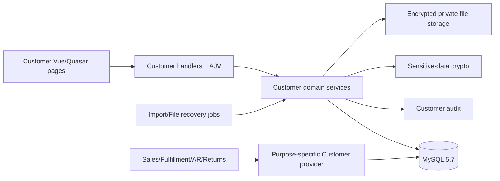

# Customer Management Aligned System Design Specification

## 1. Authority and Alignment Model

The complete aligned detailed design is [`design_spec.md`](design_spec.md). This specification is the normative harness traceability entry: it assigns stable `DES-*` identifiers and records the corrections incorporated into that full design.

Precedence is:

1. confirmed business requirement and approved decisions;
2. this aligned specification for explicit corrections/clarifications;
3. the full aligned `design_spec.md` for detailed fields, tables, routes, pages, services and test design.

No application source or migration is changed by this document.

## 2. Architecture Summary

Use the existing modular monolith: Node.js ES modules, Express `BaseRequestHandler`, AJV request/response schemas, explicit service injection, `MySqlDatabaseService.withTransaction()`, Vue 3, Quasar, page/service discovery and shared UI components. Customer owns its aggregate and purpose-specific read services. Currency/Payment Term, sensitive-data primitives, authentication, authorization, idempotency, time, upload and scheduling remain shared platform capabilities.



## 3. Canonical Design Decisions

| Design ID | Decision / behavior | Requirement basis | Provenance |
| --- | --- | --- | --- |
| DES-001 | Keep Customer as an independent aggregate in the modular monolith; do not introduce generic Party or a microservice. | FR-017..FR-100; BR-001..004 | `EXISTING` |
| DES-002 | Reuse handler discovery, AJV, permission policy, transaction, idempotency, scheduler, upload and Vue/Quasar conventions; dependency injection remains explicit. | NFR-006..014; SEC-001..014 | `EXISTING` |
| DES-003 | Application normalization is the sole equality algorithm; canonical `*_key` columns use `utf8mb4_bin`, while display/search columns retain project collation. | FR-002, FR-003, FR-018..021, FR-028, FR-049; BR-005..007 | `ENHANCED` |
| DES-004 | Customer root and children use stable numeric IDs, optimistic versions and database uniqueness/foreign-key constraints. | FR-017..070; NFR-006..008 | `EXISTING` |
| DES-005 | Lifecycle is command-based, not arbitrary status update; `ever_activated_at` and registered reference guards protect permanent deletion. | FR-034..041; BR-025..029 | `EXISTING` |
| DES-006 | Business commands use framework idempotency plus domain invariants; actor+route+canonical payload hash is bound to a durable outcome/resource reference. Commit-unknown is reconciled, never blindly retried. | FR-077, FR-090; NFR-008 | `ENHANCED` |
| DES-007 | Every write locks in fixed order, performs current-state/version validation, writes domain data and redacted audit in one MySQL transaction. | FR-030, FR-045, FR-074..077, FR-097; NFR-006..008 | `EXISTING` |
| DES-008 | Address/contact purpose default changes lock the Customer and affected mappings, clear old default and set the new value atomically; unique generated slots are the final defense. | FR-042..049; BR-010..013 | `EXISTING` |
| DES-009 | Credit absence, zero limit and On Hold are distinct projections; Customer stores policy only and never computes exposure or override eligibility. | FR-050..056; BR-017..020 | `EXISTING` |
| DES-010 | Activation approval uses a setting/version snapshot, different active approver, immutable bounded snapshot/hash and CAS decisions; setting changes are prospective. | FR-071..083; SEC-004, SEC-007 | `EXISTING` |
| DES-011 | Bank values use AES-256-GCM, versioned owner-bound AAD, separate HMAC blind-index keys, masked projections, fresh permission/re-auth and audited reveal; no generic decrypt route exists. | FR-057..063; SEC-005, SEC-006, SEC-010..014 | `EXISTING` |
| DES-012 | General and bank-sensitive files use private encrypted storage, allowlisted signatures, malware scan and durable `processing -> active/storage_error` finalization. Stale processing/upload operations are reconciled by a bounded recovery job. | FR-064..070; NFR-006, NFR-009, NFR-015; SEC-010, SEC-013 | `ENHANCED` |
| DES-013 | CSV jobs stream RFC 4180 input, reject sensitive columns, persist row-level normalized payload/status, apply each Customer aggregate atomically and resume by lease without replaying terminal rows. | FR-084..093; NFR-004, NFR-008 | `EXISTING` |
| DES-014 | APIs use explicit GET/read and POST/command routes, `additionalProperties:false`, owner-composite lookup, version fields, bounded pagination, stable public errors and safe envelopes. | FR-001..FR-100; SEC-001..014 | `EXISTING` |
| DES-015 | Authorization is enforced server-side with explicit permissions and no inheritance. Sensitive writes/read and delegation re-check current actor status/permission and required authentication strength. | SEC-001..014 | `EXISTING` |
| DES-016 | Frontend follows `docs/frontend-design.md`, shared components, URL filters, accessible status/error/focus behavior, 375–1440px layouts, and never stores sensitive plaintext in Pinia, URL or local storage. | FR-001..016, FR-064..093; NFR-011, NFR-014 | `EXISTING` |
| DES-017 | Downstream lookup is purpose-specific. New sale/manual invoice is Active-only; existing-order fulfillment, shipped-source invoice, existing AR settlement, historical return and history views do not fail solely on Customer status. Address/contact/bank ownership and active-purpose rules still apply at submit. Unknown purpose fails closed. | FR-034, FR-047, FR-048, FR-054..056; BR-025, BR-026, BR-035, BR-042 | `ENHANCED` |
| DES-018 | Search defaults to exact and normalized token-prefix semantics with bounded input and indexed predicates. Arbitrary infix search is not implied; adding it requires a new indexed design and performance acceptance. | FR-001..010; NFR-001..005 | `ENHANCED` |
| DES-019 | Query plans use two-step page IDs/summary projections, `EXISTS` for completeness/child filters, allowlisted sort, stable tie-breaker and no multi-child count join. | FR-001..016; NFR-001..005 | `EXISTING + ENHANCED` |
| DES-020 | Reference/open-matter checks use a versioned provider registry. Delete requires every mandatory provider `READY` and `NO_REFERENCE`; unavailable/unknown fails closed. Archive reports safe blockers and never silently severs existing obligations. | FR-037..041; NFR-010 | `ENHANCED` |
| DES-021 | Audit actions use allowlisted redacted builders, same-transaction writes for business mutations, immutable application APIs, request correlation and bounded detail. Sensitive access attempts/results are auditable without plaintext. | FR-094..100; SEC-011, SEC-014 | `EXISTING` |
| DES-022 | Migrations use logical IDs and forward-only, restart-safe DDL. Physical sequence numbers are allocated from latest main at Phase entry; no reserved number is authoritative. | NFR-006, NFR-011 | `ENHANCED` |
| DES-023 | Logs/metrics/alerts avoid sensitive and high-cardinality labels and cover latency, conflicts, approval age, integrity failures, denied access, file recovery and worker leases. | NFR-001..010; SEC-010..014 | `EXISTING + ENHANCED` |
| DES-024 | Backup/restore treats DB, key rings, general files, bank-sensitive files and audit as one recoverable set; production RTO<=4h and RPO<=15m are proven by isolated restore/reconciliation. | NFR-009, NFR-015 | `NEW — USER APPROVED` |
| DES-025 | Deliver dependency-safe vertical Phases; sensitive/file and consumer capabilities remain disabled/fail-closed until providers, keys, scanner, storage and security reviews are ready. | All requirements; OI-002..005 | `ENHANCED` |

## 4. Domain and State Design

### 4.1 Customer Lifecycle

```text
draft -> active                         (approval OFF)
draft -> pending_approval -> active     (approval ON + approve)
pending_approval -> draft               (reject/withdraw/invalidate)
active -> suspended -> active
active|suspended -> blocked -> suspended
draft|active|suspended -> archived -> suspended
```

Only named commands execute these transitions. Block/unblock requires `customer.approval`; restore/unblock never returns directly to Active. Permanent delete is limited to never-active, currently Draft, unreferenced aggregates with all mandatory reference providers ready.

### 4.2 Purpose Eligibility Matrix

| Purpose | Customer status | Child rule | Typical consumer |
| --- | --- | --- | --- |
| `new_sale` | Active only | No shipping address required at SO creation | Sales Order |
| `manual_invoice` | Active only | Billing data optional per AR contract | Invoicing |
| `existing_order_fulfillment` | Any persisted status | Chosen shipping address/contact must be active, owned and correctly purposed | Fulfillment |
| `invoice_existing_shipment` | Any persisted status | Current billing choice, if supplied, must be active/owned; source snapshot remains authoritative | Invoicing |
| `ar_existing_document` | Any persisted status | No new-sales eligibility implication | Receipt/Credit/Statement |
| `historical_return` | Any persisted status | Original transaction identity/snapshot retained | Returns |
| `refund_existing_transaction` | Any persisted status | Selected bank must be active/owned/purpose-authorized | Refund |
| `history` | Any persisted status | Read-only minimal projection | Inquiry/reporting |

The consumer authorizes its own actor and owns its transaction/snapshot. Customer Provider only validates current master ownership/eligibility and returns an allowlisted projection.

## 5. Database Alignment

### 5.1 Formal Logical Tables

The full design defines 20 logical-table groups: shared `currencies` and `payment_terms`; three classification catalogs; `customers`; address/purpose; contact/purpose; identifier; credit profile; bank; attachment; activation request; settings; audit; import job/row; and `customer_operation_requests` for durable domain outcomes. Exact fields, nullability, defaults, FKs and indexes remain as specified except the corrections below.

### 5.2 Normative Corrections

- `customer_code_key`, `legal_name_key`, `trading_name_key`, catalog/payment-term `code_key` and `identifier_value_key` explicitly use `CHARACTER SET utf8mb4 COLLATE utf8mb4_bin`. Equality is applied to the already normalized value, not delegated to linguistic collation.
- User-facing text remains `utf8mb4_unicode_ci`; normalized token-prefix predicates target indexed key/search columns. A leading `%term%` scan is not the standard list path.
- `customer_attachments` processing records must durably correlate the request/operation and deterministic `stored_name`; status includes `processing`, `active`, `inactive`, `storage_error`, `deleting`, `delete_failed`. A recovery index covers `(status,updated_at,id)`.
- Import source/result storage uses the same deterministic-state reconciliation rule; a DB terminal state is never claimed while the required object is absent or has the wrong hash.
- `customer_operation_requests` owns long-lived actor/route/key/payload-hash/result/lease state. Attachment and import operations reference it; short-lived framework idempotency rows do not replace this domain result index.
- Generated default-slot columns and composite ownership FKs remain required. Service tests are insufficient substitutes for real MySQL 5.7 constraint/race tests.
- Audit has no update/delete application endpoint. Production DB credentials separate migration/operations authority from runtime DML authority; backup and emergency access are logged and governed operationally.

### 5.3 Migration Rules

Use logical migration ordering only: permissions/shared catalogs -> Customer catalogs/root/audit -> party/credit -> settings/approval -> bank/files -> imports. At each Phase start, fetch latest main, inspect applied migration history, allocate the next available physical sequence and update tests. Applied migrations are never renamed or edited; correction uses a forward migration.

## 6. Backend and API Alignment

### 6.1 Services

Preserve the source service boundaries. Add explicit responsibilities:

- `CustomerOperationService`: canonical payload hash/outcome reconciliation around framework idempotency.
- `CustomerFileRecoveryJob`: finalize or safely fail stale attachment/import file states; verify hashes before activation.
- `CustomerReferenceProviderRegistry`: mandatory provider readiness/version and tri-state `REFERENCE | NO_REFERENCE | UNKNOWN`.
- `CustomerLookupService`: named/purpose-allowlisted methods matching §4.2; no generic status bypass.

### 6.2 Transaction and Lock Order

Normative lock order is:

```text
customer_settings (when required)
-> customers (ascending id)
-> activation request
-> child rows (type then ascending id)
-> purpose mappings
-> import/file operation row
-> customer_audit_logs append
```

Never call storage, scanner, notification or an unavailable downstream service while holding DB locks. Multiple-Customer commands are not part of this module. Deadlock/lock timeout produces a bounded retryable conflict; services do not silently replay business commands.

### 6.3 Idempotency and Outcome

- Required on create, activation/approval decision, high-risk lifecycle, bank mutation/reveal session creation, upload, import upload/confirm and export creation.
- The idempotency record binds actor, route, canonical payload hash and resource/operation ID.
- Same key/same payload returns the original known outcome; same key/different payload returns `IDEMPOTENCY_CONFLICT`.
- An indeterminate commit returns a correlation/operation reference. Clients poll outcome or GET the resource; they never generate a fresh key until the original outcome is terminal.
- Domain unique/CAS constraints remain mandatory because framework idempotency alone cannot prevent two different keys causing duplicate effects.

### 6.4 API Contract

All routes in `design_spec.md` §6 remain in scope. Aligned additions/clarifications:

- Every command response returns `resourceId`, `version`, `status`, `requestId`, and `operationId` when processing may outlive the request.
- `GET /api/v1/customer-operations/:operationId` returns only actor-owned/safely authorized status: `PROCESSING | SUCCEEDED | FAILED | UNKNOWN`, result resource reference and stable error; it never returns payload or sensitive data.
- Customer Provider exposes named methods or an enum-enforced purpose. Unknown purpose is rejected at construction/validation and at runtime.
- All child/file/bank/approval lookups query parent ID and child ID together. Cross-owner and absent results use the same safe response.
- Sensitive downloads/reveals use `no-store`, fresh permission, re-auth, bounded token/session binding and audit before content is exposed.

## 7. File and Import Recovery Sequences

### 7.1 Attachment Upload

1. Authenticate/authorize, validate metadata and reserve idempotent operation.
2. Stream to encrypted private temp storage while calculating size, signature and SHA-256; scan before acceptance.
3. In one transaction create `processing` metadata with deterministic object name and redacted audit.
4. Atomically move temp object to final storage and verify hash/size.
5. In a short transaction change metadata to `active`, append completion audit and complete operation response.
6. If the process stops after step 3, recovery checks final then temp object: finalize a valid object, otherwise mark `storage_error` and alert. It never creates a second attachment for the same operation.

### 7.2 Import Files

Apply the same reserve/stream/verify/finalize pattern to import sources/results. Row application remains one Customer aggregate per transaction. Worker leases are bounded; terminal rows never replay; summary is recomputed from row states.

## 8. Frontend Design

Preserve the source pages: Customer list/create/detail, approvals, imports and settings. Each page uses `PageHeader`, `DataTable`, `FormPanel`, `EllipsisCell`, shared notifications/confirmations, URL filters and permission-aware page metadata.

Implementation acceptance requires Playwright in a real browser for primary flows, error/empty/loading states, keyboard/focus behavior, refresh/back state, 375/768/1024/1440px behavior, console errors and failed/malformed network requests. Static review, unit tests and build success alone are insufficient.

Bank plaintext exists only inside the active reveal/form component, is cleared on timeout/unmount/session loss and is never placed in URL, analytics, storage, global store, screenshot fixture or test snapshot.

## 9. Security and Threat Controls

- Explicit backend permission matrix; UI visibility is convenience only.
- System administrator does not automatically receive bank permissions. Any exceptional delegation path requires current protected-admin role, approved device, password, reason, target permission allowlist and audit; it does not grant route access to the delegator.
- SQL values are parameterized; sort/table selection uses code allowlists. AJV blocks mass assignment.
- Owner-safe IDs, output encoding, CSV formula neutralization, private paths, file signature/scan and response headers address IDOR/injection/XSS/path traversal/content sniffing.
- Bank ciphertext, IV, tag, blind index, key IDs, plaintext, sensitive filenames and file contents are excluded from ordinary projections/logs/audit details.
- Key rotation supports old+new reads and new-key writes, reports counts only, proves zero old-key rows before retirement and is covered by backup/restore.

## 10. Performance, Availability and Operations

- Capacity baseline: 100,000 customers, stated child cardinalities, 50 concurrent users and 10,000-row imports.
- Standard list/exact/prefix and shipping/contact lookups: p95 < 2s under the declared mixed load; error rate <1%; no unbounded DB/request queue.
- Import precheck+execution: <10 minutes excluding human delay.
- Record dataset generator version, distribution, hardware, MySQL config, warm-up, p50/p95/p99, throughput, errors, CPU/memory and lock metrics.
- Health/readiness reports schema, mandatory provider registry, key ring, scanner, storage and worker readiness per capability. Optional sensitive capability failure does not corrupt or overexpose core Customer reads.
- Alerts cover bank integrity/unknown key, unauthorized access spikes, stuck file/import operations, audit failures, migration mismatch and sustained latency breaches.

## 11. Backup, Retention and DR

- Restore unit: Customer DB rows and audit, encryption/lookup key rings, general files, bank-sensitive files, import evidence and configuration manifest.
- RPO<=15 minutes determines backup/log-shipping cadence. RTO<=4 hours is measured from declared incident start through isolated restore, key/file verification, reference reconciliation and successful smoke—not merely database availability.
- Quarterly restore exercise samples ordinary Customer, address/contact, approval, encrypted bank reveal, both file sensitivity classes, import history and audit correlation.
- Customer/audit/bank/file records retain at least seven years. No automatic destructive purge/crypto-shredding until Legal/Compliance approves longer periods, legal hold and deletion procedure. Import source/result policy remains source requirement baseline.

## 12. Failure and Degraded Modes

| Failure | Required behavior |
| --- | --- |
| DB timeout before commit | Roll back/destroy abandoned connection; return safe retryable error. |
| Commit result unknown | Keep operation unresolved; reconcile by operation/resource/audit before retry. |
| Audit insert fails | Business transaction rolls back. |
| Scanner/key/storage unavailable | Sensitive/file capability fails closed; core masked/general data remains available where safe. |
| Crash after file metadata commit | Recovery finalizes deterministic object or marks error; no duplicate active record. |
| Reference provider unavailable | Delete/archive decision returns unknown and fails closed; no silent bypass. |
| Permission revoked after page load | Submit/reveal re-checks current authority and returns safe denial without side effect. |
| Customer/child changed after selection | Consumer submit revalidates purpose/ownership/version and requires reselection where applicable. |
| Worker crash/lease expiry | Another worker resumes non-terminal rows only; terminal effects are not replayed. |

## 13. Deployment and Rollback

- Each Phase begins from current main in an independent worktree and has one merge checkpoint by default.
- Use expand/additive forward migrations. Server remains compatible with absent disabled-capability tables during ordered deployment where explicitly designed.
- Provision keys/storage/scanner/backup before enabling bank/file routes or assigning sensitive roles.
- Rollback application only to a schema-compatible version. Data correction is an audited compensating action or forward migration, never direct history deletion.
- Any change to lifecycle, normalization equality, purpose matrix, retention or sensitive-data model reopens the requirement/design gate and updates all downstream artifacts.

## 14. Trade-offs and Rejected Alternatives

| Rejected alternative | Reason |
| --- | --- |
| Generic Party aggregate | No second implemented variation justifies complexity; Customer/Supplier have distinct ownership and workflows. |
| Customer microservice/event bus | Current single-application MySQL transaction model is simpler and sufficient. |
| Generic decrypt/download API | Expands data-exfiltration surface and loses purpose/audit context. |
| Leading-wildcard scan as default search | Cannot rely on existing B-tree indexes at the declared capacity. |
| Client-only permissions/default validation | Races and direct API calls would bypass business rules. |
| Cross-store “success” before file finalization | Creates ambiguous/missing objects and unsafe retries. |
| Fixed future migration numbers | Parallel feature branches make reservations stale. |
| Automatic purge after seven years | Legal hold/longer retention is unresolved and deletion is irreversible. |

## 15. Requirement Coverage Manifest

The following IDs are each covered by one or more decisions above and mapped precisely in `08_traceability_matrix.md`:

- Functional: FR-001, FR-002, FR-003, FR-004, FR-005, FR-006, FR-007, FR-008, FR-009, FR-010, FR-011, FR-012, FR-013, FR-014, FR-015, FR-016, FR-017, FR-018, FR-019, FR-020, FR-021, FR-022, FR-023, FR-024, FR-025, FR-026, FR-027, FR-028, FR-029, FR-030, FR-031, FR-032, FR-033, FR-034, FR-035, FR-036, FR-037, FR-038, FR-039, FR-040, FR-041, FR-042, FR-043, FR-044, FR-045, FR-046, FR-047, FR-048, FR-049, FR-050, FR-051, FR-052, FR-053, FR-054, FR-055, FR-056, FR-057, FR-058, FR-059, FR-060, FR-061, FR-062, FR-063, FR-064, FR-065, FR-066, FR-067, FR-068, FR-069, FR-070, FR-071, FR-072, FR-073, FR-074, FR-075, FR-076, FR-077, FR-078, FR-079, FR-080, FR-081, FR-082, FR-083, FR-084, FR-085, FR-086, FR-087, FR-088, FR-089, FR-090, FR-091, FR-092, FR-093, FR-094, FR-095, FR-096, FR-097, FR-098, FR-099, FR-100.
- Non-functional: NFR-001, NFR-002, NFR-003, NFR-004, NFR-005, NFR-006, NFR-007, NFR-008, NFR-009, NFR-010, NFR-011, NFR-012, NFR-013, NFR-014, NFR-015.
- Security: SEC-001, SEC-002, SEC-003, SEC-004, SEC-005, SEC-006, SEC-007, SEC-008, SEC-009, SEC-010, SEC-011, SEC-012, SEC-013, SEC-014.

## 16. Design Readiness

The aligned architecture is implementable, but the Human Design Gate is `CONDITIONAL`: the cross-system sensitive-permission delegation change requires explicit Security/Backend approval before TASK-020 in PHASE-003, and each unavailable downstream provider or sensitive runtime dependency blocks only its dependent capability. No application code or acceptance test was executed here.
