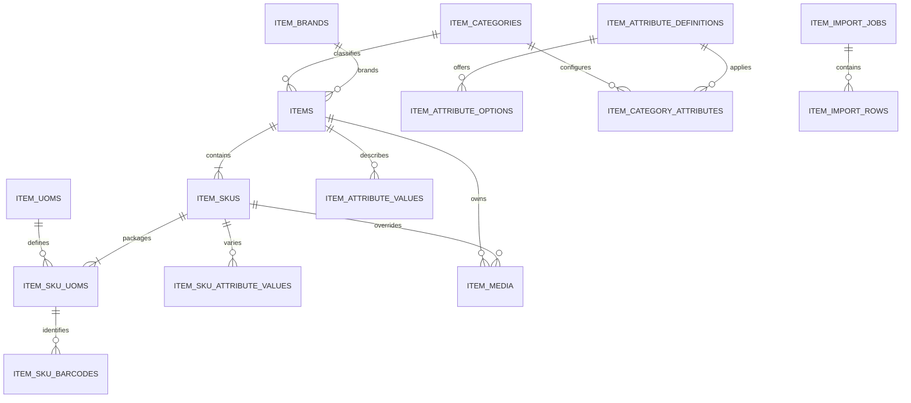

# Item Management System Design Specification (Harness Aligned)

## Harness alignment record

| Item | Value |
| --- | --- |
| Execution mode | `REVIEW_AND_ALIGN` |
| Alignment date | 2026-09-11 |
| Inspected baseline | `fd8a4ddb27636aaeb47235f3d4976001fa7dfc7a` |
| Legacy source | `design_spec.md`, SHA-256 `58a9e82e14285a8eca95671f5a8cd1cdc1e67a4bc0e361bf0131132c55550805` |
| Provenance | Existing proposed design plus current-code alignment evidence |
| Product-code change | None |

The complete legacy design is retained below. Canonical `DES-*` items provide stable traceability; the design remains subject to the independent findings in `04_design_review.md`.

## Canonical design index

| ID | Design item | Legacy sections | Requirement coverage | Alignment |
| --- | --- | --- | --- | --- |
| DES-001 | Scope, decisions, actors and module boundaries | §1, §2 | FR-001, FR-002, FR-003, FR-004, FR-005, FR-006, FR-007, FR-008, FR-009, FR-010; SEC-001; NFR-001 | ALIGNED |
| DES-002 | Permissions, fresh authorization and strong re-authentication | §3 | FR-059, FR-060, FR-061, FR-062, FR-063, FR-064; SEC-001, SEC-002, SEC-003, SEC-004, SEC-005, SEC-006 | PARTIAL; verify every asynchronous effect |
| DES-003 | Item/SKU aggregate and lifecycle state model | §4.1–4.3, §8.1 | FR-016, FR-017, FR-018, FR-019, FR-020, FR-021, FR-022, FR-023, FR-024, FR-025, FR-026, FR-027, FR-028, FR-029, FR-030, FR-031, FR-032, FR-033, FR-034, FR-035, FR-036, FR-037, FR-038 | PARTIAL; downstream reference checks await real consumers |
| DES-004 | Variant signature and typed attributes | §4.4, §5.10, §6.4 | FR-018, FR-025; SEC-007, SEC-008 | IMPLEMENTATION_GAP in read projection/UI |
| DES-005 | Barcode normalization and uniqueness | §4.5, §5.9 | FR-002, FR-003, FR-041, FR-042, FR-043 | ALIGNED |
| DES-006 | Fixed HKD price and numeric rules | §4.6, §5.2, §6.5 | FR-044, FR-045, FR-046, FR-047, FR-048, FR-049 | ALIGNED |
| DES-007 | Relational schema, constraints and migrations | §5 | FR-011, FR-012, FR-015, FR-039, FR-040; SEC-008; NFR-006, NFR-008, NFR-009, NFR-010 | PARTIAL; operational upgrade proof pending |
| DES-008 | Item/SKU API contracts, error semantics and idempotency | §6.1–6.3, §6.9–6.11 | FR-011, FR-012, FR-015, FR-016, FR-017, FR-018, FR-019, FR-020, FR-021, FR-022, FR-023, FR-024, FR-025, FR-026, FR-027, FR-028, FR-029, FR-030, FR-031 | PARTIAL; standalone SKU create retained by HD-001 and pending TASK-038 |
| DES-009 | Catalog API and reference protection | §6.4, §8.2, §8.4 | FR-032, FR-033, FR-034, FR-035, FR-036, FR-037, FR-038 | IMPLEMENTATION_GAP for referenced Brand/UOM error mapping |
| DES-010 | UOM conversion and lookup contract | §5.8, §8.3 | FR-039, FR-040, FR-041, FR-042, FR-043 | ALIGNED for current consumers |
| DES-011 | Media storage, API and consistency | §2.6, §5.11, §6.6, §8.5 | FR-011, FR-012, FR-015; SEC-007, SEC-008, SEC-009; NFR-011 | ALIGNED with filesystem compensation risk |
| DES-012 | Audit persistence, query and presentation | §5.12, §6.7, §8.7 | FR-013, FR-059, FR-060, FR-061, FR-062, FR-063, FR-064; NFR-006 | IMPLEMENTATION_GAP: backend exists, user-facing history view absent |
| DES-013 | CSV import/export, job lifecycle and retention | §5.13, §6.8, §8.6 | FR-050, FR-051, FR-052, FR-053, FR-054, FR-055, FR-056, FR-057, FR-058; SEC-007, SEC-008, SEC-009; NFR-005, NFR-011 | HIGH gap: direct SQL bypasses aggregate audit contract |
| DES-014 | Query, pagination, search, filters and response projections | §6.10, §8.8 | FR-001, FR-002, FR-003, FR-004, FR-005, FR-006, FR-007, FR-008, FR-009, FR-010, FR-011, FR-012, FR-014, FR-015; NFR-002, NFR-003, NFR-004 | PARTIAL; attribute/variant arrays forced empty |
| DES-015 | Page routes, editors, scanner UX and accessibility | §7 | FR-006, FR-007, FR-008, FR-009, FR-010, FR-011, FR-012, FR-013, FR-014, FR-015, FR-016, FR-017, FR-018, FR-022, FR-025; SEC-009; NFR-012, NFR-013 | PARTIAL; Audit page absent; standalone SKU-create page retained by HD-001 and pending TASK-038 |
| DES-016 | Validation and automated-test architecture | §10, §11 | All FR/NFR/SEC through the canonical test crosswalk | PARTIAL; developer evidence exists, independent acceptance not executed |
| DES-017 | Configuration, logs, metrics and alerts | §12.1–12.3 | SEC-007, SEC-009; NFR-001, NFR-002, NFR-003, NFR-004, NFR-005, NFR-013 | IMPLEMENTED with developer evidence |
| DES-018 | Retention, backup, restore and DR objectives | §12.4, §14 | FR-063; SEC-008, SEC-009; NFR-010, NFR-011, NFR-014, NFR-015 | DESIGN ENHANCED; RTO/RPO verification pending |
| DES-019 | Delivery phases, deployment and forward-only rollback | §13, §14 | NFR-007, NFR-008, NFR-009, NFR-010, NFR-014, NFR-015 | PARTIAL; staging exercise pending |
| DES-020 | Cross-module reference integration and transaction snapshot boundary | §1.2, §8.3–8.4 | FR-014, FR-030, FR-031, FR-034, FR-037, FR-038; SEC-008 | DEFERRED until first real Purchasing/Inventory/Sales FK |

## Full canonical requirement set

Functional: FR-001, FR-002, FR-003, FR-004, FR-005, FR-006, FR-007, FR-008, FR-009, FR-010, FR-011, FR-012, FR-013, FR-014, FR-015, FR-016, FR-017, FR-018, FR-019, FR-020, FR-021, FR-022, FR-023, FR-024, FR-025, FR-026, FR-027, FR-028, FR-029, FR-030, FR-031, FR-032, FR-033, FR-034, FR-035, FR-036, FR-037, FR-038, FR-039, FR-040, FR-041, FR-042, FR-043, FR-044, FR-045, FR-046, FR-047, FR-048, FR-049, FR-050, FR-051, FR-052, FR-053, FR-054, FR-055, FR-056, FR-057, FR-058, FR-059, FR-060, FR-061, FR-062, FR-063, FR-064.

Non-functional and security: NFR-001, NFR-002, NFR-003, NFR-004, NFR-005, NFR-006, NFR-007, NFR-008, NFR-009, NFR-010, NFR-011, NFR-012, NFR-013, NFR-014, NFR-015; SEC-001, SEC-002, SEC-003, SEC-004, SEC-005, SEC-006, SEC-007, SEC-008, SEC-009.

## Current-baseline alignment notes

- Implemented tables and services broadly follow the legacy design; migrations currently reach `0026` for Item scope.
- `ItemAdminService` still projects `attributeValues: []` and `variantValues: []`, while response schemas cap both arrays at zero. The Attribute/Variant persistence therefore is not observable through the promised detail contract.
- Variant creation exists inside Item aggregate creation, but the designed `POST /api/v1/skus/create` / standalone SKU-create flow is absent. Human decision `HD-001` on 2026-09-11 retains this contract for existing Variant Items and places its implementation under `TASK-038`.
- Audit query API exists at `GET /api/v1/item-audit/logs`, but the designed user-facing audit page/timeline and frontend client are absent.
- Brand and UOM permanent deletion still contain stale assumptions that no reference tables exist. Current foreign keys reject referenced deletion, but the service does not translate those failures to the documented `CATALOG_IN_USE` public error as Attribute deletion does.
- Import execution writes Item/SKU/UOM rows directly. The earlier confirm transaction writes one job-level `item.import` audit record, but item.create/item.update audit is not transactionally coupled to the imported aggregate changes.
- No production downstream Purchasing/Inventory/Sales FK currently exists; the future reference-guard integration remains a declared dependency, not an implementation failure against an available provider.

## HD-003 — Attribute and Variant detail projection contract

`ERP Product Owner (Sam)` approved this contract in the active Codex task on 2026-09-14 for `TASK-037`. It resolves the previously unspecified non-empty response shape without expanding the task into Attribute write support or arbitrary typed SKU Variant values.

`GET /api/v1/items/:id` returns `attributeValues`, ordered by the assigned Category Attribute `sort_order` and then `attributeId`. Each row is a whitelist projection:

```json
{
  "attributeId": 4,
  "code": "MATERIAL",
  "name": "材質",
  "dataType": "single_option",
  "value": "cotton",
  "option": { "id": 17, "value": "cotton", "label": "棉" }
}
```

`value` is the typed display value: `string` for text, long text and decimal; `boolean` for boolean; epoch milliseconds for date; and the option `value` for `single_option`. `option` is `null` for every non-option data type and otherwise contains only `id`, `value` and `label`.

`GET /api/v1/skus/:id` returns `variantValues` in the same stable order. This task projects the existing Variant domain only: every row has `dataType: "single_option"` and a non-null option object. The response does not add a write API, and Item-detail SKU summaries remain summaries rather than duplicating each SKU's variant values.

---

# Preserved legacy body (verbatim)

# Item Management 詳細設計規格

## 0. 文件資訊

| 項目 | 內容 |
| --- | --- |
| 文件版本 | 0.2 Draft |
| 文件日期 | 2026-09-04 |
| 需求來源 | `docs/items_management/requirement.md` 0.3 Draft |
| 適用系統 | ERP App |
| 技術基線 | Node.js 26、Express 5、MySQL 5.7+、Vue 3、Quasar、Pinia |
| 狀態 | 核心設計已收斂；待正式簽核與上線前置工作 |

本文件把業務需求轉成可實作的程式架構、資料庫、API、頁面、權限、交易、錯誤及測試設計。若本文件與業務需求衝突，以已簽核的業務需求為準；上線前置工作不得被視為已完成。

版本 0.2 同步 2026-09-04 訪談決策：增加 `item.view`、固定 HKD／`tax_not_applicable`、改用整數 UOM factor，並移除 Item settings table／API／page 及本期 Supplier reference。

---

## 1. 設計範圍、決策與前置條件

### 1.1 已確認決策

| 編號 | 決策 | 設計結果 |
| --- | --- | --- |
| DEC-001 | 單一公司 | 所有 Item、SKU Code、條碼、分類及品牌均為全公司範圍，不加入 `tenant_id`／`company_id`。 |
| DEC-002 | SKU Code 人工輸入，沒有指定格式 | API 不自動產生或改寫 Code；只 trim 首尾空白、拒絕空字串／控制字元、限制長度並以不分大小寫方式保證唯一。 |
| DEC-003 | 建檔人可直接啟用 | 不建立 approval table 或第二人審批；有 `item.mgmt` 且資料完整即可啟用，啟用事件必須稽核。 |
| DEC-004 | 單語言 | 不建 translation tables；Item／SKU 只保存一組 UTF-8 名稱及描述。 |
| DEC-005 | 不拆零 | Base UOM 數量及 Pack UOM 換算只接受整數。 |
| DEC-006 | 成本不屬本模組 | `items`／`item_skus` 不保存成本欄位。 |
| DEC-007 | 條碼非啟用必填 | 無條碼 SKU 可用 Code 搜尋及交易。 |
| DEC-008 | 停產可清貨 | Discontinued 禁止採購、Sellable 時可售；售完由使用者手動封存。 |
| DEC-009 | 查看與管理分權 | 新增 `item.view` 及 `item.mgmt`；下游 lookup 仍依呼叫模組權限。 |
| DEC-010 | SKU 保存 tracking policy | Item 只提供新 SKU 預設，不按分類強制或覆寫既有 SKU。 |
| DEC-011 | 自訂法規屬性 | 不建固定成分／法規欄；使用分類自訂屬性。 |
| DEC-012 | 不支援組合／服務型商品 | 本期只處理獨立持有庫存的實體 SKU。 |
| DEC-013 | 匯入全有全無 | 預檢有任一錯誤即不可確認，執行使用單一商品交易。 |
| DEC-014 | 容量 | 三年內預計少於 20,000 SKU，但按 100,000 SKU 上限設計及壓測。 |
| DEC-015 | 全域狀態 | 不建立門店／倉庫／渠道層 Item status。 |
| DEC-016 | 價格固定口徑 | RRP 使用 HKD，tax basis 固定為 `tax_not_applicable`，不建立 Item settings。 |
| DEC-017 | Standard／Variant 邊界 | Standard 恰好一個 SKU；Variant 才可多 SKU。 |
| DEC-018 | Supplier 對照延後 | Supplier 主資料存在前不建立 supplier reference table。 |
| DEC-019 | 不設 Item Code | `items` 不增加 `item_code` 欄位或 API 欄位；Item 使用內部 ID，交易識別使用 SKU Code。 |
| DEC-020 | RRP 修改原因不強制 | 單純修改 `suggested_price_amount` 時 `reason` 可選，但 audit 必須保存前後值、操作者及時間；同一請求若修改其他關鍵欄位，仍按其規則要求 `reason`。 |
| DEC-021 | 可授權豁免最低收貨效期 | 預設阻擋效期不足的收貨；Receiving 模組須以專門權限、必填原因及完整 audit 控制例外。 |
| DEC-022 | 效能與容量基線 | 支援最多 50 名同時在線使用者及每日 1,000 次商品變更；線上查詢 p95 < 2 秒，10,000 row CSV 的系統處理時間合計 ≤ 10 分鐘。 |
| DEC-023 | 資料保留基線 | Item／SKU／Catalog 主資料、import job summary 及 audit 至少保留 7 年；import source／result files 保留 1 年；正式上線前由合規核對。 |
| DEC-024 | 父 Item 狀態實際同步至 SKU | Item 停用、停產及封存時，在同一交易更新所有受影響 SKU；任一失敗全部 rollback；Item restore 不自動 restore／activate SKU。 |

### 1.2 非設計決策類前置工作

本輪需求訪談已沒有未決的核心設計假設。上線前仍須完成 §16 的合規核對及初始主資料準備；它們不改變本文件的 Item／SKU 核心模型。

### 1.3 明確不做的設計

- 不在 Item 模組保存庫存結餘、實際批號、實際到期日或序號。
- 不建立正式價格表、促銷價、會員價、渠道價或價格生效排程。
- 不建立 BOM、組合包拆組、服務型商品或虛擬 SKU。
- 不建立稅務分類、含稅／未稅設定或 Item settings 頁；已確認 HKD／`tax_not_applicable`。
- 不建立成本或供應商對照；Supplier／Purchasing 主資料完成後另行設計後者。
- 不因未來可能多公司而預先加入 tenant abstraction。
- 不把商品業務邏輯放入 `server/src/framework/`。
- 不用 Item 名稱、SKU Code 或條碼作資料庫外鍵。

---

## 2. 整體架構

### 2.1 元件關係

```text
Vue Pages
  └─ client/src/services/item*.js
       └─ HTTP /api/v1/items/*
            └─ Handler（一支 API 一個檔案）
                 ├─ ItemAdminService
                 ├─ ItemCatalogService
                 ├─ ItemMediaService
                 ├─ ItemImportService
                 └─ ItemAuditLogService
                        └─ MySqlDatabaseService

採購／庫存／銷售 Handler（後續）
  └─ ItemLookupService（內部唯讀，不繞過呼叫方自己的授權）
       └─ item_skus + items + UOM + barcode
```

### 2.2 後端分層

| 層 | 位置 | 責任 |
| --- | --- | --- |
| Handler | `server/src/handlers/items/` | 宣告 method、path、auth、schema；將 HTTP 輸入轉為 service 參數；不寫 SQL。 |
| Domain／Application Service | `server/src/modules/item/` | 狀態機、完整性、唯一性、交易、並發、稽核及資料映射。 |
| Technical Service | 現有 `server/src/services/` | MySQL、時間、日誌、檔案型別、排程及 idempotency。 |
| Configuration | `server/config/item.js` | Media 儲存／上限、分類深度及匯入批次／timeout；固定價格口徑放在 domain constants。 |
| Persistence | `server/database/migrations/` | Schema、索引、外鍵、permission seed。 |

### 2.3 前端分層

| 層 | 位置 | 責任 |
| --- | --- | --- |
| Page | `client/src/pages/items/` | 列表、詳情、表單、狀態操作及錯誤呈現。 |
| Feature component | `client/src/components/items/` | SKU editor、UOM、barcode、attribute、media 等可測試區塊。 |
| Service | `client/src/services/item*.js` | HTTP 路徑、request mapping、DataTable mapping。 |
| Framework UI | 現有 `client/src/framework/ui/` | 共用 DataTable、FormPanel、確認及通知；不加入商品規則。 |

### 2.4 模組目錄

```text
server/src/modules/item/
├── ItemAdminService.js
├── ItemCatalogService.js
├── ItemLookupService.js
├── ItemMediaService.js
├── ItemImportService.js
├── ItemAuditLogService.js
├── itemConstants.js
├── itemErrors.js
├── itemValidation.js
├── barcodeValidation.js
├── variantSignature.js
└── import/
    ├── itemCsvSchema.js
    └── ItemImportProcessor.js
```

`ItemAdminService` 負責 Item／SKU aggregate；分類、品牌、UOM、屬性由 `ItemCatalogService` 負責。不要把所有 SQL 及規則塞進單一萬行 service，也不為每張表建立沒有行為的 repository class。

### 2.5 交易與一致性

- Item／SKU 建立、修改、狀態變更、子集合覆蓋與 audit 必須在同一個 `database.withTransaction()` 內完成。
- 建立 Item 及初始 SKU 是一個 aggregate command；任何一個 SKU 失敗時全部 rollback。
- 所有更新 body 帶 `version`。SQL 使用 `UPDATE ... SET version = version + 1 WHERE id = ? AND version = ?`；`affectedRows = 0` 時再區分 `NOT_FOUND` 與 `VERSION_CONFLICT`。
- 修改 SKU 的 UOM、barcode、attribute 集合時，先 `SELECT ... FOR UPDATE` 鎖 SKU，再比較版本，然後整組覆蓋。陣列上限使交易大小有界。
- DB unique key 是競態下的最後防線；service 的預查只用來提供較清楚錯誤。
- 金額、重量、尺寸及淨含量在 API 以十進位字串傳遞，service 不以 JavaScript floating point 做計算；Base quantity 與 UOM factor 只接受有界整數。
- 所有時間沿用現有 epoch milliseconds，來源只使用 `SystemTimeService.nowMs()`。

### 2.6 檔案一致性

上傳 middleware 先驗證內容並寫入受控目錄。Handler 成功前若 schema／service 失敗，沿用 `cleanupUploadedFiles()` 刪除孤兒檔。成功後 DB 保存 `stored_name` 而非絕對路徑或使用者原始路徑。

刪除 media 時先在 DB 交易刪 metadata 及寫 audit；commit 後刪實體檔。若 unlink 失敗，記錄結構化 error。排程執行 `ItemMediaCleanupJob`，只掃描受控 Item media root，比對 DB 仍存在的 `stored_name`，並在 grace period 後刪除無引用檔；不得跟隨 symlink 或掃描 root 外路徑。這處理 DB 與檔案系統無法使用同一交易的情況。

刪除媒體採以下順序：

1. 交易中刪除 `item_media` 並寫 audit。
2. commit 後刪實體檔。
3. 實體刪除失敗時記錄 `item.media_delete_failed` 並由清理 job 重試；不得 rollback 已提交的業務結果。

---

## 3. 權限與認證設計

### 3.1 權限目錄

新增兩個 permission：

```js
{ name: "item.view", description: "查看商品、SKU 與商品變更歷史" }
{ name: "item.mgmt", description: "管理商品、SKU 與商品主資料" }
```

Migration 將兩者種入 `permissions` 並授予 `system-admin`。`item.view` 保持純讀取權限；`item.mgmt` 是 Item Management 的完整讀寫權限，對 Item 相關讀取 API 明確以 `item.view` **或** `item.mgmt` 授權，毋須另加 `item.view`。這是 Item 模組明確的 policy，不是跨模組的 permission inheritance。Permission 仍是程式碼目錄的一部分，不提供新增／修改 permission API。

### 3.2 認證強度

| 操作 | authType | permission | 理由 |
| --- | --- | --- | --- |
| Item／SKU 列表、詳情、catalog 查詢、media download、audit 查詢 | `jwt` | `item.view` 或 `item.mgmt` | 純讀使用者以 view 查閱；管理者以 mgmt 完整讀寫。 |
| 建立、一般修改、直接啟用、圖片上傳 | `jwt` | `item.mgmt` | 日常商品維護；啟用仍需完整驗證及 audit。 |
| Inactive／Active 切換 | `jwt` | `item.mgmt` | 可逆且有 audit。 |
| Discontinued／Archived／Restore | `jwt-password` | `item.mgmt` | 會中止新交易或重新開放資料，要求密碼再確認及原因。 |
| 永久刪除 Draft | `jwt-password` | `item.mgmt` | 不可復原。 |
| SKU Code 特批修改、條碼釋放 | `jwt-device-password` | `item.mgmt` | 改變外部識別，要求已核准設備、簽章及密碼。 |
| 匯入確認執行、批量狀態變更 | `jwt-password` | `item.mgmt` | 一次影響多筆資料。 |
| 下游 SKU 查找 | 呼叫方 Handler 自己的 auth／permission | 不要求 `item.view`／`item.mgmt` | 透過內部 `ItemLookupService`，不公開通用管理 API。 |

所有對外 Item service 方法首先呼叫現有 `assertActorFresh()`，確保查看或管理權限被收回後即時生效，而不是等待 JWT 續期。

### 3.3 頁面權限

列表、Item／SKU 詳情及 audit 頁宣告：

```js
requires: { permissions: ["item.view", "item.mgmt"], match: "any" }
```

Create、Catalog 維護及 Import 頁宣告 `item.mgmt`；詳情頁內所有寫入按鈕另以 `v-can="item.mgmt"` 控制。前端 route guard、menu visibility 及 `v-can` 只是體驗層；所有 API 仍獨立驗證 permission。

角色對應如下：

| 使用者類型 | Permission | 可用範圍 |
| --- | --- | --- |
| `system-admin` | Migration 預設授予兩者 | 全部 Item 頁及 API，包括稽核、匯入與高風險操作。 |
| 商品管理員自訂角色 | `item.mgmt` | 完整 Item 業務能力（包括讀取）；高風險操作仍須相應再認證。 |
| 只讀／一般後台角色 | `item.view` | 列表、詳情、附件下載及 audit；所有寫入 API 403。 |
| 採購／庫存角色 | 按需要另授 `item.view` | 可進管理端只讀查閱；交易內查找仍依各模組自己的權限。 |
| 銷售／POS 角色 | 通常不授 Item permission | 只在自己的已授權流程，由後端呼叫 `ItemLookupService` 取得用途相符的 SKU。 |

---

## 4. Domain 設計

### 4.1 Aggregate 邊界

- **Item aggregate**：`items`、其 `item_skus`、SKU UOM、barcode、item／SKU attribute values 及 media metadata。
- **Catalog aggregate**：Category、Brand、UOM、Attribute Definition／Option；它們可被多個 Item 引用，單獨維護。
- **Import aggregate**：Import Job 及 Row；執行時呼叫與 UI 相同的 domain validation，不複製一套較寬鬆規則。
- **Audit aggregate**：append-only；只由其他 service 在既有交易內寫入。

### 4.2 Item 與 SKU 狀態

狀態常數集中於 `itemConstants.js`，資料庫用 `VARCHAR` 而非 `ENUM`，讓日後新增狀態不用重建整表；允許轉換仍由 service 白名單控制。

| From | To | 條件 |
| --- | --- | --- |
| `draft` | `active` | Item 完整，並在同一交易至少啟用一個完整 SKU。 |
| `active` | `inactive` | 填原因；所有 Active SKU 同交易轉 Inactive。 |
| `inactive` | `active` | 至少選一個 SKU 明確啟用；不自動恢復全部 SKU。 |
| `active`／`inactive` | `discontinued` | 密碼再確認及原因；所有可採購 SKU 停止採購。 |
| `draft`／`inactive`／`discontinued` | `archived` | 無庫存／在途／未完成引用；密碼及原因。 |
| `archived` | `inactive` | 密碼及原因；重新驗證唯一代碼和 catalog 依賴，不直接 Active。 |

SKU 規則：

- SKU Active 前，父 Item 必須在同一交易成為或已是 Active。
- Standard Item 在任何非刪除狀態下恰好只能有一個 SKU；`createSku()` 對 Standard Item 拒絕第二個 SKU。Variant Item 才可建立多個不重複規格組合。
- Item 已有多於一個 SKU 時不可改成 Standard；Item／SKU 已被交易引用後不可在 Standard 與 Variant 間切換。
- 不允許把 Active Item 的最後一個 Active SKU 單獨停用；使用者需停用 Item，或同時啟用另一個 SKU。
- Item 退出 Active 時，所有 Active SKU 同交易改為 Inactive；Item 恢復時不自動恢復 SKU。
- Item 轉 Discontinued 時，所有 Active／Inactive SKU 同交易轉 Discontinued 並強制 `purchasable = false`；Draft SKU 保持 Draft 但不可啟用。Discontinued SKU 允許 `sellable = true` 清貨。
- Item 封存前先驗證全部 SKU 無阻擋引用，再把非 Archived SKU 同交易轉 Archived。Item restore 只恢復為 Inactive，SKU 仍為 Archived，須逐一 restore 及重新驗證。
- Archived SKU 不可被任何新交易選擇。

### 4.3 SKU 完整性檢查

`assertSkuActivatable()` 一次回傳全部問題，不採「修一個、再看到下一個」：

- SKU Code、名稱存在且 Code 全域唯一。
- 父 Item 有可用 leaf Category。
- Standard Item 只有一個 SKU，且不接受 variant values；Variant Item 每個 SKU 必須有完整 variant values。
- 恰好一個 Base UOM，factor 為 `1`。
- 至多一個 default purchase UOM、default sales UOM，且都屬該 SKU。
- Variant Item 必須有完整 variant value，signature 在 Item 內唯一。
- `batch_expiry` 必須有正整數 shelf life；minimum receipt／sale days 不大於 shelf life。
- Sellable SKU 必須有大於零的 suggested retail price；currency 固定 HKD，tax basis 固定 `tax_not_applicable`。
- effectiveTo 不早於 effectiveFrom。
- Barcode 非啟用必填；如有則全部唯一且標準 GTIN 檢查碼正確。

### 4.4 Variant signature

Variant values 以 `attribute_id` 排序後正規化為 `attributeId=typedValue`，用 SHA-256 產生 64 字元 hex signature，存於 `item_skus.variant_signature`。Unique key `(item_id, variant_signature)` 在並發建立時保證同一組合只有一個 SKU。Standard SKU 的 signature 為 NULL，MySQL unique key 不會限制多個 NULL，因此 Standard Item 的單一 SKU 規則必須由 service 在鎖定 Item row 後執行。

這個 hash 只用於唯一性，不代替實際 attribute rows。錯誤訊息仍從 rows 組出可讀的規格名稱。

### 4.5 Barcode 正規化

- 保存 `barcode` 原始顯示值及 `normalized_barcode` 比對值。
- GTIN 移除空格與 `-` 後只接受數字；依 8／12／13／14 位驗證 check digit。
- Internal barcode 只 trim 首尾空白、拒絕控制字元，最多 190 字元。
- Unique key 只設在 `normalized_barcode`，Archived barcode 仍占用。
- 條碼釋放不是一般 delete；專用高強度 endpoint 填原因後才移除，audit 保存原值及原 SKU。

### 4.6 金額與小數

- DB 金額使用 `DECIMAL(19,4)`；API 使用字串，例如 `"128.0000"`。
- 重量、尺寸及淨含量使用 `DECIMAL(20,6)` 並以 API 字串傳輸；UOM factor 是 1–1,000,000 的整數。
- `suggested_price_amount` 只代表 RRP／MSRP。SKU response 將它與固定的 HKD、`tax_not_applicable` 組成完整價格物件。
- 每次 RRP 修改都在 audit detail 保存舊／新 amount、當時 currency 及 tax basis。已確認單純修改 RRP 時 `reason` 可選；一旦同一請求亦修改 Base UOM／tracking policy，`reason` 仍依關鍵變更規則必填。
- 正式成交價永遠由定價／銷售模組決定，交易明細保存當時成交價快照。

---

## 5. 資料庫詳細設計

### 5.1 共通規則

- Engine：InnoDB；charset／collation 沿用資料庫 `utf8mb4_unicode_ci`。
- ID：`BIGINT UNSIGNED AUTO_INCREMENT`。
- 時間：`BIGINT UNSIGNED` epoch milliseconds。
- Boolean：`TINYINT(1)`。
- Optimistic lock：`version INT UNSIGNED NOT NULL DEFAULT 1`。
- 狀態值由 service 驗證；MySQL 5.7 不依賴 `CHECK` constraint。
- 父 aggregate 永久刪除時，純從屬資料可 `ON DELETE CASCADE`；共享 catalog 或歷史表一律 `RESTRICT`／不設 target FK。
- 所有 unique key 都是資料正確性的最後防線，不只為查詢效能。

核心實體關係如下；`item_audit_logs.target_id` 是歷史邏輯引用，刻意不畫成 FK：



### 5.2 價格口徑（不建表）

需求已確認單一公司使用 HKD，且目前不適用銷售稅，因此不建立 `item_settings` 表、設定 API 或設定頁。`ITEM_PRICE_CURRENCY = "HKD"` 及 `ITEM_PRICE_TAX_BASIS = "tax_not_applicable"` 集中定義於 `itemConstants.js`，SKU response、CSV template／result 及 UI 一律使用同一來源。日後如公司價格口徑變成可配置需求，須先變更 requirement，再以 forward migration 加 company settings，不在本期預留可變欄位。

### 5.3 `item_categories`

| 欄位 | 型別 | Null／預設 | 說明 |
| --- | --- | --- | --- |
| `id` | BIGINT UNSIGNED PK | auto | Category ID。 |
| `parent_id` | BIGINT UNSIGNED | NULL | Self FK，`ON DELETE RESTRICT`。 |
| `parent_scope_id` | BIGINT UNSIGNED generated stored | `IFNULL(parent_id, 0)` | 使 root 名稱也可建立 unique key。 |
| `name` | VARCHAR(190) | 必填 | 同一父節點下不分大小寫唯一。 |
| `status` | VARCHAR(20) | `active` | `active`／`inactive`／`archived`。 |
| `sort_order` | INT | 0 | 同層排序。 |
| `version` | INT UNSIGNED | 1 | Optimistic lock。 |
| `created_at`／`updated_at` | BIGINT UNSIGNED | 必填 | Epoch ms。 |
| `created_by`／`updated_by` | BIGINT UNSIGNED | NULL | FK users，SET NULL。 |

索引／約束：`UNIQUE(parent_scope_id, name)`、`INDEX(parent_id, status, sort_order)`。Service 將最大深度設為 8，更新 parent 時逐層讀 ancestor 並拒絕 cycle；Active Item 只能指向 Active leaf Category。

### 5.4 `item_brands`

| 欄位 | 型別 | Null／預設 | 說明 |
| --- | --- | --- | --- |
| `id` | BIGINT UNSIGNED PK | auto | Brand ID。 |
| `name` | VARCHAR(190) | 必填 | 全公司不分大小寫唯一。 |
| `official_name` | VARCHAR(190) | 空字串 | 選填官方名稱。 |
| `description` | VARCHAR(1000) | 空字串 | 純文字。 |
| `status` | VARCHAR(20) | `active` | `active`／`inactive`／`archived`。 |
| `version`、時間、操作者 | 共通欄位 | — | 同 §5.1。 |

索引／約束：`UNIQUE(name)`、`INDEX(status, name)`。被 Item 引用時 FK 阻止永久刪除。

### 5.5 `item_uoms`

| 欄位 | 型別 | Null／預設 | 說明 |
| --- | --- | --- | --- |
| `id` | BIGINT UNSIGNED PK | auto | UOM ID。 |
| `code` | VARCHAR(50) | 必填 | 全域唯一穩定代碼，如 `EA`、`BOX`。 |
| `name` | VARCHAR(100) | 必填 | 顯示名稱。 |
| `symbol` | VARCHAR(30) | 空字串 | 簡寫。 |
| `status` | VARCHAR(20) | `active` | `active`／`inactive`／`archived`。 |
| `version`、時間、操作者 | 共通欄位 | — | 同 §5.1。 |

索引／約束：`UNIQUE(code)`、`INDEX(status, name)`。被 SKU UOM、attribute 或 net content 引用時不可刪。

### 5.6 `items`

已確認本期不增加 Item Code；Item 只用內部 ID，交易識別使用 SKU Code，避免兩套人工代碼用途重疊。

| 欄位 | 型別 | Null／預設 | 說明 |
| --- | --- | --- | --- |
| `id` | BIGINT UNSIGNED PK | auto | Item ID。 |
| `name` | VARCHAR(190) | 必填 | 商品名稱。 |
| `short_name` | VARCHAR(100) | 空字串 | POS／窄版顯示。 |
| `description` | TEXT | NULL | 純文字，API 上限 4,000 字元。 |
| `category_id` | BIGINT UNSIGNED | NULL | FK category RESTRICT；Draft 可空，Active 必填。 |
| `brand_id` | BIGINT UNSIGNED | NULL | FK brand RESTRICT。 |
| `product_type` | VARCHAR(20) | `standard` | `standard`／`variant`。 |
| `country_of_origin` | CHAR(2) | NULL | ISO 3166-1 alpha-2。 |
| `manufacturer` | VARCHAR(190) | 空字串 | 生產商顯示名稱。 |
| `default_tracking_policy` | VARCHAR(20) | `none` | `none`／`batch`／`batch_expiry`／`serial`。 |
| `default_shelf_life_days` | INT UNSIGNED | NULL | Item 建 SKU 時的預設，不追溯覆寫。 |
| `status` | VARCHAR(20) | `draft` | Item lifecycle。 |
| `version` | INT UNSIGNED | 1 | Optimistic lock。 |
| `created_at`／`updated_at` | BIGINT UNSIGNED | 必填 | Epoch ms。 |
| `created_by`／`updated_by` | BIGINT UNSIGNED | NULL | FK users SET NULL。 |

索引：`INDEX(status, updated_at)`、`INDEX(category_id, status)`、`INDEX(brand_id, status)`、`INDEX(name)`。

本期不建立 `tax_category_code` 欄位；已確認 HKD／`tax_not_applicable`，法規描述則使用分類自訂屬性。日後出現實際稅務整合需求時，先更新 requirement，再以 migration 新增有明確代碼來源的欄位。

### 5.7 `item_skus`

| 欄位 | 型別 | Null／預設 | 說明 |
| --- | --- | --- | --- |
| `id` | BIGINT UNSIGNED PK | auto | SKU ID，下游唯一外鍵。 |
| `item_id` | BIGINT UNSIGNED | 必填 | FK items CASCADE；只有未引用 Draft Item 可刪。 |
| `sku_code` | VARCHAR(190) | 必填 | 人工輸入、全域不分大小寫唯一。 |
| `sku_name` | VARCHAR(190) | 必填 | SKU 顯示名稱。 |
| `variant_signature` | CHAR(64) | NULL | Variant 組合 SHA-256。Standard 為 NULL。 |
| `net_content` | DECIMAL(20,6) | NULL | 描述用淨含量。 |
| `net_content_uom_id` | BIGINT UNSIGNED | NULL | FK item_uoms RESTRICT。 |
| `weight` | DECIMAL(20,6) | NULL | 物流重量。 |
| `weight_uom_id` | BIGINT UNSIGNED | NULL | FK item_uoms RESTRICT。 |
| `length`／`width`／`height` | DECIMAL(20,6) | NULL | 包裝尺寸。 |
| `dimension_uom_id` | BIGINT UNSIGNED | NULL | FK item_uoms RESTRICT。 |
| `tracking_policy` | VARCHAR(20) | `none` | SKU 實際追蹤政策。 |
| `shelf_life_days` | INT UNSIGNED | NULL | `batch_expiry` 時必填。 |
| `min_receipt_life_days` | INT UNSIGNED | NULL | 不大於 shelf life。 |
| `min_sale_life_days` | INT UNSIGNED | NULL | 不大於 shelf life。 |
| `purchasable` | TINYINT(1) | 1 | 可否新採購。 |
| `sellable` | TINYINT(1) | 1 | 可否新銷售。 |
| `inventory_tracked` | TINYINT(1) | 1 | 是否納入庫存台帳。 |
| `suggested_price_amount` | DECIMAL(19,4) | NULL | Sellable Active 時 > 0。 |
| `effective_from`／`effective_to` | BIGINT UNSIGNED | NULL | 新交易有效期間。 |
| `status` | VARCHAR(20) | `draft` | SKU lifecycle。 |
| `version`、時間、操作者 | 共通欄位 | — | 同 §5.1。 |

索引／約束：`UNIQUE(sku_code)`、`UNIQUE(item_id, variant_signature)`、`UNIQUE(id, item_id)`、`INDEX(item_id, status)`、`INDEX(status, purchasable, sellable)`、`INDEX(updated_at)`。Collation 已使 `sku_code` 不分大小寫唯一。

### 5.8 `item_sku_uoms`

每列表示一個 SKU 的一個可用 UOM；Base UOM 也是一列且 factor 固定為 1。

| 欄位 | 型別 | Null／預設 | 說明 |
| --- | --- | --- | --- |
| `id` | BIGINT UNSIGNED PK | auto | SKU UOM ID。 |
| `sku_id` | BIGINT UNSIGNED | 必填 | FK item_skus CASCADE。 |
| `uom_id` | BIGINT UNSIGNED | 必填 | FK item_uoms RESTRICT。 |
| `to_base_factor` | INT UNSIGNED | 必填 | 此 UOM 等於多少 Base UOM；1–1,000,000 的正整數。 |
| `is_base` | TINYINT(1) | 0 | Base 時 factor 必須 1。 |
| `is_default_purchase` | TINYINT(1) | 0 | 至多一列。 |
| `is_default_sale` | TINYINT(1) | 0 | 至多一列。 |
| `base_slot` | TINYINT generated stored | base 時 1，否則 NULL | Unique slot。 |
| `purchase_slot` | TINYINT generated stored | default purchase 時 1 | Unique slot。 |
| `sale_slot` | TINYINT generated stored | default sale 時 1 | Unique slot。 |
| `version`、時間、操作者 | 共通欄位 | — | UOM 行也可單獨稽核。 |

索引／約束：`UNIQUE(sku_id, uom_id)`、`UNIQUE(sku_id, base_slot)`、`UNIQUE(sku_id, purchase_slot)`、`UNIQUE(sku_id, sale_slot)`、`UNIQUE(id, sku_id)`。At most one 由 DB 保證，Active SKU 的 exactly one 由 service 保證。Base UOM 的 factor 固定為 1；本期不接受小數 factor 或小數庫存數量。

### 5.9 `item_sku_barcodes`

| 欄位 | 型別 | Null／預設 | 說明 |
| --- | --- | --- | --- |
| `id` | BIGINT UNSIGNED PK | auto | Barcode row ID。 |
| `sku_id` | BIGINT UNSIGNED | 必填 | SKU ID。 |
| `sku_uom_id` | BIGINT UNSIGNED | 必填 | 對應包裝 UOM。 |
| `barcode` | VARCHAR(190) | 必填 | 原始顯示值。 |
| `normalized_barcode` | VARCHAR(190) | 必填 | 唯一比對值。 |
| `barcode_type` | VARCHAR(20) | 必填 | `gtin8`／`upca`／`ean13`／`gtin14`／`internal`。 |
| `is_primary` | TINYINT(1) | 0 | 同一 SKU UOM 最多一個。 |
| `primary_scope` | BIGINT generated stored | primary 時 `sku_uom_id` | Unique slot。 |
| `version`、時間、操作者 | 共通欄位 | — | — |

使用 composite FK `(sku_uom_id, sku_id) -> item_sku_uoms(id, sku_id)`，防止把 SKU A 的條碼綁到 SKU B 的 UOM。索引：`UNIQUE(normalized_barcode)`、`UNIQUE(sku_id, primary_scope)`、`INDEX(sku_id, sku_uom_id)`。

### 5.10 Attribute tables

#### `item_attribute_definitions`

| 欄位 | 型別 | 說明 |
| --- | --- | --- |
| `id` | BIGINT UNSIGNED PK | Attribute ID。 |
| `code` | VARCHAR(80) UNIQUE | 穩定代碼，建立後不可改。 |
| `name` | VARCHAR(190) | 顯示名稱。 |
| `data_type` | VARCHAR(20) | `text`／`long_text`／`decimal`／`boolean`／`date`／`single_option`。 |
| `uom_id` | BIGINT UNSIGNED NULL | 數值屬性的顯示單位，FK UOM RESTRICT。 |
| `is_variant` | TINYINT(1) | 是否可區分 SKU。 |
| `is_filterable` | TINYINT(1) | 是否出現在搜尋篩選。 |
| `status` | VARCHAR(20) | active／inactive／archived。 |
| 共通版本／時間／操作者 | — | 同前。 |

#### `item_attribute_options`

欄位：`id`、`attribute_id` FK CASCADE、`value VARCHAR(190)`、`label VARCHAR(190)`、`sort_order`、`status`、共通欄位。Unique `(attribute_id, value)`。

#### `item_category_attributes`

欄位：`category_id` FK CASCADE、`attribute_id` FK RESTRICT、`required_for_activation`、`sort_order`。Primary key `(category_id, attribute_id)`。

#### `item_attribute_values`／`item_sku_attribute_values`

兩表分別以 `item_id` 或 `sku_id` 加 `attribute_id` 作 composite primary key，並具有：

- `option_id BIGINT UNSIGNED NULL`
- `value_text TEXT NULL`
- `value_decimal DECIMAL(20,6) NULL`
- `value_boolean TINYINT(1) NULL`
- `value_date BIGINT UNSIGNED NULL`
- `updated_at`、`updated_by`

Service 依 definition `data_type` 保證恰好一個 value 欄有值；SKU values 只接受 `is_variant = 1`。不用單一 JSON 欄，因為 typed columns 才能做驗證、索引及未來報表。

### 5.11 `item_media`

| 欄位 | 型別 | 說明 |
| --- | --- | --- |
| `id` | BIGINT UNSIGNED PK | Media ID。 |
| `item_id` | BIGINT UNSIGNED | FK items CASCADE。 |
| `sku_id` | BIGINT UNSIGNED NULL | NULL 表 Item 共用；否則 composite FK `(sku_id,item_id)`。 |
| `media_kind` | VARCHAR(20) | `image`／`attachment`。 |
| `stored_name` | VARCHAR(190) UNIQUE | 伺服器生成檔名，不含路徑。 |
| `original_name` | VARCHAR(255) | 顯示及下載名，輸出時安全編碼。 |
| `mime_type` | VARCHAR(100) | 已驗證 MIME。 |
| `byte_size` | BIGINT UNSIGNED | 檔案大小。 |
| `sha256` | CHAR(64) | 完整性／重複偵測。 |
| `is_primary` | TINYINT(1) | 只對 image 有效。 |
| `sort_order` | INT | 顯示順序。 |
| `primary_scope` | VARCHAR(64) generated stored | primary image 時 `item_id:sku_id-or-0`。 |
| `created_at`／`created_by` | 共通欄位 | — |

索引：`UNIQUE(primary_scope)`、`INDEX(item_id, sku_id, media_kind, sort_order)`。允許 PNG、JPEG、WebP 及 PDF；圖片每檔 5MB、附件 10MB，一次一檔，沿用內容簽章驗證。SVG 不允許。

### 5.12 `item_audit_logs`

Item audit 與現有 `user_audit_logs` 分表，避免使用者稽核頁混入商品事件，也避免把 `AuditLogService` 擴成無界的跨領域 service。

| 欄位 | 型別 | 說明 |
| --- | --- | --- |
| `id` | BIGINT UNSIGNED PK | Audit ID。 |
| `occurred_at` | BIGINT UNSIGNED | 事件時間。 |
| `actor_user_id` | BIGINT UNSIGNED NULL | FK users SET NULL。 |
| `actor_username` | VARCHAR(190) | 當時帳號快照。 |
| `action` | VARCHAR(80) | 如 `item.create`、`sku.status`、`barcode.release`。 |
| `target_type` | VARCHAR(30) | item／sku／category／brand／uom／attribute／media／import。 |
| `target_id` | BIGINT UNSIGNED NULL | 不設 target FK，永久刪除後仍保留。 |
| `target_label` | VARCHAR(190) | 當時名稱／SKU Code。 |
| `reason` | VARCHAR(190) | 高風險操作必填。 |
| `detail` | JSON NULL | 欄位 before／after；request schema 令大小有界。 |
| `request_id` | VARCHAR(64) | 對應 request log。 |
| `ip` | VARCHAR(45) | 操作者 IP。 |

索引：`(occurred_at)`、`(target_type,target_id,occurred_at)`、`(actor_user_id,occurred_at)`、`(action,occurred_at)`。只提供 INSERT／SELECT，不提供 UPDATE／DELETE API。

### 5.13 Import tables（Phase 3）

#### `item_import_jobs`

| 欄位 | 型別 | Null／預設 | 說明 |
| --- | --- | --- | --- |
| `id` | BIGINT UNSIGNED PK | auto | Import Job ID。 |
| `file_stored_name` | VARCHAR(190) UNIQUE | 必填 | 伺服器生成的來源 CSV 檔名。 |
| `result_stored_name` | VARCHAR(190) UNIQUE | NULL | 預檢／執行結果 CSV；未產生時空。 |
| `file_sha256` | CHAR(64) | 必填 | 來源檔完整性及診斷資訊。 |
| `template_version` | VARCHAR(20) | 必填 | CSV contract version。 |
| `mode` | VARCHAR(20) | 必填 | `create_only`／`upsert`。 |
| `status` | VARCHAR(20) | `uploaded` | uploaded／validating／invalid／ready／queued／running／completed／failed／cancelled。 |
| `total_count` | INT UNSIGNED | 0 | 資料列總數。 |
| `success_count`／`failure_count` | INT UNSIGNED | 0 | 已套用及失敗數。 |
| `skipped_count`／`warning_count` | INT UNSIGNED | 0 | 略過及帶警告數。 |
| `error_summary` | VARCHAR(1000) | NULL | 已清理的 job-level 錯誤，不含 stack／SQL。 |
| `lease_owner` | VARCHAR(100) | NULL | 執行 worker instance ID。 |
| `lease_until` | BIGINT UNSIGNED | NULL | Lease 到期 epoch ms。 |
| `created_by`／`confirmed_by` | BIGINT UNSIGNED | confirmed 可 NULL | FK users SET NULL。 |
| `created_at`／`updated_at` | BIGINT UNSIGNED | 必填 | 狀態更新時間。 |
| `confirmed_at`／`completed_at` | BIGINT UNSIGNED | NULL | 流程里程碑。 |
| `files_purged_at` | BIGINT UNSIGNED | NULL | 原始檔及結果檔依 1 年期限完成清理的時間；不代表 Job summary 被刪除。 |
| `version` | INT UNSIGNED | 1 | Job state compare-and-set。 |

索引：`(status,created_at)`、`(lease_until)`、`(created_by,created_at)`。相同 file hash 不作絕對去重，因合法重跑可能有意義；真正的重送由 route idempotency key 防止。

#### `item_import_rows`

| 欄位 | 型別 | Null／預設 | 說明 |
| --- | --- | --- | --- |
| `job_id` | BIGINT UNSIGNED | 必填 | FK jobs CASCADE。 |
| `row_number` | INT UNSIGNED | 必填 | CSV 1-based data row；與 job 組成 PK。 |
| `operation` | VARCHAR(20) | 必填 | create／update／skip。 |
| `match_sku_id` | BIGINT UNSIGNED | NULL | Update 的穩定匹配 ID；不設 FK，避免歷史結果因 Draft delete 消失。 |
| `expected_sku_version` | INT UNSIGNED | NULL | Update 執行時防止預檢後被他人改寫。 |
| `normalized_payload` | JSON | 必填 | 白名單化、大小受限的 typed command，不保存任意未知欄。 |
| `status` | VARCHAR(20) | 必填 | valid／warning／invalid／applied／skipped／failed。 |
| `errors`／`warnings` | JSON | NULL | `{field,code,message}` arrays；每列數量及字數有上限。 |
| `created_at`／`updated_at` | BIGINT UNSIGNED | 必填 | Epoch ms。 |

Primary key `(job_id,row_number)`，另有 `(job_id,status)`。

預檢只寫 Job／Row 結果，不動商品表。Create row 的 `match_sku_id` 為 NULL；upsert update 必須以不可重用的 SKU ID 配對並帶 expected version，SKU Code 只作顯示／交叉檢查，不允許藉匯入繞過 code-change 特批。確認後 worker 鎖 Job，重新讀取所引用 catalog 的狀態、unique keys 及 SKU version，再以單一商品交易套用全部 valid rows；任何 row 執行失敗整批 rollback。Worker 捕捉失敗後，另開短交易把 Job 記為 failed，確保狀態更新不會跟商品交易一起 rollback。

### 5.14 Supplier reference（延後建立）

目前 repo 沒有 Supplier master，不能安全建立無外鍵的 `supplier_id`。待 Supplier 模組確定後新增 `item_supplier_refs`：`sku_id`、`supplier_id`、`supplier_item_code`、`supplier_item_name`、`purchase_uom_id`、`minimum_order_qty`、`is_preferred`、version／audit；unique `(supplier_id,supplier_item_code)`，兩端均有 FK。此前 Item API 不接受 supplier payload。

### 5.15 Migration 拆分

沿用 migration runner 的字典序及可重跑要求。每支 DDL 只建立一個表或一組不可分割的緊密關聯表：

| Migration | 內容 |
| --- | --- |
| `0010_seed_item_management_permissions.js` | 冪等種 `item.view`、`item.mgmt` 並授予 system-admin。 |
| `0011_create_item_categories.js` | Category。 |
| `0012_create_item_brands.js` | Brand。 |
| `0013_create_item_uoms.js` | UOM。 |
| `0014_create_items.js` | Item。 |
| `0015_create_item_skus.js` | SKU。 |
| `0016_create_item_sku_uoms.js` | SKU UOM。 |
| `0017_create_item_sku_barcodes.js` | Barcode。 |
| `0018_create_item_attribute_definitions.js` | Attribute definition。 |
| `0019_create_item_attribute_options.js` | Attribute options。 |
| `0020_create_item_category_attributes.js` | Category mapping。 |
| `0021_create_item_attribute_values.js` | Item values。 |
| `0022_create_item_sku_attribute_values.js` | SKU values。 |
| `0023_create_item_media.js` | Media metadata。 |
| `0024_create_item_audit_logs.js` | Item audit。 |
| `0025_create_item_import_jobs.js` | Import jobs。 |
| `0026_create_item_import_rows.js` | Import row results。 |

（此編號已依實作前置差異順延一位，保留既有 `0009_add_user_email.js` 不變；詳見 `docs/items_management/tasks.md` §1.2。）

每支使用 `CREATE TABLE IF NOT EXISTS`；DML seed 採「先查再 insert」，不用 `INSERT IGNORE` 吞掉其他錯誤。已套用 migration 永不改內容。

---

## 6. API 詳細設計

### 6.1 共通契約

- API 版本維持 `/api/v1`。
- 配合現有專案，只用 `GET` 及 `POST`；狀態及動作寫在 URL。
- Handler 目錄第一段與 URL prefix 一致，通過 `handlerConventions.test.js`。
- 所有 request schema 設 `additionalProperties: false`；ID params 使用現有正整數字串 pattern。
- 列表使用 `page`、`pageSize`、`q`、篩選欄位、`sortBy`、`descending`；pageSize 1–100、預設 20。
- 列表回 `{ items, total, page, pageSize }`；client service 轉成 `{ rows, rowsNumber }`。
- 建立 command 啟用 framework idempotency，TTL 1 小時；同 key、不同 payload 由現有 service 拒絕。
- 更新／狀態 body 必須帶 `version`；衝突回 409 `VERSION_CONFLICT`。
- 高風險 body 的 `reason` 沿用 5–190 字元；`jwt-password`／`jwt-device-password` body 仍須宣告 `password`，供 auth strategy 讀取。
- 金額及 decimal 以字串傳輸；response 不回 JavaScript 浮點數。
- Response schema 對生產環境的開關沿用現有設定，不為 Item 模組另開例外。

### 6.2 Item APIs

| Method／Path | Handler | Auth／Permission | 輸入與行為 |
| --- | --- | --- | --- |
| `GET /api/v1/items` | `listItemsHandler.js` | jwt／item.view | Item 分頁；q 搜名稱及其 SKU；filter categoryId、brandId、status、updated range。 |
| `GET /api/v1/items/:id` | `getItemHandler.js` | jwt／item.view | 回 Item、全部 SKU 摘要、attributes、media 及 version。 |
| `POST /api/v1/items/create` | `createItemHandler.js` | jwt／item.mgmt | 原子建立 Item＋至少一個 SKU；`activate=true` 時須帶 `activationReason` 並同交易啟用；idempotency enabled。 |
| `POST /api/v1/items/:id/update` | `updateItemHandler.js` | jwt／item.mgmt | 更新 Item 層欄位、item attributes；帶 version。 |
| `POST /api/v1/items/:id/activate` | `activateItemHandler.js` | jwt／item.mgmt | 帶 `skuIds`、reason、version；直接啟用指定完整 SKU。 |
| `POST /api/v1/items/:id/deactivate` | `deactivateItemHandler.js` | jwt／item.mgmt | 帶 reason、version；Active children 同步 Inactive。 |
| `POST /api/v1/items/:id/discontinue` | `discontinueItemHandler.js` | jwt-password／item.mgmt | 帶 reason、password、version；停止採購。 |
| `POST /api/v1/items/:id/archive` | `archiveItemHandler.js` | jwt-password／item.mgmt | 引用檢查通過才 Archived。 |
| `POST /api/v1/items/:id/restore` | `restoreItemHandler.js` | jwt-password／item.mgmt | 恢復為 Inactive，不自動啟用 children。 |
| `POST /api/v1/items/:id/delete` | `deleteItemHandler.js` | jwt-password／item.mgmt | 只刪未引用 Draft Item 及其 Draft children。 |
| `POST /api/v1/items/:id/copy` | `copyItemHandler.js` | jwt／item.mgmt | 複製成 Draft；body 提供每個新 SKU Code，不複製 barcode；idempotency enabled。 |
| `POST /api/v1/items/duplicates/check` | `checkItemDuplicatesHandler.js` | jwt／item.mgmt | Phase 3；按 normalized name、brand、category及 variant summary 回最多 10 個疑似重複；只警告，不自動合併或阻擋建立。 |

狀態動作拆成多支 endpoint，而不是一支 `status/change`：每支 `static api.authType` 在啟動時固定，避免由 handler 內部臨時決定認證強度。

### 6.3 SKU APIs

| Method／Path | Handler | Auth／Permission | 輸入與行為 |
| --- | --- | --- | --- |
| `GET /api/v1/skus` | `listSkusHandler.js` | jwt／item.view | SKU 平鋪分頁；q 搜 Code、barcode、Item／SKU name；完整篩選及排序。 |
| `GET /api/v1/skus/:id` | `getSkuHandler.js` | jwt／item.view | 回完整 SKU、Item 摘要、UOM、barcodes、variant values、media、價格口徑、version。 |
| `POST /api/v1/skus/create` | `createSkuHandler.js` | jwt／item.mgmt | body 帶 itemId 及完整 SKU；預設 Draft；idempotency enabled。 |
| `POST /api/v1/skus/:id/update` | `updateSkuHandler.js` | jwt／item.mgmt | 原子更新 mutable fields、UOM／barcode／attributes 全集合；帶 version；Base UOM／tracking policy 關鍵變更時 reason 必填。 |
| `POST /api/v1/skus/:id/activate` | `activateSkuHandler.js` | jwt／item.mgmt | 帶 reason；父 Item 已 Active；執行完整性檢查。 |
| `POST /api/v1/skus/:id/deactivate` | `deactivateSkuHandler.js` | jwt／item.mgmt | 帶 reason；不可停用父 Item 最後一個 Active SKU。 |
| `POST /api/v1/skus/:id/discontinue` | `discontinueSkuHandler.js` | jwt-password／item.mgmt | 強制 purchasable false，保留 sellable 清貨基線。 |
| `POST /api/v1/skus/:id/archive` | `archiveSkuHandler.js` | jwt-password／item.mgmt | 引用檢查通過才封存。 |
| `POST /api/v1/skus/:id/restore` | `restoreSkuHandler.js` | jwt-password／item.mgmt | 恢復為 Inactive。 |
| `POST /api/v1/skus/:id/delete` | `deleteSkuHandler.js` | jwt-password／item.mgmt | 只刪未引用 Draft SKU，且不令 Item 零 SKU。 |
| `POST /api/v1/skus/:id/code/change` | `changeSkuCodeHandler.js` | jwt-device-password／item.mgmt | 特批修改，reason 必填；全域唯一；版本遞增。 |
| `POST /api/v1/skus/:id/barcodes/:barcodeId/release` | `releaseBarcodeHandler.js` | jwt-device-password／item.mgmt | 移除並釋放條碼，reason 必填。 |

一般 barcode／UOM 維護不另開逐列 CRUD：由 SKU update 將使用者讀到的完整集合連同 `version` 一次提交，避免多支請求只成功一半。

### 6.4 Catalog APIs

Catalog GET 要求 jwt＋`item.view` 或 `item.mgmt`；create／update／activate／deactivate 要求 jwt＋`item.mgmt`；archive／restore／delete 要求 jwt-password＋`item.mgmt`。列表不分頁的唯一例外是 UOM 小目錄；Category 回整棵樹。Brand／Attribute 仍分頁。

| Resource | APIs |
| --- | --- |
| Category | `GET /api/v1/catalog/categories`；`POST .../categories/create`；`POST .../categories/:id/update`；`POST .../:id/activate`／`deactivate`／`archive`／`restore`／`delete`。 |
| Brand | `GET /api/v1/catalog/brands`；create／update／activate／deactivate／archive／restore／delete。 |
| UOM | `GET /api/v1/catalog/uoms`；create／update／activate／deactivate／archive／restore／delete。 |
| Attribute | `GET /api/v1/catalog/attributes`；create／update／activate／deactivate／archive／restore／delete。Attribute update 原子覆蓋 option 集合。 |
| Category attribute rules | 包含在 Category get／update response 及 body，以 `expectedAttributeIds` 做 compare-and-set。 |

Category move 的 update body 帶 `parentId` 及 version；service 在同一交易鎖 target 和新 parent，檢查深度及 cycle。

所有 catalog 狀態及 delete command 均帶 reason、version；拆開 route 是為了讓 `static api.authType` 固定，不在 handler 內按目標狀態動態降低認證強度。

### 6.5 價格口徑

不提供 Item settings API。Item／SKU response 及 CSV 固定回 `currency: "HKD"`、`taxBasis: "tax_not_applicable"`；request 只接受 amount，不接受 client 自行提交 currency／tax basis，避免同公司資料出現不同口徑。

### 6.6 Media APIs

| Method／Path | Auth | 行為 |
| --- | --- | --- |
| `POST /api/v1/items/:id/media/upload` | jwt＋item.mgmt | multipart，一次一檔；body fields kind、isPrimary、sortOrder、version。 |
| `POST /api/v1/skus/:id/media/upload` | jwt＋item.mgmt | SKU 專屬 media；驗證 SKU 屬 Item。 |
| `GET /api/v1/item-media/:id/download` | jwt＋item.view 或 item.mgmt | 以 `this.file()` attachment／受控 inline image 回傳；不得接受使用者 path。 |
| `POST /api/v1/item-media/:id/update` | jwt＋item.mgmt | 改 primary／sort／display name。 |
| `POST /api/v1/item-media/:id/delete` | jwt-password＋item.mgmt | DB delete＋audit 後刪檔。 |

圖片預覽只允許經驗證的 PNG／JPEG／WebP，response 加正確 `Content-Type`、`X-Content-Type-Options: nosniff`；PDF 一律 attachment，不 inline 執行未知內容。

Multipart middleware 提供的非檔案欄位一律先視為字串；Handler schema／mapper 必須明確解析 `isPrimary`、`sortOrder`、`version`，拒絕含糊 boolean（例如任意非空字串），再呼叫 service。

### 6.7 Audit API

`GET /api/v1/item-audit/logs`，jwt＋`item.view` 或 `item.mgmt`。Query：page、pageSize、from、to、actor、target、action、targetType；固定 `occurred_at DESC, id DESC`，不接受任意 sort。回 item audit，不混入 user audit。

### 6.8 Import／Export APIs（Phase 3）

| Method／Path | Auth | 行為 |
| --- | --- | --- |
| `GET /api/v1/item-imports/template` | jwt＋item.mgmt | 下載帶 version 的 UTF-8 CSV template。 |
| `POST /api/v1/item-imports/upload` | jwt＋item.mgmt | multipart CSV；建立 Job，狀態 uploaded；idempotency enabled。 |
| `GET /api/v1/item-imports` | jwt＋item.mgmt | 查所有 job；分頁及狀態篩選。 |
| `GET /api/v1/item-imports/:id` | jwt＋item.mgmt | Job 摘要及 row errors 分頁。 |
| `POST /api/v1/item-imports/:id/confirm` | jwt-password＋item.mgmt | 只允許 ready job；重新驗證 version，轉 queued。 |
| `POST /api/v1/item-imports/:id/cancel` | jwt＋item.mgmt | 只取消 uploaded／ready／queued；validating／running 不可取消。 |
| `GET /api/v1/item-imports/:id/result` | jwt＋item.mgmt | 下載結果 CSV；檔案已按期限清理時回 `410 IMPORT_FILE_EXPIRED`，Job 詳情仍可查閱。 |
| `GET /api/v1/item-exports/skus` | jwt＋item.mgmt | 按當前 filter 匯出；寫一筆 `item.export` audit。 |

CSV 解析使用成熟的 RFC 4180 parser；新增 `csv-parse` 及 `csv-stringify` dependencies，不自行用 `split(',')` 處理引號、換行及 BOM。

Phase 3 另提供 `POST /api/v1/item-bulk/status/change`，使用 jwt-password＋`item.mgmt`。Body 帶 `targetType(item/sku)`、`targetIds`（1–100）、`action(activate/deactivate/discontinue/archive/restore)`、各 target 的 expected version、reason 及 password。Service 預先鎖定並驗證全部 target 與影響，單一交易全有全無執行；response 回每個 target 結果。它不支援永久刪除，也不繞過單筆狀態、引用及 activatability 規則。

### 6.9 核心 request 範例

建立 Item＋兩個 SKU（以下節錄一個 SKU）：

```json
{
  "item": {
    "name": "品牌 A 維他命 C 軟糖",
    "shortName": "A牌維C軟糖",
    "description": "",
    "categoryId": 21,
    "brandId": 8,
    "productType": "variant",
    "countryOfOrigin": "HK",
    "manufacturer": "Example Manufacturer",
    "defaultTrackingPolicy": "batch_expiry",
    "defaultShelfLifeDays": 540,
    "attributeValues": []
  },
  "skus": [
    {
      "skuCode": "VC-GUMMY-ORANGE-60",
      "skuName": "橙味 60粒",
      "trackingPolicy": "batch_expiry",
      "shelfLifeDays": 540,
      "minimumReceiptLifeDays": 180,
      "minimumSaleLifeDays": 30,
      "purchasable": true,
      "sellable": true,
      "inventoryTracked": true,
      "suggestedPriceAmount": "128.0000",
      "variantValues": [{ "attributeId": 4, "optionId": 17 }],
      "uoms": [
        { "uomId": 1, "toBaseFactor": 1, "isBase": true, "isDefaultSale": true },
        { "uomId": 5, "toBaseFactor": 12, "isDefaultPurchase": true }
      ],
      "barcodes": [
        { "barcode": "4891234567890", "barcodeType": "ean13", "uomId": 1, "isPrimary": true }
      ]
    }
  ],
  "activate": true,
  "activationReason": "完成初次建檔並上架"
}
```

SKU 詳情的價格必須帶口徑，不只回裸數字：

```json
{
  "id": 101,
  "skuCode": "VC-GUMMY-ORANGE-60",
  "status": "active",
  "suggestedRetailPrice": {
    "amount": "128.0000",
    "currency": "HKD",
    "taxBasis": "tax_not_applicable"
  },
  "version": 3
}
```

HKD／`tax_not_applicable` 是已確認的全公司固定口徑，不由 SKU request 覆寫。

更新 SKU 採整組 compare-and-set：

```json
{
  "version": 3,
  "skuName": "橙味 60粒（新包裝）",
  "trackingPolicy": "batch_expiry",
  "shelfLifeDays": 540,
  "minimumReceiptLifeDays": 180,
  "minimumSaleLifeDays": 30,
  "purchasable": true,
  "sellable": true,
  "inventoryTracked": true,
  "suggestedPriceAmount": "138.0000",
  "variantValues": [{ "attributeId": 4, "optionId": 17 }],
  "uoms": [
    { "id": 201, "uomId": 1, "toBaseFactor": 1, "isBase": true, "isDefaultSale": true },
    { "id": 202, "uomId": 5, "toBaseFactor": 12, "isDefaultPurchase": true }
  ],
  "barcodes": [
    { "id": 301, "barcode": "4891234567890", "barcodeType": "ean13", "uomId": 1, "isPrimary": true }
  ]
}
```

既有 child ID 必須屬該 SKU；傳入別的 SKU 的 ID 回 400 `SKU_CHILD_MISMATCH`，不把它解讀成新增。

### 6.10 Response projection

Handler 使用 `toItemSummaryResponse()`、`toItemDetailResponse()`、`toSkuSummaryResponse()`、`toSkuDetailResponse()` 明確白名單映射。不得直接把 DB row spread 回 response，避免日後新增成本或內部欄位時意外外洩。

### 6.11 錯誤代碼

| HTTP | Code | 觸發條件 |
| --- | --- | --- |
| 400 | `SKU_CODE_INVALID` | 空白、控制字元或超長；不檢查固定格式。 |
| 400 | `GTIN_INVALID` | 位數或 check digit 錯。 |
| 400 | `UOM_CONVERSION_INVALID` | factor、base/default 組合錯。 |
| 400 | `SKU_CHILD_MISMATCH` | child ID 不屬於目標 SKU。 |
| 400 | `ATTRIBUTE_VALUE_INVALID` | 型別、option 或適用分類錯。 |
| 404 | `ITEM_NOT_FOUND`／`SKU_NOT_FOUND` | ID 不存在。 |
| 404 | `CATEGORY_NOT_FOUND`／`BRAND_NOT_FOUND`／`UOM_NOT_FOUND`／`ATTRIBUTE_NOT_FOUND` | Catalog ID 不存在。 |
| 409 | `SKU_CODE_TAKEN` | sku_code unique 衝突。 |
| 409 | `BARCODE_TAKEN` | normalized barcode unique 衝突。 |
| 409 | `VARIANT_COMBINATION_TAKEN` | variant signature 衝突。 |
| 409 | `STANDARD_ITEM_SKU_LIMIT` | Standard Item 已有 SKU，或多 SKU Item 嘗試轉成 Standard。 |
| 409 | `VERSION_CONFLICT` | optimistic version 不同。 |
| 409 | `STATUS_TRANSITION_INVALID` | 不允許的 From→To。 |
| 409 | `LAST_ACTIVE_SKU` | 嘗試停用 Item 最後一個 Active SKU。 |
| 409 | `ITEM_REFERENCED`／`SKU_REFERENCED` | 永久刪除或封存仍有引用。 |
| 409 | `CATALOG_IN_USE`／`CATEGORY_HAS_CHILDREN` | Catalog 不可刪。 |
| 409 | `UOM_CHANGE_BLOCKED` | 已有交易後改 Base UOM／factor。 |
| 409 | `TRACKING_POLICY_CHANGE_BLOCKED` | 已有庫存／交易後改 policy。 |
| 422 | `ITEM_NOT_ACTIVATABLE` | Item／SKU 完整性問題；details 回全部欄位問題。 |
| 409 | `IMPORT_NOT_READY`／`IMPORT_STATE_CONFLICT` | Job 狀態不允許確認／取消。 |
| 410 | `IMPORT_FILE_EXPIRED` | 匯入原始檔或結果檔已按 1 年保留期限清理；Job summary 及 audit 仍可查閱。 |
| 403 | `PERMISSION_STALE` | DB 現有權限與 token claim 不同；沿用既有錯誤。 |

MySQL `ER_DUP_ENTRY` 必須依 constraint 名轉成對應公開 code；不得把 SQL、constraint 原文或其他商品敏感資料直接回客戶端。

---

## 7. 頁面與使用流程

### 7.1 Menu

修改 `client/config/menu.js`，在 system 前新增：

```js
{ name: "items", label: "商品管理", icon: "inventory_2", order: 200 }
```

### 7.2 頁面清單

| Page／Route | Menu | Permission | 主要功能 |
| --- | --- | --- | --- |
| `ItemsPage.vue` `/items` | 商品與 SKU | item.view 或 item.mgmt | Item／SKU view toggle、搜尋、篩選、分頁；item.mgmt 顯示操作。 |
| `ItemCreatePage.vue` `/items/new` | 無，從列表進入 | item.mgmt | 分步建立 Item＋初始 SKU，可直接啟用。 |
| `ItemDetailPage.vue` `/items/:id` | 無 | item.view 或 item.mgmt | 基本資料、SKU、attributes、media、歷史 tabs；編輯需 item.mgmt。 |
| `SkuCreatePage.vue` `/items/:itemId/skus/new` | 無 | item.mgmt | 在既有 Item 新增 SKU。 |
| `SkuDetailPage.vue` `/items/:itemId/skus/:skuId` | 無 | item.view 或 item.mgmt | SKU 資料、variant、UOM、barcode、追蹤政策、價格及 media；編輯需 item.mgmt。 |
| `CategoriesPage.vue` `/items/categories` | 分類 | item.mgmt | Tree 維護、移動、停用、封存。 |
| `BrandsPage.vue` `/items/brands` | 品牌 | item.mgmt | 分頁 CRUD。 |
| `UomsPage.vue` `/items/uoms` | 單位 | item.mgmt | UOM catalog 及使用中保護；本期不設小數精度。 |
| `AttributesPage.vue` `/items/attributes` | 商品屬性 | item.mgmt | Definition、option、variant flag、category rules。 |
| `ItemImportsPage.vue` `/items/imports` | 匯入／匯出 | item.mgmt | Template、上傳、預檢、確認、進度、錯誤下載。 |
| `ItemAuditPage.vue` `/items/audit` | 變更紀錄 | item.view 或 item.mgmt | Audit filter、detail diff。 |

Create／detail 頁沒有 menu metadata，但有 page metadata 供 router guard 保護。所有 menu order 在 `items` group 內唯一。

### 7.3 `ItemsPage.vue`

- 預設 SKU 平鋪視圖，因 SKU 是實際查找單位；使用者可切 Item 彙總。
- 搜尋框 debounce 300ms；Code／barcode exact match 排最前。
- Filters：status、category、brand、tracking、purchasable、sellable、含 Archived。
- Page、sort、view、q 及 filters 同步到 URL query；重新整理及分享 URL 可還原查詢狀態。本期不另建跨裝置 saved-filter table。
- 列表顯示 SKU Code、主要條碼、Item／SKU name、variant summary、Base UOM、RRP、分類、品牌及狀態。
- 勾選 1–100 筆可進入 Phase 3 批量狀態操作；dialog 先顯示 target 數、預檢阻擋及全有全無語意，再要求 password 與 reason。
- row menu 根據狀態只顯示合法動作；後端仍重驗狀態。
- 高風險動作使用 password＋reason dialog；一般啟停使用明確確認。

### 7.4 Item／SKU editor

以 route page 保留深連結，不把整個複雜 aggregate 塞入一個 dialog。共用元件：

```text
ItemBasicForm.vue
SkuEditor.vue
VariantMatrixEditor.vue
SkuUomEditor.vue
SkuBarcodeEditor.vue
TrackingPolicyFields.vue
SuggestedPriceField.vue
AttributeValueEditor.vue
ItemMediaPanel.vue
ItemAuditTimeline.vue
```

- 表單分段但提交一次 aggregate command。
- 驗證錯誤按 `details.issues[{path,code,message}]` 對應回欄位；無法對應的顯示於摘要。
- `VERSION_CONFLICT` 時不自動重送；重新載入最新資料，保留使用者草稿供比較／複製。
- SKU Code 在建立後 readonly；特批修改從獨立 action 開啟高強度 dialog。
- Suggested price 固定顯示 HKD／`tax_not_applicable`，使用者只輸入 amount。
- 「儲存 Draft」與「儲存並啟用」分開；後者失敗時保留輸入並列出全部 activatability issues。
- 表單 dirty 時，route leave 及 browser unload 均提示未儲存變更；成功儲存後才清除 dirty flag。

### 7.5 Category tree

- Tree lazy expand 或一次載入最多 8 層；100k SKU 不影響 category tree query。
- 拖放不是第一版必要能力；移動以 edit parent select 完成，避免拖錯節點。
- 有 children／Items 時 delete button 改為停用並顯示原因，但後端仍拒絕繞過。

### 7.6 Barcode scanner experience

快速輸入欄捕捉 Enter 後才查找，不在每個鍵逐次請求。結果顯示 SKU、UOM 及 `toBaseFactor`。找不到只顯示「沒有對應 SKU」，不自動建檔；多結果視為資料完整性事故並記 error，不能任選第一筆。

### 7.7 共通可用性

- 核心 CRUD、tabs、row actions、dialogs 及 scanner input 可用鍵盤完成；focus order 與 visible focus indicator 沿用 Quasar 可存取元件。
- 狀態同時顯示文字與 icon，不只靠顏色；表單 error 使用可被輔助技術識別的 label／description，提交失敗時 focus 到錯誤摘要或第一個錯誤欄位。
- 危險操作文案列明 target、SKU 數與不可逆後果；成功通知包含 Item／SKU Code，不只顯示「成功」。
- Epoch time 只在 API 傳輸；UI 以現有 locale 及 `APP_TIME_ZONE` formatter 顯示，CSV 使用無歧義 ISO 8601＋offset。

---

## 8. Service 與核心流程

### 8.1 `ItemAdminService`

公開方法：`listItems`、`getItem`、`listSkus`、`getSku`、`createItem`、`updateItem`、`createSku`、`updateSku`、Item／SKU 各狀態方法、`deleteItem`、`deleteSku`、`changeSkuCode`、`releaseBarcode`、`copyItem`、Phase 3 的 `findDuplicateCandidates` 與 `bulkChangeStatus`。

每個管理方法的共同輸入：

```js
{
  actorId,
  claimedRoles,
  claimedPermissions,
  requestId,
  ip,
  ...command
}
```

寫入流程固定為：

1. 開 transaction。
2. `assertActorFresh(connection, ...)`。
3. `SELECT target ... FOR UPDATE` 及 version check。
4. 載入並驗證 catalog、唯一性、狀態及 references。
5. 寫 aggregate；捕捉並翻譯 unique constraint。
6. 用同一 connection 寫一筆或多筆 item audit。
7. Commit 後回傳白名單 projection。

`bulkChangeStatus` 依排序後的 ID 鎖 rows，避免不同請求以不同順序取鎖造成 deadlock；任何 target 驗證失敗都不寫入，response 的 issues 指出 target ID 與原因。`findDuplicateCandidates` 只使用 deterministic normalization／exact catalog 條件產生提示，不自動合併、不採用不可解釋的 fuzzy score。

### 8.2 `ItemCatalogService`

Category、Brand、UOM、Attribute 共用 transaction／audit／version 模式，但保留具名方法；不做一個接收 table name 的 generic CRUD，以免 table、狀態規則及錯誤 code 變成動態且難審查。

Category 另有：

- `loadTree()`：一次 query 取所有非 Archived rows，在 service 組 tree。
- `moveCategory()`：鎖 target／parent，循序載入 ancestor，最大 8 層，拒絕自身及 descendant。
- `assignAttributes()`：鎖現況、比較 expected IDs、原子覆蓋 mapping。

### 8.3 `ItemLookupService`

下游模組只依賴此唯讀入口：

- `findById(skuId, { purpose, atMs })`
- `findByCode(skuCode, { purpose, atMs })`
- `findByBarcode(barcode, { purpose, atMs })`
- `findManyByIds(skuIds, { purpose, atMs })`
- `assertUsable(skuId, { purpose, atMs })`

`purpose` 規則：

| purpose | 規則 |
| --- | --- |
| purchase | Item 與 SKU 都是 Active、purchasable、有效日期內；任何 Discontinued 均拒絕。 |
| sale | Item Active＋SKU Active／Discontinued，或 Item 與 SKU 都是 Discontinued；另須 sellable 且在有效日期內。Discontinued 只表示商品主資料可清貨，實際庫存仍由銷售／庫存模組驗證。 |
| inventory | inventoryTracked 且非 Archived；歷史異動需顯式 `includeInactive`。 |

Service 不讀 HTTP claims，也不自行授權。採購／庫存／銷售 Handler 先用自己的 permission 授權，再呼叫 Lookup，避免 Item 模組認識所有下游角色。

Lookup projection 須回傳 `shelfLifeDays`、`minimumReceiptLifeDays` 及 `minimumSaleLifeDays`。Receiving 模組計算實際剩餘天數；低於最低收貨效期時預設拒絕，只有具備 `receiving.override_shelf_life` 的操作者可在提交非空白原因後繼續。Receiving audit 須保存 SKU、批次、到期日、門檻、實際剩餘天數、操作者、原因及時間；`item.mgmt` 不授予此豁免能力。該權限、流程及 audit 由 Receiving 模組建立，Item Management 本期只提供政策資料及 contract tests。

### 8.4 Reference guard

Phase 1 尚無庫存、採購或銷售表，永久刪除 Draft 只需檢查 Item aggregate 自身。每增加一個下游表，必須：

1. 對 `item_skus.id` 建 `ON DELETE RESTRICT` FK。
2. 在首次出現真引用時建立 `ItemReferenceService.describeSkuReferences()`，加入實際 EXISTS／count 查詢。
3. 增加真 MySQL 整合測試，證明 delete／archive 的公開錯誤包含引用類型。

現在不為尚不存在的模組建立 plugin registry 或空 interface；待第一個真引用出現再抽取。

### 8.5 `ItemMediaService`

- `attach()` 驗證 target、檔案 metadata、Item／SKU version，insert media、調整 primary、audit。
- `update()` 只接受 display name、sort order、primary；不允許修改 path、hash、MIME。
- `resolveDownload()` 從 media ID 查 stored name，在 configured root 下解析並確認仍位於 root。
- `delete()` 回傳 commit 後待刪檔名；Handler／post-commit helper 執行 unlink。
- `findStoredNames()` 只供 cleanup job 分頁取得 DB 引用；job 比對受控 root 中超過 grace period 的檔案，安全刪除 orphan。
- Primary 切換以同一交易把 scope 內舊 primary 清為 0，再設新值；generated unique key 防並發雙 primary。

### 8.6 `ItemImportService`／Processor

- `ItemImportProcessor` 是 business module；CSV parse、mapping、normalization、domain validation 在這裡。
- 薄的 `ItemImportWorkerService` 是 scheduler lifecycle adapter，放在 `server/src/services/itemImport/`；只註冊 cluster job 及呼叫 processor，不放商品規則。
- Worker 以 `lease_owner`／`lease_until` claim 一個 Job；同 Job 只有一個 owner。
- Validation 及 execution 是兩個 job phase，UI 輪詢 Job GET。
- Execution 共享 Item validation helper，但在一個 transaction 內批次寫入，不逐列開 10,000 個 transaction。
- Background transaction timeout 由 item config 明確設定且有硬上限，並接 scheduler abort signal。

### 8.7 Audit actions

```text
item.create item.update item.activate item.deactivate item.discontinue
item.archive item.restore item.delete item.copy
sku.create sku.update sku.activate sku.deactivate sku.discontinue
sku.archive sku.restore sku.delete sku.code.change
sku.uoms sku.barcodes barcode.release sku.price
category.create category.update category.status category.delete
brand.create brand.update brand.status brand.delete
uom.create uom.update uom.status uom.delete
attribute.create attribute.update attribute.status attribute.delete
media.upload media.update media.delete
item.import item.export
```

密碼、JWT、設備私鑰、檔案內容及整份 CSV 不進 `detail`。Import 只記 Job ID、file hash、mode 及統計。

### 8.8 查詢實作

SKU list 搜尋順序：

1. `sku_code = ?` 或 `normalized_barcode = ?` 的 exact indexed match 排最前。
2. `sku_code LIKE prefix%`。
3. Item／SKU name 及 Code 的 escaped contains search。

Item 列表搜尋 SKU Code／name／barcode 時使用相關 `EXISTS`，避免 JOIN 多個 barcode／UOM 後令 Item 重複及 `total` 膨脹。`%`、`_`、`\` 依現有 `UserAdminService.escapeLikeTerm()` 同樣處理。100,000 SKU 基線先用 MySQL 索引及 bounded page 驗證；只有真實壓測未達 KPI 才引入 FULLTEXT／搜尋服務，不預先增加第二個資料來源。

---

## 9. 程式碼變更清單

### 9.1 修改既有檔案

| 檔案 | 修改內容 |
| --- | --- |
| `server/src/modules/authorization/permissionCatalogue.js` | 加 `item.view`、`item.mgmt`。 |
| `server/database/migrations/0008_seed_user_management_permissions.js` | **不修改**；已套用 migration 是歷史紀錄。新 permission 由 0010 種。 |
| `server/database/migrations/0009_add_user_email.js` | **不修改**；已套用 migration 是歷史紀錄，Item migrations 從 0010 開始順延，不重用或插入這個編號。 |
| `server/test/permissionCatalogueConventions.test.js` | 不再假設 0008 包含未來所有 permission；改為掃描明確 permission seed migrations，確保 catalogue 每項恰有 seed。 |
| `server/test/integration/migrations.integration.test.js` | 加 0010–0026 schema、索引、FK、generated unique slot、seed、重跑測試；測試可拆新檔避免單檔過大。 |
| `server/src/framework/configuration/applicationConfiguration.js` | 匯入 item config／normalizer，加入 `item` section；不把商品規則放 framework。 |
| `server/config/scheduler.js` | 加 media cleanup，以及 Phase 3 import validation／execution／file-retention cleanup job 的可覆寫排程設定名稱。 |
| `server/.env.example` | 記錄 item media root、import batch／timeout 等 deployment settings；固定 HKD／`tax_not_applicable` 不放 env。 |
| `server/package.json`、root `package-lock.json` | Phase 3 加 `csv-parse`、`csv-stringify`。 |
| `client/config/menu.js` | 加 `items` menu group。 |
| `client/test/pages/system/pages.test.js` | 將只驗 system pages 的命名／斷言整理為涵蓋 item page metadata；不改既有授權行為。 |
| `README.md` | 補固定價格口徑、media storage、migration、匯入 worker 及 smoke test 部署說明。 |

### 9.2 新增後端設定與 module

| 檔案／目錄 | 內容 |
| --- | --- |
| `server/config/item.js` | Media root／limits／cleanup grace、category max depth、import interval／batch／transaction timeout。 |
| `server/src/modules/item/normalizeItemConfig.js` | 啟動期驗證 item config；限制最大檔案／批次／timeout，避免無界設定。 |
| `server/src/modules/item/itemConstants.js` | Status、tracking policy、barcode types、固定 HKD／tax-not-applicable、import states、1 年 import file retention、sort whitelist。 |
| `server/src/modules/item/itemErrors.js` | §6.11 ApplicationError factories。 |
| `server/src/modules/item/itemValidation.js` | SKU／Item activatability、money／decimal、state transitions、attribute rules。 |
| `server/src/modules/item/barcodeValidation.js` | Normalize 及 GTIN check digit。 |
| `server/src/modules/item/variantSignature.js` | Typed canonical form＋SHA-256。 |
| `server/src/modules/item/ItemAdminService.js` | Item／SKU aggregate commands 及 query。 |
| `server/src/modules/item/ItemCatalogService.js` | Category／Brand／UOM／Attribute。 |
| `server/src/modules/item/ItemLookupService.js` | 下游唯讀 lookup。 |
| `server/src/modules/item/ItemMediaService.js` | Media metadata／download resolution／delete。 |
| `server/src/modules/item/ItemAuditLogService.js` | 同交易 append 及分頁 query。 |
| `server/src/modules/item/ItemImportService.js` | Job 狀態、預檢／確認／查詢。 |
| `server/src/modules/item/import/*` | CSV schema、normalization、processor。 |
| `server/src/services/itemImport/ItemImportWorkerService.js` | Phase 3 scheduler adapter。 |
| `server/src/services/itemImport/jobs/*.js` | Validation／execution job adapter，如現有 job pattern。 |
| `server/src/services/itemImport/ItemImportFileCleanupJob.js` | 按 UTC 周年日清理滿 1 年的受控 source／result files，標記 `files_purged_at` 並記錄結果。 |
| `server/src/services/itemMedia/ItemMediaCleanupJob.js` | 掃描受控 media root，按 DB 引用及 grace period 清理 orphan。 |

### 9.3 新增 Handler

| 目錄 | 檔案 |
| --- | --- |
| `server/src/handlers/items/` | `itemSchemas.js`、list／get／create／update／activate／deactivate／discontinue／archive／restore／delete／copy／duplicate-check handlers、Item media upload。 |
| `server/src/handlers/skus/` | `skuSchemas.js`、list／get／create／update／各狀態／delete／code-change／barcode-release handlers、SKU media upload。 |
| `server/src/handlers/catalog/` | `catalogSchemas.js`；Category、Brand、UOM、Attribute 的 list／create／update／status／delete handlers。 |
| `server/src/handlers/item-media/` | download／update／delete。 |
| `server/src/handlers/item-audit/` | list audit。 |
| `server/src/handlers/item-imports/` | template／upload／list／get／confirm／cancel／result。 |
| `server/src/handlers/item-exports/` | SKU export。 |
| `server/src/handlers/item-bulk/` | Phase 3 bounded bulk status change。 |

有多個 class 的檔案只用於同一資源且共享 schema 的簡單狀態 handler；其餘維持一個 export class 一個檔案。所有 static API 路徑通過目錄前綴 convention。

### 9.4 新增前端檔案

| 目錄 | 檔案／內容 |
| --- | --- |
| `client/src/services/` | `item.js`、`itemCatalog.js`、`itemMedia.js`、`itemImport.js`、`itemAudit.js`。 |
| `client/src/pages/items/` | §7.2 的 11 個頁面。 |
| `client/src/components/items/` | §7.4 的 feature components。 |
| `client/src/stores/itemDraft.js` | 只在跨 route 的 create wizard 確實需要保存草稿時新增；單頁流程則不新增 store。 |

不要修改 `DataTable.vue` 以加入商品專屬 filter。Item service 負責把 DataTable 參數映射到後端 query，沿用 user service 模式。

### 9.5 新增 migrations

新增 §5.15 的 `0010`–`0026`。不修改 `0001`–`0009`，不把新表塞入 `init.sql`；`init.sql` 仍只建 database／account，所有表由 migration 建立。

---

## 10. Unit Test 設計

### 10.1 測試原則

- 純規則用快速 unit tests 窮舉邊界。
- Service tests 驗證交易順序、rollback、audit、錯誤翻譯及 version compare-and-set。
- SQL 語法、collation、generated index、FK、transaction concurrency 只由真 MySQL integration test 證明，不用字串 mock 假裝證明。
- Handler tests 驗證 API metadata、authType、permission、schema、輸入映射及 response projection，不重測 domain 規則。
- Client service tests 驗證 URL／body／signed flags／DataTable mapping；page tests 驗證使用者行為及錯誤呈現。
- 不以提高 coverage 數字為目的建立沒有斷言價值的測試；仍必須維持 repo 現有 coverage floor。

### 10.2 Pure unit tests

#### `server/test/itemValidation.test.js`

| 區域 | Case |
| --- | --- |
| SKU Code | 接受人工任意可列印文字；trim；空白、控制字元、>190 拒絕；不自行 uppercase／重編碼。 |
| Status | 每個合法／非法 From→To；直接啟用不要求 approver；restore 只到 Inactive。 |
| Activation | 缺 category、base UOM、variant、price；無條碼仍可通過；一次回全部 issues。 |
| Tracking | none／batch／batch_expiry／serial；shelf life 及 min days 邊界。 |
| Price | null、0、負數、4 位小數、超 precision、超 range；amount 以 string 回傳並固定配 HKD／`tax_not_applicable`。 |
| Quantity／UOM | Base quantity 及 factor 的 0、負數、小數、1、上限與超上限；只有合法整數通過。 |
| Effective dates | 空、同時、正常、to < from。 |

#### `server/test/barcodeValidation.test.js`

- GTIN-8、UPC-A、EAN-13、GTIN-14 合法 known vectors。
- 錯位數、非數字、錯 check digit。
- 空格／hyphen normalization 後 unique value。
- Internal barcode 接受合法可列印 Unicode，但拒絕空白、控制字元及超長。
- 不修改保存的 display value。

#### `server/test/variantSignature.test.js`

- Attribute 輸入順序不同產生相同 signature。
- 不同 data type 或值產生不同 signature。
- Unicode normalization 規則固定。
- 重複 attribute ID、缺必填 option、非 variant definition 拒絕。
- 實際 values 仍可由 canonical payload 還原顯示，不依賴 hash。

#### `server/test/itemConfig.test.js`

- category depth、media root、upload bytes、import batch／timeout 的正常值、型別、零／負數及安全上限。
- Media root 解析後是受控 absolute path。
- Item worker timeout 與 scheduler interval 合法；錯誤在 startup 出現。

### 10.3 Service unit tests

#### `server/test/itemAdminService.test.js`

使用關聯式 in-memory fake 或可記錄狀態的 fake DB，不為每句 SQL 手排互相矛盾的 mock response。至少涵蓋：

- Constructor dependency validation。
- 建立 Item＋1 SKU、variant 多 SKU、直接 Active、Draft。
- Standard Item 建第二個 SKU及多 SKU Item 轉 Standard 均拒絕；失敗時無部分寫入。
- 第二個 SKU 失敗時 Item／第一 SKU／audit 全部 rollback。
- Duplicate SKU Code／barcode／variant constraint 轉正確公開 code。
- Item update version 成功遞增；stale version 無寫入／無 audit。
- SKU aggregate update 正確 replace UOM／barcode／attribute，child mismatch 拒絕。
- Active SKU exactly one Base UOM；default UOM subset。
- Item deactivate、discontinue、archive 依 DEC-024 同交易同步 children；任一 child 失敗時 Item、全部 SKU 及 audit 一併 rollback；restore 不自動 restore／activate SKU。
- 最後一個 Active SKU 防護。
- Discontinue 設 purchasable false，保留清貨 sellable。
- Draft delete／referenced delete／Item 零 SKU防護。
- SKU Code change 及 barcode release reason／audit detail。
- 關鍵 UOM／tracking update 缺 reason 拒絕；純 RRP update 可無 reason但 audit 仍有完整價格口徑。
- Duplicate candidate 只回警告且不阻擋合法 create；bulk status 1／100／101 筆、鎖順序及任一失敗全 rollback。
- 每個 write 的 audit 使用呼叫方 transaction connection，而非另開 DB query。
- `assertActorFresh` 在每個公開管理方法執行，`PERMISSION_STALE` 無副作用。

#### `server/test/itemCatalogService.test.js`

- Category tree、root 同名、同 parent 同名、不同 parent 同名。
- Move to self／descendant、深度 8 邊界、inactive parent。
- Category 有 child／Item 時 delete 阻擋。
- Brand、UOM、Attribute unique、version、狀態及 in-use delete。
- Attribute data type／variant flag 被 Active SKU 使用後不可破壞性修改。
- Category attribute compare-and-set stale。

#### `server/test/itemLookupService.test.js`

- find by id／code／barcode；barcode 回 UOM factor。
- purchase／sale／inventory 每種 purpose 的 status、flag、effective time 矩陣。
- Lookup projection 正確回傳 shelf life、minimum receipt／sale life；Item 模組不把 `item.mgmt` 當作收貨效期豁免權限。
- Item Inactive 即使 SKU Active 也拒絕。
- 批量 lookup 保留輸入對應且一次 query，不 N+1。
- 查不到、不可用、重複條碼資料事故的不同錯誤。

#### 其他 service tests

| 檔案 | Case |
| --- | --- |
| `itemAuditLogService.test.js` | caller connection、before／after、reason、filter、大小上限、敏感值不由 service自動猜測清理。 |
| `itemMediaService.test.js` | path traversal 拒絕、target ownership、primary 切換、DB 失敗檔案清理、unlink 失敗 log。 |
| `itemMediaCleanupJob.test.js` | root 外／symlink 不跟隨、grace period、仍被引用檔保留、orphan 刪除與失敗 log。 |
| `itemImportService.test.js` | Job state machine、row mapping、全有全無、duplicate confirm、lease、cancel、統計。 |
| `itemImportWorkerService.test.js` | scheduler register、cluster scope、abort signal、overlap 由 scheduler 防護。 |
| `itemImportFileCleanupJob.test.js` | UTC 一周年邊界、terminal／未完成 Job、受控路徑、重跑冪等、部分 unlink 失敗、compare-and-set 及結構化日誌。 |

### 10.4 Handler unit tests

`server/test/itemHandlers.test.js`、`itemCatalogHandlers.test.js`、`itemFileHandlers.test.js`：

- 每支 path／method／authType／`ITEM_VIEW_POLICY` 或 `ITEM_MGMT_POLICY` 正確；GET list／detail／catalog／media download／audit 使用 view，write 使用 mgmt。
- Create／copy／import upload 有 idempotency；普通 update 不誤開。
- Archive／delete／import confirm 是 `jwt-password`。
- SKU code change／barcode release 是 `jwt-device-password`。
- Params、query、body 拒絕 additional fields、非法 ID、pageSize > 100、超大 arrays。
- Handler 將 claims、requestId、IP、body version 完整傳入 service。
- Money decimal 保持 string。
- Response mapper 不外洩 DB column 或內部 stored path。
- Multipart handler 只接收框架驗證後的 `req.files`，並嚴格解析 string fields 的 boolean／integer／version。

### 10.5 Client service unit tests

| 檔案 | 重點 |
| --- | --- |
| `client/test/services/item.test.js` | 列表參數 mapping、所有 action URL/body、price string、signed flag 只在 code／barcode 特批。 |
| `itemCatalog.test.js` | Category tree、Brand/UOM/Attribute endpoints 及 version。 |
| `itemMedia.test.js` | FormData、不手動設定 multipart boundary、download URL／abort。 |
| `itemImport.test.js` | Upload、poll、confirm password、result download。 |
| `itemAudit.test.js` | Filter mapping 及分頁 response。 |

`item.test.js` 另驗 duplicate-check 與 bounded bulk-status URL／body，bulk endpoint 必須使用 password signing，不能誤用一般 request。

---

## 11. Integration 與前端測試設計

### 11.1 MySQL migration integration

`DB_INTEGRATION_TESTS=1` 對真 MySQL 驗證：

- 0010 的 `item.view`、`item.mgmt` 均存在且 system-admin 持有。
- 每表 column type、nullability、default、index、FK delete rule。
- Category root generated scope 能擋同名 root。
- SKU Code 在 `utf8mb4_unicode_ci` 下擋大小寫差異。
- Barcode normalized unique。
- UOM generated slots 擋兩個 base／default。
- Composite FK 擋 barcode 指向別 SKU UOM、media 指向別 Item SKU。
- Audit target 無 FK、actor 使用 SET NULL。
- 逐支 migration 重跑收斂，row／link 數不變。

### 11.2 HTTP＋DB integration

#### `server/test/integration/itemManagement.integration.test.js`

以真 application、HTTP、JWT、MySQL 完整走：

1. system-admin 建 Category、Brand、UOM、Attribute。
2. 原子建立 variant Item＋兩個 SKU並直接 Active。
3. 以 Code、barcode、name 搜尋；驗證列表及詳情 projection。
4. 修改 RRP／UOM／barcode，version 增加、audit before／after 正確。
5. stale version update 回 409 且 DB／audit 無變更。
6. Item deactivate 使 children Inactive；restore 後 children 不自動 Active。
7. SKU Code 特批 endpoint 驗證 device signature＋password＋audit。
8. `item.view` 可讀 list／detail／media／audit、所有 write 403；`item.mgmt` 可讀寫所有 Item Management API，無任一 Item 權限時全部拒絕。
9. 無相應 permission token 對每類 API 都 403。
10. 無條碼 SKU 可啟用；小數 Base quantity／UOM factor 被拒；RRP response 固定 HKD／`tax_not_applicable`。
11. Phase 3 duplicate warning 不阻擋建立；100 筆 bulk status 成功及中間一筆失敗全 rollback。
12. 清理按 FK 依賴反向執行，不污染開發資料。

#### `itemConcurrency.integration.test.js`

- 兩請求用同 version 更新 SKU，只有一個成功。
- 同時建立大小寫不同同一 SKU Code，只有一個成功。
- 同時把同一 barcode 加到兩個 SKU，只有一個成功。
- 同時建立相同 variant signature，只有一個成功。
- 同時設兩個 Base UOM，DB unique slot 保持一個。
- 同時停用兩個中最後一個 Active SKU，不可令 Active Item 零 Active SKU。

#### `itemLookup.integration.test.js`

直接建立不同狀態／日期／flag SKU，驗證 purchase／sale／inventory matrix、barcode UOM factor 及三個 shelf-life policy 欄位；這是未來下游模組的契約測試。Receiving 模組另須測試預設拒絕、缺少專門權限、原因空白、授權成功及 audit rollback，但不在本模組實作其交易流程。

#### `itemMedia.integration.test.js`

- 真 multipart PNG／JPEG／WebP／PDF。
- MIME、extension、signature 任一不符拒絕且無孤兒檔。
- 超大小、abort、DB error cleanup。
- Download 不可 path traversal；刪除後 metadata／實體檔一致。

#### `itemImport.integration.test.js`

- BOM、quoted comma、quoted newline、Unicode、10,000 rows。
- Preflight 不改商品表；逐 row errors 正確。
- 有一錯誤時 confirm 拒絕。
- 相同 confirm 重送不重複建立。
- 執行中 unique race 令整批 rollback。
- Lease 過期可被另一 worker 安全接手；同 job 不同時執行兩次。
- 已完成滿 1 年的 source／result files 被清理並標記 `files_purged_at`；未滿一年及非 terminal Job 保留，Job summary／audit 不刪除，結果下載回 410 而詳情仍成功。

### 11.3 Vue page tests

| 測試檔 | 行為 |
| --- | --- |
| `client/test/pages/items/items.test.js` | 初始 fetch、view toggle、debounced search、filters、pagination、URL query 還原、狀態 badge、row／bulk actions。 |
| `itemCreate.test.js` | 單／多規格、variant matrix、duplicate warning、Draft／直接 Active及 reason、完整 issues、無固定 SKU 格式。 |
| `itemDetail.test.js` | Tabs、update、version conflict、Item 狀態影響、保留草稿。 |
| `skuDetail.test.js` | UOM／barcode editor、base/default 防呆、RRP currency／tax label、code change dialog。 |
| `catalogPages.test.js` | Category move、in-use disabled、Brand/UOM/Attribute CRUD。 |
| `itemMedia.test.js` | Preview、upload progress／error、primary、delete confirm。 |
| `itemImports.test.js` | Template、upload、poll、row errors、confirm、result。 |
| `itemAudit.test.js` | Filter、detail diff、理由、empty/error states。 |

另修改 page metadata tests，驗證各頁只要求 catalogue 中存在的 `item.view` 或 `item.mgmt`、只讀詳情頁不暴露寫入動作、非 menu 頁沒有 menu、`items` group order 不重複、直接 URL 無權限導 `/403`。Router test 明確驗證 `/items/categories`、`/items/audit` 等 static route 不會被 `/items/:id` 誤接，避免頁面發現順序造成回歸。

Vue component tests 另驗 route leave dirty prompt、鍵盤操作、狀態不是只靠顏色、錯誤摘要可聚焦且有可存取名稱；時間顯示以注入 locale／timezone 的固定值斷言，避免測試依賴開發機時區。

### 11.4 Security tests

- 每支寫入 API：未登入 401、無 permission 403、stale permission 403。
- 每支只讀 API：`item.view` 或 `item.mgmt` 均可存取；管理讀取是 Item 模組明確 policy，不延伸為其他模組的 permission hierarchy。
- 前端按鈕隱藏後直接呼叫 API 仍被拒。
- SKU Code／names／description／CSV 內的 HTML／script 只當文字，不執行。
- SQL LIKE wildcard 已 escape，所有值使用 parameterized query；sort column 只走 whitelist。
- IDOR：改 Item、SKU、media、barcode child ID 不可越過 aggregate ownership。
- Export 不包含 stored path、audit IP、內部 hash 或未來成本欄。
- Upload traversal filename、SVG、polyglot／錯 signature、zip 不在 allowlist。
- Error response 不含 SQL、stack、filesystem absolute path。

### 11.5 效能驗證

準備 100,000 SKU、1,000,000 barcode、1,000,000 UOM rows，以最多 50 名同時在線使用者執行代表查詢、瀏覽及每日 1,000 次資料變更比例的混合負載：

- exact SKU／barcode p95 < 2 秒。
- 首頁及常用 status＋category filters p95 < 2 秒。
- `EXPLAIN` 不得對 exact lookup full scan。
- 分頁只 select 列表需要欄位，不載入完整 attributes／media。
- `findManyByIds(100)` 固定少量 queries，不逐 SKU 查。
- 10,000 row CSV 的 preflight 與 confirm execution 系統處理時間合計不超過 10 分鐘，不計兩階段之間的使用者停留時間。
- 匯入執行期間一般 lookup 仍須符合 p95 < 2 秒；同時觀察 pool queue、transaction time、deadlock／retry 及 error rate。

這是 release performance test，不放進每次 unit test；CI 可用較小資料集做 query plan smoke。

---

## 12. 設定、日誌與營運

### 12.1 Item config

`server/config/item.js` 只放部署／資源設定；HKD／`tax_not_applicable` 是已確認 domain constants，不是 deployment setting：

```js
{
  categoryMaxDepth: 8,
  mediaDirectory: "storage/items",
  imageMaxBytes: 5_242_880,
  attachmentMaxBytes: 10_485_760,
  mediaOrphanGraceMs: 86_400_000,
  importMaxRows: 10_000,
  importBatchSize: 200,
  importTransactionTimeoutMs: 120_000
}
```

上限需與 API upload budget、DB transaction及 scheduler timeout交叉驗證。Currency／tax basis 不接受環境變數或 client request 覆寫。

`server/config/scheduler.js` 為 media cleanup 設定獨立 job 名稱／interval／timeout；預設每日執行，實際刪除仍受 `mediaOrphanGraceMs` 保護。Phase 3 的 import validation、execution 及 import file-retention cleanup 使用各自的 job 名稱，不能共用 lock key。匯入檔案保留期是已確認的 1 年 domain policy，由 `itemConstants.js` 定義；cleanup 以 terminal Job 的 `completed_at`（沒有則用最後 `updated_at`）之 UTC 周年日計算，只刪受控 import root 內的 source／result files，成功後以 compare-and-set 寫入 `files_purged_at` 並產生結構化日誌。

### 12.2 結構化日誌

至少新增 events：

```text
item.created item.updated item.status_changed item.deleted
sku.created sku.updated sku.status_changed sku.code_changed
item.lookup_duplicate_barcode
item.media_delete_failed item.media_orphan_cleaned
item.import.claimed item.import.validated item.import.completed item.import.failed
```

Log context 只放 ID、Code、Job ID、count、duration、requestId；不放整個 Item body、CSV rows、附件內容或密碼。

### 12.3 指標及告警

- API latency／error rate 按 list、lookup、write、upload、import 分類。
- Duplicate constraint conflict 數量；突然上升代表整合方重送或建檔流程有問題。
- Import queue age、running duration、failed count、lease recovery。
- Media orphan／delete failure。

### 12.4 保留與備份

- Item／SKU／catalog／audit／import metadata 納入現有 MySQL backup、restore 及災難復原演練；media volume 以相同 recovery point 一併備份。
- Item／SKU／Catalog 主資料及 audit 在封存後至少保留 7 年；import Job summary 及 import audit 至少保留 7 年。Item audit 的 actor 資訊沿用 user audit 的存取政策。
- Import source／result files 從 Job 完成日起保留 1 年；到期 cleanup 只刪實體檔並標記 `files_purged_at`，不得刪 Job summary、audit 或因缺檔令歷史 API 失敗。未完成 Job 不進入期限清理。
- 只有完全未引用 Draft 可永久刪除。其他資料在最低期限屆滿後仍不自動 purge，除非合規核對完成並另行批准清理需求；較長的適用法定期限優先。
- 備份週期、RPO、RTO 及備份到期刪除沿用 ERP 統一政策，不在 Item 模組另設一套。

---

## 13. 分階段實作與驗收關卡

### Phase 0：決策與基礎設定

1. 提供 UOM／分類／屬性及內部 Barcode 規則樣本。
2. 0010 種 `item.view`／`item.mgmt`，再建立 catalog tables。
3. 驗證 system-admin 持有兩個權限，以及固定 HKD／`tax_not_applicable` contract。

驗收：migration 重跑；permission catalogue／DB 一致；view／mgmt 分權及固定價格口徑測試通過。

### Phase 1：核心 Item／SKU MVP

1. Item、SKU、UOM、barcode、audit schema。
2. ItemAdmin、Catalog、Lookup、Audit services。
3. 核心 CRUD／狀態 APIs。
4. Items、Create、Detail、SKU、Category、Brand、UOM pages。

驗收：AC-001～AC-011、AC-019～AC-029、AC-032～AC-033；全部 unit、client、真 MySQL integration pass。

### Phase 2：零售消耗品擴充

1. Attributes／variant signature。
2. 批次／有效期政策欄位與 lookup contract。
3. Media／attachment。
4. Discontinued 清貨語意。

驗收：AC-012～AC-016、AC-030、media security／cleanup、下游 lookup contract。

### Phase 3：匯入／匯出

1. Import tables、CSV dependencies、processor、worker jobs。
2. Import／export APIs 及 UI。
3. 10k rows、lease、重送、全有全無驗證。

驗收：AC-017～AC-018、AC-031、容量／背景執行／失敗恢復測試。

每一 Phase 的 PR 都必須：migration → backend unit／integration → API → client service／page → CI 全綠。不可先上 UI 再讓 API 權限或 unique constraint 日後補。

---

## 14. 部署與回滾

### 14.1 部署順序

1. 備份 DB 及確認 media volume 可持久保存。
2. 排空舊節點，執行 `npm run migrate --workspace server`。
3. 確認 `item.view`、`item.mgmt` 已種入且 system-admin 持有。
4. 部署 server；PermissionCatalogue startup guard 必須通過。
5. 部署 client。
6. 由 system-admin 配置初始 catalog；確認 API 顯示 HKD／`tax_not_applicable`。
7. 執行 create Draft、direct Active、Code／barcode search、deactivate、audit smoke。
8. Phase 3 再確認 scheduler jobs 已註冊及 import queue age 正常。

### 14.2 回滾原則

- Migration 採 forward-only，不自動 DROP 新表。
- 程式回滾到沒有 Item permissions 的舊版時，DB 多出的 permission 只會觸發既有 catalogue warn，舊版可啟動。
- 已建立 Item 資料保留；舊 client 沒有入口，不刪資料。
- 若新 server 在 migration 後無法啟動，先回滾程式、保留表，再以修正版 forward deploy。
- Media metadata 與 volume 一起備份；只備份 DB 不能完整還原附件。

---

## 15. 需求追溯

| 需求範圍 | 設計章節 |
| --- | --- |
| Item／SKU CRUD | §4、§5.6–§5.9、§6.2–§6.3、§7.3–§7.4、§10–§11 |
| SKU 最小單位 | §1.1、§4.1、§5.7、§8.3 |
| Category／Brand／UOM／Attribute | §5.3–§5.5、§5.10、§6.4、§8.2 |
| Barcode／包裝換算 | §4.5、§5.8–§5.9、§6.3、AC integration tests |
| 批次／效期政策 | §4.3、§5.6–§5.7、§8.3 lookup rules |
| 建議零售價 | §4.6、§5.2、§5.7、§6.5、§7.4 |
| 狀態／受控刪除 | §4.2、§6.2–§6.3、§8.1、§10.3 |
| 權限／稽核 | §3、§5.12、§6.7、§8.7、§11.4 |
| Media | §2.6、§5.11、§6.6、§8.5、§11.2 |
| Import／Export | §5.13、§6.8、§8.6、§11.2、§13 Phase 3 |
| 下游整合 | §8.3–§8.4、§11.2 lookup tests |
| 效能／容量 | §8.8、§11.5、§12.3 |
| 使用者體驗／無障礙 | §7.3–§7.7、§11.3 |
| 重複提示／批量狀態 | §6.2、§6.8、§7.3、§8.1、§10.3–§11.3 |
| 時區／保留／備份 | §2.5、§7.7、§12.4、§14 |

---

## 16. 設計簽核前仍需完成

核心設計決策已由需求書 §18.1 全部確認，沒有待回答的核心需求問題。仍須完成：

1. 正式上線前由合規核對 DEC-023 保留期限；如需延長，須同步調整清理排程及測試。
2. 初始 Category、UOM、Attribute 及內部 Barcode 規則樣本由業務提供。

上述前置工作不得被示例值或開發者臨場決定取代；若改變已確認決策，先同步更新 requirement、design、migration 計劃及測試。
<!-- HARNESS_V2_FORMAL_DEFINITIONS -->

# Appendix A — Harness 2.0 Formal Design Definitions

The design index above is preserved for review readability. These definitions establish the canonical DES registry without replacing the detailed design body.

## DES-001 — Scope, decisions, actors and module boundaries

### Decision
Apply the detailed design in preserved sections `§1, §2` for scope, decisions, actors and module boundaries. Current alignment classification: `ALIGNED`.

### Rationale
This design is required by FR-001, FR-002, FR-003, FR-004, FR-005, FR-006, FR-007, FR-008, FR-009, FR-010, SEC-001, NFR-001; exact typed relationships are maintained in `08_traceability.json`.

### Failure behavior
Boundary validation, authorization, optimistic concurrency, transaction/audit coupling and dependency readiness fail closed as applicable. Partial or unknown outcomes remain explicit and block acceptance until reconciled.

## DES-002 — Permissions, fresh authorization and strong re-authentication

### Decision
Apply the detailed design in preserved sections `§3` for permissions, fresh authorization and strong re-authentication. Current alignment classification: `PARTIAL; verify every asynchronous effect`.

### Rationale
This design is required by FR-059, FR-060, FR-061, FR-062, FR-063, FR-064, SEC-001, SEC-002, SEC-003, SEC-004, SEC-005, SEC-006; exact typed relationships are maintained in `08_traceability.json`.

### Failure behavior
Boundary validation, authorization, optimistic concurrency, transaction/audit coupling and dependency readiness fail closed as applicable. Partial or unknown outcomes remain explicit and block acceptance until reconciled.

## DES-003 — Item/SKU aggregate and lifecycle state model

### Decision
Apply the detailed design in preserved sections `§4.1–4.3, §8.1` for item/sku aggregate and lifecycle state model. Current alignment classification: `PARTIAL; downstream reference checks await real consumers`.

### Rationale
This design is required by FR-016, FR-017, FR-018, FR-019, FR-020, FR-021, FR-022, FR-023, FR-024, FR-025, FR-026, FR-027, FR-028, FR-029, FR-030, FR-031, FR-032, FR-033, FR-034, FR-035, FR-036, FR-037, FR-038; exact typed relationships are maintained in `08_traceability.json`.

### Failure behavior
Boundary validation, authorization, optimistic concurrency, transaction/audit coupling and dependency readiness fail closed as applicable. Partial or unknown outcomes remain explicit and block acceptance until reconciled.

## DES-004 — Variant signature and typed attributes

### Decision
Apply the detailed design in preserved sections `§4.4, §5.10, §6.4` for variant signature and typed attributes. Current alignment classification: `IMPLEMENTATION_GAP in read projection/UI`.

### Rationale
This design is required by FR-018, FR-025, SEC-007, SEC-008; exact typed relationships are maintained in `08_traceability.json`.

### Failure behavior
Boundary validation, authorization, optimistic concurrency, transaction/audit coupling and dependency readiness fail closed as applicable. Partial or unknown outcomes remain explicit and block acceptance until reconciled.

## DES-005 — Barcode normalization and uniqueness

### Decision
Apply the detailed design in preserved sections `§4.5, §5.9` for barcode normalization and uniqueness. Current alignment classification: `ALIGNED`.

### Rationale
This design is required by FR-002, FR-003, FR-041, FR-042, FR-043; exact typed relationships are maintained in `08_traceability.json`.

### Failure behavior
Boundary validation, authorization, optimistic concurrency, transaction/audit coupling and dependency readiness fail closed as applicable. Partial or unknown outcomes remain explicit and block acceptance until reconciled.

## DES-006 — Fixed HKD price and numeric rules

### Decision
Apply the detailed design in preserved sections `§4.6, §5.2, §6.5` for fixed hkd price and numeric rules. Current alignment classification: `ALIGNED`.

### Rationale
This design is required by FR-044, FR-045, FR-046, FR-047, FR-048, FR-049; exact typed relationships are maintained in `08_traceability.json`.

### Failure behavior
Boundary validation, authorization, optimistic concurrency, transaction/audit coupling and dependency readiness fail closed as applicable. Partial or unknown outcomes remain explicit and block acceptance until reconciled.

## DES-007 — Relational schema, constraints and migrations

### Decision
Apply the detailed design in preserved sections `§5` for relational schema, constraints and migrations. Current alignment classification: `PARTIAL; operational upgrade proof pending`.

### Rationale
This design is required by FR-011, FR-012, FR-015, FR-039, FR-040, SEC-008, NFR-006, NFR-008, NFR-009, NFR-010; exact typed relationships are maintained in `08_traceability.json`.

### Failure behavior
Boundary validation, authorization, optimistic concurrency, transaction/audit coupling and dependency readiness fail closed as applicable. Partial or unknown outcomes remain explicit and block acceptance until reconciled.

## DES-008 — Item/SKU API contracts, error semantics and idempotency

### Decision
Apply the detailed design in preserved sections `§6.1–6.3, §6.9–6.11` for item/sku api contracts, error semantics and idempotency. Current alignment classification: `PARTIAL; standalone SKU create retained by HD-001 and pending TASK-038`.

### Rationale
This design is required by FR-011, FR-012, FR-015, FR-016, FR-017, FR-018, FR-019, FR-020, FR-021, FR-022, FR-023, FR-024, FR-025, FR-026, FR-027, FR-028, FR-029, FR-030, FR-031; exact typed relationships are maintained in `08_traceability.json`.

### Failure behavior
Boundary validation, authorization, optimistic concurrency, transaction/audit coupling and dependency readiness fail closed as applicable. Partial or unknown outcomes remain explicit and block acceptance until reconciled.

## DES-009 — Catalog API and reference protection

### Decision
Apply the detailed design in preserved sections `§6.4, §8.2, §8.4` for catalog api and reference protection. Current alignment classification: `IMPLEMENTATION_GAP for referenced Brand/UOM error mapping`.

### Rationale
This design is required by FR-032, FR-033, FR-034, FR-035, FR-036, FR-037, FR-038; exact typed relationships are maintained in `08_traceability.json`.

### Failure behavior
Boundary validation, authorization, optimistic concurrency, transaction/audit coupling and dependency readiness fail closed as applicable. Partial or unknown outcomes remain explicit and block acceptance until reconciled.

## DES-010 — UOM conversion and lookup contract

### Decision
Apply the detailed design in preserved sections `§5.8, §8.3` for uom conversion and lookup contract. Current alignment classification: `ALIGNED for current consumers`.

### Rationale
This design is required by FR-039, FR-040, FR-041, FR-042, FR-043; exact typed relationships are maintained in `08_traceability.json`.

### Failure behavior
Boundary validation, authorization, optimistic concurrency, transaction/audit coupling and dependency readiness fail closed as applicable. Partial or unknown outcomes remain explicit and block acceptance until reconciled.

## DES-011 — Media storage, API and consistency

### Decision
Apply the detailed design in preserved sections `§2.6, §5.11, §6.6, §8.5` for media storage, api and consistency. Current alignment classification: `ALIGNED with filesystem compensation risk`.

### Rationale
This design is required by FR-011, FR-012, FR-015, SEC-007, SEC-008, SEC-009, NFR-011; exact typed relationships are maintained in `08_traceability.json`.

### Failure behavior
Boundary validation, authorization, optimistic concurrency, transaction/audit coupling and dependency readiness fail closed as applicable. Partial or unknown outcomes remain explicit and block acceptance until reconciled.

## DES-012 — Audit persistence, query and presentation

### Decision
Apply the detailed design in preserved sections `§5.12, §6.7, §8.7` for audit persistence, query and presentation. Current alignment classification: `IMPLEMENTATION_GAP: backend exists, user-facing history view absent`.

### Rationale
This design is required by FR-013, FR-059, FR-060, FR-061, FR-062, FR-063, FR-064, NFR-006; exact typed relationships are maintained in `08_traceability.json`.

### Failure behavior
Boundary validation, authorization, optimistic concurrency, transaction/audit coupling and dependency readiness fail closed as applicable. Partial or unknown outcomes remain explicit and block acceptance until reconciled.

## DES-013 — CSV import/export, job lifecycle and retention

### Decision
Apply the detailed design in preserved sections `§5.13, §6.8, §8.6` for csv import/export, job lifecycle and retention. Current alignment classification: `HIGH gap: direct SQL bypasses aggregate audit contract`.

### Rationale
This design is required by FR-050, FR-051, FR-052, FR-053, FR-054, FR-055, FR-056, FR-057, FR-058, SEC-007, SEC-008, SEC-009, NFR-005, NFR-011; exact typed relationships are maintained in `08_traceability.json`.

### Failure behavior
Boundary validation, authorization, optimistic concurrency, transaction/audit coupling and dependency readiness fail closed as applicable. Partial or unknown outcomes remain explicit and block acceptance until reconciled.

## DES-014 — Query, pagination, search, filters and response projections

### Decision
Apply the detailed design in preserved sections `§6.10, §8.8` for query, pagination, search, filters and response projections. Current alignment classification: `PARTIAL; attribute/variant arrays forced empty`.

### Rationale
This design is required by FR-001, FR-002, FR-003, FR-004, FR-005, FR-006, FR-007, FR-008, FR-009, FR-010, FR-011, FR-012, FR-014, FR-015, NFR-002, NFR-003, NFR-004; exact typed relationships are maintained in `08_traceability.json`.

### Failure behavior
Boundary validation, authorization, optimistic concurrency, transaction/audit coupling and dependency readiness fail closed as applicable. Partial or unknown outcomes remain explicit and block acceptance until reconciled.

## DES-015 — Page routes, editors, scanner UX and accessibility

### Decision
Apply the detailed design in preserved sections `§7` for page routes, editors, scanner ux and accessibility. Current alignment classification: `PARTIAL; Audit page absent; standalone SKU-create page retained by HD-001 and pending TASK-038`.

### Rationale
This design is required by FR-006, FR-007, FR-008, FR-009, FR-010, FR-011, FR-012, FR-013, FR-014, FR-015, FR-016, FR-017, FR-018, FR-022, FR-025, SEC-009, NFR-012, NFR-013; exact typed relationships are maintained in `08_traceability.json`.

### Failure behavior
Boundary validation, authorization, optimistic concurrency, transaction/audit coupling and dependency readiness fail closed as applicable. Partial or unknown outcomes remain explicit and block acceptance until reconciled.

## DES-016 — Validation and automated-test architecture

### Decision
Apply the detailed design in preserved sections `§10, §11` for validation and automated-test architecture. Current alignment classification: `PARTIAL; developer evidence exists, independent acceptance not executed`.

### Rationale
This design is required by FR-001, FR-002, FR-003, FR-004, FR-005, FR-006, FR-007, FR-008, FR-009, FR-010, FR-011, FR-012, FR-013, FR-014, FR-015, FR-016, FR-017, FR-018, FR-019, FR-020, FR-021, FR-022, FR-023, FR-024, FR-025, FR-026, FR-027, FR-028, FR-029, FR-030, FR-031, FR-032, FR-033, FR-034, FR-035, FR-036, FR-037, FR-038, FR-039, FR-040, FR-041, FR-042, FR-043, FR-044, FR-045, FR-046, FR-047, FR-048, FR-049, FR-050, FR-051, FR-052, FR-053, FR-054, FR-055, FR-056, FR-057, FR-058, FR-059, FR-060, FR-061, FR-062, FR-063, FR-064, NFR-001, NFR-002, NFR-003, NFR-004, NFR-005, NFR-006, NFR-007, NFR-008, NFR-009, NFR-010, NFR-011, NFR-012, NFR-013, NFR-014, NFR-015, SEC-001, SEC-002, SEC-003, SEC-004, SEC-005, SEC-006, SEC-007, SEC-008, SEC-009; exact typed relationships are maintained in `08_traceability.json`.

### Failure behavior
Boundary validation, authorization, optimistic concurrency, transaction/audit coupling and dependency readiness fail closed as applicable. Partial or unknown outcomes remain explicit and block acceptance until reconciled.

## DES-017 — Configuration, logs, metrics and alerts

### Decision
Apply the detailed design in preserved sections `§12.1–12.3` for configuration, logs, metrics and alerts. Current alignment classification: `IMPLEMENTED with developer evidence`.

### Rationale
This design is required by SEC-007, SEC-009, NFR-001, NFR-002, NFR-003, NFR-004, NFR-005, NFR-013; exact typed relationships are maintained in `08_traceability.json`.

### Failure behavior
Boundary validation, authorization, optimistic concurrency, transaction/audit coupling and dependency readiness fail closed as applicable. Partial or unknown outcomes remain explicit and block acceptance until reconciled.

## DES-018 — Retention, backup, restore and DR objectives

### Decision
Apply the detailed design in preserved sections `§12.4, §14` for retention, backup, restore and dr objectives. Current alignment classification: `DESIGN ENHANCED; RTO/RPO verification pending`.

### Rationale
This design is required by FR-063, SEC-008, SEC-009, NFR-010, NFR-011, NFR-014, NFR-015; exact typed relationships are maintained in `08_traceability.json`.

### Failure behavior
Boundary validation, authorization, optimistic concurrency, transaction/audit coupling and dependency readiness fail closed as applicable. Partial or unknown outcomes remain explicit and block acceptance until reconciled.

## DES-019 — Delivery phases, deployment and forward-only rollback

### Decision
Apply the detailed design in preserved sections `§13, §14` for delivery phases, deployment and forward-only rollback. Current alignment classification: `PARTIAL; staging exercise pending`.

### Rationale
This design is required by NFR-007, NFR-008, NFR-009, NFR-010, NFR-014, NFR-015; exact typed relationships are maintained in `08_traceability.json`.

### Failure behavior
Boundary validation, authorization, optimistic concurrency, transaction/audit coupling and dependency readiness fail closed as applicable. Partial or unknown outcomes remain explicit and block acceptance until reconciled.

## DES-020 — Cross-module reference integration and transaction snapshot boundary

### Decision
Apply the detailed design in preserved sections `§1.2, §8.3–8.4` for cross-module reference integration and transaction snapshot boundary. Current alignment classification: `DEFERRED until first real Purchasing/Inventory/Sales FK`.

### Rationale
This design is required by FR-014, FR-030, FR-031, FR-034, FR-037, FR-038, SEC-008; exact typed relationships are maintained in `08_traceability.json`.

### Failure behavior
Boundary validation, authorization, optimistic concurrency, transaction/audit coupling and dependency readiness fail closed as applicable. Partial or unknown outcomes remain explicit and block acceptance until reconciled.
