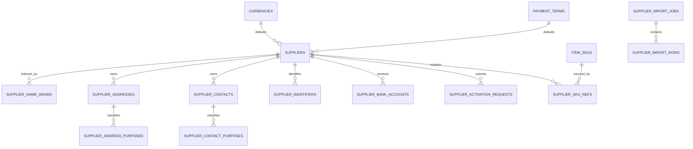

# Supplier Management Aligned System Design Specification

## Harness Design Control

The detailed design below remains normative except where an explicit alignment correction in this section says otherwise. These stable Design IDs provide the required Requirement → Design → Phase → Task → Test chain.

| Design ID | Decision / responsibility | Requirement rationale |
| --- | --- | --- |
| DES-001 | Supplier owns its aggregate; Business Master owns Currency and Payment Term; downstream modules consume purpose-specific contracts. | FR-011, FR-014, FR-020, FR-024, FR-030, FR-065, FR-066, FR-067, FR-068, FR-069, FR-070, NFR-010 |
| DES-002 | Use the existing Node.js ES-module modular monolith, Express handlers, MySQL transactions, Vue 3, Quasar, Pinia and discovery conventions. | NFR-006, NFR-007, NFR-010 |
| DES-003 | Normalize code/identifier equality explicitly and use binary-collated canonical keys; names remain warning-only. | FR-002, FR-003, FR-004, FR-017, FR-018, FR-019, FR-026 |
| DES-004 | Model Supplier root, addresses, contacts, identifiers, approvals, settings, bank accounts, SKU relations, import and audit with ownership FKs and concurrency constraints. | FR-012, FR-013, FR-016, FR-039, FR-040, FR-041, FR-042, FR-043, FR-044, FR-047, FR-048, FR-049 |
| DES-005 | Enforce the Draft/Pending/Active/Suspended/Blocked/Archived state machine and fail-closed reference guard. | FR-015, FR-021, FR-023, FR-031, FR-032, FR-033, FR-034, FR-035, FR-036, FR-037, FR-038 |
| DES-006 | Use optimistic versions, fixed lock order and atomic audit-coupled transactions. | FR-027, FR-028, NFR-006, NFR-007 |
| DES-007 | Use framework plus durable domain idempotency for create, approval, status and import outcomes. | FR-058, FR-077, NFR-008 |
| DES-008 | Keep activation approval as one typed Supplier setting, default OFF, snapshotted at submission. | FR-052, FR-053, FR-054, FR-055, FR-056, FR-057, FR-059, FR-060, FR-061, FR-062, FR-063, FR-064 |
| DES-009 | Seed all six Supplier permissions to protected system-admin while retaining explicit route permissions and strong re-auth. | FR-045, FR-046, FR-050, SEC-001, SEC-002, SEC-003, SEC-004, SEC-005, SEC-006, SEC-007, SEC-008, SEC-009, SEC-013, SEC-014 |
| DES-010 | Encrypt bank account data with independent encryption/lookup key rings, AAD binding and rotation evidence. | FR-045, FR-046, FR-047, FR-048, FR-049, FR-050, FR-051, SEC-005, SEC-006, SEC-010, SEC-011 |
| DES-011 | Expose masked projections by default and an audited no-store reveal path; never include bank data in general export. | FR-007, FR-012, FR-046, FR-050, FR-051, FR-080, FR-083, FR-084, FR-087, SEC-010, SEC-011, SEC-012 |
| DES-012 | Define versioned, paginated HTTP schemas, stable errors and boundary validation for all APIs. | FR-001, FR-005, FR-006, FR-008, FR-009, FR-010, FR-022, FR-025, FR-029 |
| DES-013 | Implement accessible, responsive pages using the shared frontend design system and permission-aware actions. | FR-009, FR-010, FR-013, FR-015, FR-023, FR-029, FR-062 |
| DES-014 | Provide transaction-aware Supplier eligibility/default/history/bank provider contracts with minimal projections. | FR-014, FR-030, FR-031, FR-037, FR-065, FR-066, FR-069, NFR-010, SEC-008, SEC-009 |
| DES-015 | Use indexed exact/token/gram candidate search with bounded deterministic ranking; never scan all Suppliers in memory. | FR-002, FR-003, FR-004, NFR-001, NFR-003, NFR-005 |
| DES-016 | Process RFC 4180 import through precheck, durable jobs, per-row atomicity, recovery and safe result/export files. | FR-071, FR-072, FR-073, FR-074, FR-075, FR-076, FR-077, FR-078, FR-079, FR-080, NFR-004, NFR-008, SEC-012 |
| DES-017 | Maintain append-only, redacted Supplier audit records in the same business transaction. | FR-028, FR-050, FR-057, FR-062, FR-081, FR-082, FR-083, FR-084, FR-085, FR-086, FR-087, SEC-011, SEC-012 |
| DES-018 | Register downstream reference/open-matter providers and treat missing/unavailable required providers as UNKNOWN/fail closed. | FR-025, FR-030, FR-034, FR-035, FR-036, FR-042, FR-049, NFR-010 |
| DES-019 | Allocate only logical migration slices from latest main; Business Master tables are external prerequisites and applied migrations are immutable. | NFR-006, NFR-010 |
| DES-020 | Meet bounded paging, 100k Supplier, 10k-row import and 50-user measurable performance targets. | NFR-001, NFR-002, NFR-003, NFR-004, NFR-005 |
| DES-021 | Emit low-cardinality logs, metrics and alerts for approvals, bank failures, import leases, conflicts and provider degradation. | NFR-009, NFR-010, SEC-010, SEC-011, SEC-012 |
| DES-022 | Retain auditable records, safely purge bounded import files, and meet ERP RTO≤4h/RPO≤15m through isolated restore exercises. | NFR-009, NFR-011, SEC-010, SEC-011 |
| DES-023 | Define failure, retry, commit-unknown, dependency-outage and recovery behavior without silent fallback. | NFR-006, NFR-008, NFR-010 |
| DES-024 | Deliver four dependency-safe, independently tested Phase checkpoints with one implementation PR per Phase. | All FR/NFR/SEC |
| DES-025 | Separate technical acceptance from UAT and preserve executable evidence/status boundaries. | All FR/NFR/SEC |

### Canonical requirement coverage manifest

下列canonical IDs透過`01_requirement_spec.md`的一對一alias映射至本文件各節所引用的legacy FR family ID。此manifest只解決ID標準化，不能取代下文的schema、API、transaction及security設計：

- FR-001, FR-002, FR-003, FR-004, FR-005, FR-006, FR-007, FR-008, FR-009, FR-010, FR-011, FR-012, FR-013, FR-014, FR-015, FR-016, FR-017, FR-018, FR-019, FR-020, FR-021, FR-022, FR-023, FR-024, FR-025, FR-026, FR-027, FR-028, FR-029, FR-030, FR-031, FR-032, FR-033, FR-034, FR-035, FR-036, FR-037, FR-038, FR-039, FR-040, FR-041, FR-042, FR-043, FR-044, FR-045, FR-046, FR-047, FR-048, FR-049, FR-050, FR-051, FR-052, FR-053, FR-054, FR-055, FR-056, FR-057, FR-058, FR-059, FR-060, FR-061, FR-062, FR-063, FR-064, FR-065, FR-066, FR-067, FR-068, FR-069, FR-070, FR-071, FR-072, FR-073, FR-074, FR-075, FR-076, FR-077, FR-078, FR-079, FR-080, FR-081, FR-082, FR-083, FR-084, FR-085, FR-086, FR-087.
- NFR-001, NFR-002, NFR-003, NFR-004, NFR-005, NFR-006, NFR-007, NFR-008, NFR-009, NFR-010, NFR-011.
- SEC-001, SEC-002, SEC-003, SEC-004, SEC-005, SEC-006, SEC-007, SEC-008, SEC-009, SEC-010, SEC-011, SEC-012, SEC-013, SEC-014.

## 0. 文件資訊

| 項目 | 內容 |
| --- | --- |
| 文件版本 | 1.0 Aligned |
| 文件日期 | 2026-09-11 |
| 需求來源 | `docs/supplier_management/01_requirement_spec.md` 1.0 Aligned |
| 適用系統 | ERP App |
| 技術基線 | Node.js 26、Express 5、MySQL 5.7+、Vue 3、Quasar、Pinia |
| 狀態 | Harness對標完成；依賴及上線門檻仍須在各Phase確認 |

本文件將 Supplier Management 業務需求轉換為可實作的程式架構、資料庫、API、頁面、權限、安全、交易、錯誤及測試設計。若本文件與已簽核的業務需求衝突，以業務需求為準；技術設計不得自行擴大業務範圍。

---

## 1. 設計範圍、決策與前置條件

### 1.1 已確認決策的設計結果

| Requirement 決策 | 設計結果 |
| --- | --- |
| Supplier－SKU 不作強制白名單 | `supplier_sku_refs` 只保存軟性對照；採購 lookup 先查全部 Active Supplier，再以關係及供貨紀錄排序。 |
| 啟用審批預設關閉 | `supplier_settings.require_activation_approval` 預設 `0`；啟用 command 在交易中鎖定設定列後決定直接 Active 或建立 Pending request。 |
| 設定需有獨立功能並可擴充 | 使用單列、具明確型別欄位的 `supplier_settings`；日後新增參數以 forward migration 加欄，不使用任意 key/value 執行規則。 |
| Supplier 代表簽約／收款實體 | `suppliers` 是 aggregate root；多地址、聯絡人、識別及銀行帳戶均以外鍵從屬於 Supplier。 |
| 不區分公司與個人 | 不建立 `supplier_type`，亦不因類型分叉 schema、API 或 workflow。 |
| Supplier Code 人工輸入、無固定格式 | API 只 trim、長度及控制字元驗證；保存 normalized key，以不分大小寫方式全域唯一。 |
| 發生引用後 Code 不可修改 | Code change 使用獨立高強度 endpoint；service 先執行 reference guard，任何引用存在即拒絕。 |
| 銀行資料選填、多帳戶、一個預設 | `supplier_bank_accounts` 與 Supplier 分表；generated unique slot 保證最多一個有效預設，沒有帳戶亦可 Active。 |
| 銀行權限獨立 | 一般 Supplier response 永遠只回遮罩；完整值只由 password＋device re-auth 的 reveal endpoint 短暫回傳。 |
| 支援外幣 | 使用Business Master提供的共用`currencies`目錄並由Supplier引用；匯率及結算不在本模組。 |
| 預設付款條件選填 | 使用Business Master提供的`payment_terms`目錄；Supplier以nullable FK引用，停用條件不回寫歷史交易。 |
| Suspended 與 Blocked 分開 | 狀態機分別實作；Blocked 的建立／解除要求 `supplier.approval`，解除後只回 Suspended。 |
| 識別資料選填、有值才唯一 | `supplier_identifiers` 以 type＋issuer country＋normalized value 建全域 unique key。 |
| 最低啟用欄位只有三項 | `assertSupplierActivatable()` 只強制 Code、Name、Active Currency；其他缺項以 completeness warnings 回傳。 |
| 六組權限 | 種入 `supplier.view`、`supplier.mgmt`、`supplier.approval`、`supplier.bank.view`、`supplier.bank.mgmt`、`supplier.settings`。 |
| system-admin為最高權限 | 六組Supplier權限均冪等授予受保護的`system-admin`；Bank操作仍使用相同強認證、遮罩、稽核及告警。 |
| Currency／Payment Term共用 | Supplier只透過Business Master讀取、驗證及保存FK／快照，不建立catalog schema、不提供write API。 |
| 不管理資格文件及績效 | 不建 contract／certificate／attachment／score tables、API 或頁面。 |
| 只有未引用 Draft 可永久刪除 | `SupplierReferenceService` 加上 FK RESTRICT 作雙重防線；approval／SKU ref／下游交易均算引用。 |
| CSV 可按列部分成功 | Import worker 逐 Supplier transaction 套用；一列失敗不回滾已成功列，但單一 Supplier 及其子資料全有全無。 |

### 1.2 現有程式基線

- Handler 由 `server/src/framework/api/handlerRegistry.js` 遞迴發現；每支 API 以 `BaseRequestHandler` 宣告 method、path、auth、authorization policy 及 AJV schema。
- 現有 API 使用 `/api/v1` 並以 GET／POST 為主；本模組維持相同慣例。
- 業務模組放在 `server/src/modules/`，由 Handler 注入 `mysqldatabase`、`logging`、`time` 等現有 technical services；不把 Supplier 規則放進 `server/src/framework/`。
- 管理操作必須在 service 內使用 `assertActorFresh()` 重讀當前角色及權限，避免只信任舊 JWT claims。
- Vue 頁面由 `client/src/framework/discovery/pages.js` 自動發現；menu 由 page metadata 及 `client/config/menu.js` 組成。
- Migration runner 按四位數檔名前綴排序，套用後不再修改既有 migration。
- 對標基線的最新migration是`0026_create_item_import_rows.js`；Supplier實作不得預留固定編號，必須在每個Phase開始時從當時最新main分配下一個可用序號。

### 1.3 明確不做

- 不建立採購單、報價、收貨、退貨、應付、付款、匯率或成本資料。
- 不讓 `supplier_sku_refs` 成為採購資格白名單。
- 不保存供應商評分、合約、牌照、認證、附件或到期提醒。
- 不建立 Supplier company／individual subtype。
- 不把完整銀行帳號放在 `suppliers`、一般 audit detail、一般 response 或 CSV。
- 不建立通用「任意設定 key/value＋動態規則執行器」；本期只有一個明確 boolean 設定。
- 不因未來可能多公司而加入 `tenant_id`／`company_id` 或 tenant abstraction。
- 不修改既有已套用 migrations。

### 1.4 Capability Map 與依賴順序

Supplier Management 包含可獨立建置及驗收的能力，不能以一個籠統的「Supplier module」直接進入 task breakdown。以下 ID 是後續 task、commit、test case 及需求追溯使用的穩定 module ID；名稱可微調，但 ID 與邊界一經簽核不得在實作途中無聲重組。

| Module ID | Capability | Included | Depends on | 獨立驗收出口 |
| --- | --- | --- | --- | --- |
| `SUP-CAP-01` | Supplier Core | Business Master Currency／Payment Term read、Supplier root、Address、Contact、Identifier、一般 lifecycle、lookup、audit | User／Role／Permission及Business Master基線 | 不含 Bank／Approval／Import 亦可完成 CRUD、直接啟用、狀態及一般稽核 |
| `SUP-CAP-02` | Approval & Settings | Approval toggle、eligible approver、submit／approve／reject／withdraw／reassign、approval audit | `SUP-CAP-01` | Approval OFF／ON、snapshot、競態及重新指派情境全部通過 |
| `SUP-CAP-03` | Bank Security | 加密 Bank Account、masked projection、reveal、default、key operations | `SUP-CAP-01`、secret provisioning | 無明文落盤／日誌、分權、輪替與還原演練通過 |
| `SUP-CAP-04` | Supplier–SKU Sourcing | 軟性關係、preferred／history ranking、for-SKU lookup | `SUP-CAP-01`、已落地的 Item SKU／UOM tables | 沒有 relation 的 Active Supplier 仍可選，無效 Supplier 一律不可新用 |
| `SUP-CAP-05` | Bulk Import & Export | Template、precheck、partial apply、resume、result、一般 export、retention | `SUP-CAP-01`；activate mode 另依賴 `SUP-CAP-02` | 10k rows、逐列原子性、crash resume、idempotency及無 Bank 欄位通過 |

```text
SUP-CAP-01 Supplier Core
├── SUP-CAP-02 Approval & Settings
├── SUP-CAP-03 Bank Security
├── SUP-CAP-04 Supplier–SKU Sourcing ── requires Item tables
└── SUP-CAP-05 Bulk Import & Export ─── activate mode requires SUP-CAP-02
```

建置順序固定為 `SUP-CAP-01` → `SUP-CAP-02`／`SUP-CAP-03`；`SUP-CAP-04` 等 Item schema 可用後才開始；`SUP-CAP-05` 的 Draft import 可在 Core 後開始，但 activate mode 不可先於 Approval policy。Capability Map是`05_development_tasks.md`的正式輸入。

確認紀錄：2026-09-04，使用者已確認上述五個capability邊界、依賴及可獨立驗收方式，可據此進入正式task breakdown；技術、安全及上線資料事項仍按§16分別評審。

### 1.5 設計目標與可驗證成功條件

- 所有 Supplier 寫入渠道使用相同 domain validation、state machine、permission freshness check、transaction 及 audit helper。
- `SUP-CAP-01` 完成時，AC-001～AC-006、AC-014～AC-022、AC-038～AC-039 對應測試全部通過。
- `SUP-CAP-02` 完成時，AC-007～AC-013、AC-036～AC-037 對應測試全部通過。
- `SUP-CAP-03` 完成時，AC-023～AC-027 以及 no-plaintext、key rotation、backup restore security tests 全部通過。
- `SUP-CAP-04` 完成時，AC-028～AC-032 與 100,000 Supplier lookup performance gate 通過。
- `SUP-CAP-05` 完成時，AC-033～AC-035、AC-040、crash-window及10,000-row performance tests 通過。
- `npm run verify`、Supplier MySQL integration suite、Client page suite及部署 smoke 在 release candidate 上全數成功，且不存在未解決的 P0／P1 security 或 data-integrity defect。

### 1.6 實作邊界

#### Always do

- 每個 implementation task 標示一個 `SUP-CAP-*`、至少一個 Requirement／AC ID、驗證命令及預期結果。
- 所有寫入 route 使用 static authorization metadata，service 內再執行 `assertActorFresh()`；所有可變資料使用 version／transaction／DB constraint 防競態。
- Bank 明文只在必要的 request-local memory 出現；所有 response、audit、log、fixture及錯誤先經 projection／redaction 檢查。
- Migration 只向前新增，先按主分支實際序號與 FK 順序編排；每個階段先測失敗案例再實作成功路徑。

#### Ask first

- 任何新增強制 Supplier－SKU 白名單、更多審批步驟、銀行匯入匯出、附件／資格／評分、多公司、稅務或匯率功能。
- 任何更改六項 permission 語意、`system-admin` break-glass 定位、最低啟用欄位、狀態轉換或資料保留期。
- 引入外部搜尋引擎、通用 encryption framework、event bus、新 scheduler infrastructure 或新的全域設定機制。
- 因 Item／Purchasing／Finance schema 已變動而需要改寫本文件整合契約時，先完成影響分析並由相應 owner 確認。

#### Never do

- 不修改已套用 migration、不繞過 service 直接從 handler 寫 SQL、不以 role name 取代 permission check。
- 不把 Bank 明文、ciphertext、IV、tag、blind index、key ID 或 secrets 寫入一般 response、CSV、audit detail或log。
- 不以 client-side 權限、舊 JWT claims、預查結果或應用程式記憶體鎖取代後端授權與 DB constraint。
- 不讓匯入、UI 或整合 API 使用不同的驗證／狀態規則；不讓 Supplier Name warning 自動合併或阻止合法建立。

---

## 2. 整體架構

### 2.1 元件關係

```text
Vue Supplier Pages
  └─ client/src/services/supplier*.js
       └─ HTTP /api/v1/suppliers/*
            └─ Handler（一支 API 一個檔案）
                 ├─ SupplierAdminService
                 ├─ SupplierApprovalService
                 ├─ SupplierBankService
                 ├─ SupplierSettingsService
                 ├─ BusinessMasterLookupService（shared provider）
                 ├─ SupplierRelationService
                 ├─ SupplierImportService
                 └─ SupplierAuditLogService
                        └─ MySqlDatabaseService

Purchasing／Receiving／AP Handler（後續）
  ├─ SupplierLookupService（Active eligibility＋一般 projection）
  └─ SupplierBankService.resolveForPayment（只限後端付款流程）
```

### 2.2 後端分層

| 層 | 位置 | 責任 |
| --- | --- | --- |
| Handler | `server/src/handlers/suppliers/` 等 | 固定 route metadata、auth、schema；將 HTTP 輸入映射為 command；不寫 SQL。 |
| Domain／Application Service | `server/src/modules/supplier/` | Supplier aggregate、狀態機、審批、敏感資料、交易、並發、稽核及 response projection。 |
| Technical Service | 現有 `server/src/services/` | MySQL、時間、日誌、idempotency、排程及 file upload。 |
| Worker adapter | `server/src/services/supplierImport/` | 將 scheduler lifecycle 接到 supplier import processor，不放業務規則。 |
| Configuration | `server/config/supplier.js` | 銀行encryption／lookup key rings、匯入限制及duplicate warning threshold。 |
| Persistence | `server/database/migrations/` | Tables、indexes、FK、permissions 及 singleton setting seed。 |

### 2.3 前端分層

| 層 | 位置 | 責任 |
| --- | --- | --- |
| Page | `client/src/pages/suppliers/` | 列表、詳情、建立、審批、匯入、設定及稽核。 |
| Feature component | `client/src/components/suppliers/` | 地址、聯絡人、識別、銀行、狀態及 approval panels。 |
| Service | `client/src/services/supplier*.js` | HTTP mapping、DataTable mapping、敏感操作參數及 response 白名單。 |
| Framework UI | 現有 `client/src/framework/ui/` | 共用 table、form、confirm、notify；不得加入 Supplier 規則。 |

### 2.4 建議模組目錄

```text
server/src/modules/supplier/
├── SupplierAdminService.js
├── SupplierApprovalService.js
├── SupplierBankService.js
├── SupplierSettingsService.js
├── SupplierRelationService.js
├── SupplierLookupService.js
├── SupplierReferenceService.js
├── SupplierImportService.js
├── SupplierAuditLogService.js
├── supplierConstants.js
├── supplierErrors.js
├── supplierValidation.js
├── supplierStateMachine.js
├── supplierNormalization.js
├── supplierDuplicateCandidates.js
├── SupplierBankCrypto.js
├── supplierProjections.js
└── import/
    ├── supplierCsvSchema.js
    └── SupplierImportProcessor.js
```

這些類別按真實責任拆分：一般主資料、審批、銀行資料及設定各有不同權限與安全邊界。地址／聯絡人／識別資料仍由 `SupplierAdminService` 管理，不為每張簡單從屬表建立 repository abstraction。

Handler constructor 從現有 ServiceContainer 取得 `mysqldatabase`、`logging`、`time`，並以 `services.config.supplier` 注入已正規化設定；不得在 request 時重新讀 `process.env`。Unit tests可直接注入fake config／crypto，不依賴真environment secret。

### 2.5 Aggregate 與交易邊界

- `Supplier` 是一般主資料 aggregate root；Supplier row、識別資料及狀態相關 audit 在同一交易修改。
- Address、Contact 各自有 version，可獨立修改；用途 mapping 與其 owner row 在同一交易更新。
- Bank Account 是 Supplier 下的敏感子 aggregate，具有自己的 version；銀行資料、default slot 切換及 audit 在同一交易。
- Approval request 與 Supplier status 必須在同一交易；批准時同時鎖 Supplier、pending request 及設定所需資料。
- Supplier Settings 是 singleton aggregate；設定更新只鎖 `id=1`，不鎖所有 Supplier。
- Import 的每一 Supplier row 是一個獨立業務交易，符合按列部分成功；單列內主資料及子資料不得部分提交。
- DB unique／FK 是競態下最後防線；service 預查只為回傳較清晰的公開錯誤。

### 2.6 Optimistic lock 與鎖順序

- 所有 mutable root／child／request／setting 帶 `version INT UNSIGNED NOT NULL DEFAULT 1`。
- 更新採 `UPDATE ... SET version = version + 1 WHERE id = ? AND version = ?`；`affectedRows=0` 時區分 not found 與 `VERSION_CONFLICT`。
- 多列交易統一依以下順序取鎖，避免相反鎖序造成 deadlock：`supplier_settings` → `suppliers`（ID 升序）→ `supplier_activation_requests` → child rows（ID 升序）→ audit insert。
- 啟用時以 `SELECT ... FOR UPDATE` 鎖 settings singleton，使「設定切換」與「新啟用提交」有可判定先後順序。
- 審批與一般更新都先鎖 Supplier；批准只接受 request 的 `supplier_version` 等於當前 Supplier version。
- 設定預設銀行帳戶時先鎖 Supplier 全部 Active Bank rows，再清舊 default、設新 default；generated unique key 阻止並發雙 default。

### 2.7 開發與驗證命令

以下命令以 repository root 執行；Node.js 必須符合 root `package.json` 的 `>=26`。新增 Supplier scripts 時同步更新 `server/package.json`，不得只把一次性命令留在個人 runbook。

| 用途 | 命令 | 成功標準 |
| --- | --- | --- |
| 安裝依賴 | `npm install` | lockfile 可重現安裝且沒有 install error |
| 啟動完整開發環境 | `npm run dev` | Server 與 Client 均啟動，health check 成功 |
| 只啟動後端／前端 | `npm run dev:server`／`npm run dev:client` | 對應服務無 startup validation error |
| DB migration | `npm run migrate --workspace server` | 所有 pending migrations 完成；重跑為 no-op |
| Lint | `npm run lint` | 0 error |
| 全部 unit／component tests | `npm test` | Server node:test 與 Client Vitest 全部通過 |
| Coverage gate | `npm run test:coverage` | Server lines 92%、branches 83%、functions 90%及 Client既有門檻通過 |
| Client production build | `npm run build --workspace client` | Vite build 成功且無 unresolved import |
| 完整 repository verification | `npm run verify` | lint、coverage、high-severity dependency audit 全部通過 |
| 線上輪替 Bank encryption key | `npm run supplier:bank:rotate-encryption --workspace server -- --from=<oldId> --to=<activeId>` | 可續跑；舊 key row count 最終為 0 |
| 輪替 Bank lookup key | `npm run supplier:bank:reindex-lookup --workspace server -- --from=<oldId> --to=<activeId>` | 可續跑；舊lookup key row count為0且duplicate report通過 |

真 MySQL integration 使用測試專用 database及相同 migration runner；命令仍由 `npm test --workspace server` 收納，不建立一套繞過正常測試入口的隱藏腳本。效能測試及 backup／restore drill 的資料量、環境與結果另存 release evidence。

### 2.8 Code Style 與實作慣例

- 使用 ESM、雙引號、分號及兩格縮排，跟隨現有 ESLint與相鄰模組風格；不在本功能順便格式化或重構無關檔案。
- 一個 Handler 宣告固定 `handlerName`、method、path、authType、authorizationPolicies、AJV schema及response schema；`execute()`只映射輸入／actor context並呼叫 domain service。
- Domain service constructor 明確驗證依賴；公開寫入方法先 fresh-authorize，再於`database.withTransaction()`內執行 lock、validation、write及audit。
- SQL value一律 parameterized；只有 allowlist 映射後的 sort column／direction可插入SQL字串。公開錯誤使用`ApplicationError`及穩定 public code。
- 純 normalization、validation、state transition、projection及crypto primitive保持無DB依賴；不要為單一實作預建 repository/interface。
- 時間只使用注入的time service；ID在Handler邊界轉正整數；response只回projection，不回DB row。

代表性 Handler 形狀：

```js
export class CreateSupplierHandler extends BaseRequestHandler {
  static handlerName = "createSupplier";
  static api = {
    method: "POST",
    path: "/api/v1/suppliers/create",
    authType: "jwt",
    authorizationPolicies: SUPPLIER_MGMT_POLICY,
    requestSchema: CREATE_SUPPLIER_REQUEST_SCHEMA,
    responseSchema: { 201: SUPPLIER_DETAIL_SCHEMA }
  };

  constructor(services = {}) {
    super(services);
    this.supplierAdmin = new SupplierAdminService({
      database: services.require("mysqldatabase"),
      logger: services.require("logging").logger,
      time: services.require("time")
    });
  }

  async execute(req) {
    const supplier = await this.supplierAdmin.create({
      actorId: Number(req.auth.claims.sub),
      claimedRoles: req.auth.claims.roles,
      claimedPermissions: req.auth.claims.permissions,
      ...req.input.body,
      requestId: req.requestId,
      ip: req.ip || req.socket?.remoteAddress || ""
    });
    return this.response(supplier, { statusCode: 201 });
  }
}
```

代表性 Service transaction 形狀：

```js
return this.database.withTransaction(async (connection) => {
  const actor = await assertActorFresh(connection, actorContext);
  const current = await lockSupplier(connection, supplierId);
  assertVersion(current.version, expectedVersion);
  const updated = await updateSupplier(connection, command);
  await this.auditLog.record(connection, buildSupplierAudit(actor, current, updated));
  return toSupplierDetail(updated);
});
```

上述片段只規定結構，不取代§6的完整schema與§8的業務流程；實作時import名稱及constructor注入方式以現有相鄰Handler為準。

---

## 3. 權限、認證與敏感資料

### 3.1 權限目錄

在 `server/src/modules/authorization/permissionCatalogue.js` 增加：

```js
{ name: "supplier.view", description: "查看一般供應商資料與變更歷史" }
{ name: "supplier.mgmt", description: "管理供應商一般主資料與一般狀態" }
{ name: "supplier.approval", description: "審批供應商啟用及管理封鎖狀態" }
{ name: "supplier.bank.view", description: "查看供應商完整銀行資料" }
{ name: "supplier.bank.mgmt", description: "管理供應商銀行資料" }
{ name: "supplier.settings", description: "管理供應商模組參數" }
```

Permission migration 冪等種入六項並授予受保護的 `system-admin` role。這是明確的 break-glass superuser 決策：現有系統禁止修改該角色且禁止一般管理員授出自己沒有的權限，因此不能把「部署後再移除 bank permissions」當成可執行方案。日常操作必須建立分離的一般 Supplier、Approval、Bank及Settings角色，不把`system-admin`分配給日常使用者；所有`system-admin` Bank reveal／write仍走相同re-auth、audit及alert，不因role name繞過permission或資料保護。

上線權限核對必須證明：只有經批准的break-glass帳號持有`system-admin`；日常Supplier管理角色不含bank permissions；Bank read與Bank write可分開配置；任何break-glass使用均有登入及Supplier audit證據。若業務日後要求system-admin也絕不可接觸銀行資料，必須先變更全系統superuser／permission-escalation模型，不能只改本模組seed。

Bank write route policy 要求同時持有 `supplier.view`、`supplier.bank.view` 及 `supplier.bank.mgmt`；approval／block route要求`supplier.view`＋`supplier.approval`。Permission catalogue 不做隱式繼承，避免 JWT 只含單一高權限名稱時前後端理解不同。

### 3.2 API 認證強度

| 操作 | authType | Permission |
| --- | --- | --- |
| 一般列表／詳情／audit | `jwt` | `supplier.view` |
| 建立、一般更新、地址／聯絡／識別維護 | `jwt` | `supplier.mgmt` |
| 直接啟用或提交審批 | `jwt` | `supplier.mgmt` |
| 暫停／重新啟用／封存／還原 | `jwt-password` | `supplier.mgmt` |
| 永久刪除／Code change | `jwt-device-password` | `supplier.mgmt` |
| 批准／拒絕／重新指派 | `jwt-password` | `supplier.view`＋`supplier.approval` |
| 封鎖／解除封鎖 | `jwt-device-password` | `supplier.view`＋`supplier.approval` |
| 銀行完整 reveal | `jwt-password` | `supplier.view`＋`supplier.bank.view` |
| 銀行新增／修改／停用／default | `jwt-device-password` | `supplier.view`＋bank view＋bank mgmt |
| Supplier Settings寫入 | `jwt-device-password` | `supplier.settings` |
| 一般 CSV 匯入確認／匯出 | `jwt-password` | `supplier.mgmt` |

高強度 route 必須在 static metadata 固定 authType，不在 handler 內按 payload 動態降低。Password 由既有 re-auth strategy 讀取；device signature 沿用現有 approved-device 機制。

### 3.3 銀行資料保護

完整帳號不在一般 Supplier／Bank GET response 中出現。標準 Bank projection 只包含：bank account ID、銀行名稱、國家／地區、帳戶持有人、幣別、status、isDefault、`maskedAccountNumber`、last updated 及 version。

完整值必須經獨立 `POST .../reveal` 取得；response 設 `Cache-Control: no-store, private`、`Pragma: no-cache`，不得在 URL、query、analytics 或通知中傳遞。前端只把明文保存在 component-local memory，dialog 關閉、route 離開、session 失效或 30 秒後清除，不寫 Pinia、localStorage 或 sessionStorage。

資料庫使用 application-layer encryption：

- Algorithm：AES-256-GCM。
- 每列產生 96-bit random IV，保存 ciphertext、IV、128-bit auth tag 及 `encryption_key_id`。
- AAD 綁定 `supplierId` 及不可變 `crypto_context` UUID，防止把 ciphertext 搬到另一個 Supplier／row 後仍能解密。
- 另以獨立lookup key ring對正規化的銀行識別＋帳號產生HMAC-SHA-256 blind index，用於同Supplier阻擋重複及跨Supplier高風險警告；不以一般SHA-256處理低熵帳號。每列保存`blind_index_key_id`，service duplicate check對ring內所有可讀key計算candidate indexes，支援輪替期間新舊資料並存。
- Encryption及lookup各有獨立key ring與active key ID；新增／修改只使用各自active key。Encryption key可在線分批重加密；lookup key需分批重建blind index，兩者只有在舊key ID row count=0且rotation report通過後才可移除舊key。
- Key material 只存在部署 secret store／environment，使用現有 `SecretValue` 包裝；不得進 DB、日誌、錯誤或 repository。

`server/config/logging.js` 的所有 logger profile 必須加入大小寫不敏感的敏感欄位名稱：`accountNumber`、`iban`、`bankAccountNumber`、`accountNumberCiphertext`、`bankEncryptionKey`、`bankLookupKey`。Service 仍不得把整個 request body 或 decrypted value交給 logger；redaction 只是第二道防線。

### 3.4 頁面權限矩陣

| 頁面／區塊 | view | mgmt | approval | bank.view | bank.mgmt | settings |
| --- | --- | --- | --- | --- | --- | --- |
| Supplier list／一般 detail | R | C／U／一般狀態 | R | — | — | — |
| Address／Contact／Identifier | R | C／U／停用 | R | — | — | — |
| Bank tab | 遮罩 | 遮罩 | 遮罩 | Reveal | — | — |
| Bank edit actions | — | — | — | 必須同時具備 | C／U／停用／default | — |
| My Approvals | — | — | 決定／重新指派 | 仍須 bank.view 才 reveal | — | — |
| Import／Export | — | 執行一般資料 | — | 不增加銀行欄位 | — | — |
| Supplier Audit | R（敏感值遮罩） | R | R | 不直接 reveal歷史明文 | — | — |
| Supplier Settings | — | — | — | — | — | R／U |

R／C／U 表示 read／create／update。前端權限只控制操作呈現，所有 API 仍由後端 authorization policy 及 `assertActorFresh()` 驗證。

---

## 4. Domain 設計

### 4.1 Supplier aggregate

`SupplierAdminService` 管理 Supplier root、Address、Contact 及 Identifier。Bank、Approval、Settings 分開是因為它們有不同權限、認證強度及交易語意，而不是為了每張表建立一層抽象。

所有 command 共用 context：

```js
{
  actorId,
  claimedRoles,
  claimedPermissions,
  requestId,
  ip,
  ...command
}
```

每個 public write method 都在 transaction 內先 `assertActorFresh()`，再鎖定目標、驗證 version／狀態／reference、寫業務資料與 supplier audit，最後 commit。

### 4.2 正規化

| 欄位 | 保存值 | 比對 key |
| --- | --- | --- |
| Supplier Code | trim 後原值 | Unicode NFKC、trim、lowercase；拒絕 C0／C1 control、NUL 及長度超限。 |
| Supplier Name | trim、內部空白保留 | Unicode NFKC、lowercase、連續空白折疊；用於 duplicate warning，不作 unique。 |
| Identifier | trim 後顯示值 | 依 identifier type 移除允許的空白／分隔符並 uppercase；規則不認得時只 NFKC＋trim。 |
| Email | trim 後原值 | lowercase 只作搜尋；不改寫顯示值。 |
| Bank account | 不保存明文 | NFKC、trim、移除允許分隔空白；加密前保留業務有效字元。 |

Normalization helper 是 pure function，UI、import 及 API 共用相同 service-side結果。Client 可做即時提示，但 DB 寫入只相信 server normalization。

### 4.3 啟用完整性

`assertSupplierActivatable()` 只阻擋：

1. Supplier Code 空白／無效或 normalized key 衝突。
2. Supplier Name 空白／超長。
3. Default Currency 不存在或不是 Active。
4. Supplier 不在可啟用狀態。

Address、Contact、Payment Term、Identifier、Bank 均只形成 `completenessWarnings[]`。API response 將問題分成 `issues[]` 與 `warnings[]`，避免 UI 把提示誤當錯誤。

### 4.4 狀態機

```text
draft -> active                  approval setting OFF
draft -> pending_approval        approval setting ON
pending_approval -> active       approve
pending_approval -> draft        reject / withdraw / invalidated
active -> suspended -> active
active|suspended -> blocked -> suspended
draft|active|suspended -> archived -> suspended
unreferenced draft -> deleted
```

- Status 值由 `supplierConstants.js` 及 `supplierStateMachine.js` 中央定義；MySQL 5.7 不依賴 CHECK。
- 任何新交易只接受 Active；歷史 lookup 可顯式 `purpose: "history"` 取得其他狀態。
- Blocked 的解除永遠回 Suspended，不直接 Active。
- Archived 的還原永遠回 Suspended。
- Pending 不允許一般狀態 action；必須 approve、reject、withdraw 或因關鍵修改 invalidated。
- Status command 重複送達且 target 已在相同終態時可回現況而不重複 audit；相反或過時轉換回 `STATUS_TRANSITION_INVALID`／`VERSION_CONFLICT`。

### 4.5 Approval snapshot 與失效規則

提交時 `supplier_activation_requests` 保存 `supplier_version` 及 approval summary JSON；summary 只包含 Supplier Code、Name、Display Name、Default Currency、Payment Term 及 identifiers 的遮罩／非敏感資料，不包含完整銀行帳號。

以下變更視為 approval-significant：Supplier Code、Supplier Name、Display Name、Default Currency、Default Payment Term、Identifier 集合。Pending 時發生任一變更，`SupplierAdminService` 在同一交易將 request 改為 `invalidated`、Supplier 改回 `draft`，再套用修改並回傳 `approvalInvalidated: true`。Address、Contact、Notes 或 Bank 變更不改變 activation approval，因它們不是最低啟用條件且銀行有獨立權限。

批准時必須同時滿足：request 是 pending、actor 是 assigned approver、actor 不是 requester、actor 目前仍有 permission、Supplier version 未改、Supplier 仍可啟用。任何一項不符都不可部分改狀態。

### 4.6 Duplicate warning

Supplier Code 及 Identifier 使用硬性 unique。Supplier Name 只警告：

1. 先查 `supplier_name_key = ?` 的確切正規化相同。
2. 將正規化名稱切成去重的 Unicode bigrams；由`supplier_name_grams`的indexed gram查交集數，按共同gram數取最多50個候選。單一code point名稱只做exact match。
3. 對候選以完整normalized name計算 deterministic bigram Dice score；預設threshold 0.85，最多回10筆。候選取得不依賴名稱開頭，因此第一段、中段或尾段的單一錯字仍可進入比較。

Name及grams必須在同一Supplier transaction新增／更新；名稱改動時先刪舊grams再批量insert新集合。這個score只產生`duplicateCandidates`，不自動合併、不阻止建立。以中英文、重音、全半形、首／中／尾錯字fixtures建立recall acceptance set；若實際資料仍不足才提出搜尋方案變更，不在沒有證據時加入外部搜尋引擎。

### 4.7 Reference guard

`SupplierReferenceService.describeReferences(connection, supplierId)` 回傳具名引用計數。第一版至少檢查 activation request、Supplier－SKU ref；下游模組建立表時必須加入 `ON DELETE RESTRICT` FK 及對應查詢，例如 purchase order、receipt、return、AP invoice、payment instruction。

永久刪除只允許：status=draft、沒有 approval history、沒有 Supplier－SKU ref、沒有任何下游 FK reference。通過後從屬 Address／Contact／Identifier／未引用 Bank 可 CASCADE；supplier audit 不設 target FK並保留刪除事件。

### 4.8 Response projection

Handler 不得 spread DB row。集中使用：

- `toSupplierSummaryResponse()`
- `toSupplierDetailResponse()`
- `toAddressResponse()`／`toContactResponse()`／`toIdentifierResponse()`
- `toMaskedBankResponse()`
- `toApprovalResponse()`
- `toSupplierSettingResponse()`

所有一般 projection 都沒有 ciphertext、IV、auth tag、blind index、key ID、內部 normalization key 或完整帳號。即使 actor 有 bank.view，Supplier detail 也只回 masked projection；明文只由 reveal endpoint 的專用 projection 回傳。

---

## 5. 資料庫詳細設計

### 5.1 共通規則

- Engine：InnoDB；charset／collation 沿用 `utf8mb4_unicode_ci`。
- ID：`BIGINT UNSIGNED AUTO_INCREMENT`；Currency 使用 ISO code 作穩定 PK。
- 時間：`BIGINT UNSIGNED` epoch milliseconds，來源只用 `SystemTimeService.nowMs()`。
- Boolean：`TINYINT(1)`。
- Optimistic lock：`version INT UNSIGNED NOT NULL DEFAULT 1`。
- 狀態由 service 驗證；MySQL 5.7 不依賴 CHECK constraint。
- Aggregate root 或被交易引用資料使用 `ON DELETE RESTRICT`；只屬於可永久刪除 Draft Supplier 的純從屬資料可 `ON DELETE CASCADE`。
- Audit target 使用邏輯引用而不設 target FK，確保 target 被合法永久刪除後 audit 仍存在。
- 所有 normalized keys 由 service 產生並保存；DB unique key 處理競態。



### 5.2 `currencies`（Business Master-owned contract）

| 欄位 | 型別 | Null／預設 | 說明 |
| --- | --- | --- | --- |
| `code` | CHAR(3) PK | 必填 | Uppercase ISO 4217 code。 |
| `name` | VARCHAR(100) | 必填 | 顯示名稱。 |
| `decimal_places` | TINYINT UNSIGNED | 2 | 0–4；只作顯示／未來金額驗證。 |
| `status` | VARCHAR(20) | `active` | `active`／`inactive`。 |
| `version` | INT UNSIGNED | 1 | Optimistic lock。 |
| `created_at`／`updated_at` | BIGINT UNSIGNED | 必填 | Epoch ms。 |
| `created_by`／`updated_by` | BIGINT UNSIGNED | NULL | FK users SET NULL。 |

索引契約：`INDEX(status,name)`。本表、HKD seed及其他幣別均由共用Business Master foundation建立及維護。Supplier migration不得建立、alter或seed此表；Supplier只透過正式lookup provider驗證Active Currency並保存FK／交易快照。

### 5.3 `payment_terms`（Business Master-owned contract）

| 欄位 | 型別 | Null／預設 | 說明 |
| --- | --- | --- | --- |
| `id` | BIGINT UNSIGNED PK | auto | Payment Term ID。 |
| `code`／`code_key` | VARCHAR(50) | 必填 | 人類可讀穩定 code 及 normalized unique key。 |
| `name` | VARCHAR(100) | 必填 | 顯示名稱。 |
| `calculation_type` | VARCHAR(30) | 必填 | `immediate`／`cod`／`net_days`／`custom_label`。 |
| `due_days` | SMALLINT UNSIGNED | NULL | `net_days` 時必填，0–3650。 |
| `description` | VARCHAR(500) | 空字串 | 純文字說明。 |
| `status` | VARCHAR(20) | `active` | `active`／`inactive`。 |
| `version`、時間、操作者 | 共通欄位 | — | 同 §5.1。 |

約束／索引契約：`UNIQUE(code_key)`、`INDEX(status,name)`。Business Master負責新增、修改、停用及相容性；Supplier只讀取和驗證。被Supplier引用時不可永久刪除；停用後保留FK並阻止新指派。Custom label只代表顯示預設，實際due-date calculation由Finance模組明確定義。

### 5.4 `suppliers`

| 欄位 | 型別 | Null／預設 | 說明 |
| --- | --- | --- | --- |
| `id` | BIGINT UNSIGNED PK | auto | Supplier ID，下游唯一外鍵。 |
| `supplier_code` | VARCHAR(64) | 必填 | 人工輸入顯示值。 |
| `supplier_code_key` | VARCHAR(64) | 必填 | NFKC＋lowercase normalized key。 |
| `supplier_name` | VARCHAR(190) | 必填 | 主要名稱。 |
| `supplier_name_key` | VARCHAR(190) | 必填 | Duplicate warning／搜尋 key，不作 unique。 |
| `display_name` | VARCHAR(190) | 空字串 | 選填日常名稱。 |
| `default_currency_code` | CHAR(3) | 必填 | FK currencies RESTRICT。 |
| `default_payment_term_id` | BIGINT UNSIGNED | NULL | FK payment_terms RESTRICT。 |
| `website` | VARCHAR(500) | 空字串 | 經驗證 URL。 |
| `general_phone` | VARCHAR(50) | 空字串 | 選填。 |
| `general_email` | VARCHAR(254) | 空字串 | 選填。 |
| `notes` | VARCHAR(2000) | 空字串 | 純文字內部備註。 |
| `status` | VARCHAR(30) | `draft` | 六種 lifecycle status。 |
| `version` | INT UNSIGNED | 1 | Root optimistic lock。 |
| `created_at`／`updated_at` | BIGINT UNSIGNED | 必填 | Epoch ms。 |
| `created_by`／`updated_by` | BIGINT UNSIGNED | NULL | FK users SET NULL。 |

索引／約束：`UNIQUE(supplier_code_key)`、`INDEX(status,updated_at,id)`、`INDEX(supplier_name_key)`、`INDEX(default_currency_code,status)`、`INDEX(default_payment_term_id,status)`。列表固定以 allowlist sort columns 組 SQL，不接受 client column 名直接插入。

### 5.4.1 `supplier_name_grams`

| 欄位 | 型別 | Null／預設 | 說明 |
| --- | --- | --- | --- |
| `supplier_id` | BIGINT UNSIGNED | 必填 | FK suppliers CASCADE。 |
| `gram_hash` | BINARY(32) | 必填 | 正規化Unicode bigram的SHA-256；名稱不是secret，hash只用作固定長度索引。 |

Primary key為`(supplier_id,gram_hash)`；另建`INDEX(gram_hash,supplier_id)`。Candidate query先把輸入grams放入bounded derived table，再以`gram_hash` join及`COUNT(*) DESC,supplier_id ASC`選最多50筆；最終score仍使用Supplier完整normalized name計算，hash collision最多造成多一筆候選，不可造成自動合併或拒絕。

### 5.5 `supplier_addresses` 與 `supplier_address_purposes`

`supplier_addresses`：

| 欄位 | 型別 | 說明 |
| --- | --- | --- |
| `id` | BIGINT UNSIGNED PK | Address ID。 |
| `supplier_id` | BIGINT UNSIGNED | FK suppliers CASCADE。 |
| `label` | VARCHAR(100) | 例如總部、九龍倉。 |
| `address_line1`／`address_line2`／`address_line3` | VARCHAR(190) | 選填地址行。 |
| `city`／`state_region`／`postal_code` | VARCHAR(100) | 選填。 |
| `country_code` | CHAR(2) | NULL；ISO 3166-1 alpha-2。 |
| `phone` | VARCHAR(50) | 選填。 |
| `notes` | VARCHAR(500) | 純文字。 |
| `status` | VARCHAR(20) | active／inactive。 |
| `version`、時間、操作者 | 共通欄位 | — |

索引：`(supplier_id,status,id)`、`(country_code)`。

`supplier_address_purposes`：`address_id`、`supplier_id`、`purpose_code VARCHAR(30)`、`is_primary`、generated `primary_slot`（primary 時為 1，否則 NULL）、時間／操作者。Primary key `(address_id,purpose_code)`；composite FK `(address_id,supplier_id)` 指向 address 的 unique `(id,supplier_id)`；`UNIQUE(supplier_id,purpose_code,primary_slot)` 保證每用途最多一個 primary。允許 purpose：registered／office／ordering／return／remittance／other。停用Address時在同一transaction把其所有purpose的`is_primary`清為0；mapping保留作歷史，但inactive owner不可再被設為primary。

### 5.6 `supplier_contacts` 與 `supplier_contact_purposes`

`supplier_contacts`：`id`、`supplier_id` FK CASCADE、`name VARCHAR(190)`、`job_title VARCHAR(100)`、`department VARCHAR(100)`、`email VARCHAR(254)`、`phone VARCHAR(50)`、`mobile VARCHAR(50)`、`preferred_language VARCHAR(20)`、`notes VARCHAR(500)`、`status`、version／時間／操作者。索引 `(supplier_id,status,name)`、`(email)`。

`supplier_contact_purposes` 與 address purpose 使用相同 composite FK／generated primary slot 模式；purpose：general／orders／sales／accounts_payable／returns／emergency。每個 Contact 可有多個 purpose，每個 Supplier 每種 purpose 至多一名 active primary；停用 Contact 時同交易移除其 primary 標記。

### 5.7 `supplier_identifiers`

| 欄位 | 型別 | Null／預設 | 說明 |
| --- | --- | --- | --- |
| `id` | BIGINT UNSIGNED PK | auto | Identifier ID。 |
| `supplier_id` | BIGINT UNSIGNED | 必填 | FK suppliers CASCADE。 |
| `identifier_type` | VARCHAR(50) | 必填 | business_registration／company_registration／tax／other。 |
| `issuer_country_code` | CHAR(2) | 必填 | ISO country／region scope。 |
| `identifier_value` | VARCHAR(190) | 必填 | 顯示值。 |
| `identifier_value_key` | VARCHAR(190) | 必填 | Type-aware normalized value。 |
| `notes` | VARCHAR(500) | 空字串 | 選填。 |
| `version`、時間、操作者 | 共通欄位 | — | — |

約束／索引：`UNIQUE(identifier_type,issuer_country_code,identifier_value_key)`、`INDEX(supplier_id,identifier_type)`。不保存身份證影像或資格附件。

### 5.8 `supplier_bank_accounts`

| 欄位 | 型別 | Null／預設 | 說明 |
| --- | --- | --- | --- |
| `id` | BIGINT UNSIGNED PK | auto | Bank Account ID。 |
| `supplier_id` | BIGINT UNSIGNED | 必填 | FK suppliers CASCADE；付款表日後另以 RESTRICT 引用。 |
| `crypto_context` | CHAR(36) | 必填 | Server random UUID，AAD 一部分，unique。 |
| `account_holder_name` | VARCHAR(190) | 必填 | 顯示值。 |
| `bank_name` | VARCHAR(190) | 必填 | 顯示值。 |
| `bank_country_code` | CHAR(2) | NULL | ISO country／region。 |
| `bank_code`／`branch_code` | VARCHAR(50) | 空字串 | 選填。 |
| `swift_bic` | VARCHAR(11) | 空字串 | 選填，uppercase。 |
| `account_currency_code` | CHAR(3) | NULL | FK currencies RESTRICT。 |
| `account_ciphertext` | VARBINARY(512) | 必填 | AES-GCM ciphertext，無明文。 |
| `account_iv` | BINARY(12) | 必填 | 每次加密隨機 IV。 |
| `account_auth_tag` | BINARY(16) | 必填 | GCM authentication tag。 |
| `encryption_key_id` | VARCHAR(50) | 必填 | 對應 config key ring。 |
| `account_blind_index` | BINARY(32) | 必填 | HMAC-SHA-256 duplicate key。 |
| `blind_index_key_id` | VARCHAR(50) | 必填 | 對應lookup key ring，支援輪替與可續跑reindex。 |
| `last_four` | VARCHAR(4) | 必填 | 遮罩顯示；不足四位保存實際尾碼長度。 |
| `account_length` | SMALLINT UNSIGNED | 必填 | 正規化帳號長度；避免短帳號的尾碼等同完整值。 |
| `is_default` | TINYINT(1) | 0 | Supplier 全域預設。 |
| `default_slot` | TINYINT generated stored | default 且 active 時 1，否則 NULL | Unique slot。 |
| `status` | VARCHAR(20) | `active` | active／inactive。 |
| `version`、時間、操作者 | 共通欄位 | — | — |

約束／索引：`UNIQUE(crypto_context)`、`UNIQUE(supplier_id,blind_index_key_id,account_blind_index)`、`UNIQUE(supplier_id,default_slot)`、`INDEX(blind_index_key_id,account_blind_index)`、`INDEX(supplier_id,status,id)`。跨Supplier同一key ID及blind index只觸發warning，不建global unique；service在rotation期間以所有ring keys查重，避免同帳號因key ID不同繞過。Projection只在`account_length > 4`時顯示尾四位；較短帳號全部以`*`遮罩，不能把`last_four`原樣輸出。

### 5.9 `supplier_activation_requests`

| 欄位 | 型別 | Null／預設 | 說明 |
| --- | --- | --- | --- |
| `id` | BIGINT UNSIGNED PK | auto | Request ID。 |
| `supplier_id` | BIGINT UNSIGNED | 必填 | FK suppliers RESTRICT，approval history 算引用。 |
| `requested_by` | BIGINT UNSIGNED | NULL | FK users SET NULL。 |
| `assigned_approver_id` | BIGINT UNSIGNED | NULL | FK users SET NULL；pending 時 service 要求非空。 |
| `supplier_version` | INT UNSIGNED | 必填 | 提交時 Supplier version。 |
| `summary` | JSON | 必填 | 有界、無銀行明文的 approval snapshot。 |
| `status` | VARCHAR(20) | `pending` | pending／approved／rejected／withdrawn／invalidated。 |
| `pending_slot` | TINYINT generated stored | pending 時 1，否則 NULL | 每 Supplier 最多一個 pending。 |
| `request_note` | VARCHAR(500) | 空字串 | 提交說明。 |
| `decision_reason` | VARCHAR(500) | 空字串 | Reject 必填；approve 可選。 |
| `requested_at`／`decided_at` | BIGINT UNSIGNED | decided 可 NULL | 時間。 |
| `decided_by` | BIGINT UNSIGNED | NULL | FK users SET NULL。 |
| `version` | INT UNSIGNED | 1 | Request compare-and-set。 |

索引／約束：`UNIQUE(supplier_id,pending_slot)`、`INDEX(assigned_approver_id,status,requested_at)`、`INDEX(supplier_id,requested_at)`。歷史 request 不更新 summary，只更新 lifecycle fields。

### 5.10 `supplier_settings`

Singleton table：

| 欄位 | 型別 | Null／預設 | 說明 |
| --- | --- | --- | --- |
| `id` | TINYINT UNSIGNED PK | 固定 1 | 單一公司唯一設定列。 |
| `require_activation_approval` | TINYINT(1) | 0 | 本期唯一業務參數。 |
| `version` | INT UNSIGNED | 1 | Optimistic lock。 |
| `updated_at` | BIGINT UNSIGNED | 必填 | Epoch ms。 |
| `updated_by` | BIGINT UNSIGNED | NULL | FK users SET NULL。 |

Migration 以「不存在才 insert」種 `id=1`，不得用 `INSERT IGNORE` 吞掉其他錯誤。Service 拒絕未知 settings fields；日後新參數以 typed column＋schema＋UI＋audit＋migration 增加。

### 5.11 `supplier_sku_refs`（Item tables 存在後）

| 欄位 | 型別 | Null／預設 | 說明 |
| --- | --- | --- | --- |
| `id` | BIGINT UNSIGNED PK | auto | Relationship ID。 |
| `supplier_id` | BIGINT UNSIGNED | 必填 | FK suppliers RESTRICT。 |
| `sku_id` | BIGINT UNSIGNED | 必填 | FK item_skus RESTRICT。 |
| `supplier_item_code` | VARCHAR(190) | 空字串 | Supplier 自有商品代碼。 |
| `supplier_item_code_key` | VARCHAR(190) | NULL | 非空時的 normalized key。 |
| `supplier_item_name` | VARCHAR(190) | 空字串 | 選填。 |
| `purchase_sku_uom_id` | BIGINT UNSIGNED | NULL | Composite FK 至 item_sku_uoms。 |
| `minimum_order_qty` | INT UNSIGNED | NULL | Pack UOM 整數數量；不保存價格。 |
| `standard_lead_time_days` | SMALLINT UNSIGNED | NULL | 一般提示，0–3650。 |
| `relationship_status` | VARCHAR(20) | `alternative` | preferred／alternative／stopped。 |
| `first_supplied_at`／`last_supplied_at` | BIGINT UNSIGNED | NULL | Purchasing 完成交易後可更新。 |
| `source` | VARCHAR(20) | `manual` | manual／purchasing。 |
| `version`、時間、操作者 | 共通欄位 | — | — |

約束／索引：`UNIQUE(supplier_id,sku_id)`、`UNIQUE(supplier_id,supplier_item_code_key)`（NULL 可重複）、composite FK `(purchase_sku_uom_id,sku_id)`、`INDEX(sku_id,relationship_status,last_supplied_at)`。允許多個 preferred，不建立唯一首選白名單；排序為 preferred、曾供貨／last supplied、名稱。

若 Item migrations 尚未落地，Supplier core migrations 不建立此表，API 回 feature unavailable；待 `item_skus` 及 `item_sku_uoms` 存在後以獨立 forward migration 加入，不能先保存無 FK 的自由輸入 SKU ID。

Item design spec §5.14 在 Supplier master 尚未確定時曾以 `item_supplier_refs` 作延後建立的暫名；該段不是本模組 manifest 所消費的 `item-sku-uom-provider`（`aligned-design-v2`）SKU／UOM identity 契約。現按 Supplier requirement §12.2、本文資料擁有權及 Purchasing design 的 `supplier_sku_ref_id`，以 Supplier-owned `supplier_sku_refs` 作唯一正式名稱。Product Owner 已於 2026-09-14 批准刷新 Supplier 對 Item 現行 identity contract 的 pin；這不等於批准修改 Item §5.14 的關係表語意。PHASE-004 建立 Migration 前，仍必須先在經批准的跨模組文件變更中把 Item 的暫名對齊並刷新相關 contract hash；未完成時 T38 保持 `BLOCKED`。實作只可建立一張表，不得建立兩張語意重複的 relation tables。

### 5.11.1 `supplier_supply_events`（Purchasing projection idempotency）

| 欄位 | 型別 | Null／預設 | 說明 |
| --- | --- | --- | --- |
| `id` | BIGINT UNSIGNED PK | auto | 內部ID。 |
| `event_id` | VARCHAR(64) | 必填 | Purchasing穩定idempotency key；unique。 |
| `source_type` | VARCHAR(30) | 必填 | 本期固定`goods_receipt`。 |
| `source_id`／`source_line_id` | BIGINT UNSIGNED | 必填 | 永久來源索引；不對下游交易建跨aggregate cascade FK。 |
| `supplier_id`／`sku_id` | BIGINT UNSIGNED | 必填 | 分別FK Supplier／Item RESTRICT。 |
| `relation_id` | BIGINT UNSIGNED | 必填 | FK `supplier_sku_refs` RESTRICT。 |
| `supplied_at` | BIGINT UNSIGNED | 必填 | GR確認時間epoch ms。 |
| `payload_hash` | CHAR(64) | 必填 | Canonical command hash；同event不同payload拒絕。 |
| `created_at` | BIGINT UNSIGNED | 必填 | 寫入時間。 |

約束：`UNIQUE(event_id)`及`UNIQUE(source_type,source_id,source_line_id)`；同event同payload回既有結果，不同payload回`IDEMPOTENCY_CONFLICT`。Event insert、relation upsert、first／last supplied更新及低敏audit在同一Supplier transaction；表為append-only，不提供一般update/delete API。

### 5.12 `supplier_audit_logs`

Supplier audit 與 `user_audit_logs` 分表，避免擴大現有 User domain service；銀行 reveal 亦記在此表，但不保存明文。

| 欄位 | 型別 | 說明 |
| --- | --- | --- |
| `id` | BIGINT UNSIGNED PK | Audit ID。 |
| `occurred_at` | BIGINT UNSIGNED | 事件時間。 |
| `actor_user_id` | BIGINT UNSIGNED NULL | FK users SET NULL。 |
| `actor_username` | VARCHAR(190) | 操作者快照。 |
| `action` | VARCHAR(80) | 具名 action。 |
| `target_type` | VARCHAR(30) | supplier／address／contact／identifier／bank／approval／setting／supplier_sku／import。 |
| `target_id` | BIGINT UNSIGNED NULL | 邏輯 ID，不設 target FK。 |
| `supplier_id` | BIGINT UNSIGNED NULL | 查詢 scope；不設 FK以保留 delete history。 |
| `target_label` | VARCHAR(190) | Code／遮罩後 label。 |
| `reason` | VARCHAR(500) | 高風險操作必填。 |
| `detail` | JSON NULL | 已白名單／遮罩的before／after；UTF-8序列化後上限8192 bytes。 |
| `request_id` | VARCHAR(64) | 對應 request log。 |
| `ip` | VARCHAR(45) | 操作者 IP。 |

索引：`(occurred_at,id)`、`(supplier_id,occurred_at,id)`、`(target_type,target_id,occurred_at)`、`(actor_user_id,occurred_at)`、`(action,occurred_at)`。只提供INSERT／SELECT；無UPDATE／DELETE API。Audit builder只接受action-specific allowlist；超過8192 bytes時不得任意切斷JSON，而是把可重複集合縮成`{count,sample,truncated:true}`後再驗證，若仍超限則整個業務transaction失敗並告警，不能成功寫資料卻沒有audit。

### 5.13 Import tables

`supplier_import_jobs`：`id`、source／result stored name、SHA-256、template version、mode（create_only／upsert）、activation_mode（draft／activate）、approver_user_id、approval_setting_snapshot、status、各統計 count、error summary、lease owner／until、created／confirmed actor、timestamps、files_purged_at、version。狀態：uploaded／validating／ready／ready_with_errors／queued／running／completed／completed_with_errors／failed／cancelled。

`supplier_import_rows`：composite PK `(job_id,row_number)`、operation、match_supplier_id、expected_supplier_version、normalized payload JSON、status（valid／warning／invalid／applied／failed／skipped）、`applied_supplier_id`（logical ID，不設FK）、errors／warnings JSON、timestamps。Payload使用白名單schema且不接受bank fields；`applied_supplier_id`只在`status=applied`時有值，用於結果下載及重試證據。

索引：Jobs `(status,created_at)`、`(lease_until)`、`(created_by,created_at)`；Rows `(job_id,status)`。預檢不動Supplier tables。執行成功路徑必須在同一connection／transaction中`SELECT ... FOR UPDATE`鎖row、再次確認非terminal、寫Supplier aggregate及audit，再把row改為`applied`並保存`applied_supplier_id`；最後一次commit同時確立兩邊。失敗時Supplier transaction rollback，再以另一個短交易把仍非terminal的row標為`failed`。Job在所有列完成後彙總為completed或completed_with_errors。

### 5.14 Migration 拆分

對標基線已使用`0001`～`0026`。以下只定義不可拆錯依賴的邏輯migration slices，不預留實體號碼；實作者在每個Phase從最新`origin/main`配置下一個連續可用序號。Currency及Payment Term由Business Master提供，不屬Supplier migration。

| Logical migration | 內容 |
| --- | --- |
| `SUP-M01 permissions` | 六項permissions及system-admin最高權限初始授權。 |
| `SUP-M02 core` | Supplier root、name grams及必要constraints／indexes。 |
| `SUP-M03 parties` | Address＋purpose、Contact＋purpose及Identifier。 |
| `SUP-M04 control` | Supplier audit、singleton settings及activation requests。 |
| `SUP-M05 bank` | Encrypted bank metadata、default／duplicate constraints。 |
| `SUP-M06 import` | Import jobs、rows及atomic applied marker。 |
| `SUP-M07 sku relation` | Item tables存在後建立Supplier－SKU relation及`supplier_supply_events` durable idempotency fence。 |

每支 migration 使用 existence guard／`CREATE TABLE IF NOT EXISTS` 使半套用後可收斂；但「table已存在」不能直接視為成功，migration必須以`information_schema`或`SHOW CREATE TABLE`核對欄位、型別、NULL/default、FK、unique/index及trigger等契約，任何不相容即fail closed並停止部署。DML seed先查後insert。MySQL DDL會implicit commit，不能假設整支migration transaction rollback。

---

## 6. API 詳細設計

### 6.1 共通契約

- API prefix：`/api/v1`。
- 只使用現有 GET／POST 慣例；狀態及 command action 寫在 URL。
- Handler 目錄第一段與 URL resource prefix 對應並通過既有 handler convention tests。
- Request schema 全部 `additionalProperties: false`；ID params 使用正整數字串 schema。
- List query：`page`、`pageSize`、`q`、filter、`sortBy`、`descending`；page size 1–100、預設 20。
- List response：`{ items, total, page, pageSize }`；client service 映射為 DataTable 的 `{ rows, rowsNumber }`。
- Create、import upload／confirm 等可重送 command 使用現有 Idempotency service；相同 key 不同 payload 必須拒絕。
- Mutable command 帶 `version`；衝突回 HTTP 409 `VERSION_CONFLICT`，前端不自動覆蓋或盲目重送。
- 高風險 `reason` 為 5–500 字元；使用 password auth 的 body 仍須在 schema 宣告 `password`。
- 所有 response 經明確 projection；銀行明文 endpoint 另外設 no-store headers。
- API timestamp 使用 epoch milliseconds；UI 依 `APP_TIME_ZONE` 顯示，CSV 使用 ISO 8601＋offset。

### 6.2 Supplier root APIs

| Method／Path | Handler | Auth／Permission | 行為 |
| --- | --- | --- | --- |
| `GET /api/v1/suppliers` | `listSuppliersHandler.js` | jwt／supplier.view | 分頁搜尋；filter status、currency、payment term、completeness、updated range。 |
| `GET /api/v1/suppliers/:id` | `getSupplierHandler.js` | jwt／supplier.view | 一般 detail、children summaries、masked banks、warnings、version。 |
| `POST /api/v1/suppliers/duplicates/check` | `checkSupplierDuplicatesHandler.js` | jwt／supplier.mgmt | Code hard conflict、identifier conflict、最多 10 個 name candidates。 |
| `POST /api/v1/suppliers/create` | `createSupplierHandler.js` | jwt／supplier.mgmt | 建立 Draft；可帶 `activate=true`，按設定直接 Active 或 Pending；idempotent。 |
| `POST /api/v1/suppliers/:id/update` | `updateSupplierHandler.js` | jwt／supplier.mgmt | 更新一般 mutable fields，不接受 Supplier Code；帶 version。 |
| `POST /api/v1/suppliers/:id/code/change` | `changeSupplierCodeHandler.js` | jwt-device-password／supplier.mgmt | 僅未引用 Supplier；reason、password、version。 |
| `POST /api/v1/suppliers/:id/activate` | `activateSupplierHandler.js` | jwt／supplier.mgmt | 按 settings 直接 Active 或要求 approver；body 帶 version、approverUserId 可選。 |
| `POST /api/v1/suppliers/:id/suspend` | `suspendSupplierHandler.js` | jwt-password／supplier.mgmt | Active→Suspended；reason、password、version。 |
| `POST /api/v1/suppliers/:id/reactivate` | `reactivateSupplierHandler.js` | jwt-password／supplier.mgmt | Suspended→Active；重新檢查最低欄位。 |
| `POST /api/v1/suppliers/:id/archive` | `archiveSupplierHandler.js` | jwt-password／supplier.mgmt | Draft／Active／Suspended→Archived；reference／open flow guard。 |
| `POST /api/v1/suppliers/:id/restore` | `restoreSupplierHandler.js` | jwt-password／supplier.mgmt | Archived→Suspended。 |
| `POST /api/v1/suppliers/:id/delete` | `deleteSupplierHandler.js` | jwt-device-password／supplier.mgmt | 僅從未引用 Draft；reason、password、version。 |
| `GET /api/v1/suppliers/:id/completeness` | `getSupplierCompletenessHandler.js` | jwt／supplier.view | 回 blocking issues 與 non-blocking warnings。 |

`activate` body：

```json
{
  "version": 2,
  "approverUserId": 18,
  "requestNote": "新零食供應商，請覆核基本資料"
}
```

當 setting 關閉時，request 不應帶 `approverUserId`；帶入時回 400 `APPROVER_NOT_REQUIRED`，避免 UI 誤以為已進審批。當 setting 開啟時 approver 必填，成功回 Supplier status `pending_approval` 及 approval request summary。

### 6.3 Address、Contact 與 Identifier APIs

| Resource | APIs | Auth |
| --- | --- | --- |
| Address | `POST /api/v1/suppliers/:supplierId/addresses/create`、`POST .../:addressId/update`、`POST .../:addressId/deactivate` | jwt＋supplier.mgmt |
| Contact | `POST /api/v1/suppliers/:supplierId/contacts/create`、`POST .../:contactId/update`、`POST .../:contactId/deactivate` | jwt＋supplier.mgmt |
| Identifier | `POST /api/v1/suppliers/:supplierId/identifiers/create`、`POST .../:identifierId/update`、`POST .../:identifierId/delete` | jwt＋supplier.mgmt；delete 僅未被引用 child |

Supplier detail 已包含分頁上限內的 children；當單個 Supplier 超過 100 筆 Contact／Address 時，另用 `GET .../contacts`／`addresses` server-side 分頁。Create／update body 帶完整 purpose array；service 在同一交易覆蓋 mapping 並處理 primary slot。

Child route 同時帶 supplierId 及 childId，service 必須以 `WHERE id=? AND supplier_id=?` 查找；不允許把 Supplier A 的 child ID 透過 Supplier B route 操作。錯誤對未授權者只回 404，避免跨 Supplier 枚舉。

### 6.4 Approval APIs

| Method／Path | Auth／Permission | 行為 |
| --- | --- | --- |
| `GET /api/v1/supplier-approvals` | jwt／supplier.view＋supplier.approval | Queue；`scope=mine`為預設，另支援`all`／`unassigned`及status、requester、date filter。 |
| `GET /api/v1/supplier-approvals/:id` | jwt／supplier.view＋supplier.approval | Request snapshot、current Supplier summary、diff、version。 |
| `GET /api/v1/supplier-approvers` | jwt／supplier.mgmt 或 supplier.approval | 最小化列出 Active 且具 approval permission 的人員；可排除 requester。 |
| `POST /api/v1/suppliers/:id/approval/submit` | jwt／supplier.mgmt | Draft→Pending；approver 不能是自己；idempotent。 |
| `POST /api/v1/suppliers/:id/approval/withdraw` | jwt／supplier.mgmt | 只限原 requester；Pending→Draft。 |
| `POST /api/v1/supplier-approvals/:id/approve` | jwt-password／supplier.view＋supplier.approval | Assigned approver 批准；重新檢查 Supplier version／完整性。 |
| `POST /api/v1/supplier-approvals/:id/reject` | jwt-password／supplier.view＋supplier.approval | Assigned approver拒絕；decisionReason 必填。 |
| `POST /api/v1/supplier-approvals/:id/reassign` | jwt-password／supplier.view＋supplier.approval | 任一目前具approval permission者可重新指派pending request；新approver不得是requester，reason必填。 |

Approval detail 不自動 reveal 銀行資料；actor 即使有 bank.view 也需走獨立 reveal endpoint並留下 audit。

Eligible approver lookup 只回 `{ id, username, displayName }`，固定最多 100 筆並支援名稱搜尋；不得重用需要 `user.mgmt` 的完整 User Admin API，也不回 roles、其他 permissions、email 或帳號安全狀態細節。Service 以實際 DB role／permission join 判斷資格，不只相信前端或 token。

本期沒有額外的`approval.admin` permission，因此`scope=all`／`unassigned`及跨人重新指派明確授予所有`supplier.approval`持有人。列表只回approval summary，不回Bank明文；每次reassign保存原assigned user、新assigned user、操作者及reason。若日後需要把「作決定」與「管理queue」分權，屬permission模型範圍變更。

### 6.5 Block APIs

| Method／Path | Auth／Permission | 行為 |
| --- | --- | --- |
| `POST /api/v1/suppliers/:id/block` | jwt-device-password／supplier.view＋supplier.approval | Active／Suspended→Blocked；reason 必填。 |
| `POST /api/v1/suppliers/:id/unblock` | jwt-device-password／supplier.view＋supplier.approval | Blocked→Suspended；reason 必填，不直接 Active。 |

Block response 包含新狀態、version 及 `effectiveForNewTransactions=true`。下游 open documents 是否可繼續由各模組處理，本 API 不取消訂單或付款。

### 6.6 Bank APIs

| Method／Path | Auth／Permission | 行為 |
| --- | --- | --- |
| `GET /api/v1/suppliers/:id/bank-accounts` | jwt／supplier.view | 所有人只取得 masked list；bank.view 不自動 reveal。 |
| `POST /api/v1/suppliers/:id/bank-accounts/create` | jwt-device-password／supplier.view＋bank.view＋bank.mgmt | 驗證、加密、blind index、duplicate warning、audit。 |
| `POST /api/v1/suppliers/:id/bank-accounts/:bankId/update` | jwt-device-password／supplier.view＋bank.view＋bank.mgmt | 帶 version；帳號有改才重新加密／blind index。 |
| `POST /api/v1/suppliers/:id/bank-accounts/:bankId/default` | jwt-device-password／supplier.view＋bank.view＋bank.mgmt | 同交易切換唯一 default。 |
| `POST /api/v1/suppliers/:id/bank-accounts/:bankId/deactivate` | jwt-device-password／supplier.view＋bank.view＋bank.mgmt | 停用並清 default；已付款引用仍保留。 |
| `POST /api/v1/suppliers/:id/bank-accounts/:bankId/reveal` | jwt-password／supplier.view＋supplier.bank.view | 解密、寫 `bank.reveal` audit、回 no-store 明文。 |

Create request 範例：

```json
{
  "accountHolderName": "Example Supplier Limited",
  "bankName": "Example Bank",
  "bankCountryCode": "HK",
  "bankCode": "999",
  "branchCode": "001",
  "accountNumber": "123-456789-001",
  "swiftBic": "EXAMPLEHH",
  "accountCurrencyCode": "HKD",
  "isDefault": true,
  "reason": "新增已核對的收款帳戶",
  "password": "<current-user-password>"
}
```

Request logging、validation error及 `ApplicationError.details` 不得包含 `accountNumber`。重複檢查公開 response 只指出「同一 Supplier 已有相同帳戶」或「另一 Supplier 有疑似相同帳戶」，不回另一 Supplier 的帳號；有 supplier.view 時可回對方 Supplier Code 供人工判斷。

Reveal response：

```json
{
  "id": 41,
  "accountNumber": "123-456789-001",
  "revealedAt": 1788500000000,
  "expiresInSeconds": 30
}
```

### 6.7 Settings 與 Business Master lookup APIs

| Method／Path | Auth／Permission | 行為 |
| --- | --- | --- |
| `GET /api/v1/supplier-settings` | jwt／supplier.settings | 回 singleton typed settings＋version。 |
| `POST /api/v1/supplier-settings/update` | jwt-device-password／supplier.settings | 只接受已知欄位、version、reason、password。 |
| `GET /api/v1/business-master/currencies` | jwt／supplier.view或相應consumer權限 | 共用Provider回Active Currency；不由Supplier handler擁有。 |
| `GET /api/v1/business-master/payment-terms` | jwt／supplier.view或相應consumer權限 | 共用Provider回Active Payment Term；不由Supplier handler擁有。 |

Settings update request：

```json
{
  "version": 1,
  "requireActivationApproval": true,
  "reason": "公司開始要求供應商建檔覆核",
  "password": "<current-user-password>"
}
```

Unknown property 一律 400，不保存成動態 setting。Response 顯示設定只影響之後提交的啟用操作，既有 Pending 不自動批准。

### 6.8 Supplier－SKU relation 與 lookup APIs

以下 API 只在 Item tables／service 已存在後啟用：

| Method／Path | Auth／Permission | 行為 |
| --- | --- | --- |
| `GET /api/v1/suppliers/:id/sku-relations` | jwt／supplier.view | 分頁列出 relation；可搜 SKU／Supplier Item Code。 |
| `POST /api/v1/suppliers/:id/sku-relations/create` | jwt／supplier.mgmt | 建立 soft relation，不更改採購資格。 |
| `POST /api/v1/suppliers/:id/sku-relations/:relationId/update` | jwt／supplier.mgmt | 更新 UOM、MOQ、lead time、preferred／alternative／stopped。 |
| `GET /api/v1/supplier-lookups/for-sku/:skuId` | 呼叫方採購權限 | 回全部 Active Supplier；relation／last supplied 只影響 sort metadata。 |

`SupplierLookupService` 是下游後端的首選內部入口：

- `findById(supplierId, { purpose, atMs })`
- `findByCode(supplierCode, { purpose, atMs })`
- `findManyByIds(ids, { purpose, atMs })`
- `listForSku(skuId, { q, page, pageSize, atMs })`
- `assertUsable(supplierId, { purpose, atMs })`（preflight相容wrapper）
- `assertUsableInTransaction(connection, supplierId, { purpose, atMs })`（提交時原子重驗）
- `getPurchaseDefaults(supplierId, { atMs })`（preflight相容wrapper）
- `getPurchaseDefaultsInTransaction(connection, supplierId, { atMs })`（提交時原子讀取）

`purpose: purchase`只接受Active；`history`接受所有未物理刪除狀態。無connection的wrapper只供selector／draft preflight，內部開bounded read transaction；PO提交／批准必須把自己的connection傳給`*InTransaction`版本，避免check與write之間的狀態競態。兩種版本使用同一domain helper及相同projection；`getPurchaseDefaults*`只回Supplier基本資料、ordering address、default Currency及Payment Term，絕不回Bank資料。Lookup service不自行認識所有Purchasing roles，呼叫方handler先以自己的permission授權。

`SupplierRelationService.recordSupply(command)`是Purchasing Confirmed GR後的idempotent post-commit projection contract：

```js
{
  eventId, sourceType: 'goods_receipt', sourceId, sourceLineId,
  supplierId, skuId, purchaseSkuUomId, supplierItemCode,
  suppliedAt
}
```

`eventId`由Purchasing穩定產生，同一來源行重送沿用同值；`(source_type,source_id,source_line_id)`亦唯一。Service先以`supplier_supply_events.event_id`作durable fence，再upsert soft relation及以最大值更新`first_supplied_at`／`last_supplied_at`；重送回既有outcome，不重複audit，也不得把relation自動改成preferred。Projection失敗不回滾已提交GR，必須發低敏告警並由reconciliation按來源事件補回。

### 6.9 Import／Export APIs

| Method／Path | Auth／Permission | 行為 |
| --- | --- | --- |
| `GET /api/v1/supplier-imports/template` | jwt／supplier.mgmt | UTF-8 CSV template，標示不接受 bank fields。 |
| `POST /api/v1/supplier-imports/upload` | jwt／supplier.mgmt | multipart upload、建立 Job、啟動預檢；idempotent。 |
| `GET /api/v1/supplier-imports` | jwt／supplier.mgmt | Job list。 |
| `GET /api/v1/supplier-imports/:id` | jwt／supplier.mgmt | Job summary＋row results 分頁。 |
| `POST /api/v1/supplier-imports/:id/confirm` | jwt-password／supplier.mgmt | body 指定 draft／activate；需要時指定單一 approver。 |
| `POST /api/v1/supplier-imports/:id/cancel` | jwt／supplier.mgmt | 只取消尚未 running 的 Job。 |
| `GET /api/v1/supplier-imports/:id/result` | jwt／supplier.mgmt | 下載逐列結果；過期回 410。 |
| `GET /api/v1/supplier-exports` | jwt-password／supplier.mgmt | 按 filters 匯出一般資料；永不包含銀行明文。 |

Confirm 時在交易中讀 Supplier Settings 並把 value／version 保存到 Job。`activationMode=activate` 且 approval ON 時 `approverUserId` 必填並不得等於 confirmer；每個成功 create row 進 Pending。Approval OFF 時成功 row 直接 Active。Update row 不藉匯入修改 Supplier Code、Bank 或狀態。

CSV 使用成熟 RFC 4180 parser（`csv-parse`／`csv-stringify`）；若 Item implementation 已加入相同 dependencies，不重複增加。禁止以 `split(',')` 解析引號、逗號、換行及 BOM。

Template v1 採「一列一個 Supplier」，包含 root fields及各一組選填的主要 Address、主要 Contact、Identifier 欄位；不以重複 Supplier Code rows 表示任意多子資料，避免部分成功時無法定義哪幾列屬於同一 aggregate。第二個以上的 Address／Contact／Identifier由UI維護；日後如有大量多子資料導入需求，另設具明確parent key的獨立CSV job，不在單一模板加入含糊語意。

V1 upsert只更新Supplier root的一般欄位，不更新Address／Contact／Identifier：更新列只要任何child欄位非空，precheck即回`IMPORT_CHILD_UPDATE_UNSUPPORTED`。這避免在template沒有child ID時猜測「新增、覆蓋或配對」而製造重複資料。Update row的空白optional root cell表示「保持原值」，本期CSV不提供清空欄位語意；需要清空或維護child時使用UI/API。Create row仍可在同一aggregate transaction建立各一組選填child。

Template v1 欄位：

| 類別 | 欄位 |
| --- | --- |
| Matching | `supplierId`（upsert選填）、`supplierCode` |
| Root | `supplierName`、`displayName`、`defaultCurrencyCode`、`paymentTermCode`、`website`、`generalPhone`、`generalEmail`、`notes` |
| Primary Address | `addressLabel`、`addressPurpose`、`addressLine1..3`、`city`、`stateRegion`、`postalCode`、`countryCode`、`addressPhone` |
| Primary Contact | `contactName`、`contactPurpose`、`jobTitle`、`department`、`contactEmail`、`contactPhone`、`contactMobile` |
| Identifier | `identifierType`、`issuerCountryCode`、`identifierValue` |

Create row要求`supplierCode`、`supplierName`、`defaultCurrencyCode`；upsert優先用不可重用的`supplierId`配對並以Supplier Code交叉檢查，沒有ID時才以Code配對。匯入不提供Code change語意。

### 6.10 Audit API

`GET /api/v1/supplier-audit/logs`，jwt＋`supplier.view`。Query：page、pageSize、supplierId、from、to、actor、target、action、targetType；固定 `occurred_at DESC,id DESC`。Detail 經 action-specific projection，bank action 永遠不回明文、ciphertext、blind index 或 key ID。

### 6.11 公開錯誤代碼

| HTTP | Code | 觸發條件 |
| --- | --- | --- |
| 400 | `SUPPLIER_CODE_INVALID` | 空白、控制字元或超長。 |
| 400 | `SUPPLIER_NAME_INVALID` | 空白或超長。 |
| 400 | `CURRENCY_INVALID`／`CURRENCY_INACTIVE` | Currency 不存在或不可用。 |
| 400 | `PAYMENT_TERM_INVALID`／`PAYMENT_TERM_INACTIVE` | Term 不存在或不可新指派。 |
| 400 | `IDENTIFIER_INVALID` | Type／country／value 無效。 |
| 400 | `BANK_ACCOUNT_INVALID` | Bank input 格式錯；details 不回帳號。 |
| 400 | `APPROVER_REQUIRED`／`APPROVER_NOT_REQUIRED` | Setting 與 request 不一致。 |
| 400 | `APPROVER_INVALID`／`SELF_APPROVAL_FORBIDDEN` | Approver 無權限、停用或是 requester。 |
| 400 | `IMPORT_CHILD_UPDATE_UNSUPPORTED` | V1 upsert row包含Address／Contact／Identifier欄位。 |
| 404 | `SUPPLIER_NOT_FOUND` | Supplier ID 不存在或不可向 actor 暴露。 |
| 404 | `SUPPLIER_CHILD_NOT_FOUND` | Child 不屬 route Supplier 或不存在。 |
| 409 | `SUPPLIER_CODE_TAKEN` | Normalized Code unique 衝突。 |
| 409 | `SUPPLIER_IDENTIFIER_TAKEN` | Identifier unique 衝突。 |
| 409 | `BANK_ACCOUNT_DUPLICATE` | 同 Supplier blind index 重複。 |
| 409 | `BANK_DEFAULT_CONFLICT` | 並發 default conflict。 |
| 409 | `VERSION_CONFLICT` | Root／child／setting version 過時。 |
| 409 | `STATUS_TRANSITION_INVALID` | 不允許的狀態轉換。 |
| 409 | `APPROVAL_STATE_CONFLICT` | Request 不再 pending／已由他人處理。 |
| 409 | `APPROVAL_STALE` | Supplier version／snapshot 已改。 |
| 409 | `SUPPLIER_REFERENCED` | Code change／delete 被引用阻擋。 |
| 409 | `SUPPLIER_HAS_OPEN_FLOWS` | Archive 被未完成下游流程阻擋。 |
| 422 | `SUPPLIER_NOT_ACTIVATABLE` | 最低欄位不完整；details 回全部 issues。 |
| 403 | `PERMISSION_STALE` | DB 權限與 token claim 不一致；沿用既有錯誤。 |
| 410 | `IMPORT_FILE_EXPIRED` | Import source／result 已清理，Job summary 仍存在。 |
| 503 | `BANK_KEY_UNAVAILABLE` | 舊 key ID 不在 key ring；公開訊息不洩漏 key ID。 |

MySQL `ER_DUP_ENTRY` 必須依 constraint 名映射成穩定公開 code；不得回 SQL、constraint 原文、encrypted fields 或其他 Supplier 敏感資料。

---

## 7. 頁面與使用流程

本模組所有 UI/UX 設計與實作必須遵循 `docs/frontend-design.md` 的內容。

### 7.1 Menu group

在 `client/config/menu.js` 增加 `suppliers` group，order 置於商品管理之後、system 之前。頁面以 metadata 宣告 group、icon、order 及 requires；無權限 group 自動消失。

### 7.2 頁面清單

| Page／Route | Menu | Permission | 主要功能 |
| --- | --- | --- | --- |
| `SuppliersPage.vue` `/suppliers` | 供應商 | supplier.view | 搜尋、篩選、分頁、狀態、完整度；mgmt 才有 actions。 |
| `SupplierCreatePage.vue` `/suppliers/new` | 無 | supplier.mgmt | 建立 Draft、直接啟用或提交 approval。 |
| `SupplierDetailPage.vue` `/suppliers/:id` | 無 | supplier.view | Overview、Address、Contact、Identifier、Payment、Bank、SKU relation、Audit tabs。 |
| `SupplierApprovalsPage.vue` `/suppliers/approvals` | 待我審批 | supplier.approval | Pending queue、diff、approve／reject／reassign。 |
| `SupplierImportsPage.vue` `/suppliers/imports` | 匯入／匯出 | supplier.mgmt | Template、upload、precheck、confirm、progress、result。 |
| `SupplierSettingsPage.vue` `/suppliers/settings` | 設定 | supplier.settings | Activation approval toggle、payment terms。 |
| `SupplierAuditPage.vue` `/suppliers/audit` | 變更紀錄 | supplier.view | Audit filter、masked detail。 |

Create／detail 沒有 menu metadata但有 route metadata，router guard 必須阻止直接 URL 存取。

### 7.3 `SuppliersPage.vue`

- DataTable server-side 分頁，q debounce 300ms；精確 Supplier Code 排第一。
- Filters：status、currency、payment term、missing primary contact、missing address、missing bank、include archived、updated range。
- Page、sort、q 及 filters 同步 URL query；本期不另建 saved-filter table。
- Columns：Code、Name、Display Name、Currency、Payment Term、Primary Contact、completeness indicator、Status、Updated At。
- Bank column 只顯示「未設定／已設定」或 masked summary，不顯示完整帳號。
- Row action 只呈現合法狀態轉換；後端仍重驗。
- 從 Purchasing 的 SKU context 進入時帶 `skuId`，頁面顯示「首選／曾供貨」排序原因，但保留全部 Active Suppliers。

### 7.4 Create／Detail editor

Supplier create 使用 route page 而非大型 dialog，主要 sections：

```text
SupplierBasicForm.vue
SupplierPaymentDefaults.vue
SupplierAddressPanel.vue
SupplierContactPanel.vue
SupplierIdentifierPanel.vue
SupplierBankPanel.vue
SupplierSkuRelationsPanel.vue
SupplierApprovalPanel.vue
SupplierAuditTimeline.vue
SupplierCompletenessBanner.vue
```

- 建立第一步只要求 Code、Name、Default Currency；其他 sections 可跳過並顯示非阻擋 warning。
- 「儲存 Draft」與「啟用／提交審批」分開。
- Approval ON 時顯示 approver selector，只列 Active 且有 permission 的其他使用者；OFF 時不顯示。
- `VERSION_CONFLICT` 不自動 retry；重新讀取最新值，保留使用者草稿供比較／複製。
- Supplier Code 建立後 readonly；符合未引用條件時從獨立 Change Code action 處理。
- Pending 進行 approval-significant 修改前提示原申請會失效。
- Dirty form 在 route leave／browser unload 前提示。

### 7.5 Bank UX

- Bank tab 預設只顯示 masked rows；即使有 bank.view 也不自動載入明文。
- 「查看完整帳號」開 password dialog，成功後只在該 row 展開 30 秒並顯示倒數；關閉時清除值。
- 新增／修改使用 approved-device＋password confirmation；提交成功後 form state 中的 account number立即清空。
- Browser autocomplete 對帳號及 password 採適當屬性；不得把帳號帶入 URL、toast 或 validation summary。
- 跨 Supplier duplicate warning 只顯示必要 Supplier Code／Name，使用者必須主動確認才能繼續；同 Supplier duplicate 直接阻擋。
- Default 切換文案明確指出舊 default 會被取消。

### 7.6 Approval UX

- Queue預設只顯示指定給自己的Pending requests，並提供「全部待處理」及「未指派」scope；顯示requester、assigned approver、提交時間、age及狀態。
- Detail 顯示 submission snapshot 與 current Supplier diff；snapshot stale 時禁止 approve。
- Approve／Reject 都要求目前密碼；Reject 必須填理由。
- Requester 可 withdraw；修改關鍵資料時 UI 先解釋 request 將 invalidated。
- Approver失去權限或不可用時，任一目前具有approval permission者可從all／unassigned queue重新指派；dialog要求新approver及reason。
- Approval 成功通知包含 Supplier Code 及結果，不只顯示「成功」。

### 7.7 Settings UX

- Approval toggle 顯示預設值、目前值、影響與「不追溯處理 Pending」說明。
- 儲存設定要求 reason、password 及 approved device；version conflict 時重載並要求重新確認。
- Supplier Settings只顯示啟用審批參數；Currency／Payment Term提供唯讀連結或狀態提示，管理入口由Business Master擁有。
- 不顯示空白的「未來設定」或 generic JSON editor。

### 7.8 Import UX

- 四步：下載 template → upload／precheck → 選擇 Draft 或 Activate 並確認 → 查看逐列結果。
- Precheck 顯示 valid、warning、invalid；存在 invalid row 仍可確認，並明確說明「合法列會寫入，錯誤列不寫入」。
- Activate＋approval ON 時在 confirm step 選一名 approver，套用到本 Job 的新建 rows。
- 結果可 filter failed rows並下載；顯示已成功 rows 不會因其他 row 失敗回滾。
- Template 不含 bank columns；如果來源檔出現保留銀行欄位，precheck 明確報錯而非靜默忽略。

### 7.9 共通可用性

- Core CRUD、tabs、dialogs、approval 及 filters 可用鍵盤操作。
- Status 同時顯示文字及 icon，不只用顏色。
- Field errors 使用可存取 description；提交失敗 focus error summary／第一個錯誤欄。
- 危險操作文案列出 Supplier Code、狀態結果、歷史保留及不可逆部分。
- 所有 date/time 使用現有 locale＋`APP_TIME_ZONE` formatter。

---

## 8. Service 與核心流程

### 8.1 `SupplierAdminService`

公開方法：`list`、`getById`、`findDuplicateCandidates`、`create`、`update`、`changeCode`、address／contact／identifier CRUD、`activate`、`suspend`、`reactivate`、`archive`、`restore`、`delete`、`completeness`。

一般 write 流程：

1. 開 transaction。
2. `assertActorFresh(connection, claims)`。
3. `SELECT supplier ... FOR UPDATE` 及 version check。
4. 驗證normalizations、Business Master reference、unique、status及reference guard。
5. 若 Pending 且 approval-significant change，invalidate request並回 Draft。
6. Compare-and-set 寫 root／child。
7. 同一 connection 寫 `supplier_audit_logs`。
8. Commit 後回白名單 projection。

Create 可在同一 transaction 建 root、選填 children 及 audit。若 request 帶 activate，必須呼叫 shared activation decision，而不是另發 HTTP 呼叫；任何一段失敗全部 rollback。

### 8.2 `SupplierApprovalService`

- `submit()`：鎖 settings、Supplier；檢查 approver directory及 self rule；建立 pending request、Supplier→Pending、audit。
- `listEligibleApprovers()`：直接查 Active users與目前role permissions，只回最小 projection；支援排除 requester及bounded搜尋。
- `approve()`：鎖 Supplier／request；重讀 actor permission、assigned approver、snapshot version、完整性；request→approved、Supplier→Active、audit。
- `reject()`／`withdraw()`：request→terminal、Supplier→Draft；reject reason 必填。
- `reassign()`：只改 pending assigned approver及 request version；保存 before／after，不改 Supplier version。
- `listQueue()`：預設只查actor本人；`all`／`unassigned`仍先fresh-authorize並使用bounded server-side pagination，不能用前端取全量後篩選。
- `invalidateForSupplierChange()`：供 Admin service 在同一 transaction呼叫，不自行開 transaction。

直接啟用與 submit 都透過 `decideActivation()`：在鎖定 settings row 後，OFF 時直接 Active，ON 時必須建立 request。這避免 create route、activate route及 import 各自解讀設定。

### 8.3 `SupplierBankCrypto`

這是一個只負責 crypto primitive及 payload format 的小型 class，不查 DB、不授權、不記 audit：

- `encrypt({ supplierId, cryptoContext, accountNumber })`
- `decrypt({ supplierId, cryptoContext, ciphertext, iv, tag, keyId })`
- `blindIndexesForLookup({ bankCountryCode, bankCode, branchCode, accountNumber })`
- `blindIndexForWrite({ bankCountryCode, bankCode, branchCode, accountNumber })`
- `mask(accountNumber)`

Constructor接收已正規化的兩組secret key rings；AES-GCM decrypt authentication failure轉成內部integrity error並記結構化error，但不記ciphertext／key ID／明文。`SupplierBankService`才把它轉成500 generic response；只有資料所指key ID已不在ring時可公開503`BANK_KEY_UNAVAILABLE`。Lookup方法對ring中每個key回`{keyId,index}`，write方法只回active lookup key結果。

### 8.4 `SupplierBankService`

- `listMasked()`：只 select metadata＋last_four；不讀 ciphertext。
- `create()`：fresh permission→lock Supplier／bank rows→normalize→blind index duplicate check→encrypt→insert→default switch→audit。
- `update()`：帳號沒改時不 decrypt／reencrypt；帳號改時重新產生 IV及 blind index。
- `setDefault()`：只接受 Active account，同交易清舊值及設新值。
- `deactivate()`：查 Payment references；清 default、status inactive、audit。
- `reveal()`：fresh permission＋password 已由 route驗證；讀 encrypted columns、decrypt、先寫 audit並 commit，成功後才回明文。Audit 失敗則不 reveal。

未來 Payment module 不應呼叫 reveal HTTP endpoint；它在自己的 high-trust service flow 中注入 `SupplierBankService` 並使用專用 `resolveForPayment()`，先驗證 payment actor／workflow、active bank及 Supplier狀態，再在記憶體短暫取得明文。該方法等 Payment 真實存在時才加入，本期不提供 generic decrypt service。

### 8.5 `SupplierSettingsService`

- `get()` 只允許 supplier.settings。
- `update()` transaction 鎖 `id=1`、version check、compare typed fields、寫 audit。
- Setting update 不掃描／批量修改 Suppliers 或 pending requests。
- `getActivationPolicy(connection)` 供 Approval／Import 在既有 transaction 內呼叫；需要 deterministic ordering 時以 FOR UPDATE 鎖定。

### 8.6 `BusinessMasterLookupService` dependency

由`BusinessMasterLookupService`取代Supplier-owned catalog service。Supplier只呼叫`listCurrencies()`、`listPaymentTerms()`、`assertCurrencyUsableInTransaction()`及`assertPaymentTermUsableInTransaction()`；所有write、normalization、deactivation及catalog authorization由Business Master負責。Supplier update／activate／import必須在caller transaction內重驗所選值，並保存ID/code/name/version的必要snapshot或audit before/after。

### 8.7 `SupplierRelationService`／`SupplierLookupService`

Relation service 驗證 Supplier、SKU、SKU UOM及 relationship status。建立 relation不會使 Supplier Active，也不改 SKU status。

`listForSku()` 查詢順序：

1. 僅 `suppliers.status='active'`。
2. 精確 Supplier Code／Supplier Item Code match。
3. Active preferred relation。
4. 有 `last_supplied_at` 的 relation，時間新者優先。
5. 其他 Active Supplier 依名稱、ID穩定排序。

使用 LEFT JOIN relation而不是 INNER JOIN，確保沒有 relation 的 Active Supplier仍出現。Count 查 Supplier root，不因 join重複。Purchasing提交時必須在自己的transaction內再次呼叫`assertUsableInTransaction(connection, supplierId, { purpose: 'purchase', atMs })`，不能信任先前selector結果。

Supplier對下游公開的最小contract固定為：

- `findById(supplierId, { purpose: 'history' })`：可回歷史所需Code、Name及狀態，不把inactive視為不存在。
- `assertUsableInTransaction(connection, supplierId, { purpose, atMs })`：鎖定／重驗新交易資格；required provider未知或不可用時fail closed。
- `listForSku(skuId, { q, page, pageSize })`：只回Active候選及排序理由，不回Bank資料。
- `getPurchaseDefaultsInTransaction(connection, supplierId)`：回Currency／Payment Term reference及必要snapshot；不存在Payment Term時明確回`null`。
- `getOpenMatterStatusInTransaction(connection, supplierId)`：聚合已註冊下游providers，結果為`OPEN`、`CLEAR`或`UNKNOWN`；永久刪除／封存等安全操作不得把`UNKNOWN`當`CLEAR`。

所有provider在startup registry宣告name、purpose、required capability及health/readiness；不允許Fulfillment、Purchasing、Receiving、Returns、AP或Payment自行複製Supplier狀態判斷。一般lookup永不包含Bank欄；未來Payment Bank contract按§8.4的高信任流程另行增加。

### 8.8 `SupplierImportService`／Processor

- Upload middleware只接受 UTF-8 CSV、限制大小及列數；source file存受控目錄。
- Processor parse、normalize及 domain validate後寫 Import Rows，不寫 Supplier。
- Confirm 保存 activation policy snapshot、mode、approver及 actor；轉 queued。
- Worker以lease claim Job，按row number依序處理。每列transaction先`SELECT ... FOR UPDATE`鎖`(job_id,row_number)`並確認status仍為valid／warning；同一transaction使用API相同domain helper寫Supplier aggregate、audit及row的`applied`／`applied_supplier_id`，一次commit。失敗時整個Supplier transaction rollback，再以短交易標failed。
- Worker crash後只重做未terminal rows。`(job_id,row_number)`主鍵加transactional terminal marker就是business idempotency fence：若commit已成功，重試看到applied並skip；若commit未成功，Supplier與marker均不存在，可安全重做。不得採「先commit Supplier、稍後標applied」的兩階段成功路徑。
- Update row在執行時重驗 expected Supplier version；衝突只令該 row failed，不回滾其他 rows。
- Update row只接受root一般欄位；child欄位在precheck已拒絕，空白optional root cell不覆蓋現值。
- Job result統計必須等於 applied＋failed＋skipped，並可重建；原始 CSV及結果不寫 audit detail。

### 8.9 Audit actions

```text
supplier.create supplier.update supplier.code.change
supplier.activate supplier.suspend supplier.reactivate
supplier.block supplier.unblock supplier.archive supplier.restore supplier.delete
address.create address.update address.deactivate
contact.create contact.update contact.deactivate
identifier.create identifier.update identifier.delete
bank.create bank.update bank.default bank.deactivate bank.reveal
approval.submit approval.approve approval.reject approval.withdraw
approval.reassign approval.invalidate
supplier.settings.update
supplier_sku_ref.create supplier_sku_ref.update
supplier.import supplier.export
```

Bank audit detail只保存 changed field names、masked last four、status及 default前後；永不保存 account number、ciphertext、IV、tag、blind index、key ID或完整 request。

### 8.10 查詢實作

- Exact Supplier Code：`supplier_code_key=?` indexed。
- Prefix Code：`supplier_code_key LIKE 'escaped%'`。
- Name／display name／phone／email：escaped contains search；識別號先正規化後 EXISTS subquery。
- Address／Contact join 使用 EXISTS，避免 Supplier row重複及 total膨脹。
- Sort column採常數 allowlist，不將 client sortBy直接插 SQL。
- Name duplicate candidate先以exact name key及indexed gram交集取得最多50筆，再在service算完整Dice score；不對100k rows逐筆算JavaScript similarity。
- 預設 query排除 archived；只有明確 filter可包含。

---

## 9. 程式碼變更清單

### 9.1 修改既有檔案

| 檔案 | 修改 |
| --- | --- |
| `server/src/modules/authorization/permissionCatalogue.js` | 加六個 Supplier permissions。 |
| `server/src/framework/configuration/applicationConfiguration.js` | 載入／驗證 supplier config section。 |
| `server/config/logging.js` | 將銀行及 encryption相關欄位加入所有 logger redaction。 |
| `server/config/scheduler.js` | 註冊 Supplier import worker及 file purge job設定。 |
| `server/.env.example` | 加encryption／lookup key rings、各自active key ID及import config範例，不放真secret。 |
| `server/package.json`／root lockfile | 若尚未存在，加入`csv-parse`、`csv-stringify`；加入兩個Bank rotation scripts；crypto使用Node內建模組。 |
| `client/config/menu.js` | 新增 suppliers menu group。 |
| `client/src/framework/http/errorMessages.js` | 加穩定 Supplier錯誤訊息映射。 |

不需修改 handler registry、page discovery、router builder、authorization registry、DataTable或BaseRequestHandler；現有extension points已足夠。

### 9.2 新增後端設定及 module

| 目錄 | 檔案 |
| --- | --- |
| `server/config/` | `supplier.js` |
| `server/src/modules/supplier/` | §2.4列出的 services、constants、errors、validation、normalization、crypto、projection及import files。 |
| `server/src/services/supplierImport/` | `SupplierImportWorkerService.js`、`jobs/SupplierImportFilePurgeJob.js`及必要的thin scheduler adapter。 |
| `server/scripts/` | `rotateSupplierBankEncryption.js`、`reindexSupplierBankBlindIndexes.js`；共用Supplier config、DB及crypto module，不自行解析另一套key格式。 |

`normalizeSupplierConfig.js` 可放 `server/src/modules/supplier/`，因設定完全服務此business module；不要為單一設定先建立全域 field-encryption framework。

### 9.3 新增 Handler

| 目錄 | 檔案／責任 |
| --- | --- |
| `server/src/handlers/suppliers/` | `supplierSchemas.js`、root CRUD／code／status／delete／completeness、approval submit／withdraw，以及所有 `/suppliers/:id/...` address／contact／identifier／bank／SKU relation handlers。 |
| `server/src/handlers/supplier-approvals/` | list／get／approve／reject／reassign。 |
| `server/src/handlers/supplier-approvers/` | eligible approver最小化lookup。 |
| `server/src/handlers/supplier-settings/` | settings get／update。 |
| `server/src/handlers/business-master/` | 不由Supplier Phase建立；Supplier只等待共用Currency／Payment Term read contract達到READY。 |
| `server/src/handlers/supplier-lookups/` | for-SKU lookup。 |
| `server/src/handlers/supplier-imports/` | template／upload／list／get／confirm／cancel／result。 |
| `server/src/handlers/supplier-exports/` | filtered一般資料export。 |
| `server/src/handlers/supplier-audit/` | list audit。 |

可以把相同resource的簡單狀態 handlers放同一檔並export多個classes，但每個handler仍須有唯一 `handlerName`及固定static API metadata。

### 9.4 新增前端檔案

| 目錄 | 檔案／內容 |
| --- | --- |
| `client/src/services/` | `supplier.js`、`supplierApproval.js`、`supplierBank.js`、`supplierSettings.js`、`supplierImport.js`、`supplierAudit.js`。 |
| `client/src/pages/suppliers/` | §7.2的7個pages。 |
| `client/src/components/suppliers/` | §7.4 feature components及bank／approvaldialogs。 |

只有在create wizard確實跨route保存草稿時才新增Pinia store；Bank明文禁止放store。

### 9.5 新增 migrations

按§5.14邏輯切片建立Supplier migrations。實作開始前須fetch／核對目標主分支並從最新已用序號後配置；不可修改任何已套用migration。Business Master schema／seed是硬性Provider依賴，不在Supplier branch複製。Supplier－SKU migration待Item tables真實落地後才配置當時下一號。

---

## 10. Unit Test 設計

### 10.1 測試原則

- Pure rules 用 Node `node:test` 快速窮舉；不連 DB。
- Service tests 使用現有 `fakeMySqlPool` 或專用 transaction fake 驗證 call order、rollback、audit及公開錯誤映射。
- MySQL collation、generated unique slots、FK、JSON、locking及migration SQL只由真MySQL integration tests證明，不用mock SQL字串假裝證明。
- Handler tests只驗API metadata、schema、input mapping、auth及projection；不重複domain rules。
- 銀行測試不得把真實帳號、測試key或明文寫進snapshot／failure message；使用明確假的固定資料。
- Coverage須維持現有server全域門檻及per-file floors；安全核心檔案`SupplierBankCrypto.js`、projection、state machine及approval rules要求100% branches。

### 10.2 Pure unit tests

#### `server/test/supplierNormalization.test.js`

- Code trim／NFKC／case normalization；不強制前綴或格式。
- Empty、NUL、control chars、overlength拒絕。
- Identifier按type移除允許分隔符，country及type參與key。
- Name whitespace fold、case及Unicode normalization產生穩定warning key。
- Bank account normalization只移除允許分隔，不丟失合法前導零。

#### `server/test/supplierValidation.test.js`

- Activatable只要求Code、Name、Active Currency。
- Address、Contact、Payment Term、Identifier、Bank缺少只產生warnings。
- Website、email、phone、country、SWIFT及payment term cross-field邊界。
- Unknown properties由schema拒絕；service仍拒絕不合法typed command。
- Supplier沒有type欄位，不接受`company`／`individual` payload。

#### `server/test/supplierStateMachine.test.js`

- 每個允許轉換及所有禁止轉換。
- Blocked解除只回Suspended；Archived restore只回Suspended。
- Pending只可approve／reject／withdraw／invalidate。
- 已在相同終態的冪等結果不重複audit。
- Delete只接受unreferenced Draft。

#### `server/test/supplierDuplicateCandidates.test.js`

- Exact normalized name最高優先。
- Gram-index candidate及bigram Dice threshold的邊界0.8499／0.85。
- 中英文、重音、全半形、空白、大小寫、標點及首／中／尾單字錯誤案例結果deterministic。
- Name update在同一transaction替換grams；rollback不留下新舊混合集合。
- 最多10 results且stable tie-breaker用Supplier ID。
- Candidate永遠只是warning，不返回automatic merge decision。

#### `server/test/supplierBankCrypto.test.js`

- AES-256-GCM round trip；每次encrypt IV不同。
- Supplier ID／crypto context不同使AAD authentication失敗。
- Ciphertext、tag、IV任一bit被改時decrypt失敗。
- Unknown key ID回key unavailable，不fallback到其他key。
- Blind index對同normalization穩定、不同bank scope／account不同。
- Lookup ring可同時計算新舊indexes；write只使用active lookup key並保存key ID。
- Mask短帳號及一般帳號；不在錯誤message暴露明文。
- Encryption／lookup key ring長度、base64、active ID及key ID啟動驗證。

#### `server/test/supplierBankKeyRotation.test.js`

- Encryption rotation只處理指定old key ID，逐批提交、可由最後ID續跑，AAD及明文內容不變。
- Lookup reindex把index及`blind_index_key_id`在同一row transaction更新；中斷後按舊key ID續跑。
- Rotation期間duplicate check同時查新舊lookup indexes；相同Supplier同帳號仍阻擋。
- 舊key仍有row引用時report失敗且不可移除；count為0後才通過。
- Script及error／progress log不包含keys、明文、ciphertext或blind index。

#### `server/test/supplierProjections.test.js`

- Supplier detail不包含normalization keys。
- Masked Bank projection不含ciphertext、IV、tag、blind index、key ID或明文。
- bank.view不會令一般projection自動出現明文。
- Approval snapshot及audit detail不包含銀行明文。
- Reveal projection只包含必要ID、accountNumber及expiry metadata。

#### `server/test/supplierCsvSchema.test.js`

- RFC4180 quoted commas、newlines、UTF-8 BOM。
- Template version、required headers及unknown headers。
- Bank headers明確invalid，不靜默忽略。
- Create／upsert、draft／activate mapping。
- Upsert child欄位明確回`IMPORT_CHILD_UPDATE_UNSUPPORTED`；空白optional root cell映射為no change。
- 每列errors／warnings有界，不能以巨大payload塞爆audit／DB。

### 10.3 Service unit tests

#### `server/test/supplierAdminService.test.js`

- 每個write先fresh actor check，再lock／validate／write／audit／commit。
- Create Draft成功；activate OFF直接Active；activate ON建立Pending。
- Code及identifier duplicate預查和ER_DUP_ENTRY競態都映射正確公開code。
- Name duplicate只回warning仍可建立。
- Update的optimistic lock及child ownership。
- Pending significant update同交易invalidate request；Address／Contact／Bank不invalidate。
- Suspend／reactivate／archive／restore狀態及reason。
- Delete有任一reference時不刪；合法Draft delete保留audit。
- 任一audit insert失敗令business write rollback。

#### `server/test/supplierApprovalService.test.js`

- Setting OFF拒絕多餘approver；ON要求approver。
- Self approval、disabled user、無permission及stale actor拒絕。
- Eligible approver lookup只回Active、具permission且非排除對象，projection不洩漏完整User資料。
- Submit保存bounded snapshot及Supplier version。
- Approve／reject／withdraw／reassign happy paths。
- Queue mine／all／unassigned scopes、pagination及跨人reassign reason／audit。
- Stale Supplier／stale request／已決定request拒絕。
- Repeated approve不重複state transition或audit。
- Setting更新不自動改pending request。

#### `server/test/supplierBankService.test.js`

- List query不select encrypted columns。
- Create先permission及duplicate check，再encrypt／insert／audit。
- 同Supplier duplicate阻擋；跨Supplierduplicate只warning。
- Update沒改account時不decrypt／reencrypt。
- Set default原子清舊設新；inactive account不可default。
- Deactivate清default並respect payment reference guard。
- Reveal先成功audit commit才回明文；audit失敗不reveal。
- 所有logger calls不含明文、ciphertext或keys。

#### `server/test/supplierSettingsService.test.js`

- Singleton missing視為部署錯誤，不偷偷建立。
- Get／update permissions及fresh claims。
- Update compare-and-set、typed boolean、unknown field拒絕。
- 設定變更audit前後值及reason，不掃描Supplier／request。

#### `server/test/supplierCatalogService.test.js`

- Currency只回active給一般selector。
- Payment term code unique、type／dueDayscross-field rules。
- Referenced term只能inactive，不可delete。
- Inactive term不可新指派但舊Supplier可讀。

#### `server/test/supplierRelationService.test.js`

- 無relation不影響Active Supplier lookup。
- Preferred／supplied／other排序及stable tie-breaker。
- LEFT JOIN語意及count不重複。
- Supplier Item Code unique、SKU UOM ownership、MOQ整數。
- Supplier／SKU無效時relation保留歷史但lookup不可新用。

#### `server/test/supplierImportService.test.js`

- Upload／precheck／confirm／lease／terminal transitions。
- Precheck不寫Supplier tables。
- 合法與錯誤row混合時合法row成功、錯誤row保留結果。
- 單row中任一child失敗使該row全回滾。
- Worker crash重啟不重複已applied row。
- 模擬在transaction commit前中斷時Supplier與applied marker都不存在；commit後中斷時兩者同時存在且retry skip。
- 兩個worker競爭同一row時由row lock／terminal check保證只套用一次。
- Activate mode正確snapshotsetting並要求或拒絕approver。
- Update version conflict只令該row failed。
- Job counts與row terminals一致。

### 10.4 Handler unit tests

為每組handler驗證：

- Method／path／handlerName唯一且符合目錄prefix。
- `authType`及`hasPermission` options與§6一致。
- AJV params／query／body required、bounds、`additionalProperties:false`。
- Password及signed client要求只出現在相應high-risk routes。
- Actor context、requestId及IP完整傳給service。
- ID由字串轉正整數；boolean不以任意truthy string解析。
- Response用projection，不直接回service DB row。
- Reveal response加no-store headers。
- Serviceerror交由framework error handler，handler不吞錯或改成200。

### 10.5 Client service unit tests

- List把DataTable參數正確映射page、pageSize、q、sort及filters。
- Create／update／status／approval路徑與body shape。
- Bank high-risk write設`signed:true`；reveal帶password但不把明文寫cache。
- Settings及block actions設`signed:true`。
- Import multipart及result download處理。
- API error code映射為可理解訊息，不顯示原SQL／server details。

---

## 11. Integration、前端與安全測試設計

### 11.1 Migration integration（真MySQL）

- 全新DB由現有framework＋所有delta migrations成功建立。
- 重跑migration全部skip／no-op，不改schema。
- 半套用JS migration在重跑後收斂。
- `supplier_code_key`及payment term code的case-insensitive業務唯一性。
- Identifier composite unique。
- Address／Contact每purpose最多一個primary。
- 每Supplier最多一個active default bank。
- 每Supplier最多一個pending approval。
- Supplier－SKU composite UOM FK阻止跨SKU UOM。
- FK delete policies符合CASCADE／RESTRICT設計。
- Bank table沒有plaintext account column，encryptedbinary lengths正確。
- Bank encryption／blind-index key IDs及相應indexes完整；HKD active seed在重跑時不重複。
- Settings `id=1`、approval default=0。
- Permissions table與code catalogue完全一致，system-admin seed不重複。

### 11.2 HTTP＋DB integration

#### `server/test/integration/supplierManagement.integration.test.js`

- Create→get→update→suspend→reactivate→archive→restore完整流程，每步audit一筆。
- 最低三欄直接啟用；缺Address／Contact／Bank不阻擋。
- Code及Identifier真正並發duplicate只成功一筆。
- Child ownership及水平越權。
- Delete referenced Supplier回409，資料及audit一致。
- Downstream lookup只回Active。

#### `supplierApproval.integration.test.js`

- OFF直接啟用；ON submit→approve／reject／withdraw。
- Create actor不可self approve。
- Actor permission在JWT後被撤銷時回`PERMISSION_STALE`。
- Approval與Supplier update並發只有一個合法結果；不能批准stale snapshot。
- Settings toggle與activation並發由row lock產生deterministic順序。
- 同request兩個approver並發只有一個terminal transition及一筆decision audit。
- Approver被停用／刪除後request出現在unassigned scope，其他approval user可帶reason重新指派。

#### `supplierBank.integration.test.js`

- DB row只保存ciphertext，搜尋DB dump不出現fixture明文。
- Masked list對所有permission一致；reveal只對bank.view＋password成功。
- Bank mgmt沒有view時後端拒絕。
- Reveal audit失敗時不回account number。
- Wrong key／tamperedtag安全失敗且log已redact。
- Encryption及lookup rotation各執行一半後中斷再續跑；新舊key並存期間duplicate仍阻擋，完成後舊key row count為0。
- Concurrent default changes最多一個default。
- General Supplier export、audit及request log沒有account明文。

#### `supplierImport.integration.test.js`

- Mixed valid／invalid rows部分成功，單row transaction atomic。
- Duplicate Code在執行期競態只令該rowfailed。
- Activate mode遵守confirm時approval policy snapshot。
- Job crash／lease expiry後可resume且不duplicate。
- 在Supplier／row同一commit前後注入process failure，驗證不存在「Supplier已提交但row仍可重做」的crash window。
- Upsert帶child欄位在precheck拒絕；root空白optional cells保持原值。
- Bank columns被precheck拒絕。
- Result file purge後GET回410，Job summary／audit仍在。

#### `supplierSkuLookup.integration.test.js`

- 無relation的Active Supplier仍在結果。
- Preferred及last supplied排序正確。
- Suspended／Blocked／Archived即使有preferred也不出現在purchase lookup。
- Item／SKU invalid時relation不繞過。

### 11.3 Vue page tests

#### `client/test/pages/suppliers.test.js`

- Filter／sort／URL query同步及DataTable reload。
- view-only不顯示write actions；直接route仍由guard拒絕。
- Code exact搜尋、狀態label及completeness warning。
- Version conflict保留草稿並顯示reload提示。

#### `client/test/pages/supplierDetail.test.js`

- Tabs按permissions呈現；一般Bank tab只masked。
- Pending significant edit顯示approval invalidation提示。
- Address／Contact primary切換及field errors。
- Status dialogs要求適當reason／password。

#### `client/test/pages/supplierBank.test.js`

- 初始不呼叫reveal。
- Reveal要求password，30秒／close／unmount後清除明文。
- 明文不進Pinia、localStorage、URL、toast或DOM hidden fields。
- Write成功清空account及password form。
- 無bank permissions時沒有reveal／edit controls。

#### `client/test/pages/supplierApprovals.test.js`

- Queue預設mine；all／unassigned scope使用server-side filter並可找到失效approver留下的request。
- Snapshot diff、stale disable、approve／reject／reassign。
- Self approver不出現在selector。
- Reject／reassign reason及password validation。

#### `client/test/pages/supplierSettings.test.js`

- Toggle impact說明、reason／password、version conflict。
- Pending不追溯提示。
- Payment term type與dueDaysconditional form。
- 沒有generic future setting input。

#### `client/test/pages/supplierImports.test.js`

- Mixed結果文案明確為partial success。
- Activate＋approval ON顯示approver selector。
- Error row filter／download及expired result。
- Bank header error顯示。

### 11.4 Security tests

- 六項permission逐一允許／拒絕正確routes；尤其證明`supplier.mgmt`不能approval、bank或settings。
- bank.mgmt須同時有supplier.view及bank.view；approval／block須同時有supplier.view及approval。
- 所有write API在tokenpermission stale時拒絕。
- IDOR：替換supplierId、childId、bankId、approvalId不能越權或洩漏存在性。
- Request／system／audit logs搜尋fixture完整account number結果為0。
- Error、validation details及duplicate warning不含敏感值。
- Encryption config缺失、格式錯、active key不存在時production啟動失敗。
- Bank reveal response no-store；CORS及security headers沿用現有middleware。
- CSV formula injection：以`=`,`+`,`-`,`@`開頭的輸出cell做安全處理，且不改DB原值。
- CSV upload MIME／size／BOM／malformed quote／zip bomb不適用（只允許raw CSV）。
- SQL LIKE `%`、`_`、`\`正確escape；sortBy只接受allowlist。
- Prototype pollution／unknown nested fields由AJV及mapper拒絕。

### 11.5 效能驗證

基準資料：100,000 Suppliers；平均5 addresses、10 contacts、2 identifiers、2 masked bank rows；其中20%有SKU relations。以50名同時在線使用者執行代表性混合負載：

- Supplier Code exact、name search、status／currency filter、detail及for-SKU lookup的p95 < 2秒。
- 10,000-row CSV precheck＋execution系統處理時間合計≤10分鐘，並保持線上query p95。
- Duplicate candidate query只讀bounded50 rows；不得掃描全部Supplier後在Node計算。
- Bank list不讀ciphertext；reveal單筆decrypt不形成bulk decrypt endpoint。
- Explain plan證明常用filter／sort使用設計索引，沒有因Address／Contact join令count膨脹。

測試結果須記錄硬體、DB版本、資料分布、warm-up、concurrency、p50／p95／p99及error rate，不能只寫「感覺很快」。

---

## 12. 設定、日誌與營運

### 12.1 `server/config/supplier.js`

```js
export default {
  bankEncryption: {
    activeKeyId: process.env.SUPPLIER_BANK_ACTIVE_KEY_ID,
    keyRing: process.env.SUPPLIER_BANK_ENCRYPTION_KEYS
  },
  bankLookup: {
    activeKeyId: process.env.SUPPLIER_BANK_LOOKUP_ACTIVE_KEY_ID,
    keyRing: process.env.SUPPLIER_BANK_LOOKUP_KEYS
  },
  duplicateNameThreshold: Number(process.env.SUPPLIER_DUPLICATE_NAME_THRESHOLD || 0.85),
  import: {
    maxFileBytes: Number(process.env.SUPPLIER_IMPORT_MAX_FILE_BYTES || 10485760),
    maxRows: Number(process.env.SUPPLIER_IMPORT_MAX_ROWS || 10000),
    fileRetentionDays: Number(process.env.SUPPLIER_IMPORT_FILE_RETENTION_DAYS || 365)
  }
};
```

Normalizer要求：兩組activeKeyId均非空；兩組keyRing parse後均為`{id:base64Key}`且每key decode為32 bytes；各自active ID存在；threshold介於0.5–1；limits為有界正整數。Secrets使用`SecretValue`，任何inspect／JSON只顯示`[REDACTED]`。

開發／測試不得提交固定production key。Test直接inject固定fake key；本機由`server/.env`提供但不納入git。`SUP-CAP-03`／PHASE-003的Bank logical migration部署且Bank capability註冊後，兩組有效key ring是無條件startup requirement，不以「目前沒有Bank rows」放寬。PHASE-001／002沒有Bank table時不得因缺Bank keys阻止非Bank能力啟動。Bank capability已部署但缺key時應用startup fail closed，不允許只關閉bank endpoint後照常啟動，否則付款流程會在更晚時才失敗。

Encryption rotation可在線執行：先把new key加入ring並切為active，command只鎖定／處理仍引用old ID的rows，以ID升序小批transaction解密及重加密，並可從last processed ID續跑。完成report確認old encryption key ID count=0後才從secret store移除。

Lookup rotation同樣先把new key加入ring並切active；BankService在整個過渡期對ring內全部indexes查重，新寫入保存new key ID。Reindex command以old lookup key ID選row，解密帳號後用new key重算並在單row transaction更新index＋key ID；可按ID續跑。完成report確認old lookup key ID count=0及duplicate scan無異常後才移除old key。若key ring數量超過3或過渡超過30日發出operational alert，避免查重成本無界增長。

### 12.2 DB Supplier Settings

`require_activation_approval`是業務可在UI修改的DB setting，不是environment config。Environment決定technical安全及capacity；DB row決定即時業務流程。兩者不得混用。

### 12.3 結構化日誌

允許context：supplierId、Supplier Code、action、approvalId、bankAccountId、importJobId、rowNumber、durationMs、result、public error code。禁止：account number／IBAN、ciphertext、IV、tag、blind index、encryption／lookup keys、整份request、CSV row payload。

主要events：

```text
supplier.command.completed supplier.command.failed
supplier.approval.completed supplier.approval.stale
supplier.bank.reveal.completed supplier.bank.integrity_failed
supplier.bank.duplicate_warning
supplier.settings.changed
supplier.import.claimed supplier.import.completed supplier.import.failed
supplier.lookup.slow
```

Bank reveal的業務audit記錄「誰查看」，system log只記技術結果及IDs，不重複敏感detail。

### 12.4 指標與告警

- Supplier API request count／latency／error rate按route及status code。
- Duplicate Code／Identifier conflict count。
- Pending approval age、approve／reject count；超過業務門檻只報指標，本期不自動升級或改派。
- Bank reveal／change count、unauthorized attempt、integrity failure、key unavailable；integrity或key錯誤立即critical alert。
- Import queued age、row throughput、failure rate、lease recovery、file purge failures。
- for-SKU lookup latency及結果中history-ranked比例。

### 12.5 保留與清理

- Supplier master、approval及audit按需求至少7年保留；不提供一般purge API。
- Import source／result自完成日起365天後由job安全刪除，設定`files_purged_at`；Job summary／rows／audit仍保留至少7年。
- Cleanup只掃配置的Supplier import root，不跟隨symlink、不離開root；刪除失敗記error並下次retry。
- Bank encryption及lookup keys都不能在仍有row引用時移除。各自rotation report須證明舊key ID count=0後才可從secret store移除。
- Backup／restore演練必須同時帶回DB及對應key ring；只有ciphertext而沒有keys不算可還原備份。

---

## 13. 分階段實作與驗收關卡

### PHASE-001：Supplier Core、安全與實作基線

- 從最新main配置Supplier migration序號；驗證Business Master Currency／Payment Term provider、schema及初始資料達到READY，未完成時標記BLOCKED且不建立影子catalog。
- 建立Supplier permissions、一般config、root、Address、Contact、Identifier、audit、List／Detail／Create／Update、completeness及一般生命週期。
- 完成Supplier Lookup、transaction-aware downstream guard及reference guard。
- 本Phase不建立Bank table、不註冊Bank capability，也不要求Bank encryption／lookup keys；Bank資料不得暫存於Supplier root或其他欄位。

Gate：configuration、permission catalogue、migration compatibility、核心unit／HTTP＋真MySQL／Vue、最低三欄啟用、unique、history及provider fail-closed tests通過。

### PHASE-002：Approval & Settings

- 建立singleton settings及activation request persistence、獨立Settings page及Pending approval完整流程。
- Currency／Payment Term只顯示Business Master readiness與唯讀導向，不提供Supplier-owned catalog write。
- 本Phase仍不建立Bank table、不註冊Bank capability，也不要求Bank keys。

Gate：approval concurrency、settings race、SoD、撤回／重新指派、permission撤銷及audit tests通過。

### PHASE-003：Bank Security

- 建立Bank schema、crypto primitives、encrypted Bank Accounts、masked list、reveal及獨立permissions。
- Bank logical migration與capability註冊後，encryption及lookup key rings成為無條件startup requirement。
- 完成key rotation、no-plaintext、tamper、backup／restore及system-admin受控最高權限驗收。

Gate：bank encryption、authorization、rotation、recovery及獨立security review通過。

### PHASE-004：Supplier－SKU、Bulk與Release

- Item tables存在後建立soft relation、append-only supply events、`recordSupply`及for-SKU lookup。
- 完成CSV precheck、partial execution、result、export、worker、file cleanup、效能及release evidence。

Gate：無relation仍可選Active Supplier；10k-row partial success、resume、no-bank-export、recordSupply idempotency及效能／復原測試通過。

不可為趕進度把unique、permission、encryption、audit或transaction從對應feature延後；PHASE-003前不得建立Bank table、要求Bank keys或以明文臨時存放Bank fields。

---

## 14. 部署與回滾

### 14.1 部署順序

1. 備份DB並驗證restore；準備Bank encryption／lookup secrets但不記錄值。
2. 先部署／驗證共用Business Master Currency及Payment Term，再部署Supplier permissions、core、children、audit、settings、approval、bank、import migrations；SKU ref只在Item tables存在後。
3. 由Business Master owner核對currency及payment term初始資料；Supplier deployment只驗證readiness，不寫入catalog。
4. 部署server config及code；startup self-check驗證schema、permissions、settings singleton及key ring。
5. 部署client pages／services／menu。
6. 配置一般、approval、bank及settings日常角色；確認只有批准的break-glass帳號持有system-admin，並完成使用監控。
7. 執行smoke：Draft create、direct activation、approval ON流程、suspend、block、masked bank、reveal、lookup及audit。
8. 最後開放import worker及使用者menu。

### 14.2 Capability rollout

- 本期不建立新的server-side feature flag infrastructure。各`SUP-CAP-*`只有在其migration、server、client、permissions及gate一併完成後才部署；尚未上線的capability不註冊handler／menu。
- Approval setting migration預設OFF；只有業務明確切換後新提交才進approval。
- Bank功能只有keys已安全provision且security smoke通過才開放Bank permissions。
- SKU relation code及handler只在Item tables已由依賴release落地後部署，不以runtime探測缺表或`FEATURE_UNAVAILABLE`掩蓋不完整部署。

### 14.3 回滾原則

- Client可回滾，不刪除已建立Supplier資料。
- Server可回到仍能讀新schema的上一相容版本；migration前先確認backward compatibility。
- 已套用migration不down／不drop table；錯誤以forward migration修正。
- Approval setting切OFF不是技術rollback，且不會自動處理Pending。
- 絕不可用移除encryption key作Bank feature rollback。
- Import worker rollback前先停止claim新jobs，等待running lease結束或安全expire；已成功rows不因其他row失敗回滾。

### 14.4 Smoke與資料核對

- Migration count及schema hash符合預期。
- 六permissions存在且沒有未知extra permission。
- `supplier_settings.id=1`且approval OFF。
- Active currency至少一個，Supplier create selector可用。
- Bank create後DB找不到fixture明文；masked list及authorizedreveal正常。
- Audit可對應每次create／status／approval／bank／settings動作。
- Suspended／Blocked Supplier在purchase lookup立即消失，history仍可見。

---

## 15. 需求追溯

| Requirement 範圍 | Design | 主要驗證 |
| --- | --- | --- |
| OBJ-01～OBJ-08 | §2、§5、§8、§13 | Unit＋integration＋phase gates |
| Supplier主資料／最低欄位 | §4.1～§4.3、§5.4、§6.2 | AC-001～AC-006、AC-020對應tests |
| Address／Contact／Identifier | §5.5～§5.7、§6.3 | Child ownership、primary slot、identifier unique integration |
| Currency／Payment Terms | §5.2～§5.3、§6.7、§8.6 | Business Master provider contract＋FK／inactive integration |
| Lifecycle／Delete | §4.4、§4.7、§6.2、§6.5 | State matrix、reference guard、AC-014～AC-019 |
| Configurable approval | §4.5、§5.9～§5.10、§6.4／§6.7 | Approval unit、race integration、AC-007～AC-013 |
| Bank選填／分權／遮罩 | §3、§5.8、§6.6、§8.3～§8.4 | Crypto、projection、no-plaintext、AC-023～AC-027 |
| Supplier－SKU軟關係 | §5.11、§6.8、§8.7 | LEFT JOIN／status／sort integration、AC-028～AC-031 |
| CSV partial success | §5.13、§6.9、§8.8 | Mixed row、atomic row、resume、AC-033～AC-035 |
| Audit | §5.12、§6.10、§8.9 | Transactional audit及redaction tests |
| Permissions | §3、§6 | Route matrix、stale claims及IDOR tests |
| NFR／Security／Retention | §11.4～§12.5 | Security suite、load test、purge／restore drill |
| Out of scope | §1.3 | Schema／route inventory review |

### 15.1 逐項 Requirement／Test Traceability

下列Test ID是規劃期穩定ID；建立測試檔時必須在test name或test case metadata保留同一ID。Task不得只引用一段ID範圍，必須逐項列出其實際覆蓋ID；同一測試可覆蓋多個ID，但每個ID都必須至少有一個owner及一個可執行驗證。

#### Functional Requirements

| Requirement ID | Capability | Design | Planned test ID／suite |
| --- | --- | --- | --- |
| FR-LIST-001 | SUP-CAP-01 | §6.2、§7.3、§8.10 | TC-SUP-FR-LIST-001：supplierManagement list unit／integration／page |
| FR-LIST-002 | SUP-CAP-01 | §6.2、§7.3、§8.10 | TC-SUP-FR-LIST-002：supplierManagement list unit／integration／page |
| FR-LIST-003 | SUP-CAP-01 | §6.2、§7.3、§8.10 | TC-SUP-FR-LIST-003：supplierManagement list unit／integration／page |
| FR-LIST-004 | SUP-CAP-01 | §6.2、§7.3、§8.10 | TC-SUP-FR-LIST-004：supplierManagement list unit／integration／page |
| FR-LIST-005 | SUP-CAP-01 | §6.2、§7.3、§8.10 | TC-SUP-FR-LIST-005：supplierManagement list unit／integration／page |
| FR-LIST-006 | SUP-CAP-01 | §6.2、§7.3、§8.10 | TC-SUP-FR-LIST-006：supplierManagement list unit／integration／page |
| FR-LIST-007 | SUP-CAP-01 | §6.2、§7.3、§8.10 | TC-SUP-FR-LIST-007：supplierManagement list unit／integration／page |
| FR-LIST-008 | SUP-CAP-01 | §6.2、§7.3、§8.10 | TC-SUP-FR-LIST-008：supplierManagement list unit／integration／page |
| FR-LIST-009 | SUP-CAP-01 | §6.2、§7.3、§8.10 | TC-SUP-FR-LIST-009：supplierManagement list unit／integration／page |
| FR-LIST-010 | SUP-CAP-01 | §6.2、§7.3、§8.10 | TC-SUP-FR-LIST-010：supplierManagement list unit／integration／page |
| FR-VIEW-001 | SUP-CAP-01 | §3.4、§6.2、§7.4、§8.1 | TC-SUP-FR-VIEW-001：supplierManagement detail／projection／page |
| FR-VIEW-002 | SUP-CAP-01 | §3.4、§6.2、§7.4、§8.1 | TC-SUP-FR-VIEW-002：supplierManagement detail／projection／page |
| FR-VIEW-003 | SUP-CAP-01 | §3.4、§6.2、§7.4、§8.1 | TC-SUP-FR-VIEW-003：supplierManagement detail／projection／page |
| FR-VIEW-004 | SUP-CAP-01 | §3.4、§6.2、§7.4、§8.1 | TC-SUP-FR-VIEW-004：supplierManagement detail／projection／page |
| FR-VIEW-005 | SUP-CAP-01 | §3.4、§6.2、§7.4、§8.1 | TC-SUP-FR-VIEW-005：supplierManagement detail／projection／page |
| FR-CREATE-001 | SUP-CAP-01／02 | §4.1～§4.6、§6.2、§8.1～§8.2 | TC-SUP-FR-CREATE-001：supplierAdmin create＋approval integration |
| FR-CREATE-002 | SUP-CAP-01／02 | §4.1～§4.6、§6.2、§8.1～§8.2 | TC-SUP-FR-CREATE-002：supplierAdmin create＋approval integration |
| FR-CREATE-003 | SUP-CAP-01／02 | §4.1～§4.6、§6.2、§8.1～§8.2 | TC-SUP-FR-CREATE-003：supplierAdmin create＋approval integration |
| FR-CREATE-004 | SUP-CAP-01／02 | §4.1～§4.6、§6.2、§8.1～§8.2 | TC-SUP-FR-CREATE-004：supplierAdmin create＋approval integration |
| FR-CREATE-005 | SUP-CAP-01／02 | §4.1～§4.6、§6.2、§8.1～§8.2 | TC-SUP-FR-CREATE-005：supplierAdmin create＋approval integration |
| FR-CREATE-006 | SUP-CAP-01／02 | §4.1～§4.6、§6.2、§8.1～§8.2 | TC-SUP-FR-CREATE-006：supplierAdmin create＋approval integration |
| FR-CREATE-007 | SUP-CAP-01／02 | §4.1～§4.6、§6.2、§8.1～§8.2 | TC-SUP-FR-CREATE-007：supplierAdmin create＋approval integration |
| FR-CREATE-008 | SUP-CAP-01／02 | §4.1～§4.6、§6.2、§8.1～§8.2 | TC-SUP-FR-CREATE-008：supplierAdmin create＋approval integration |
| FR-EDIT-001 | SUP-CAP-01 | §4、§6.2～§6.3、§8.1 | TC-SUP-FR-EDIT-001：supplierAdmin update／version／snapshot integration |
| FR-EDIT-002 | SUP-CAP-01 | §4、§6.2～§6.3、§8.1 | TC-SUP-FR-EDIT-002：supplierAdmin update／version／snapshot integration |
| FR-EDIT-003 | SUP-CAP-01 | §4、§6.2～§6.3、§8.1 | TC-SUP-FR-EDIT-003：supplierAdmin update／version／snapshot integration |
| FR-EDIT-004 | SUP-CAP-01 | §4、§6.2～§6.3、§8.1 | TC-SUP-FR-EDIT-004：supplierAdmin update／version／snapshot integration |
| FR-EDIT-005 | SUP-CAP-01 | §4、§6.2～§6.3、§8.1 | TC-SUP-FR-EDIT-005：supplierAdmin update／version／snapshot integration |
| FR-EDIT-006 | SUP-CAP-01 | §4、§6.2～§6.3、§8.1 | TC-SUP-FR-EDIT-006：supplierAdmin update／version／snapshot integration |
| FR-EDIT-007 | SUP-CAP-01 | §4、§6.2～§6.3、§8.1 | TC-SUP-FR-EDIT-007：supplierAdmin update／version／snapshot integration |
| FR-STATUS-001 | SUP-CAP-01／02 | §4.4、§4.7、§6.2、§6.5 | TC-SUP-FR-STATUS-001：stateMachine＋supplierManagement integration |
| FR-STATUS-002 | SUP-CAP-01／02 | §4.4、§4.7、§6.2、§6.5 | TC-SUP-FR-STATUS-002：stateMachine＋supplierManagement integration |
| FR-STATUS-003 | SUP-CAP-01／02 | §4.4、§4.7、§6.2、§6.5 | TC-SUP-FR-STATUS-003：stateMachine＋supplierManagement integration |
| FR-STATUS-004 | SUP-CAP-01／02 | §4.4、§4.7、§6.2、§6.5 | TC-SUP-FR-STATUS-004：stateMachine＋supplierManagement integration |
| FR-STATUS-005 | SUP-CAP-01／02 | §4.4、§4.7、§6.2、§6.5 | TC-SUP-FR-STATUS-005：stateMachine＋supplierManagement integration |
| FR-STATUS-006 | SUP-CAP-01／02 | §4.4、§4.7、§6.2、§6.5 | TC-SUP-FR-STATUS-006：stateMachine＋supplierManagement integration |
| FR-STATUS-007 | SUP-CAP-01／02 | §4.4、§4.7、§6.2、§6.5 | TC-SUP-FR-STATUS-007：stateMachine＋supplierManagement integration |
| FR-STATUS-008 | SUP-CAP-01／02 | §4.4、§4.7、§6.2、§6.5 | TC-SUP-FR-STATUS-008：stateMachine＋supplierManagement integration |
| FR-PARTY-001 | SUP-CAP-01 | §5.5～§5.7、§6.3、§8.1 | TC-SUP-FR-PARTY-001：child ownership／primary／identifier tests |
| FR-PARTY-002 | SUP-CAP-01 | §5.5～§5.7、§6.3、§8.1 | TC-SUP-FR-PARTY-002：child ownership／primary／identifier tests |
| FR-PARTY-003 | SUP-CAP-01 | §5.5～§5.7、§6.3、§8.1 | TC-SUP-FR-PARTY-003：child ownership／primary／identifier tests |
| FR-PARTY-004 | SUP-CAP-01 | §5.5～§5.7、§6.3、§8.1 | TC-SUP-FR-PARTY-004：child ownership／primary／identifier tests |
| FR-PARTY-005 | SUP-CAP-01 | §5.5～§5.7、§6.3、§8.1 | TC-SUP-FR-PARTY-005：child ownership／primary／identifier tests |
| FR-PARTY-006 | SUP-CAP-01 | §5.5～§5.7、§6.3、§8.1 | TC-SUP-FR-PARTY-006：child ownership／primary／identifier tests |
| FR-BANK-001 | SUP-CAP-03 | §3.3、§5.8、§6.6、§8.3～§8.4 | TC-SUP-FR-BANK-001：bank crypto／service／security integration |
| FR-BANK-002 | SUP-CAP-03 | §3.3、§5.8、§6.6、§8.3～§8.4 | TC-SUP-FR-BANK-002：bank crypto／service／security integration |
| FR-BANK-003 | SUP-CAP-03 | §3.3、§5.8、§6.6、§8.3～§8.4 | TC-SUP-FR-BANK-003：bank crypto／service／security integration |
| FR-BANK-004 | SUP-CAP-03 | §3.3、§5.8、§6.6、§8.3～§8.4 | TC-SUP-FR-BANK-004：bank crypto／service／security integration |
| FR-BANK-005 | SUP-CAP-03 | §3.3、§5.8、§6.6、§8.3～§8.4 | TC-SUP-FR-BANK-005：bank crypto／service／security integration |
| FR-BANK-006 | SUP-CAP-03 | §3.3、§5.8、§6.6、§8.3～§8.4 | TC-SUP-FR-BANK-006：bank crypto／service／security integration |
| FR-BANK-007 | SUP-CAP-03 | §3.3、§5.8、§6.6、§8.3～§8.4 | TC-SUP-FR-BANK-007：bank crypto／service／security integration |
| FR-APPROVAL-001 | SUP-CAP-02 | §4.5、§5.9、§6.4、§8.2 | TC-SUP-FR-APPROVAL-001：approval service／integration／page |
| FR-APPROVAL-002 | SUP-CAP-02 | §4.5、§5.9、§6.4、§8.2 | TC-SUP-FR-APPROVAL-002：approval service／integration／page |
| FR-APPROVAL-003 | SUP-CAP-02 | §4.5、§5.9、§6.4、§8.2 | TC-SUP-FR-APPROVAL-003：approval service／integration／page |
| FR-APPROVAL-004 | SUP-CAP-02 | §4.5、§5.9、§6.4、§8.2 | TC-SUP-FR-APPROVAL-004：approval service／integration／page |
| FR-APPROVAL-005 | SUP-CAP-02 | §4.5、§5.9、§6.4、§8.2 | TC-SUP-FR-APPROVAL-005：approval service／integration／page |
| FR-APPROVAL-006 | SUP-CAP-02 | §4.5、§5.9、§6.4、§8.2 | TC-SUP-FR-APPROVAL-006：approval service／integration／page |
| FR-APPROVAL-007 | SUP-CAP-02 | §4.5、§5.9、§6.4、§8.2 | TC-SUP-FR-APPROVAL-007：approval service／integration／page |
| FR-SET-001 | SUP-CAP-02 | §5.10、§6.7、§7.7、§8.5 | TC-SUP-FR-SET-001：settings service／integration／page |
| FR-SET-002 | SUP-CAP-02 | §5.10、§6.7、§7.7、§8.5 | TC-SUP-FR-SET-002：settings service／integration／page |
| FR-SET-003 | SUP-CAP-02 | §5.10、§6.7、§7.7、§8.5 | TC-SUP-FR-SET-003：settings service／integration／page |
| FR-SET-004 | SUP-CAP-02 | §5.10、§6.7、§7.7、§8.5 | TC-SUP-FR-SET-004：settings service／integration／page |
| FR-SET-005 | SUP-CAP-02 | §5.10、§6.7、§7.7、§8.5 | TC-SUP-FR-SET-005：settings service／integration／page |
| FR-SET-006 | SUP-CAP-02 | §5.10、§6.7、§7.7、§8.5 | TC-SUP-FR-SET-006：settings service／integration／page |
| FR-SKU-001 | SUP-CAP-04 | §5.11、§6.8、§8.7 | TC-SUP-FR-SKU-001：relation／lookup integration |
| FR-SKU-002 | SUP-CAP-04 | §5.11、§6.8、§8.7 | TC-SUP-FR-SKU-002：relation／lookup integration |
| FR-SKU-003 | SUP-CAP-04 | §5.11、§6.8、§8.7 | TC-SUP-FR-SKU-003：relation／lookup integration |
| FR-SKU-004 | SUP-CAP-04 | §5.11、§6.8、§8.7 | TC-SUP-FR-SKU-004：relation／lookup integration |
| FR-SKU-005 | SUP-CAP-04 | §5.11、§6.8、§8.7 | TC-SUP-FR-SKU-005：relation／lookup integration |
| FR-SKU-006 | SUP-CAP-04 | §5.11、§6.8、§8.7 | TC-SUP-FR-SKU-006：relation／lookup integration |
| FR-IMPORT-001 | SUP-CAP-05 | §5.13、§6.9、§7.8、§8.8 | TC-SUP-FR-IMPORT-001：CSV／import service／crash integration |
| FR-IMPORT-002 | SUP-CAP-05 | §5.13、§6.9、§7.8、§8.8 | TC-SUP-FR-IMPORT-002：CSV／import service／crash integration |
| FR-IMPORT-003 | SUP-CAP-05 | §5.13、§6.9、§7.8、§8.8 | TC-SUP-FR-IMPORT-003：CSV／import service／crash integration |
| FR-IMPORT-004 | SUP-CAP-05 | §5.13、§6.9、§7.8、§8.8 | TC-SUP-FR-IMPORT-004：CSV／import service／crash integration |
| FR-IMPORT-005 | SUP-CAP-05 | §5.13、§6.9、§7.8、§8.8 | TC-SUP-FR-IMPORT-005：CSV／import service／crash integration |
| FR-IMPORT-006 | SUP-CAP-05 | §5.13、§6.9、§7.8、§8.8 | TC-SUP-FR-IMPORT-006：CSV／import service／crash integration |
| FR-IMPORT-007 | SUP-CAP-05 | §5.13、§6.9、§7.8、§8.8 | TC-SUP-FR-IMPORT-007：CSV／import service／crash integration |
| FR-IMPORT-008 | SUP-CAP-05 | §5.13、§6.9、§7.8、§8.8 | TC-SUP-FR-IMPORT-008：CSV／import service／crash integration |
| FR-IMPORT-009 | SUP-CAP-05 | §5.13、§6.9、§7.8、§8.8 | TC-SUP-FR-IMPORT-009：CSV／import service／crash integration |
| FR-IMPORT-010 | SUP-CAP-05 | §5.13、§6.9、§7.8、§8.8 | TC-SUP-FR-IMPORT-010：CSV／import service／crash integration |
| FR-AUDIT-001 | SUP-CAP-01～05 | §5.12、§6.10、§8.9、§12.3 | TC-SUP-FR-AUDIT-001：audit transaction／projection／security tests |
| FR-AUDIT-002 | SUP-CAP-01～05 | §5.12、§6.10、§8.9、§12.3 | TC-SUP-FR-AUDIT-002：audit transaction／projection／security tests |
| FR-AUDIT-003 | SUP-CAP-01～05 | §5.12、§6.10、§8.9、§12.3 | TC-SUP-FR-AUDIT-003：audit transaction／projection／security tests |
| FR-AUDIT-004 | SUP-CAP-01～05 | §5.12、§6.10、§8.9、§12.3 | TC-SUP-FR-AUDIT-004：audit transaction／projection／security tests |
| FR-AUDIT-005 | SUP-CAP-01～05 | §5.12、§6.10、§8.9、§12.3 | TC-SUP-FR-AUDIT-005：audit transaction／projection／security tests |
| FR-AUDIT-006 | SUP-CAP-01～05 | §5.12、§6.10、§8.9、§12.3 | TC-SUP-FR-AUDIT-006：audit transaction／projection／security tests |
| FR-AUDIT-007 | SUP-CAP-01～05 | §5.12、§6.10、§8.9、§12.3 | TC-SUP-FR-AUDIT-007：audit transaction／projection／security tests |

#### Business Rules

| Rule ID | Capability | Design | Planned test ID／suite |
| --- | --- | --- | --- |
| BR-001 | SUP-CAP-01 | §4、§5、§8.1 | TC-SUP-BR-001：core domain／DB integration |
| BR-002 | SUP-CAP-01 | §4、§5、§8.1 | TC-SUP-BR-002：core domain／DB integration |
| BR-003 | SUP-CAP-01 | §4、§5、§8.1 | TC-SUP-BR-003：core domain／DB integration |
| BR-004 | SUP-CAP-01 | §4、§5、§8.1 | TC-SUP-BR-004：core domain／DB integration |
| BR-005 | SUP-CAP-01 | §4、§5、§8.1 | TC-SUP-BR-005：core domain／DB integration |
| BR-006 | SUP-CAP-01 | §4、§5、§8.1 | TC-SUP-BR-006：core domain／DB integration |
| BR-007 | SUP-CAP-01 | §4、§5、§8.1 | TC-SUP-BR-007：core domain／DB integration |
| BR-008 | SUP-CAP-01 | §4、§5、§8.1 | TC-SUP-BR-008：core domain／DB integration |
| BR-009 | SUP-CAP-01 | §4、§5、§8.1 | TC-SUP-BR-009：core domain／DB integration |
| BR-010 | SUP-CAP-01 | §4、§5、§8.1 | TC-SUP-BR-010：core domain／DB integration |
| BR-011 | SUP-CAP-02 | §4.5、§6.4、§8.2 | TC-SUP-BR-011：approval service／integration |
| BR-012 | SUP-CAP-02 | §4.5、§6.4、§8.2 | TC-SUP-BR-012：approval service／integration |
| BR-013 | SUP-CAP-02 | §4.5、§6.4、§8.2 | TC-SUP-BR-013：approval service／integration |
| BR-014 | SUP-CAP-01／02 | §4.4、§4.7、§6.2、§6.5 | TC-SUP-BR-014：state／reference integration |
| BR-015 | SUP-CAP-01／02 | §4.4、§4.7、§6.2、§6.5 | TC-SUP-BR-015：state／reference integration |
| BR-016 | SUP-CAP-01／02 | §4.4、§4.7、§6.2、§6.5 | TC-SUP-BR-016：state／reference integration |
| BR-017 | SUP-CAP-01／02 | §4.4、§4.7、§6.2、§6.5 | TC-SUP-BR-017：state／reference integration |
| BR-018 | SUP-CAP-01／02 | §4.4、§4.7、§6.2、§6.5 | TC-SUP-BR-018：state／reference integration |
| BR-019 | SUP-CAP-03 | §3.3、§5.8、§6.6、§8.4 | TC-SUP-BR-019：bank service／security |
| BR-020 | SUP-CAP-03 | §3.3、§5.8、§6.6、§8.4 | TC-SUP-BR-020：bank service／security |
| BR-021 | SUP-CAP-03 | §3.3、§5.8、§6.6、§8.4 | TC-SUP-BR-021：bank service／security |
| BR-022 | SUP-CAP-01～03 | §3、§6 | TC-SUP-BR-022：permission matrix／stale-claim security |
| BR-023 | SUP-CAP-04 | §5.11、§6.8、§8.7 | TC-SUP-BR-023：SKU lookup integration |
| BR-024 | SUP-CAP-04 | §5.11、§6.8、§8.7 | TC-SUP-BR-024：SKU lookup integration |
| BR-025 | SUP-CAP-01／03／04 | §4.7、§6.8、§8.7 | TC-SUP-BR-025：snapshot／reference integration |
| BR-026 | SUP-CAP-05 | §5.13、§6.9、§8.8 | TC-SUP-BR-026：import atomicity／security integration |
| BR-027 | SUP-CAP-05 | §5.13、§6.9、§8.8 | TC-SUP-BR-027：import atomicity／security integration |
| BR-028 | SUP-CAP-05 | §5.13、§6.9、§8.8 | TC-SUP-BR-028：import atomicity／security integration |
| BR-029 | SUP-CAP-01～05 | §2.6、§3、§8、§11～§12 | TC-SUP-BR-029：concurrency／security／time tests |
| BR-030 | SUP-CAP-01～05 | §2.6、§3、§8、§11～§12 | TC-SUP-BR-030：concurrency／security／time tests |
| BR-031 | SUP-CAP-01～05 | §2.6、§3、§8、§11～§12 | TC-SUP-BR-031：concurrency／security／time tests |
| BR-032 | SUP-CAP-01～05 | §2.6、§3、§8、§11～§12 | TC-SUP-BR-032：concurrency／security／time tests |

#### Non-functional Requirements

| NFR ID | Capability | Design | Planned test ID／evidence |
| --- | --- | --- | --- |
| NFR-001 | SUP-CAP-01～05 | §11.5、§12.4 | TC-SUP-NFR-001：performance evidence |
| NFR-002 | SUP-CAP-01～05 | §11.5、§12.4 | TC-SUP-NFR-002：performance evidence |
| NFR-003 | SUP-CAP-01～05 | §11.5、§12.4 | TC-SUP-NFR-003：performance evidence |
| NFR-004 | SUP-CAP-01～05 | §11.5、§12.4 | TC-SUP-NFR-004：performance evidence |
| NFR-005 | SUP-CAP-01～05 | §11.5、§12.4 | TC-SUP-NFR-005：performance evidence |
| NFR-006 | SUP-CAP-01～05 | §2.5～§2.6、§8、§11.2 | TC-SUP-NFR-006：transaction／concurrency／idempotency |
| NFR-007 | SUP-CAP-01～05 | §2.5～§2.6、§8、§11.2 | TC-SUP-NFR-007：transaction／concurrency／idempotency |
| NFR-008 | SUP-CAP-01～05 | §2.5～§2.6、§8、§11.2 | TC-SUP-NFR-008：transaction／concurrency／idempotency |
| NFR-009 | SUP-CAP-01～05 | §12.5、§14 | TC-SUP-NFR-009：backup／restore drill |
| NFR-010 | SUP-CAP-01～05 | §3.3、§6.8、§8.4、§11.4 | TC-SUP-NFR-010：fail-closed／lookup security |

#### Acceptance Criteria

| AC ID | Capability | Design | Planned test ID／suite |
| --- | --- | --- | --- |
| AC-001 | SUP-CAP-01 | §4.1～§4.7、§6.2 | TC-SUP-AC-001：supplierManagement.integration |
| AC-002 | SUP-CAP-01 | §4.1～§4.7、§6.2 | TC-SUP-AC-002：supplierManagement.integration |
| AC-003 | SUP-CAP-01 | §4.1～§4.7、§6.2 | TC-SUP-AC-003：supplierManagement.integration |
| AC-004 | SUP-CAP-01 | §4.1～§4.7、§6.2 | TC-SUP-AC-004：supplierManagement.integration |
| AC-005 | SUP-CAP-01 | §4.1～§4.7、§6.2 | TC-SUP-AC-005：supplierManagement.integration |
| AC-006 | SUP-CAP-01 | §4.1～§4.7、§6.2 | TC-SUP-AC-006：supplierManagement.integration |
| AC-007 | SUP-CAP-02 | §4.5、§6.4、§8.2 | TC-SUP-AC-007：supplierApproval.integration |
| AC-008 | SUP-CAP-02 | §4.5、§6.4、§8.2 | TC-SUP-AC-008：supplierApproval.integration |
| AC-009 | SUP-CAP-02 | §4.5、§6.4、§8.2 | TC-SUP-AC-009：supplierApproval.integration |
| AC-010 | SUP-CAP-02 | §4.5、§6.4、§8.2 | TC-SUP-AC-010：supplierApproval.integration |
| AC-011 | SUP-CAP-02 | §4.5、§6.4、§8.2 | TC-SUP-AC-011：supplierApproval.integration |
| AC-012 | SUP-CAP-02 | §4.5、§6.4、§8.2 | TC-SUP-AC-012：supplierApproval.integration |
| AC-013 | SUP-CAP-02 | §4.5、§6.4、§8.2 | TC-SUP-AC-013：supplierApproval.integration |
| AC-014 | SUP-CAP-01／02 | §4.4、§4.7、§6.2、§6.5 | TC-SUP-AC-014：state／reference integration |
| AC-015 | SUP-CAP-01／02 | §4.4、§4.7、§6.2、§6.5 | TC-SUP-AC-015：state／reference integration |
| AC-016 | SUP-CAP-01／02 | §4.4、§4.7、§6.2、§6.5 | TC-SUP-AC-016：state／reference integration |
| AC-017 | SUP-CAP-01／02 | §4.4、§4.7、§6.2、§6.5 | TC-SUP-AC-017：state／reference integration |
| AC-018 | SUP-CAP-01／02 | §4.4、§4.7、§6.2、§6.5 | TC-SUP-AC-018：state／reference integration |
| AC-019 | SUP-CAP-01／02 | §4.4、§4.7、§6.2、§6.5 | TC-SUP-AC-019：state／reference integration |
| AC-020 | SUP-CAP-01 | §4.3、§5.5～§5.6、§6.7 | TC-SUP-AC-020：core／child／catalog integration |
| AC-021 | SUP-CAP-01 | §4.3、§5.5～§5.6、§6.7 | TC-SUP-AC-021：core／child／catalog integration |
| AC-022 | SUP-CAP-01 | §4.3、§5.5～§5.6、§6.7 | TC-SUP-AC-022：core／child／catalog integration |
| AC-023 | SUP-CAP-03 | §3.3、§5.8、§6.6、§8.4 | TC-SUP-AC-023：supplierBank.integration |
| AC-024 | SUP-CAP-03 | §3.3、§5.8、§6.6、§8.4 | TC-SUP-AC-024：supplierBank.integration |
| AC-025 | SUP-CAP-03 | §3.3、§5.8、§6.6、§8.4 | TC-SUP-AC-025：supplierBank.integration |
| AC-026 | SUP-CAP-03 | §3.3、§5.8、§6.6、§8.4 | TC-SUP-AC-026：supplierBank.integration |
| AC-027 | SUP-CAP-03 | §3.3、§5.8、§6.6、§8.4 | TC-SUP-AC-027：supplierBank.integration |
| AC-028 | SUP-CAP-04 | §5.11、§6.8、§8.7 | TC-SUP-AC-028：supplierSkuLookup.integration |
| AC-029 | SUP-CAP-04 | §5.11、§6.8、§8.7 | TC-SUP-AC-029：supplierSkuLookup.integration |
| AC-030 | SUP-CAP-04 | §5.11、§6.8、§8.7 | TC-SUP-AC-030：supplierSkuLookup.integration |
| AC-031 | SUP-CAP-04 | §5.11、§6.8、§8.7 | TC-SUP-AC-031：supplierSkuLookup.integration |
| AC-032 | SUP-CAP-04 | §5.11、§6.8、§8.7 | TC-SUP-AC-032：supplierSkuLookup.integration |
| AC-033 | SUP-CAP-05 | §5.13、§6.9、§8.8 | TC-SUP-AC-033：supplierImport.integration |
| AC-034 | SUP-CAP-05 | §5.13、§6.9、§8.8 | TC-SUP-AC-034：supplierImport.integration |
| AC-035 | SUP-CAP-05 | §5.13、§6.9、§8.8 | TC-SUP-AC-035：supplierImport.integration |
| AC-036 | SUP-CAP-02 | §5.10、§6.7、§8.5 | TC-SUP-AC-036：supplier settings integration |
| AC-037 | SUP-CAP-02 | §5.10、§6.7、§8.5 | TC-SUP-AC-037：supplier settings integration |
| AC-038 | SUP-CAP-01 | §2.6、§3、§8.1 | TC-SUP-AC-038：version／authorization integration |
| AC-039 | SUP-CAP-01 | §2.6、§3、§8.1 | TC-SUP-AC-039：version／authorization integration |
| AC-040 | SUP-CAP-05 | §6.9、§8.8、§11.4 | TC-SUP-AC-040：supplier export security |

`05_development_tasks.md`須以本表為輸入，並補上每個ID的task owner、實際test file及執行命令。若需求ID新增、刪除或改意義，先更新`01_requirement_spec.md`及本表，再修改task或code；不得只改測試讓未追溯的行為通過。

---

## 16. 設計簽核前置事項

以下項目在開發前須由相應負責人確認，但不需要重新開啟已完成的核心業務訪談：

1. **已確認（2026-09-04）**：§1.4 Capability Map的module boundary、依賴及獨立驗收方式，可據此建立tasks。
2. 技術Lead從最新main配置Supplier migration序號，並確認Item tables及Business Master Currency／Payment Term providers已READY。
3. Security／Operations確認Bank兩組key rings、secret store、rotation commands／reports及backup restore方案。
4. Business Master／Finance owner確認HKD及其他初始currency／payment term資料；至少一個Active currency必須在Supplier啟用前存在。
5. Product Owner確認duplicate name threshold只是warning、名稱recall fixtures及CSV按列部分成功／upsert child限制的UI文案。
6. QA以§15.1 planned IDs建立實際test case／file mapping，並覆核security、concurrency及crash-window cases。
7. Frontend Lead確認Bank明文只存component-local memory且30秒清除的實作方式。
8. Purchasing／Item Lead確認soft relation migration及lookup contract，不引入inner join白名單。

上述前置事項未完成時，可先開發不依賴該項的核心Supplier CRUD；Bank、SKU relation或正式資料導入不得在其安全／依賴條件未成立時上線。


---

# Appendix A — Harness 2.0 Formal Design Definitions

每個DES definition的完整Decision內容以文件開首Harness Design Control表及正文相應章節為準。

## DES-001 — Supplier design decision 001

### Decision

採用開首`DES-001`列所定義的架構、資料、安全或交付決定，並以正文相應章節作可實作細節。

### Rationale

該列的Requirement rationale及正文trade-off是本決定的理由；不得以局部task另建衝突contract。

### Failure behavior

若依賴、schema、transaction、安全或驗證前提不成立，受影響capability保持BLOCKED／fail closed，不建立影子資料或靜默fallback。

## DES-002 — Supplier design decision 002

### Decision

採用開首`DES-002`列所定義的架構、資料、安全或交付決定，並以正文相應章節作可實作細節。

### Rationale

該列的Requirement rationale及正文trade-off是本決定的理由；不得以局部task另建衝突contract。

### Failure behavior

若依賴、schema、transaction、安全或驗證前提不成立，受影響capability保持BLOCKED／fail closed，不建立影子資料或靜默fallback。

## DES-003 — Supplier design decision 003

### Decision

採用開首`DES-003`列所定義的架構、資料、安全或交付決定，並以正文相應章節作可實作細節。

### Rationale

該列的Requirement rationale及正文trade-off是本決定的理由；不得以局部task另建衝突contract。

### Failure behavior

若依賴、schema、transaction、安全或驗證前提不成立，受影響capability保持BLOCKED／fail closed，不建立影子資料或靜默fallback。

## DES-004 — Supplier design decision 004

### Decision

採用開首`DES-004`列所定義的架構、資料、安全或交付決定，並以正文相應章節作可實作細節。

### Rationale

該列的Requirement rationale及正文trade-off是本決定的理由；不得以局部task另建衝突contract。

### Failure behavior

若依賴、schema、transaction、安全或驗證前提不成立，受影響capability保持BLOCKED／fail closed，不建立影子資料或靜默fallback。

## DES-005 — Supplier design decision 005

### Decision

採用開首`DES-005`列所定義的架構、資料、安全或交付決定，並以正文相應章節作可實作細節。

### Rationale

該列的Requirement rationale及正文trade-off是本決定的理由；不得以局部task另建衝突contract。

### Failure behavior

若依賴、schema、transaction、安全或驗證前提不成立，受影響capability保持BLOCKED／fail closed，不建立影子資料或靜默fallback。

## DES-006 — Supplier design decision 006

### Decision

採用開首`DES-006`列所定義的架構、資料、安全或交付決定，並以正文相應章節作可實作細節。

### Rationale

該列的Requirement rationale及正文trade-off是本決定的理由；不得以局部task另建衝突contract。

### Failure behavior

若依賴、schema、transaction、安全或驗證前提不成立，受影響capability保持BLOCKED／fail closed，不建立影子資料或靜默fallback。

## DES-007 — Supplier design decision 007

### Decision

採用開首`DES-007`列所定義的架構、資料、安全或交付決定，並以正文相應章節作可實作細節。

### Rationale

該列的Requirement rationale及正文trade-off是本決定的理由；不得以局部task另建衝突contract。

### Failure behavior

若依賴、schema、transaction、安全或驗證前提不成立，受影響capability保持BLOCKED／fail closed，不建立影子資料或靜默fallback。

## DES-008 — Supplier design decision 008

### Decision

採用開首`DES-008`列所定義的架構、資料、安全或交付決定，並以正文相應章節作可實作細節。

### Rationale

該列的Requirement rationale及正文trade-off是本決定的理由；不得以局部task另建衝突contract。

### Failure behavior

若依賴、schema、transaction、安全或驗證前提不成立，受影響capability保持BLOCKED／fail closed，不建立影子資料或靜默fallback。

## DES-009 — Supplier design decision 009

### Decision

採用開首`DES-009`列所定義的架構、資料、安全或交付決定，並以正文相應章節作可實作細節。

### Rationale

該列的Requirement rationale及正文trade-off是本決定的理由；不得以局部task另建衝突contract。

### Failure behavior

若依賴、schema、transaction、安全或驗證前提不成立，受影響capability保持BLOCKED／fail closed，不建立影子資料或靜默fallback。

## DES-010 — Supplier design decision 010

### Decision

採用開首`DES-010`列所定義的架構、資料、安全或交付決定，並以正文相應章節作可實作細節。

### Rationale

該列的Requirement rationale及正文trade-off是本決定的理由；不得以局部task另建衝突contract。

### Failure behavior

若依賴、schema、transaction、安全或驗證前提不成立，受影響capability保持BLOCKED／fail closed，不建立影子資料或靜默fallback。

## DES-011 — Supplier design decision 011

### Decision

採用開首`DES-011`列所定義的架構、資料、安全或交付決定，並以正文相應章節作可實作細節。

### Rationale

該列的Requirement rationale及正文trade-off是本決定的理由；不得以局部task另建衝突contract。

### Failure behavior

若依賴、schema、transaction、安全或驗證前提不成立，受影響capability保持BLOCKED／fail closed，不建立影子資料或靜默fallback。

## DES-012 — Supplier design decision 012

### Decision

採用開首`DES-012`列所定義的架構、資料、安全或交付決定，並以正文相應章節作可實作細節。

### Rationale

該列的Requirement rationale及正文trade-off是本決定的理由；不得以局部task另建衝突contract。

### Failure behavior

若依賴、schema、transaction、安全或驗證前提不成立，受影響capability保持BLOCKED／fail closed，不建立影子資料或靜默fallback。

## DES-013 — Supplier design decision 013

### Decision

採用開首`DES-013`列所定義的架構、資料、安全或交付決定，並以正文相應章節作可實作細節。

### Rationale

該列的Requirement rationale及正文trade-off是本決定的理由；不得以局部task另建衝突contract。

### Failure behavior

若依賴、schema、transaction、安全或驗證前提不成立，受影響capability保持BLOCKED／fail closed，不建立影子資料或靜默fallback。

## DES-014 — Supplier design decision 014

### Decision

採用開首`DES-014`列所定義的架構、資料、安全或交付決定，並以正文相應章節作可實作細節。

### Rationale

該列的Requirement rationale及正文trade-off是本決定的理由；不得以局部task另建衝突contract。

### Failure behavior

若依賴、schema、transaction、安全或驗證前提不成立，受影響capability保持BLOCKED／fail closed，不建立影子資料或靜默fallback。

## DES-015 — Supplier design decision 015

### Decision

採用開首`DES-015`列所定義的架構、資料、安全或交付決定，並以正文相應章節作可實作細節。

### Rationale

該列的Requirement rationale及正文trade-off是本決定的理由；不得以局部task另建衝突contract。

### Failure behavior

若依賴、schema、transaction、安全或驗證前提不成立，受影響capability保持BLOCKED／fail closed，不建立影子資料或靜默fallback。

## DES-016 — Supplier design decision 016

### Decision

採用開首`DES-016`列所定義的架構、資料、安全或交付決定，並以正文相應章節作可實作細節。

### Rationale

該列的Requirement rationale及正文trade-off是本決定的理由；不得以局部task另建衝突contract。

### Failure behavior

若依賴、schema、transaction、安全或驗證前提不成立，受影響capability保持BLOCKED／fail closed，不建立影子資料或靜默fallback。

## DES-017 — Supplier design decision 017

### Decision

採用開首`DES-017`列所定義的架構、資料、安全或交付決定，並以正文相應章節作可實作細節。

### Rationale

該列的Requirement rationale及正文trade-off是本決定的理由；不得以局部task另建衝突contract。

### Failure behavior

若依賴、schema、transaction、安全或驗證前提不成立，受影響capability保持BLOCKED／fail closed，不建立影子資料或靜默fallback。

## DES-018 — Supplier design decision 018

### Decision

採用開首`DES-018`列所定義的架構、資料、安全或交付決定，並以正文相應章節作可實作細節。

### Rationale

該列的Requirement rationale及正文trade-off是本決定的理由；不得以局部task另建衝突contract。

### Failure behavior

若依賴、schema、transaction、安全或驗證前提不成立，受影響capability保持BLOCKED／fail closed，不建立影子資料或靜默fallback。

## DES-019 — Supplier design decision 019

### Decision

採用開首`DES-019`列所定義的架構、資料、安全或交付決定，並以正文相應章節作可實作細節。

### Rationale

該列的Requirement rationale及正文trade-off是本決定的理由；不得以局部task另建衝突contract。

### Failure behavior

若依賴、schema、transaction、安全或驗證前提不成立，受影響capability保持BLOCKED／fail closed，不建立影子資料或靜默fallback。

## DES-020 — Supplier design decision 020

### Decision

採用開首`DES-020`列所定義的架構、資料、安全或交付決定，並以正文相應章節作可實作細節。

### Rationale

該列的Requirement rationale及正文trade-off是本決定的理由；不得以局部task另建衝突contract。

### Failure behavior

若依賴、schema、transaction、安全或驗證前提不成立，受影響capability保持BLOCKED／fail closed，不建立影子資料或靜默fallback。

## DES-021 — Supplier design decision 021

### Decision

採用開首`DES-021`列所定義的架構、資料、安全或交付決定，並以正文相應章節作可實作細節。

### Rationale

該列的Requirement rationale及正文trade-off是本決定的理由；不得以局部task另建衝突contract。

### Failure behavior

若依賴、schema、transaction、安全或驗證前提不成立，受影響capability保持BLOCKED／fail closed，不建立影子資料或靜默fallback。

## DES-022 — Supplier design decision 022

### Decision

採用開首`DES-022`列所定義的架構、資料、安全或交付決定，並以正文相應章節作可實作細節。

### Rationale

該列的Requirement rationale及正文trade-off是本決定的理由；不得以局部task另建衝突contract。

### Failure behavior

若依賴、schema、transaction、安全或驗證前提不成立，受影響capability保持BLOCKED／fail closed，不建立影子資料或靜默fallback。

## DES-023 — Supplier design decision 023

### Decision

採用開首`DES-023`列所定義的架構、資料、安全或交付決定，並以正文相應章節作可實作細節。

### Rationale

該列的Requirement rationale及正文trade-off是本決定的理由；不得以局部task另建衝突contract。

### Failure behavior

若依賴、schema、transaction、安全或驗證前提不成立，受影響capability保持BLOCKED／fail closed，不建立影子資料或靜默fallback。

## DES-024 — Supplier design decision 024

### Decision

採用開首`DES-024`列所定義的架構、資料、安全或交付決定，並以正文相應章節作可實作細節。

### Rationale

該列的Requirement rationale及正文trade-off是本決定的理由；不得以局部task另建衝突contract。

### Failure behavior

若依賴、schema、transaction、安全或驗證前提不成立，受影響capability保持BLOCKED／fail closed，不建立影子資料或靜默fallback。

## DES-025 — Supplier design decision 025

### Decision

採用開首`DES-025`列所定義的架構、資料、安全或交付決定，並以正文相應章節作可實作細節。

### Rationale

該列的Requirement rationale及正文trade-off是本決定的理由；不得以局部task另建衝突contract。

### Failure behavior

若依賴、schema、transaction、安全或驗證前提不成立，受影響capability保持BLOCKED／fail closed，不建立影子資料或靜默fallback。
